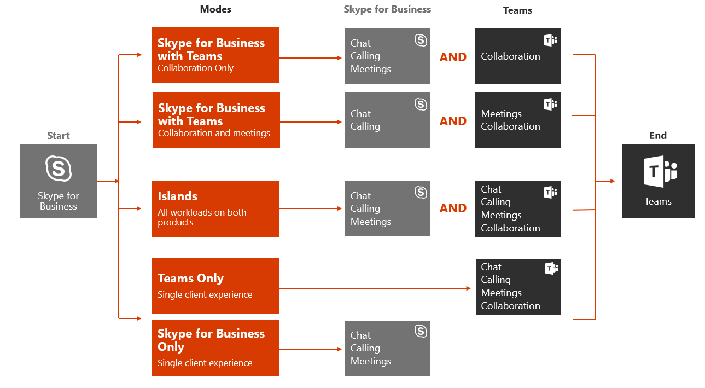

本文是升級歷程部署與實施階段的一部分。 繼續之前, 請確認您已完成下列活動:

- [已登記您的專案干係人](upgrade-enlist-stakeholders.md)
- [已定義您的專案範圍](https://aka.ms/SkypetoTeams-Scope)
- [已瞭解商務用 Skype 與團隊的共存與互通性](https://aka.ms/SkypeToTeams-Coexist)

# 選擇從商務用 Skype 升級到團隊的升級歷程

在現有的商務用 Skype 客戶中, 您對團隊的完整轉場可能需要一些時間。 不過, 您現在可以讓您的使用者在商務用 Skype 中使用團隊, 來開始實現團隊的價值。 如果兩個應用程式之間有一些重迭的功能, 建議您查看可用的共存和升級模式, 以協助判斷哪一個路徑適合您的組織。 例如, 您可以選擇在兩個解決方案中都啟用所有工作負荷, 而不需要互通性。 或者, 您也可以決定是否要管理使用者體驗, 只要逐步引入小組功能, 或以使用者的目標群組為選取功能, 直到貴組織準備好將所有人升級至團隊為止。 使用試驗的結果, 協助您評估貴組織的正確升級歷程。

> [!IMPORTANT]
> 商務用 Skype Online 將于2021年7月31日停用, 之後就不能再存取或支援。 若要最大限度取得效益並確保貴組織有適當的時間來實施升級, 我們鼓勵您立即開始將您的遷移到 Microsoft 團隊。

本文將說明各種模式, 讓您管理使用者可以使用商務用 Skype 和團隊的形式。 就像任何部署一樣, 我們強烈建議您在將組織升級至團隊之前, 先在選取的使用者群組中試驗您的[預定方案](pilot-essentials.md)。 請記住, 新技術對於使用者來說可能會造成中斷。 在執行此處所述的任何模式之前, 請花一些時間來評估使用者準備狀況, 並實施通訊與訓練方案。

> [!TIP]
> 加入即時、互動式研討會, 我們將分享指導方針、最佳做法, 以及專為開始升級規劃與實施方案而設計的資源。
>
>首先加入[升級會話方案](https://aka.ms/SkypeToTeamsPlanning), 以開始使用。

## 升級歷程組建區塊

若要正式準備貴組織進行團隊的旅程, 您必須開始規劃升級案例, 以讓您的組織完全接納團隊作為您的唯一溝通與共同作業解決方案。

若要協助引導您的決策過程, 請熟悉從商務用 Skype 升級至團隊的各種模式、概念及術語。 如需詳細資訊, 請參閱[Microsoft 團隊及商務用 Skype 共存與互通性](https://aka.ms/SkypeToTeams-Coexist)

當您的部分使用者準備好只使用團隊進行其日常通訊及共同作業需求時, 您可以開始將這些使用者升級至團隊, 只要針對他們啟用 [**僅限團隊**] 模式即可。

如果您的整個組織不可行就能移至團隊, 您可以在使用**孤島**共存模式的商務用 Skype 中開始使用先導小組。 做為其他共存模式 (例如,**使用小組**共同作業與**商務用 skype 與小組共同作業及會議**的商務用 skype), 您也可以在未來幾個月內逐步取得完整的功能, 您也可以透過完整的方式開始使用先將團隊當作群組共同作業解決方案, 然後將商務用 Skype 保持在組織的整合通訊解決方案中。 這是 Microsoft 針對使用商務用 Skype 伺服器 (內部部署或混合式) 的客戶所推薦的路徑, 以及具有大量複雜程度的客戶, 且其軌跡會包括較長的共存期間。

下表比較共存與升級模式。

|下 |具體 |建議使用 |優勢 |一些 |
|---|---|---|---|---|
|索羅門群島 |較小或較簡單的商務用 Skype 部署  管理一些短期複雜性以更快速地移至團隊的能力與意願 |儘快移至完整的團隊體驗  在小組中進行概念證明 (PoC)  採用商務用 Skype Online 之組織的建議升級路徑 |簡單的操作  最豐富的團隊遇到所有功能 |需要良好的使用者溝通以避免混淆, 並推動團隊使用方式  結束策略要求使用者在開始升級至 [僅限團隊] 階段之前, 完全採納團隊  在孤島模式中沒有使用者的互通性;當使用者的商務用 Skype 帳戶是駐留在內部部署時, 也沒有來自團隊的同盟|
|商務用 Skype 與團隊共同作業 |商務用 Skype 部署, 且小組尚未滿足需求 (例如, 高級合規性)  長期需要及/或對商務用 Skype 的承諾|快速開始團隊, 首先將焦點放在群組共同作業  想要在商務用 Skype 上保持所有整合通訊的工作負載  建議作為組織起點開始從內部部署 (或混合式) 商務用 Skype 開始旅程|團隊與商務用 Skype 之間沒有重迭的功能  立即訊息交談和會議排程將駐留在商務用 Skype 中 (系結到通話中)  只與團隊中的使用者進行交互操作|
|商務用 Skype 與團隊共同作業與會議 |商務用 Skype 部署, 在小組通話中使用企業語音及需求仍不能滿足  長期需要及/或對商務用 Skype 的承諾  可能是使用協力廠商會議服務|快速開始團隊合作, 超越群組共同作業  改善使用者的會議體驗  建議在準備好要充分升級前利用團隊會議的內部部署組織 (通常是由於企業內部部署)。 |沒有重迭的功能  小組中的出色會議。 功能藍圖、UX 及跨平臺、品質與可靠性  商務用 Skype 與團隊之間的「更好搭配」體驗  小組中的互通性使用者。|立即訊息和聊天將駐留在商務用 Skype 中 (系結到通話中)|
|僅限團隊 |團隊只是所有使用者最終的目的地。  有些使用者需要掌握商務用 Skype  您要將商務用 Skype Online 使用者升級至團隊, 同時在商務用 Skype Server 上保持商務用 Skype 內部部署使用者  您可能已經在孤島模式中部署使用者, 並已準備好停用商務用 Skype 來供使用者群組使用 |減少商務用 Skype (內部部署伺服器作業、外包合約等) 的可變成本  儘快取得完整的團隊體驗, 至少為部分使用者|僅提供一個用戶端, 就能與商務用 Skype 中的使用者進行互通性、與團隊共同作業的商務用 skype、與團隊共同作業及會議的商務用 Skype, 限制使用者的混亂|互通性只支援在商務用 Skype 與團隊之間進行基本的聊天和通話, 以及適用于桌面共用及多方聊天與通話的互通性升級案例|
|僅適用于商務用 Skype |有些使用者需要掌握商務用 Skype  |僅提供一個用戶端, 限制使用者混淆  使用者仍可參與受邀者的小組會議|繼續滿足目前僅適用于商務用 Skype 所能滿足的業務需求  只與團隊中的使用者進行交互操作|互通性只支援在商務用 Skype 與團隊之間進行基本的聊天和通話, 以及適用于桌面共用及多方聊天與通話的互通性升級案例|

> [!TIP]
> 若要協助根據您想要在小組中啟用的功能, 在商務用 Skype 仍在使用中時, 找出建議的升級模式, 請利用[Skype 與團隊升級嚮導](https://aka.ms/SkypeToTeamsWizard)。

## 升級 journeys

您可以採取多種方法, 從商務用 Skype (無論是線上或內部部署) 升級至團隊:

- 在直接升級歷程中, 您首先要在**孤島**模式的商務用 skype 中部署團隊, 做為評估與提前採納的一部分, 然後將您的使用者升級至**只有小組**的模式, 且從快速淘汰商務用 skype 的目標組織中所有使用者的環境。 這是商務用 Skype online 客戶的建議旅程, 除非他們擔心他們的使用者將無法使用兩個工具來執行相同的動作 (聊天、通話、會議排程)。
- 逐步升級歷程會根據通訊與共同作業的需求, 將特定的共存和升級模式提供給特定使用者群組 (也稱為「*群體*」)。 隨著時間的推移, 整個組織只能集中使用團隊, 且最終取代商務用 Skype。 不過, 如果您的組織有引人注目的商業理由來保持商務用 Skype (例如, 在整合通訊管理 API (UCMA) 的解決方案中, 與行業應用程式整合, 或符合道德的留言板解決方案)目前僅適用于商務用 Skype, 或是複雜的企業語音部署只需要時間來升級至**小組**, 您就可以將部分使用者升級至 [**僅限團隊**] 模式, 同時將商務用 skype 使用者保留在其中一個部分使用者群體的共存模式。 逐步升級旅程是內部部署 (以及混合式) 客戶在從商務用 Skype 開始使用小組共同作業模式時的建議做法, 且在符合使用者需求時從 [僅限團隊] 模式移至 [僅限小組] 模式 (可能是透過商務用 Skype 與團隊共同作業及會議共存模式)。

> [!IMPORTANT]
> 針對這兩種升級歷程類型, 如果您的組織目前僅適用于商務用 skype 內部部署, 您必須先開始規劃, 才能在將使用者升級至 [**僅限團隊**] 模式之前, 先執行商務用 skype 混合式。 這也會協助協助與團隊進行互通性。

> [!NOTE]
> [**團隊專用**] 模式要求屬於 cohorts 的使用者是駐留在商務用 skype online 中, 而您的商務用 skype 內部部署與商務用 skype Online 租使用者則需要協助商務用 Skype 與團隊之間的互通性。 必須先完成 [移至商務用 Skype Online], 才會將其升級至 [**僅限團隊**] 模式之前成為 cohorts 的使用者。 商務用 skype Server 2019 和商務用 Skype Server 2015 (含 CU8 更新) 可將遷移到商務用 Skype Online 的方式, 並在一個步驟中將使用者升級至 [**僅限團隊**] 模式, 以簡化將內部部署使用者升級至團隊的機制。.

### 直接升級歷程

[直接升級] 歷程在下圖中所示。

團隊會部署至組織中的所有使用者, 並以**孤島**模式設定。 當您的組織決定團隊準備好要完成所有通訊與共同作業需求時, 請通知使用者並將其升級至 [**僅限團隊**] 模式。 在該階段, 商務用 Skype 可以從環境中停用。

### 逐步升級歷程

下圖說明逐步升級歷程的範例。

團隊會以**孤島**模式部署在組織中, 以進行評估, 然後移至不同使用者群組的不同共存和升級模式。 例如, 您可以在 [安全島] 模式啟用 [**孤島**]、[**使用小組共同作業和會議模式的商務用 skype** ] 啟用的使用者群組, 而第三組使用者可能會在**商務用 Skype 中與團隊進行通話。[僅限**共同作業] 模式。

一段時間之後, 您可以將使用者群組升級至 [**僅限團隊**] 模式, 接著是組織的其他部分。 最終, 整個組織都會準備好停用商務用 Skype, 並只使用小組進行通訊與共同作業, 或者, 如果業務需求規定將商務用 Skype 保留在特定群組中, 就是大部分使用者組織只能使用團隊。   
<table>
<tr><td>  決策點</td><td><ul> 哪些升級旅程適合貴組織的業務需求？  </ul></td></tr>
<tr><td> 下一個步驟</td><td><ul> 找出您目前的部署模型、使用案例案例, 以及貴組織的重要考慮, 將會通知您的小組最適合您的組織。  </ul></td></tr>
</table>

<table>
<tr><td>  決策點</td><td><ul> 哪些升級案例適用于您的組織？  </ul></td></tr>
<tr><td> 後續步驟</td><td><ul> 根據訊息、會議和通話業務需求, 決定貴組織的升級歷程時間軸。   決定完成升級歷程所需的其他工作。  </ul></td></tr>
</table>

為您的組織選擇最佳升級歷程後, 請[執行您的團隊升級](https://aka.ms/SkypeToTeams-Upgrade)。
