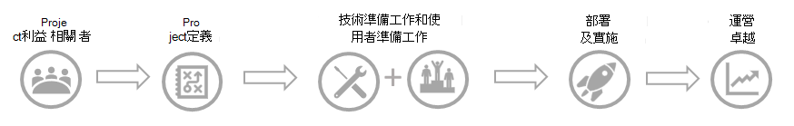

# 關於升級架構

為了協助您在升級歷程中避免猜測，我們已使用行之有效的架構來實施變更。 如下所示，framework 中的每個步驟都會在步驟之前建立，若要取得最佳結果，我們建議您按照循序執行這些步驟。  

首先，將正確的專案關係人與定義您的升級規劃（例如，範圍、目標與時程表）。 在適當的規劃中，確認您的技術環境與您的最終使用者已準備好使用團隊。 然後，您可以在幾個階段中執行升級，在準備時從試驗移至組織範圍的升級。 貴組織在團隊中後，建立可讓您監控品質並加速使用者採納的工作方案。

在相關頁面上尋找此架構圖形，以找出您在升級程式中所處的位置。

## 範例升級時程表

當您開始規劃變更時，就會開始升級歷程。 利用成功架構做為指導原則，以下是一個可讓您從升級前階段開始進行升級的範例時程表，您可以透過升級和升級後的操作階段來規劃及自助式您的結果。 

> [!NOTE]
> 我們瞭解您對團隊的旅程可能會涉及在不同時間利用多種 [模式](https://aka.ms/skypetoteams-coexist) 和升級使用者群組，讓您能夠控制使用者升級體驗，同時維持與團隊的勢頭。  

為了協助示範升級歷程可能的方式，我們提供了以下的範例方案，可定義從商務用 Skype Online 到僅限團隊的商務用 Skype。 此外，此範例方案還概述已將使用者分成四個升級群組或 cohorts 的組織。 您可以將它做為範本，自訂方案以納入團隊的特定旅程，包括您要使用的各種 [模式](https://aka.ms/skypetoteams-coexist) ，以及將您的使用者劃分成多少個升級群組。 

## 升級前

**為團隊準備您的組織**。 若要協助確保成功升級至小組，請務必指派充足的時間進行準備。 您的組織不僅能快速開始認識團隊的價值，只要團隊準備就緒，您就能加速從商務用 Skype 升級。 如果您已在商務用 Skype 中啟用團隊，請在您將使用者升級至團隊之前，使用這些升級前的活動做為檢查點，以驗證貴組織的就緒性。 

> [!TIP]
> 除了範例升級專案規劃與試驗測試方案之外，請下載範本使用者就緒性資料（例如通訊與使用者問卷）的 [升級成功套件](https://aka.ms/UpgradeSuccessKit) 。 套件中提供的專案會在下列清單中以星號（*）標示。

### 規劃：建立升級方案以協助確保貴組織已設定為長期成功

| 循序漸進 |  | 總結 | 資源 |
|------|--|---------|----------|
| **1** | **定義您的專案關係人** | 指派對促使升級成功的專案小組成員。 | [登記您的專案關係人](upgrade-enlist-stakeholders.md) |
| **2** | **定義您的專案構想與範圍** | 設計您的「大圖片」設想，以及目前的專案範圍，為您的升級歷程建立藍圖。 | [專案構想](upgrade-define-project-scope.md#project-vision)    [專案範圍](upgrade-define-project-scope.md#project-scope) |
| **3** | **定義專案目標** | 設定可讓您測量進度及專案成功的目標目標。 | [專案目標](upgrade-define-project-scope.md#project-goals) |
| **4** | **找出風險與緩解方案** | 建立緩解方案，以確保您能快速地讓您的專案回到正軌，應該會發生問題。 | [風險與緩解措施](upgrade-define-project-scope.md#risks-and-mitigation) |
| **500** | **定義時程表** | 設定時程表和關鍵里程碑，以協助您的專案及時掌握時間及掌握預算。 | [時間表](upgrade-define-project-scope.md#timeline)    [升級成功套件](https://aka.ms/UpgradeSuccessKit) |
| **6** | **定義適當的商務用 Skype 與團隊升級與共存策略** | 對應您的旅程，確保從商務用 Skype 到您組織的小組最佳路徑。 | [瞭解 Microsoft 團隊及商務用 Skype 的共存與互通性](teams-and-skypeforbusiness-coexistence-and-interoperability.md)    [選擇您的升級旅程](upgrade-and-coexistence-of-skypeforbusiness-and-teams.md) |

### 準備：評估貴組織的團隊準備情況

| 循序漸進 |  | 總結 | 資源 |
|------|--|---------|----------|
| **1** | **評估您的環境與完成團隊的技術加入** | 確定您的環境已準備好讓團隊協助優化使用者體驗，並在一段時間後輕鬆升級。 | [升級至團隊之前先評估您的環境](upgrade-plan-journey-evaluate-environment.md)。   [準備您的服務以升級至小組](upgrade-prepare-environment-prepare-service.md) |
| **2** | **針對團隊優化網路，特別是針對即時媒體案例** | 如果您要部署音訊、影片或會議，請採取這些額外步驟來優化您的網路，以取得該功能。 | [準備您的網路以升級至團隊](prepare-network.md) |
| **3** | **評估組織變更準備情況及定義團隊合作案例** | 瞭解您的使用者基礎，以準備正確的價值訊息與教育層級，以促進並加速使用者的採用。 | [組織變更就緒性](upgrade-org-change-readiness.md#organizational-change-readiness) |
| **4** | **準備使用者準備方案以定義您將如何溝通、訓練及支援使用者** | 個人化您的通訊、訓練及支援方案，以確保新技術的最佳 receptiveness。 | [準備使用者整備計畫](upgrade-user-readiness.md)  [升級成功套件](https://aka.ms/UpgradeSuccessKit) |
| **500** | **宣告 Microsoft 團隊的擱置啟動** | 及早進行溝通以協助使用者感覺，減少混淆，並產生令人興奮的效果。 | [升級成功套件](https://aka.ms/UpgradeSuccessKit) |
| **6** | **為您的 IT 員工做好團隊準備** | 確認您的技術與支援人員有他們準備好並支援您的小組技術環境所需的一切。 | [為您的 Microsoft 團隊準備 IT 員工](upgrade-prepare-it-pros.md)    [升級成功套件](https://aka.ms/UpgradeSuccessKit) |

### 試驗：執行試驗以確認貴組織已準備就緒，並通知團隊您的最佳旅程

| 循序漸進 |  | 總結 | 資源 |
|------|--|---------|----------|
| **1** | **大綱試驗物流** | 定義正式的試驗物流，以協助驗證貴組織是否已準備好升級或共存。 | [大綱試驗物流](pilot-essentials.md#1-outline-pilot-logistics) |
| **2** | **選取您的試點參與者和測試案例** | 找出可協助驗證團隊合作案例的使用者，並驗證小組的準備情況。 | [選取您的試點參與者和測試案例](pilot-essentials.md#2-select-your-pilot-participants-and-test-scenarios) |
| **3** | **設計您的測試方案與意見反應問卷** | 找出明確定義的工作，讓參與者完成，以及共用其意見反應的方法。 | [設計您的測試方案與意見反應問卷](pilot-essentials.md#3-design-your-test-plan-and-feedback-survey) |
| **4** | **建立您的試點通訊方案** | 讓試驗參與者掌握所發生的事情、時間和原因，以及它們的預期。 | [建立通訊方案](pilot-essentials.md#4-create-your-communications-plan)  [升級成功套件](https://aka.ms/UpgradeSuccessKit) |
| **500** | **進行試驗** | 啟動您的試驗，追蹤進度並視需要迴圈，以優化您的試驗結果。 | [進行試驗](pilot-essentials.md#5-conduct-your-pilot) |
| **6** | **評估學習專案並評估您的轉寄方案** | 收集使用者意見反應、網路統計資料和支援票證，以針對您的目標進行分析並判斷您的轉寄方案。 | [評估學習專案並評估您的轉寄方案](pilot-essentials.md#6-assess-learnings-and-evaluate-your-go-forward-plan)

### 部署：在與商務用 Skype 共存的情況中執行團隊

| 循序漸進 |  | 總結 | 資源 |
|------|--|---------|----------|
| **1** | **宣告團隊正式啟動** | 在團隊準備好時，傳送正式的啟動宣告來產生驚喜與動量。 | [升級成功套件](https://aka.ms/UpgradeSuccessKit) |
| **2** | **為使用者啟用適當的共存模式** | 依照步驟為您的組織設定正確的共存模式。 | [設定您的共存與升級設定](setting-your-coexistence-and-upgrade-settings.md) |
| **3** | **隨時掌握團隊藍圖的相關資訊** | 監控 [團隊藍圖]，找出適合貴組織向小組移動的時間。 | [團隊藍圖](https://aka.ms/teamsroadmap) |
| **4** | **傳送其他通訊，並讓團隊擁護者推動團隊的驚喜與採納** | 針對持續進行的通訊和擁護程式，鼓勵使用者採用並維持對小組的驚喜。 | [Microsoft 365 擁護程式計畫](https://aka.ms/O365Champions) |

## 升級 

**讓官方移至團隊**。 當您升級您的使用者時，會將他們移至 [僅限團隊] 模式。 團隊成為聊天、會議、通話和共同作業的主要 app，且已停用商務用 Skype app 的存取權。 雖然這個階段的技術層面相當簡單，但請考慮變更可能對使用者經驗造成的影響，並允許使用者從商務用 Skype 正式轉換其活動給小組。 若要減少使用者與不同用戶端的不同體驗，請嘗試將端對端升級視窗限制為45天或如此。

### 升級：實現從商務用 Skype 升級至團隊

| 循序漸進 |  | 總結 | 資源 |
|------|--|---------|----------|
| **1** | **確認您已完成上述所述的升級前活動** | 透過確認所有規劃及準備活動的完成，協助確保升級成功。 | 上述所有 |
| **2** | **在第一個升級群組中啟動與使用者的通訊** | 通知使用者正在開始進行升級，並在整個程式中保持它們的通知。 | [準備使用者整備計畫](upgrade-user-readiness.md)    [升級成功套件](https://aka.ms/UpgradeSuccessKit) |
| **3** | **僅針對第一個升級群組中的使用者啟用共存模式** | 依照適用于商務用 Skype 環境的步驟執行技術使用者遷移。 | [從商務用 Skype Online 升級至團隊](upgrade-to-Teams-execute-SkypeforBusinessOnline.md)   [從商務用 Skype 的混合式或內部部署升級至團隊](upgrade-to-Teams-execute-SkypeforBusinessHybridOnprem.md)
| **4** | **在滾動週期中針對其餘升級群組重複上述升級活動** | 根據您的計畫，繼續針對您正在進行的通訊方案和升級使用者群組進行驅動。 | |
| **500** | **傳送升級後的意見反應調查給所有使用者** | 使用意見反應問卷來捕獲來自使用者的意見反應與見解。 | [升級成功套件](https://aka.ms/UpgradeSuccessKit) |

## 升級後

**使用小組將商業價值最大化**。 貴組織完全升級至團隊之後，請花時間評估您對目標的成敗，並實施方案來繼續推進勢頭。 

### 操作：衡量升級的成功率

| 循序漸進 |  | 總結 | 資源 |
|------|--|---------|----------|
| **1** | **評估您的初始升級成功** | 針對您在升級前階段中建立的目標評估進度。 | [專案目標](upgrade-define-project-scope.md#project-goals) |
| **2** | **針對不在追蹤的任何目標實施緩解方案** | 針對不符合的目標定義緩解或課程校正原則。 | [專案目標](upgrade-define-project-scope.md#project-goals) |
| **3** | **監控網路健康情況和品質** | 實施品質檢查與監控方案，以協助確保良好的使用者體驗，並減少呼叫支援人員的需求。 | [監控網路健康情況和品質](continue-journey.md#monitor-for-network-health-and-quality) |
| **4** | **促進使用者動力與採納** | 針對現行的採納方案，鼓勵使用者採用並維持對小組的驚喜。 | [促進使用者動力與採納](continue-journey.md#drive-user-momentum-and-adoption) |
| **500** | **準備新功能** | 為新的創新與產品改良建立變更週期，以實現最大價值。 | [準備新功能](continue-journey.md#prepare-for-new-functionality)

> [!Note]
> 我們的升級內容不斷進化。 請務必查看最新的指導方針，並閱讀[小組博客](https://techcommunity.microsoft.com/t5/Microsoft-Teams-Blog/bg-p/MicrosoftTeamsBlog)。 

> [!Important]
> 商務用 Skype Online 將於 2021 年 7 月 31 日淘汰，之後將無法再存取也不再受支援。 若要最大限度取得效益並確保貴組織有適當的時間來實施升級，我們鼓勵您立即開始將您的遷移到 Microsoft 團隊。 請記住，成功的升級會將技術與使用者的就緒性相符，因此請務必在您向 Microsoft 團隊流覽您的旅程時，在本文中利用指導方針。
