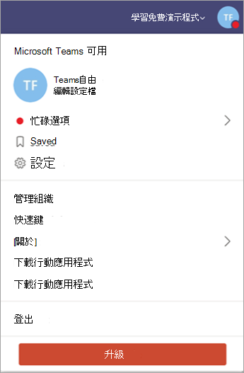

# 免費Microsoft Teams升級至訂閱版本

如果貴組織使用免費版 Microsoft Teams，您可以為使用者購買 Microsoft 365 或 Office 365 訂閱者案，輕鬆升級至完整版。 完整版提供Teams功能 ，例如排程、音訊會議、增強型系統管理和安全性功能等免費版本不提供的功能。 Microsoft 365和 Office 365 將熟悉的 Microsoft Office 桌面套件與 Microsoft 新一代通訊和共同合作服務的雲端版本結合 ，包括 Exchange Online、SharePoint Online 和 Office，協助使用者幾乎能透過網際網路隨時隨地提高工作效率。 當您升級Teams，您現有的Teams資料不會遺失;您的所有團隊、頻道、聊天、檔案和許可權都隨您一起提供。 

> [!NOTE]
> 如果您已經有 Microsoft 365 或 Office 365 訂閱，則符合使用公司身分識別 Teams (試用版) ，而非免費版。 試用版Teams提供完整版本的Teams有限時間。 詳細資訊，請參閱[管理商務Microsoft Teams試用版優惠](./teams-exploratory.md)。

## 免費Teams與完整版Teams？

Teams免費方案專為中小型企業所設計，並具有下列功能：

- 最多 500，000 個使用者
- 無限聊天訊息和搜尋
- 來賓存取
- 與應用程式和服務整合，包括線上版本的 Word、Excel、PowerPoint及OneNote
- 每個使用者 2 GB 的儲存空間和 10 GB 的共用儲存空間
- 1：1 和群組線上音訊和視訊通話
- 頻道會議
- 共用螢幕

訂閱或訂閱Teams的完整Microsoft 365 Office 365除了免費版功能之外，Teams提供下列功能：

- 使用企業授權 (沒有使用者限制) 
- Exchange電子郵件主機和自訂電子郵件網域
- OneDrive、SharePoint、Planner、Yammer等Microsoft 365 Office 365服務
- 每個使用者 1 TB 的儲存空間
- 排定的會議
- 音訊會議
- 增強的安全性與合規性功能，包括多重要素驗證、單一登入，以及進一步稽核與報告
- 系統管理控制項和支援功能，包括 24 x 7 電話和 Web 支援、管理使用者與應用程式的管理工具、Microsoft 365 或 Office 365 服務的使用方式報告、服務層級協定，以及可設定的使用者設定與政策

有關免費版和Teams功能的詳細Teams，請參閱[比較Teams方案](https://products.office.com/microsoft-teams/free)。

## 升級需求

如果您符合下列需求，Teams升級至完整版本的版本：

- 您就是註冊現有免費訂閱Teams人。
- 如果您攜帶自己的網域，該網域尚未透過試用版Azure Active Directory (訂閱或訂閱Microsoft 365或Office 365) 。

> [!NOTE]
> 若要升級和傳輸您的資料，您必須透過應用程式升級程式購買Teams訂閱。 如果您透過 Microsoft 365或 Office 365購買Teams，而未經過升級程式，您就無法傳輸資料，因為您已經有一個獨立的租使用者。

## 限制

請記住下列限制：

- 升級之後，您Teams切換回免費版。
- 您無法將多個免費租Teams合併到單一付費租使用者。
- 所有使用者都必須在同一個網域中。  (所有使用者都會以 .domain.com 格式 @ *取得* domain.com) 
- 所有使用者都必須升級：不支援Teams租使用者中的免費訂閱和付費訂閱使用者。

## 如何升級我的組織？

若要升級至完整版本的 Teams，**請選取** Teams。

輸入您用於登錄帳戶的電子郵件地址Teams，然後購買Microsoft 365 商務標準版方案。 如果您想要購買 Microsoft 365 商務基本版 或 Enterprise 版本Office 365，請[Office 365。](https://portal.office.com/support/altusupport.aspx?app=teamsfreeupgrade)

## 下一步是什麼？

升級完成後，請參閱開始使用 Microsoft Teams取得第一Microsoft Teams，並採用逐步Teams整個組織採用的方法。

## 詳細資訊

- 若要進一Teams版本及其功能，請參閱[比較Teams方案](https://products.office.com/microsoft-teams/free)。
- 有關升級至完整版本的 Teams，請參閱從 Teams[升級到 Teams。](https://support.office.com/article/Upgrade-from-Teams-free-to-Teams-29475bbd-a34f-4175-9b33-d44430f8ad39)
- 有關與升級使用者相關的其他系統管理員工作，包括新增使用者授權、變更使用者名稱，以及指派暫時密碼，請參閱適用于系統管理員從[Teams](https://support.office.com/article/for-admins-upgrading-from-teams-free-to-a-paid-subscription-75a95e7f-001e-42d0-a787-ae8b992d5a52)免費升級到付費訂閱。
- 有關在組織中Teams免費管理帳戶的資訊，請參閱[管理免費](manage-freemium.md)版 Microsoft Teams。