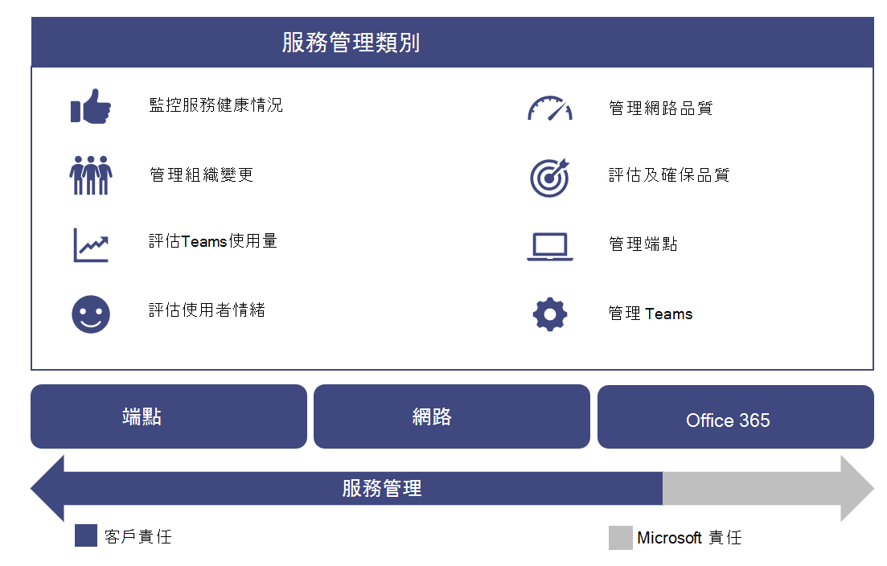
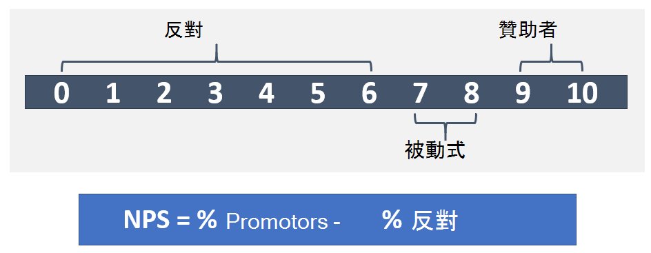

本文是您升級歷程的卓越運作階段的一部分，在您完成從商務用 Skype 升級至團隊之後，就會立即開始。

# 營運您的服務

本文將提供升級後對貴組織成功運作的團隊需求的概覽。 透過正常運作您的小組服務，您可以確定您為貴組織提供優質且可靠的體驗。

## 操作指南簡介

[操作指南] 可讓您大致瞭解 Microsoft 團隊服務管理功能所需的所有工作和活動。

服務管理是一個廣泛的主題，涵蓋在部署並為使用者啟用 Microsoft 團隊服務之後的日常作業。 [團隊服務] 包含 Microsoft Office 365 和部署于內部部署的基礎結構元件（例如 [網路]）。

服務管理的概念很可能不是大多陣列織的新概念。 您可能已經實現與現有服務相關聯的進程和工作。 如此一來，您可能會在規劃服務管理，在未來為支援小組時，增加目前的程式。

服務管理包括管理團隊的所有活動與程式，以端到端的方式進行。 如先前所述，服務管理的部分元件（由 Office 365 服務本身所組成的基礎結構）是 Microsoft 的責任，而您（如果您的客戶）對您的使用者負責管理團隊的各個層面、網路以及您所提供的端點。

本指南中的任務和活動會分為八個類別，如下列圖表所示。 在下列各節中，您將會展開這些類別中的每一種。

<table>
<tr><td>  決策點</td><td><ul><li>決定將如何針對團隊執行作業。</li></ul></td></tr>
<tr><td> 後續步驟</td><td><ul><li>完整回顧 [操作指南]。</li><li>實施與貴組織的目標相符的作業戰略，以提供小組工作負載的品質與可靠性。</li><li>查看體驗檢查指南的品質。</li><li> 實施作業策略，定期執行經驗檢查，以確保您的團隊部署在其峰值功能上運作。</li></ul></td></tr>
</table>

### 操作角色對應

規劃您在構想階段進行的作業 undertook 是至關重要的，因為當您第一次試驗使用者啟用時，就會開始執行作業活動。 本指南列出必須在每天、每週、每月或依需要執行的活動和工作，以維持高品質的小組部署。 本指南提供如何執行這些重要活動與工作的相關知識與指導方針。

成功部署的一個重要元件是確保您在構想階段初期所做的規劃包括決定誰負責執行特定的活動。 在您發現哪些工作及活動適用于您的部署之後，他們需要先瞭解，然後再加上您指派給他們的群組或人員。

您所識別的每個小組都必須審查並同意已識別的工作和職責，並開始準備作業。 這可能包括訓練及準備工作，提供人員編制規劃的更新，或確保外部提供者已準備好提供。

本指南中定義的活動和角色，在大多數情況下都應該是有效的，但每個團隊部署都是唯一的;因此，您可以使用本指南作為自訂活動和預設角色的起點，以符合您的需求。

確定每個有責任的小組對執行服務所需的活動有充分的瞭解。 在第一個試驗開始前，每個小組都必須接受並登出貴組織中的責任，這一點很重要。

達成合約之後，對應的小組就應該開始 operationalize 他們的角色。

<table>
<tr><td> 後續步驟</td>
<td><ul><li>使用這份檔協助操作角色對應練習。</li><li>與各個支援小組見面，以將名稱指派給所需活動清單中的每個專案。</li><li>取得指派角色的接受或登出。</li><li>確定對應的小組有適當的訓練、準備及資源，以完成他們所需的活動。</li></ul></td></table>

### 團隊服務相依性

Microsoft 團隊將跨 Office 365 的技術結合在一起，為團隊合作提供中樞。 範例包括：

- Azure Active Directory （Azure AD）為團隊提供驗證與授權服務。

- Exchange Online 提供法律封存和電子調查等高級功能。

- SharePoint Online 提供共用頻道中檔案的能力，而商務用 OneDrive 則提供在私人聊天中共用檔案的機制。

組織也可以在內部部署基礎結構中利用現有投資。 例如，現有的內部部署 Active Directory 帳戶可以利用 Azure AD Connect 來進行驗證。 您可以使用某些 Exchange Server 版本來取代 Exchange Online。

這些技術結合在一起，為使用者提供豐富、共同且智慧型的通訊套件。 這項緊密整合是團隊的主要優點，但同時也促進了跨這些技術進行服務管理的需求。

本指南涵蓋管理團隊服務的主要重點領域。 您最有可能的是，針對小組所依賴的支援技術，您有適當的服務管理方案。 如果不是，您將需要為那些技術元件（內部部署和線上）建立適當的服務管理方案。 這將有助於確保您的使用者能在小組中享受高品質、可靠的體驗。

#### 提到

[Microsoft 團隊概覽](teams-overview.md)

[Exchange 與 Microsoft 團隊如何互動](exchange-teams-interact.md)

[SharePoint Online 與商務用 OneDrive 與 Microsoft 團隊互動的方式](sharepoint-onedrive-interact.md)

[Microsoft 團隊及商務用 Skype 共存與互通性](teams-and-skypeforbusiness-coexistence-and-interoperability.md)

<!--ENDOFSECTION-->

## 操作指南活動

下列各節提供成功操作 Microsoft 團隊服務所需的活動的概覽。 它們包含對工具、內容資訊和其他內容的參照，以協助您瞭解活動，並協助準備就緒計畫。

<!--ENDOFSECTION-->

## 監視服務健康情況

您必須瞭解 Microsoft 團隊服務的整體健康情況，才能在您的組織中主動提醒任何影響服務的活動。 如前文所述，小組依賴于其他 Office 365 服務，例如 Azure Active Directory、Exchange Online、SharePoint Online 和商務用 OneDrive。 因此，請務必監視相依服務的健康情況。

將此活動納入您的事件管理流程，以主動告知使用者、技術人員及您的操作小組，準備處理使用者升級。

下列各節說明您可以利用哪些工具監視影響團隊服務的[服務事件](https://technet.microsoft.com/library/office-365-service-health.aspx#Anchor_1)。 下表包含每個工具的優點摘要，以及每個工具的使用時機。

| [監視] 工具 | 獲益 | 使用時機 |
|---|---|---|
| Office 365 入口網站 | 可從任何裝置使用支援的瀏覽器。 | 在您不需要即時通知時使用。 |
| Office 365 系統管理應用程式 | 向您的行動裝置提供推播通知。 | 當您在旅途中需要通知服務事件時，請使用。 |
| Microsoft System Center | 與 Microsoft System Center 整合。 | 在您需要高級監視功能和通知支援時使用。 |
| Office 365 服務通訊 API | 以程式設計方式存取 Office 365 服務健康情況。 | 當您需要與協力廠商監視工具整合或想要建立自己的解決方案時使用。 |

> [!NOTE]
> 只有獲指派 [**全域管理員**] 或 [**服務管理員**] 角色的人員，才能查看服務健康情況。

### 使用 Office 365 入口網站進行監控

[Office 365 入口網站](https://portal.office.com/)提供[服務健康情況儀表板](https://portal.office.com/adminportal/home#/servicehealth)，除了相依服務之外，您還可以在其中查看團隊服務目前的健康情況。

### 使用行動裝置 app 進行監控

您可以在 Apple iOS、Android 和 Windows （PC 和 mobile）上使用 Office 365 系統管理應用程式。 App 提供服務健康情況與即將進行變更的服務系統管理員資訊。 App 支援推播通知，在公告發布之後幾乎立即就能提醒您。 這可協助您隨時掌握服務的狀態、健康情況及任何即將進行的變更。 通知支援會將它提供給系統管理員的建議監視工具。 如需詳細資訊，請參閱：

[Office 365 Admin 行動裝置 App](https://support.office.com/article/Office-365-Admin-Mobile-App-e16f6421-2a1a-4142-bf9d-9846600a060a)

[下載 Office 365 Admin 行動裝置 App](https://products.office.com/business/manage-office-365-admin-app)

### 使用 Microsoft System Center 進行監控

Microsoft System Center 是一個整合的管理平臺，可協助您管理資料中心、用戶端裝置及混合式雲端 IT 環境。 使用 System Center 的 Office 365 系統管理員現在可以選擇匯入 Office 365 管理套件，讓他們可以在系統中心的 Operations Manager 中查看所有服務通訊。 使用這個工具可讓您存取已訂閱服務的狀態、使用中及已解決的服務事件，以及您的訊息中心通訊（即將進行的變更）。 如需詳細資訊，請參閱下列[博客文章](https://blogs.office.com/2014/07/29/new-office-365-admin-tools/?eu=true)。

如果您利用 System Center 監視團隊服務健康情況（以及相依的服務），您可以進一步自訂管理套件，以提醒或通知特定群組或已識別對事件作出反應的人員。
這些群組可以包含服務擁有者、服務台、第二層和第三層支援群組，以及貴組織中的事件管理員。

### 監視高級案例

您可以利用 Office 365 服務通訊 API，以程式設計方式存取 Office 365 服務健康情況及變更，以監控服務健康情況與即將進行的變更。 您可以使用這個 API 來建立您自己的監視工具，或將現有的監視工具連線到 Office 365 服務通訊，這可能會簡化您的環境監視方式。 如需詳細資訊，請參閱[適用于企業開發人員的 Office 365](https://msdn.microsoft.com/library/jj984343(v=office.15).aspx)。

### 每日/每週/每月/所需任務

| 操作 | 描述 | 節奏 | 指派的小組 |
|---|---|---|---|
| 監視服務健康情況 | 使用可用的工具，主動監視 Microsoft 團隊服務健康情況（以及相依服務）。 相依服務包括： Exchange Online、SharePoint Online、商務用 OneDrive、Azure Active Directory。 | 即時 | |
| 事件通知 | 通知內部干係人影響團隊服務的活動。 內部的專案關係人可加入使用者、服務中心及事件管理器。 | 視需要 | |

### 提到

[如何檢查 Office 365 服務健康情況](https://support.office.com/article/How-to-check-Office-365-service-health-932AD3AD-533C-418A-B938-6E44E8BC33B0)

[驗證 Microsoft 團隊的服務健康情況](service-health.md)

[服務健康情況與連續性](https://technet.microsoft.com/library/office-365-service-health.aspx)

<!--ENDOFSECTION-->

## 管理組織變更

Microsoft 團隊是雲端服務。 如此一來，就能夠快速提供新的功能和功能。 提供日常的創新為組織帶來明顯的好處，但需要適當地在組織內管理這些變更，以避免使用者抵抗或上報給您的技術支援人員。

小組的更新會自動向您的使用者推出。 您的使用者將永遠擁有團隊服務中提供的最新用戶端和功能。 您無法針對您的使用者管理團隊更新推出，因此您必須透過有效的通訊、訓練及採納程式管理變更，這對您而言至關重要。 如果您的使用者知道所做的變更、教育的好處，以及充分利用其新功能&mdash;，就能更快速且更歡迎地調整變更。

### 監控變更

變更管理中的第一個步驟是監視針對團隊規劃的變更。 監視這些變更的最佳來源是[Microsoft 365 藍圖](https://www.microsoft.com/microsoft-365/roadmap)，其中列出目前正在開發、向客戶推出或完全啟動的功能。 您可以使用所提供的篩選來搜尋小組特定的功能，或將藍圖下載至 Excel 檔案以進行進一步分析。 針對每個功能，藍圖會提供簡短的描述，以及預期的發行日期。

在[Microsoft 團隊博客](https://techcommunity.microsoft.com/t5/Microsoft-Teams-Blog/bg-p/MicrosoftTeamsBlog)中，您可以瞭解有關團隊產品更新的最佳做法、趨勢及新聞。 預期會在此找到要宣佈的小組主要功能更新。 您也可以透過 RSS 摘要訂閱博客。 然後，您可以直接將[RSS](https://techcommunity.microsoft.com/gxcuf89792/rss/board?board.id=MicrosoftTeamsBlog)摘要新增至團隊頻道，所以所有重要的新聞都直接在小組中傳送。

所有已發行的功能都記錄在[Microsoft 團隊的版本](https://support.office.com/article/Release-notes-for-Microsoft-Teams-d7092a6d-c896-424c-b362-a472d5f105de)資訊中。
您可以在這裡找到針對桌上型電腦、web 版和行動裝置發行的功能清單。 您也可以在 [說明] 的 [**新增功能**] 索引標籤上使用相同的版本[資訊](get-help-in-microsoft-teams.md)。

熟悉可用的資源，並確定您指派適用的擁有者來監視變更。

### 規劃變更

現在您已經知道對 [團隊服務] 的即將進行的變更，下一個步驟就是進行相應的準備及規劃。 針對每個變更進行評估，判斷哪些變更需要與使用者進行通訊、認識活動、支援小組或使用者的訓練，或功能評估與採納活動。 這是貴組織中變更管理小組的主要角色。 以下是可協助您規劃變更的範例表格集合。

#### 功能：雲端錄製（發行日期：2018年1月）

**一般追蹤**

| 變更就緒性 | 狀態值 | 備忘稿/後續步驟 | 擁有者 |
|---|---|---|---|
| 法律審查 | 完畢 | 此功能是加入訓練小組的先決條件。 | 專案小組 |

**技術變更管理**

| 變更就緒性 | 狀態值 | 備忘稿/後續步驟 | 擁有者 |
|---|---|---|---|
| 需要變更 | 是 | 系統管理員只需要為已識別的使用者啟用錄製。 | 支援小組 |
| 技術就緒已完成 | 是 | | 支援小組 |
| | | | |

**使用者變更管理**

| 變更就緒性 | 狀態值 | 備忘稿/後續步驟 | 擁有者 |
|---|---|---|---|
| 使用者影響 | 低溫 | | |
| 需要使用者就緒 | 是 | | |
| 通訊就緒 | 否 | 通訊電子郵件已起草（待定審閱）。 | 溝通小組 |
| 訓練準備 | 是 | 訓練將會利用現有的 Microsoft 影片。 | 訓練小組 |

**狀態軌**

| 變更就緒性 | 狀態值 | 備忘稿/後續步驟 | 擁有者 |
|---|---|---|---|
| 發行狀態 | 進行中 | 由主管主管進行的待定審查。 | 變更管理小組 |
| 解除簽核 | | | |
| 發行日期 | | | |

如需針對團隊進行變更管理規劃的詳細資訊，請參閱[建立 Microsoft 團隊的變更管理策略](change-management-strategy.md)。

### 每日/每週/每月/所需任務

| 操作| 描述| 節奏| 指派的小組 |
|---|---|---|---|
| 監控變更| 監視 Microsoft 團隊服務即將進行的變更。| 日常||
| 規劃變更| 評估並規劃新功能，包括溝通方案、線上認知活動，以及訓練。| 視需要 ||
| 使用者準備就緒| 執行目標通訊、認知或訓練活動，以確保使用者已準備好進行即將進行的變更。| 視需要 ||
| 支援小組就緒性 | 執行目標通訊、意識或訓練活動，以確保支援小組已就緒。 支援小組可以包含「白色 glove」團隊、支援人員、第2層或第3層支援、外部合作夥伴等。 | 視需要 ||

<!--ENDOFSECTION-->

## 評估團隊使用量

初始試驗開始之後，請務必建立定期頻率來測量實際的團隊使用量。 這可讓您的組織深入瞭解在您的構想階段，實際使用量如何與您預期的使用量相符。 雖然此區段側重于團隊使用量，但這應該是進一步努力來測量和評估 Office 365 使用方式的一部分。

在部署初期回顧使用量，為您提供機會：

- 驗證使用者是否正在使用團隊。

- 找出潛在的採納難題，然後再在整個組織中產生重要問題。

- 瞭解構想階段需求與實際使用量之間是否有差異。

如果使用方式與預期不一樣，可能是由於部署問題，或採用方案未正常執行或其他問題。 根據低使用量背後的實際原因，服務管理員必須與相關團隊共同作業，以協助移除使用障礙。

### 使用 Microsoft 365 系統管理中心測量使用量

[報表] 儀表板提供來自小組的使用資料。 您可以在三個不同的報表中找到團隊使用資料。 第一個報表提供的叉積視圖，說明使用者如何使用 Office 365 中的各種服務進行通訊與共同作業。 您可以在此找到以下報告： Office 365 作用中的[使用者報告](https://support.office.com/article/Office-365-Reports-in-the-Admin-Center-Active-Users-FC1CF1D0-CD84-43FD-ADB7-A4C4DFA8112D)

其他兩個報表是團隊專用的，而且它們提供來自使用者和裝置的團隊使用量的進一步詳細資料。 您可以在以下位置找到兩種報告：

[Microsoft 團隊裝置使用量報告](https://support.office.com/article/Office-365-Reports-in-the-Admin-Center-Microsoft-Teams-device-usage-917b3e1d-203e-4439-8539-634e80196687)

[Microsoft 團隊使用者活動報告](https://support.office.com/article/Office-365-Reports-in-the-Admin-Center-Microsoft-Teams-user-activity-07f67fc4-c0a4-4d3f-ad20-f40c7f6db524)

#### 所需許可權

系統管理中心的使用方式報告可由獲指派**全域管理員**角色的人員或產品特定的系統管理員角色（**Exchange 系統**管理員、**商務用 Skype 系統**管理員、 **SharePoint 系統管理員**）存取。

此外，對於需要存取報表的使用者，也可以使用 [**報表閱讀**者角色]，但不要執行任何需要系統管理員層級許可權的工作。 您指派這個角色來為任何擁有者的人提供使用方式報告，以監控和推動採用。 如需其他可用角色的詳細資訊，請參閱[關於 Office 365 系統管理員角色](https://support.office.com/article/About-Office-365-admin-roles-da585eea-f576-4f55-a1e0-87090b6aaa9d)。

### 評估使用量

在您使用 [報告儀表板] 來測量使用量之後，請務必將測量的使用方式與您在專案的構想階段中定義的任何重要成功指標（KSIs）進行比較。 您可以定義一個可能定義為作用中用法的 KSI，或是一個間接連結至作用中用法的。

在繼續推出給其他網站或使用者之前，請務必先找出實際與預計使用量之間的任何差異。 您可能會發現組織學習專案做為此活動的一部分，您可以利用它來確保下一批網站或使用者不會遇到相同的問題。

首先，找出這是採用或技術問題。 首先，按照順序調查下列專案，以判斷問題所在。

1. 透過執行[經驗檢查品質審查](upgrade-monitor-quality.md)來驗證品質。

2. 與技術支援小組合作，檢查是否有任何趨勢問題無法讓使用者存取或使用服務。 如果問題趨勢確實存在，請使用本文稍後所述的 [[端點疑難排解](#endpoint-troubleshooting)] 區段，嘗試先解決問題，然後再吸引支援。

3. 使用訓練與採納小組，收集使用者的直接意見反應（請參閱本文稍後的[評估使用者觀點](#assess-user-sentiment)），並查看認知與採納活動的效能。

### 每日/每週/每月/所需任務

| 操作 | 描述 | 節奏 | 指派的小組 |
|---|---|---|---|
| 測量使用量（啟用階段） | 在啟用階段繼續 onboarded 網站時，測量及評估團隊使用方式。 根據需要解決使用方式問題。 | 周更新 | |
| 測量使用量 | 在「磁片磁碟機價值」階段中測量及評估團隊的使用方式（部署完成後）。 根據需要解決使用方式問題。 | 快遞 | |
| （磁片磁碟機值階段） | | | |
| 更新採納方案 | 根據測量的使用方式與規劃目標的對比來更新您的採用方案。 | 視需要 | |

### 提到

[關於 Microsoft 365 系統管理中心](https://support.office.com/article/About-the-Office-365-admin-center-758befc4-0888-4009-9f14-0d147402fd23)

[Microsoft 365 系統管理中心的活動報告](https://support.office.com/article/Activity-Reports-in-the-Office-365-admin-center-0d6dfb17-8582-4172-a9a9-aed798150263)

<!--ENDOFSECTION-->

## 評估使用者觀點

瞭解使用者觀點可以做為您的小組部署成功測量的重要指示。 使用者意見反應可以推動貴組織中的變更。這可能包含對您通訊方案、訓練程式，或您提供給使用者支援的方式的變更。

務必提前取得意見反應，並在整個專案週期中繼續評估使用者觀點。 使用下列指導方針來判斷貴組織將向外尋找意見反應的時間間隔：

- **專案開始**：透過在專案開始時評估使用者觀點，您可以快速瞭解使用者對其團隊體驗的想法。

- 在**主要里程碑之後**：透過收集意見反應在整個專案週期中，您可以持續測量使用者觀點，並視需要進行變更。 這在主要的里程碑之後特別有用。

- **專案結論**：在專案結束時評估使用者觀點會告訴您已完成的工作，以及仍需要完成工作的位置，並可讓您將結果與前一個問捲進行比較。

- **持續**：繼續以無限期測量使用者觀點。 使用者觀點中的變更可能是您組織的環境中的變更，或是小組服務中的變更。 透過定期測量使用者觀點，您可以瞭解服務管理團隊的執行狀況，以及貴組織回應團隊服務變更的方式。

您可以透過多種不同的方法來評估使用者觀點。 這些包括電子郵件問卷、人員或電話風格的訪談，或只是在團隊或 Yammer 中建立意見反應頻道。 如需詳細資訊，請參閱[Microsoft 團隊中使用者意見反應方法的最佳做法](best-practices-feedback.md)。

您也可以使用 industrywide 方法來評估稱為 net promotor 計分（NPS）的使用者觀點，如下一節所述。

### NPS

Net promoter 計分（NPS）是一種 industrywide 的客戶忠誠度指標，以及用來評估使用者觀點的好方法。 您可以提出以下兩個問題來計算 NPS：「您可能會將團隊推薦給同事嗎？」，後面接著手中的 [為什麼？]

NPS 是一個從–100到100的索引，可以衡量客戶對公司產品或服務的建議。 NPS 是以透過電子郵件或其他電子方式傳送給使用者的匿名問卷來建立。 NPS 會測量提供者與消費者之間的忠誠度。 它只包含一個問題，要求使用者從1到10對其體驗進行評分，以及提供其他批註的選項。 然後根據下列評分來分類使用者：

- 9或10是支援者：忠誠發燒者將促銷您的服務並燃油其他人。

- 7或8為被動式：已滿意但 unenthusiastic，易受其他服務或服務的影響。

- 從1到6是 Detractors：不滿意可能會損害您服務並妨礙增長的客戶。

雖然基 NPS 編號很有用，但您可以從分析使用者的意見來取得最大的價值。 他們將協助您瞭解使用者為何（或不會）建議團隊給其他人。 這些意見反應可提供寶貴的意見反應，以協助專案或服務管理小組瞭解提供品質服務所需的調整。

若要將 NPS 問卷提供給您的組織，您可以利用您最愛的線上問卷工具。

### 每日/每週/每月/視需要的任務

| 操作 | 描述 | 節奏 | 指派的小組 |
|---|---|---|---|
| 評估使用者觀點 | 使用問卷調查或訪談，或透過團隊或 Yammer 中的意見反應頻道來捕獲及評估使用者觀點。 | 視需要 | |
| 更新採納方案 | 根據使用者意見反應，在您的組織中變更磁片磁碟機;這可能包含您的通訊方案變更、訓練程式，或您提供給使用者支援的方式。 | 視需要 | |

### 提到

[淨 Promoter 分數](https://en.wikipedia.org/wiki/Net_Promoter)

[使用 Yammer 收集意見反應](https://techcommunity.microsoft.com/t5/Yammer-Blog/The-Microsoft-Teams-team-uses-Yammer/ba-p/55210)

[使用者意見反應的最佳做法](best-practices-feedback.md)

<!--ENDOFSECTION-->

## 管理網路品質

許多核心規劃元素會進入優化、調整大小及修正您的網路基礎結構，以確保 Microsoft 團隊服務的高品質、高效的路徑。 規劃工作與需求在我們的[網路準備](prepare-network.md)指導方針中講述。 網路由於升級、擴充或其他業務需求而經常隨著時間不斷演化。 您必須針對網路規劃活動中的小組需求加以考慮，這一點非常重要。

雖然網路規劃是小組部署的重要層面，但務必確保網路保持健康狀態，並根據變更的業務或技術需求保持在最新狀態。

若要確保您的網路健康情況，必須定期執行許多作業活動。

### 每日/每週/每月/所需任務

| 操作 | 描述 | 節奏 | 指派的小組 |
|---|---|---|---|
| 監視 Office 365 IPs 與 Url | 使用提供的[RSS](https://go.microsoft.com/fwlink/p/?linkid=236301)摘要來監控[Office 365 url 和 IP 位址範圍](https://aka.ms/o365ips)的任何變更，並啟動適用網路群組的變更要求。 | 日常 | |
| 根據 Office 365 IPs 和 Url 的變更來更新網路 | 更新適用的網路元件（防火牆、proxy 伺服器、Vpn、用戶端防火牆等等），以反映[Office 365 url 與 IP 位址範圍](https://aka.ms/o365ips)的變更。 | 視需要 | |
| 提供建築物資料 | 針對品質擁護者（或相關的股東）提供更新的子網資訊，以確保[CQD 中的建築物定義](https://docs.microsoft.com/SkypeForBusiness/using-call-quality-in-your-organization/turning-on-and-using-call-quality-dashboard#upload-building-information)保持在最新狀態。 | 視需要 | |
| 實施變更 | 在網路上實施變更，以支援變更團隊的業務與技術需求。 網路元素可以包含：<ul><li>道</li><li>疑難排解</li><li>有線和 Wi-fi 網路</li><li>網際網路連線與 ExpressRoute</li><li>DNS</li></ul> | 視需要 | |
| 網路監視與報告 | 使用您現有的協力廠商網路管理工具和您的網路供應商提供的報告功能，監控網路端以結束可用性、利用率和容量趨勢。 使用趨勢資料進行網路容量規劃。 | 每日、每週、每月 | |
| 容量規劃 | 與團隊服務擁有者共同作業，以瞭解變更可能增加額外容量變更的業務與技術需求。  | 視需要 | |
| 網路疑難排解與修正 | 協助團隊技術人員、服務擁有者和主要的專案關係人，進行疑難排解並修正與團隊連線、可靠性或品質相關的問題。 網路元素可以包含：<ul><li>道</li><li>疑難排解</li><li>有線和 Wi-fi 網路</li><li>網際網路連線與 ExpressRoute</li><li>DNS</li></ul> | 視需要 | |
| 災害復原與高可用性測試 | 在網路基礎結構上執行一般的高可用性和災害復原測試，以確保它符合小組服務的規定服務等級目標（Slo）或服務層級協定（Sla）。 | 次 | |

### 提到

[Office 365 URL 與 IP 位址範圍](https://aka.ms/o365ips)

[建立資料架構](https://docs.microsoft.com/SkypeForBusiness/using-call-quality-in-your-organization/turning-on-and-using-call-quality-dashboard#tenant-data-file-format-and-building-data-file-structure)

<!--ENDOFSECTION-->

## 評估並確保品質

所有組織都需要有一個群組或個人負責品質。 這是服務管理中最重要的角色。 品質擁護者角色會指派給熱情使用者體驗的人員或群組。
這個角色需要技能來識別環境中的趨勢，以及與其他團隊合作來促進修正的贊助。 品質擁護者的最佳候選人通常是客戶服務擁有者。 根據組織的大小與複雜性，您可以使用熱情的人員或群組，以確保高品質的使用者體驗。

[品質擁護者] 利用現有的工具與已記錄的程式，例如通話品質儀表板（CQD）和體驗品質檢查指南、監控使用者體驗、識別品質趨勢，以及在必要時進行磁片磁碟機修正。
品質擁護者應該與各個小組合作，以促進修正動作並向指導委員會報告進度及任何已開啟的問題。

[經驗品質審查指南](https://aka.ms/qerguide)包括在重要區域中評估並提供修正指導方針的活動，以改善使用者體驗。 [品質體驗回顧指南] 中提供的指導方針主要是使用 CQD Online 作為主要工具來報告並調查每一個區域，並將焦點放在音訊上以最大化採納與影響。 針對網路所做的任何優化，以改善音訊體驗，也會直接翻譯成影片和桌面共用的改良功能。

我們強烈建議您提前提名品質擁護者。 在進行命名之後，他們應該開始熟悉體驗品質檢查指南中的內容，以及相關的訓練資料。

### 每日/每週/每月/所需任務

| 操作 | 描述 | 節奏 | 指派的小組 |
|---|---|---|---|
| 提名與訓練品質擁護者（s） | 提名並訓練品質專家。 | 視需要 | |
| 執行經驗檢查品質審查（QERs） | 執行 QER 以找出品質與可靠性的趨勢、針對已定義的目標進行審查，以及向組織中的主要干係人報告。 | 每月（在部署期間每週） | |
| 磁片磁碟機修正 | 根據 QER 評估與調查，在整個組織中協調修正活動。 | 視需要 | |
| 在 CQD 中更新組建資料 | 在 CQD 變更網路時，在中更新或新增新的建築物定義（請參閱[上傳建築物資訊](https://docs.microsoft.com/SkypeForBusiness/using-call-quality-in-your-organization/turning-on-and-using-call-quality-dashboard#upload-building-information)）。 | 視需要 | |
| 填入品質擁護者角色 | 組織中品質的端對端責任。 這包括：<ul><li>確保定期進行 QER。</li><li>向 [品質狀態] 上報告主要的專案關係人。</li><li>確定組建資料定義是最新的。</li><li>在整個組織中協調修正工作，以確保使用者擁有團隊的高品質體驗。</li></ul> | 日常 | |

### 提到

[上傳建築物資訊](https://docs.microsoft.com/SkypeForBusiness/using-call-quality-in-your-organization/turning-on-and-using-call-quality-dashboard#upload-building-information)

[體驗品質的審查指南](https://aka.ms/qerguide)

<!--ENDOFSECTION-->

## 管理端點

Microsoft 團隊端點可以定義為任何執行團隊用戶端的 PC、Mac、平板電腦或行動裝置（或任何其他）裝置。 這個字詞*不*只會包含裝置本身，但使用者如何連線到裝置，例如，使用裝置內建的麥克風或喇叭、earbuds 或優化的耳機。 部署之後，就不一定會忘記端點。 團隊端點需要持續的護理與維護。 下列各節說明焦點所在的特定區域。

### 端點需求

團隊的其中一個主要優點是，用戶端會自動保持為最新狀態。 PC 和 Mac 上的用戶端會使用背景處理常式來更新，在 app 空閒時檢查新的組建並下載新的用戶端。 團隊行動應用程式會透過其各自的 app 存放區保持最新狀態。

團隊用戶端在基礎軟體平臺方面的需求最低。 這些需求可能會隨著時間變更，因此請務必監視它們的變更。 例如，團隊用戶端擁有最低的 iOS 版本。 如果用戶端使用網際網路瀏覽器，則瀏覽器也必須保持在最新狀態。 您可以在[取得 Microsoft 團隊的用戶端](get-clients.md)中找到支援的平臺清單。

### 端點防火牆

用戶端防火牆對使用者體驗的影響可能會有很大的影響。
用戶端防火牆可能會影響通話品質，甚至可以避免建立通話。 在用戶端防火牆上設定適當的排除項之後，必須根據[Office 365 url 和 IP 位址範圍](https://aka.ms/o365ips)中的資訊，讓它們保持在最新狀態。 您的協力廠商廠商將提供有關如何更新排除項的特定指導方針。

### Wi-fi 驅動程式

Wi-fi 驅動程式可能會造成問題。 舉例來說，驅動程式可能會在存取點之間產生非常嚴格的漫遊行為，可能會造成不必要的存取點切換，從而導致通話品質不佳。 執行品質不佳的 Wi-fi 驅動程式可能會透過經驗檢查（如需詳細資訊，請參閱[經驗品質檢查指南](https://aka.ms/qerguide)）來探索。 必須執行一個品質驅動的程式來監視新的 Wi-fi 驅動程式，並確保在將其部署到一般使用者群體之前，對其進行測試。

### 端點管理

支援的端點和介面裝置（例如耳機）的目錄應該可供使用並維護。 此目錄將包含已選取並驗證為構想與板載階段一部分的核准裝置清單。 通常會針對貴組織中的每個角色類型選取特定裝置，以符合該角色的屬性需求。 所有端點都有週期，您需要管理與這些裝置相關聯的供應商合約、保修、取代、發佈及修復原則。

### 端點疑難排解

即使您已遵循前一個指南，貴組織中的使用者仍可能會遇到團隊的問題。 雖然問題可能不是端點本身，但問題的症狀通常是透過用戶端傳送給使用者。 下列指導方針旨在提供解決問題所需採取的一般步驟。這並不是一個全面的疑難排解指南。 這些步驟是以特定順序提供，但不需要明確追蹤，也可能不適用，視問題的性質而定。

1. **驗證服務健康情況：** 使用者可能遇到的問題，可能與對團隊服務或 itsdependent 服務產生負面影響的事件有關。 第一步，我們建議您確認沒有作用中的服務問題。 請參閱[如何檢查 Office 365 服務健康情況](https://support.office.com/article/How-to-check-Office-365-service-health-932AD3AD-533C-418A-B938-6E44E8BC33B0)。 請記得檢查相依服務的狀態（例如，Exchange、SharePoint、商務用 OneDrive）。 如需深入瞭解服務健康情況，請在上一節 [[監視服務健康情況](#monitor-service-health)] 中進一步討論。

2. **驗證用戶端連線：** 連線問題導致小組中的功能或登入問題。 我們建議您驗證與服務的連線性（尤其是新網站或位置）。 請確定每個網站都遵循下列[Office 365 url 和 IP 位址範圍](https://aka.ms/o365ips)指引。 您可以利用[Microsoft 網路評估工具](https://www.microsoft.com/download/details.aspx?id=53885)來執行連線測試，以驗證媒體埠是否已正確開啟以供團隊功能使用。 [網路就緒](prepare-network.md)指示中提供如何執行連線測試的詳細步驟。

3. **檢查已知問題清單：** 請參閱[小組已知問題的清單](known-issues.md)，以判斷是否有這些問題對使用者造成負面影響。 遵循提供的因應措施（如果有的話）來解決問題。

4. **造訪 Microsoft 團隊社區：**[Microsoft 團隊社區](https://techcommunity.microsoft.com/t5/Microsoft-Teams/ct-p/MicrosoftTeams)為團隊提供專用空間。 團隊群組會在團隊周圍提供討論清單、博客文章和公告。 您可以張貼問題或搜尋先前的討論，以解決您的問題。

5. **聯繫 Microsoft 支援人員：** 您可以與 Microsoft 支援人員聯繫，以解決團隊線上或手機的問題。 如需詳細資訊，請參閱[商務用客戶支援](https://docs.microsoft.com/office365/admin/contact-support-for-business-products?toc=/microsoftteams/toc.json&bc=/microsoftteams/breadcrumb/toc.json)。 針對 Premier 客戶，您可以依照[Microsoft 團隊的連絡人支援（Premier 客戶）](https://support.microsoft.com/premier/contacts)來啟動支援要求。

### 每日/每週/每月/所需任務

| 操作 | 描述 | 節奏 | 指派的小組 |
|---|---|---|---|
| 端點需求 | 確定團隊端點繼續符合在[Microsoft 團隊取得用戶端](get-clients.md)中所列之團隊的所有軟體需求。 | 次 | |
| 端點防火牆 | 根據[Office 365 url 和 IP 位址範圍](https://aka.ms/o365ips)中的資訊，在端點防火牆上維護適當的排除。 您的協力廠商廠商將提供有關如何維護排除項的特定指導方針。 訂閱[rss](https://support.office.com/o365ip/rss)摘要，以自動收到變更的通知。 | 視需要 | |
| Wi-fi 驅動程式 | 在電腦上測試並更新 Wi-fi 驅動程式。 使用 CQD （[經驗檢查指南的品質](https://aka.ms/qerguide)）來驗證結果。 | 視需要 | |
| 端點管理 | 維護支援的端點和介面裝置的編目（例如耳機）。 管理供應商合約、保修、發行、取代及修復原則。 | 次 | |
| 端點疑難排解 | 疑難排解工作可以包含驗證連線、查閱已知問題清單、記錄收集、分析，以及升級至 Microsoft 支援或協力廠商廠商。 | 視需要 | |

### 提到

[Office 365 URL 與 IP 位址範圍](https://aka.ms/o365ips)

[為 Microsoft 團隊取得用戶端](get-clients.md)

[Microsoft 團隊社區](https://techcommunity.microsoft.com/t5/Microsoft-Teams/ct-p/MicrosoftTeams)

[Microsoft Teams 的已知問題](known-issues.md)

[驗證 Microsoft 團隊的服務健康情況](service-health.md)

[連絡商務產品的客戶支援 - 系統管理說明](https://support.office.com/article/Contact-support-for-business-products-Admin-Help-32a17ca7-6fa0-4870-8a8d-e25ba4ccfd4b)

[連絡人 Premier 支援](https://support.microsoft.com/premier/contacts)

[疑難排解小組影片](https://www.youtube.com/watch?v=4O4d_7uZTQY)

<!--ENDOFSECTION-->

## 管理 Teams

部署 Microsoft 團隊服務之後，您必須執行數個與其管理相關的活動。 活動範圍包括從管理服務和個別使用者到容量規劃，以及提供授權與電話號碼。 下列各節涵蓋一些常見的管理工作。

### 服務管理

[團隊服務] 有多項設定可設定為全租租使用者。
對租使用者設定所做的變更會影響已針對團隊啟用的所有使用者。 如需這些設定的詳細清單，請參閱[管理貴組織的 Microsoft 團隊設定](enable-features-office-365.md)。

### 使用者管理

若要支援使用者，組織可能需要任何數量的相關工作，具體的工作會因組織而異。 最終，這些工作需要由已獲指派這些作業職責的支援小組來管理。 若要支援小組中的使用者，通常需要下列工作。

#### 一般工作

[管理使用者對 Microsoft 團隊的存取權](user-access.md)

### 小組建立（選用）

根據預設，所有在 Exchange Online 中擁有信箱的使用者，都具有建立 Office 365 群組的許可權，因此，也是 Microsoft 團隊中的小組。 如果您想要更加嚴密地控制和[限制新團隊的建立](assign-roles-permissions.md#permissions-to-create-teams)（並由此建立新的 Office 365 群組），您可以將群組建立和管理許可權委派給一組管理員。 如果您的組織想要使用此選項，請參閱本文所述的程式，讓使用者能夠提交由指派的小組處理的要求。

<!--ENDOFSECTION-->

### 每日/每週/每月/所需任務

| 操作 | 描述 | 節奏 | 指派的小組 |
|---|---|---|---|
| 服務管理 | 管理整個租使用者的團隊設定。 | 視需要 | |
| 使用者管理 | 在小組中管理使用者的設定和授權。 | 視需要 | |
| 授權管理 | 利用[pstn 使用量報告](https://docs.microsoft.com/skypeforbusiness/skype-for-business-online-reporting/pstn-usage-report)和[pstn 分鐘池](https://docs.microsoft.com/skypeforbusiness/skype-for-business-online-reporting/pstn-minute-pools-report)報告，規劃使用者與消費的授權（通話方案與通訊點數）目前與未來的需求。 | 周更新 | |
| 電話號碼管理 | 管理未來增長所能使用的電話號碼，並調整庫存階層，以符合您的組織需求。 | 周更新 | |
| 小組建立（選用） | 審查及處理小組建立的要求。 | 視需要 | |

<!--ENDOFSECTION-->
