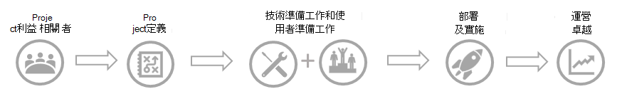

# 規劃升級Plan for your upgrade

健康的技術環境、持續採用使用者，以及達成您的商業目標，都是從適當的規劃開始。A healthy technical environment, sustained user adoption, and the realization of your business goals all begin with proper planning. 可靠的計畫會提供升級專案架構，並確保所有專案關係人都朝相同的目標努力。A solid plan gives you a framework for your upgrade project and ensures that all stakeholders are working toward the same goals. 只要花時間正確定義成功，就可以在部署進行時測量結果，並確認您正取得想要的結果。By taking time to properly define success, you can measure results as you progress through your deployment and verify that you're achieving the outcomes you wanted. 規劃您的行程包括：Planning your journey includes:

- [招募專案專案關係人Enlisting your project stakeholders](upgrade-enlist-stakeholders.md)
- [定義專案範圍Defining the scope of your project](./upgrade-define-project-scope.md)
- [瞭解商務用 Skype 和 Teams 的共存與互通性Understanding coexistence and interoperability of Skype for Business and Teams](./teams-and-skypeforbusiness-coexistence-and-interoperability.md)
- [根據您的業務需求選擇升級歷程Choosing your upgrade journey based on your business needs](upgrade-and-coexistence-of-skypeforbusiness-and-teams.md)
- [規劃使用者試驗Planning a user pilot](pilot-essentials.md)

規劃好您的行程之後，您將閱讀有關準備環境及準備組織的主題，然後再執行[升級](upgrade-to-teams.md)。 After you've planned your journey, you will read topics about [preparing your environment](upgrade-prepare-environment.md) and [preparing your organization](upgrade-prepare-organization.md) before you [implement your upgrade](upgrade-to-teams.md).  

> [!TIP]
> 與我們一起參與即時互動式研討會，我們將在這裡分享指導、最佳做法和資源，以啟動升級規劃與實作。Join us for live, interactive workshops in which we'll share guidance, best practices, and resources designed to kick start upgrade planning and implementation.
>
> 首先 [加入規劃升級](./upgrade-workshops-landing-page.yml) 會話以開始使用。Join the [Plan your upgrade](./upgrade-workshops-landing-page.yml) session first to get started.