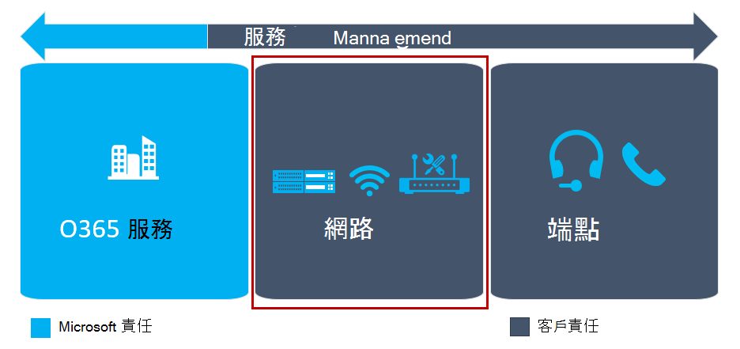

本文是您升級歷程的技術就緒階段（您可以與使用者準備階段並行完成的活動）的一部分。This article is part of the Technical Readiness stage of your upgrade journey, an activity you complete in parallel with the User Readiness stage. 繼續之前，請先確認您已從先前階段完成這些活動：Before proceeding, confirm that you’ve completed these activities from previous stages:

- [已登記您的專案干係人Enlisted your project stakeholders](upgrade-enlist-stakeholders.md)
- [已定義您的專案範圍Defined your project scope](https://aka.ms/SkypetoTeams-Scope)
- [已瞭解商務用 Skype 與團隊的共存與互通性Understood coexistence and interoperability of Skype for Business and Teams](https://aka.ms/SkypeToTeams-Coexist)
- [已選擇升級歷程Chosen your upgrade journey](upgrade-and-coexistence-of-skypeforbusiness-and-teams.md)

> [!Tip]
> 觀看下列會話，瞭解如何讓團隊利用您的網路，以及如何最佳規劃最佳網路連線：[團隊網路規劃](https://aka.ms/teams-networking)Watch the following session to learn how to Teams leverages your network and how to best plan for optimal network connectivity: [Teams Network Planning](https://aka.ms/teams-networking)

# 準備您的網路以升級至團隊Prepare your network for upgrading to Teams

如果您要部署音訊、影片或會議，您可以採取一些額外步驟來優化您的網路，以取得該功能。If you’re deploying audio, video, or meetings, you can take some additional steps to optimize your network for that functionality. 團隊使用可適應的音訊和視頻技術（編解碼器），因此在大多數網路條件下都能更好地執行。Teams uses audio and video technology (codecs) that can adapt to—and therefore perform better under—most network conditions. 為確保最佳且一致的效能，您應該為小組準備好您的網路。To ensure optimal and consistent performance, you should prepare your network for Teams.

## 為什麼應該準備網路？Why should you prepare your network?

在我們開始查看要採取的步驟之前，請務必瞭解可能會影響團隊效能的專案，進而讓使用者的幸福與滿意。Before we look at the steps to be taken, it’s important to understand what can affect the performance of Teams and thereby user happiness and satisfaction. 三個主要的風險區域會影響使用者如何感覺網路品質：Three major risk areas can affect how users perceive network quality:

- 沒有足夠的頻寬Insufficient bandwidth available

- 防火牆與 proxy 攔截程式Firewall and proxy blockers

- 網路障礙，例如抖動和資料包遺失Network impairments such as jitter and packet loss

下面所述的步驟可協助您判斷您的部署是否可能受到這些因素的影響，並將協助您移至解決方法。The steps described below will help you determine whether your deployment might be affected by any of these factors and will help you move toward a resolution. 無法準備您的網路，可能會導致不滿意的使用者，以及大量、較高的臨時修正程式。Failing to prepare your network will likely lead to dissatisfied users and costly, ad-hoc fixes. 透過為小組準備您的網路和您的組織，您就能極大地增加成功的機率。By preparing your network—and your organization—for Teams, you can dramatically increase your chance of success.

<!--ENDOFSECTION-->

## 頻寬規劃Bandwidth planning

無論您的網路狀況為何，Microsoft 團隊都能提供最佳的音訊、影片和內容共用體驗。Microsoft Teams gives you the best audio, video and content sharing experience regardless of your network conditions. 有了可變的編解碼器，就可以在有限的頻寬環境中協商媒體，且影響極小。With variable codecs, media can be negotiated in limited bandwidth environments with minimal impact. 但在頻寬不是一個重要問題時，體驗可以針對品質進行優化，包括最高解析度（含1080p 解析度），最多30fps 影片和15fps 內容，以及高保真音訊。But where bandwidth is not a concern, experiences can be optimized for quality, including up to 1080p video resolution, up to 30fps for video and 15fps for content, and high-fidelity audio.

[!INCLUDE [Bandwidth requirements](includes/bandwidth-requirements.md)]

### 本機網際網路出口Local internet egress

許多網路都是用來使用中樞與輪輻拓朴的設計。Many networks were designed to use a hub and spoke topology. 在此拓朴中，網際網路流量通常會在 WAN （egresses）到網際網路前，先將 WAN 移到中央資料中心。In this topology, internet traffic typically traverses the WAN to a central datacenter before it emerges (egresses) to the internet. 通常，這是為了將網路安全裝置集中化以減少總成本的目的。Often, this is done to centralize network security devices with the goal of reducing overall cost.

跨 WAN 的 hauling 流量會增加延遲，並對品質和使用者體驗造成負面影響。Back-hauling traffic across the WAN increases latency and has a negative impact on quality and the user experience. 因為 Microsoft 團隊是在 Microsoft 大型全域網路上執行，所以通常會有網路對等位置靠近使用者。Because Microsoft Teams runs on Microsoft’s large global network, there’s often a network peering location close to the user. 使用者最有可能獲得較佳的效能，只要從當地的網際網路點 egressing 到他們的位置，並儘快將它移到我們的語音優化網路上。A user will most likely get better performance by egressing out of a local internet point close to their location and on to our voice-optimized network as soon as possible. 針對某些工作負荷，DNS 要求是用來傳送流量到最接近的前端伺服器。For some workloads, DNS requests are used to send traffic to the nearest front-end server. 在這種情況下，請務必注意，當您使用本機的出局點時，它會與本機 DNS 解析搭配使用。In such cases, it’s important that when using a local egress point, it’s paired with local DNS resolution.

將網路路徑優化至 Microsoft 的全域網路可改善效能，並最終為使用者提供最佳的體驗。Optimizing the network path to Microsoft’s global network will improve performance and ultimately provide the best experience for users. 如需詳細資訊，請參閱在[Office 365 中取得最佳連線和效能](https://techcommunity.microsoft.com/t5/Office-365-Blog/Getting-the-best-connectivity-and-performance-in-Office-365/ba-p/124694)的博客文章。For more detail, see the blog post [Getting the best connectivity and performance in Office 365](https://techcommunity.microsoft.com/t5/Office-365-Blog/Getting-the-best-connectivity-and-performance-in-Office-365/ba-p/124694).

若要在 Microsoft 團隊中使用即時媒體來獲得最佳體驗，您必須符合 Office 365 的網路需求。To get an optimal experience using real-time media within Microsoft Teams, you must meet the networking requirements for Office 365. 如需詳細資訊，請參閱[商務用 Skype Online 的媒體質量和網路連線效能](/SkypeForBusiness/optimizing-your-network/media-quality-and-network-connectivity-performance)。For more information, see [Media Quality and Network Connectivity Performance for Skype for Business Online](/SkypeForBusiness/optimizing-your-network/media-quality-and-network-connectivity-performance).

定義網路區段（用戶端到 microsoft Edge 與客戶邊緣至 Microsoft Edge）必須符合下列需求：The two defining network segments (Client to Microsoft Edge and Customer Edge to Microsoft Edge) must meet the following requirements:

|**值****Value** |**用戶端到 Microsoft Edge****Client to Microsoft Edge** |**客戶邊緣到 Microsoft Edge****Customer Edge to Microsoft Edge** |
|---|---|---|
|**延遲（一種方式）****Latency (one way)** |< 50 ms< 50 ms |< 30 毫秒< 30 ms |
|**延遲（往返行程時間或 RTT）****Latency (round-trip time, or RTT)** |< 100 ms< 100 ms |< 60 ms< 60 ms |
|**突發資料包遺失****Burst packet loss** |在任何 200 ms 間隔期間，<10%<10% during any 200-ms interval |在任何 200 ms 間隔期間，<1%<1% during any 200-ms interval |
|**資料包遺失****Packet loss** |在任何15秒間隔期間，<1%<1% during any 15-sec interval |在任何15秒間隔期間，<0.1%<0.1% during any 15-sec interval |
|**資料包內部到達抖動****Packet inter-arrival jitter** |在任何15秒間隔期間，<30 ms<30 ms during any 15-sec interval |在任何15秒間隔期間，<15 ms<15 ms during any 15-sec interval |
|**資料包重新排序****Packet reorder** |<0.05% 的順序外資料包<0.05% out-of-order packets |<0.01% 的順序外資料包<0.01% out-of-order packets |

若要測試兩個網路區段，您可以使用 [[網路評](https://go.microsoft.com/fwlink/?linkid=855799)量] 工具。To test both network segments, you can use the [Network Assessment Tool](https://go.microsoft.com/fwlink/?linkid=855799). 此工具可以直接在用戶端電腦上和連線至客戶網路邊緣的電腦上部署。This tool can be deployed on both the client PC directly and on a PC connected to the Customer Network Edge. 此工具組含有限的檔，但在此可找到有關該工具用法的深入說明文件：[網路就緒評估](https://go.microsoft.com/fwlink/?linkid=855800)。The tool includes limited documentation, but a deeper documentation around the usage of the tool can be found here: [Network Readiness Assessment](https://go.microsoft.com/fwlink/?linkid=855800). 您可以透過執行此網路準備情況評估來驗證您的網路是否已準備好執行即時媒體應用程式，例如 Microsoft 團隊。By running this Network Readiness Assessment, you can validate your network’s readiness to run real-time media applications, such as Microsoft Teams.

> [!NOTE]
> 這是相同的網路準備情況評估，我們建議由想要成功部署商務用 Skype 的客戶執行。This is the same Network Readiness Assessment that we recommend be run by customers who are looking to successfully deploy Skype for Business.

### 點對點VPN

Vpn 為許多組織提供重要的服務。VPNs provide a valuable service to many organizations. 遺憾的是，它們通常不是專為支援即時媒體而設計或設定。Unfortunately, they’re typically not designed or configured to support real-time media. 某些 Vpn 可能也不支援 UDP。Some VPNs might also not support UDP. Vpn 也會在已加密的媒體流量上方引入額外的加密層級。VPNs also introduce an extra layer of encryption on top of media traffic that’s already encrypted. 此外，由於將流量釘選到 VPN 裝置，因此小組服務的連線可能無法有效。In addition, connectivity to the Teams service might not be efficient due to hair-pinning traffic through a VPN device. 此外，它們不一定是從容量角度設計來容納小組將需要的預期負載。Furthermore, they aren’t necessarily designed from a capacity perspective to accommodate the anticipated loads that Teams will require.

建議您提供一個替代路徑來避開團隊交通的 VPN。The recommendation is to provide an alternate path that bypasses the VPN for Teams traffic. 這通常稱為*分割隧道 VPN*。This is commonly known as *split-tunnel VPN*. 分割隧道表示 Office 365 的流量不會穿過 VPN，但會直接移至 Office 365。Split tunneling means that traffic for Office 365 won’t traverse the VPN but will go directly to Office 365. 這項變更會對品質產生正面的影響，但也會提供減少 VPN 裝置與組織網路負載的次要優點。This change will have a positive impact on quality, but also provides the secondary benefit of reducing load from the VPN devices and the organization’s network.

若要實現分割隧道，請諮詢您的 VPN 供應商以取得設定詳細資料。To implement a split-tunnel, consult with your VPN vendor for the configuration details.

### Wi-fiWi-Fi

就像 VPN，Wi-fi 網路不一定設計或設定為支援即時媒體。Like VPN, Wi-Fi networks aren’t necessarily designed or configured to support real-time media. 規劃或優化 Wi-fi 網路以支援小組是高品質部署的重要考慮。Planning for, or optimizing, a Wi-Fi network to support Teams is an important consideration for a high-quality deployment.

在優化 Wi-fi 網路時，有幾個因素會進入播放：There are several factors that come into play for optimizing a Wi-Fi network:

- 實施 QoS 或 Wi-fi 多媒體（WMM），以確保媒體流量在 Wi-fi 網路上得到相應的優先順序。Implementing QoS or Wi-Fi Multimedia (WMM) to ensure that media traffic is getting prioritized accordingly over the Wi-Fi networks.

- 規劃及優化 Wi-fi 區段和存取點位置。Planning and optimizing the Wi-Fi bands and access point placement. 2.4 GHz 範圍可能會根據存取點位置提供適當的體驗，但存取點通常會受到在該範圍中運作的其他消費者裝置的影響。The 2.4 GHz range might provide an adequate experience depending on access point placement, but access points are often affected by other consumer devices that operate in that range. 5 GHz 的範圍更適合即時媒體，因為它們的密集範圍，但需要更多存取點才能取得足夠的覆蓋範圍。The 5 GHz range is better suited to real-time media due to their dense range but requires more access points to get sufficient coverage. 端點也需要支援該範圍，並將其設定為可據此加以設定以利用這些區段。Endpoints also need to support that range and be configured to leverage those bands accordingly.

- 如果已部署雙頻帶 Wi-fi 網路，請考慮實施頻帶指導委員會。If dual-band Wi-Fi networks are deployed, consider implementing band steering. [_樂隊_控制] 是由 wi-fi 廠家提供的技術，可影響雙頻帶用戶端使用 5 GHz 範圍。_Band steering_ is a technique implemented by Wi-Fi vendors to influence dual-band clients to use the 5 GHz range.

- 當同一個頻道的存取點太靠近時，可能會導致信號重迭，並無意間爭奪，進而導致使用者無法正常發揮問題。When access points of the same channel are too close together they can cause signal overlap and unintentionally compete, resulting in a bad experience for the user. 確定彼此連續的存取點位於沒有交疊的頻道上。Ensure that access points that are next to each other are on channels that don’t overlap.

每個無線廠商都有自己的部署其無線解決方案的建議。Each wireless vendor has its own recommendations for deploying its wireless solution. 我們建議您向您的廠商諮詢特定的指導方針。We recommend that you consult your vendor for specific guidance.

<!--ENDOFSECTION-->

## 防火牆與 proxy 需求Firewall and proxy requirements

Microsoft 團隊會連線到 Microsoft Online 服務，並需要網際網路連線才能取得此問題。Microsoft Teams connects to Microsoft Online Services and needs internet connectivity for this. 若要讓團隊正常運作，您必須從用戶端開啟 TCP 埠80和443，以及從用戶端到網際網路的 UDP 埠3478到3481。For Teams to function correctly, you must open TCP ports 80 and 443 from the clients to the internet, and UDP ports 3478 through 3481 from the clients to the internet. TCP 埠是用來連線到網路內容（例如 SharePoint Online、Exchange Online 和團隊聊天服務）。The TCP ports are used to connect to web-based content such as SharePoint Online, Exchange Online, and the Teams Chat services. 外掛程式和連接器也會連線到這些 TCP 埠。Plug-ins and connectors also connect over these TCP ports. 在音訊和影片等媒體使用四個 UDP 埠，以確保它們正常流動。The four UDP ports are used for media such as audio and video, to ensure they flow correctly.

開啟這些埠對於可靠的小組部署而言是必要的。Opening these ports is essential for a reliable Teams deployment. 封鎖這些埠不受支援，並會影響媒體質量。Blocking these ports is unsupported and will affect media quality.

如果您的組織要求您指定要開啟這些埠的確切 IP 位址範圍和網域，您可以限制這些埠的目標 IP 範圍和網域。If your organization requires that you specify the exact IP address ranges and domains to which these ports should be opened, you can restrict the target IP ranges and domains for these ports. 如需確切的埠、通訊協定和 IP 範圍清單，請參閱[Office 365 url 與 ip 位址範圍](https://docs.microsoft.com/office365/enterprise/urls-and-ip-address-ranges)。For a list of exact ports, protocols, and IP ranges, see [Office 365 URLs and IP address ranges](https://docs.microsoft.com/office365/enterprise/urls-and-ip-address-ranges). 如果您選擇限制目標 IP 位址範圍和網域，您必須確保將埠清單和範圍保持在最新狀態，因為它們可能會變更。If you choose to restrict the target IP address ranges and domains, you must ensure that you keep the list of ports and ranges up to date because they might change. 您可以訂閱[此 RSS](https://go.microsoft.com/fwlink/p/?linkid=236301)摘要，以便在變更發生時進行更新。You can subscribe to [this RSS feed](https://go.microsoft.com/fwlink/p/?linkid=236301) to be updated when changes occur. 您也可以定期執行[商務用 Skype 網路評估工具](https://www.microsoft.com/download/details.aspx?id=53885)來測試所有埠是否已開啟，這也是一種很好的做法。It’s also a good practice to test whether all ports are opened by running the [Skype for Business Network Assessment Tool](https://www.microsoft.com/download/details.aspx?id=53885) on a regular basis. 您可以在下一節中找到更多關於此工具功能的資訊。You can find out more about the functionality of this tool in the next section.

在要部署的 proxy 伺服器事件中，建議您略過所有團隊服務的 proxy 伺服器。In the event of a proxy server being deployed, we recommend that you bypass the proxy server for all Teams services. 雖然您可以使用 proxy，但很可能是因為媒體不得不使用 TCP，而不是 UDP，所以品質會降低。Although using a proxy might work, it’s very likely that quality will be reduced due to media’s being forced to use TCP instead of UDP. 如需 proxy 伺服器和略過的詳細資訊，請參閱[Office 365 url 與 IP 位址範圍](https://docs.microsoft.com/MicrosoftTeams/office-365-urls-ip-address-ranges)。For more information about proxy servers and bypassing, see [Office 365 URLs and IP address ranges](https://docs.microsoft.com/MicrosoftTeams/office-365-urls-ip-address-ranges).

<!--ENDOFSECTION-->

## 其他網路考慮Additional network considerations

### 外部名稱解析External name resolution

確定執行團隊用戶端的所有用戶端電腦都可以解析外部 DNS 查詢，以探索 Office 365 提供的服務。Ensure that all the client computers running the Teams client can resolve external DNS queries to discover the services provided by Office 365.

### NAT 池子大小NAT pool size

當多個使用者和裝置使用網路位址轉譯（NAT）或埠位址轉換（PAT）來存取 Office 365 時，您必須確保隱藏在每個公開路由的 IP 位址背後的裝置不會超過支援的號碼。When multiple users and devices access Office 365 by using Network Address Translation (NAT) or Port Address Translation (PAT), you need to ensure that the devices hidden behind each publicly routable IP address don’t exceed the supported number.

若要緩解此風險，請確保已將充足的公用 IP 位址指派給 NAT 池，以避免埠耗盡。To mitigate this risk, ensure adequate public IP addresses are assigned to the NAT pools to prevent port exhaustion. 埠耗盡會導致內部使用者和裝置在連線至 Office 365 服務時面臨問題。Port exhaustion will cause internal end users and devices to face issues when connecting to the Office 365 services. 如需詳細資訊，請參閱[Office 365 的 NAT 支援](https://docs.microsoft.com/office365/enterprise/nat-support-with-office-365)。For more information, see [NAT support with Office 365](https://docs.microsoft.com/office365/enterprise/nat-support-with-office-365).

### 入侵偵測與防範指導方針Intrusion detection and prevention guidance

如果您的環境中有一個入侵偵測系統和/或入侵防禦系統，且已針對輸出連線的額外安全層級部署，請確定任何以 Office 365 Url 作為目的地的流量都是白名單。If your environment has an intrusion detection system and/or intrusion prevention system deployed for an extra layer of security for outbound connections, ensure that any traffic that has Office 365 URLs as its destination is whitelisted.

## 測試網路Test the network

完成規劃和網路準備之後（包括升級防火牆中的 [升級頻寬] 和 [開啟埠]），您應該測試網路的效能。After you’ve completed your planning and network preparation—including upgrading bandwidth and opening ports in the firewall—you should test your network’s performance. 這個測試的結果會讓您更清楚地瞭解您的小組實現成功所需的任何網路優化或修正。The results of this testing will paint a clearer picture of any network optimization or remediation required for the success of your Teams implementation.

您可以下載[商務用 Skype 網路評估工具](https://www.microsoft.com/download/details.aspx?id=53885)，以測試您的網路是否已準備好供團隊進行。You can download the [Skype for Business Network Assessment Tool](https://www.microsoft.com/download/details.aspx?id=53885) to test whether your network is ready for Teams. 此工具提供雙重功能：可以測試是否所有正確的埠都已開啟，而且可以測試網路是否有障礙。The tool offers dual functionality: it can test whether all the correct ports have been opened, and it can test for network impairments.

下載並安裝該工具之後，您可以在 C:\Program 檔案（x86） \Microsoft 商務用 Skype Network 評估工具中找到該工具。After you download and install the tool, you can find it in C:\Program Files (x86)\Microsoft Skype for Business Network Assessment Tool. 該目錄中包含如何使用此工具的詳細指南（例如，用法 .docx）。A detailed guide for how to use the tool, Usage.docx, is included in that directory.

### 測試已開啟的埠Test for opened ports

開啟命令提示字元視窗，然後在 [ **cd C:\Program Files （x86）] \Microsoft [商務用 Skype Network] 評估工具**中，流覽至網路評量工具目錄。Open a Command prompt window and navigate to the Network Assessment Tool directory by entering **cd C:\Program Files (x86)\Microsoft Skype for Business Network Assessment Tool**. 在命令提示字元中，輸入 networkassessmenttool 以開始測試已開啟的埠 **/connectivitycheck**At the command prompt, start the test for opened ports by entering **networkassessmenttool.exe /connectivitycheck**

執行檢查之後，該工具會顯示「驗證已成功完成」的訊息，或報告已封鎖的埠。After running the checks, the tool will either display the message “Verifications Completed Successfully” or report on the ports that were blocked. 它也會產生名為 Connectivity_results .txt 的檔案，其中包含該工具的輸出，並將其儲存在% userprofile\\%\\appdata\\本機 microsoft 商務用 skype 網路評估\\工具目錄中。It also generates a file named Connectivity_results.txt, which contains the output from the tool and stores it in the %userprofile%\\appdata\\local\\microsoft skype for business network assessment tool\\ directory.

我們建議您定期執行連接檢查，以確保埠已開啟且正常運作。We recommend that you run the connectivity checks on a regular basis to ensure the ports have been opened and are functioning correctly.

### 測試網路是否有障礙Test for network impairments

若要提高使用者滿意度，您應該限制在網路上有任何障礙。To increase user satisfaction, you should limit any impairments on your network. 最常見的網路障礙是延遲（延遲）、資料包遺失和抖動：The most common network impairments are delay (latency), packet loss, and jitter:

- **延遲：** 這是取得 IP 資料包從點 A 到網路上的點 B 所需的時間。**Latency:** This is the time it takes to get an IP packet from point A to point B on the network. 此網路傳播延遲實質上會與兩個點之間的實際距離和光線速度之間的距離產生關聯，包括不同的路由器所佔用的額外負荷。This network propagation delay is essentially tied to physical distance between the two points and the speed of light, including additional overhead taken by the various routers in between. 延遲是以單向或往返時間的方式來測量。Latency is measured as one-way or round-trip time.

- **資料包遺失**：這通常是定義為在指定的時間視窗中遺失的資料包百分比。**Packet loss**: This is often defined as a percentage of packets that are lost in a given window of time. 資料包遺失會直接影響音訊品質-從較小、個別的遺失式資料包，幾乎不會影響到完全剪下音訊的背對後爆發損失。Packet loss directly affects audio quality—from small, individual lost packets having almost no impact to back-to-back burst losses that cause audio to cut out completely.

- **資料包間的抖動，或簡單地抖動：** 這是連續資料包之間延遲的平均變更。**Inter-packet arrival jitter, or simply jitter:** This is the average change in delay between successive packets. 大多數現代 VoIP 軟體（包括商務用 Skype）都可以透過緩衝來適應某些層級的抖動。Most modern VoIP software, including Skype for Business, can adapt to some levels of jitter through buffering. 只有抖動超過了參與者會注意到抖動效果的緩衝，才會出現這種情況。It's only when the jitter exceeds the buffering that a participant will notice the effects of jitter.

在[媒體質量和網路連線效能](/SkypeForBusiness/optimizing-your-network/media-quality-and-network-connectivity-performance)中，會說明這些障礙的最大值。The maximum values for these impairments are described in [Media quality and network connectivity performance](/SkypeForBusiness/optimizing-your-network/media-quality-and-network-connectivity-performance). 測試這些障礙時，我們會區分兩個不同的區段：When testing for these impairments, we distinguish between two separate segments:

- [*邊緣] 區段*是您的路由器所在的區段。The *edge segment* is the segment in which your router lives. 這是您在每個位置都連接至網際網路的最接近邏輯網路區段。This is the closest logical network segment connected to the internet at each of your locations. 在大多數情況下，這是路由器的連接點，或可能是周邊網路（也稱為*DMZ*、*隔離區域*及*遮罩子網*）。In most cases, this is the connection point of the router, or possibly a perimeter network (also known as *DMZ*, *demilitarized zone*, and *screened subnet*). 除了路由器以外的裝置之外，不會發生任何其他影響裝置與網際網路之間的通信量。No further traffic that affects devices other than the router should occur between this segment and the internet.

- *用戶端區段*是您的用戶端所在的邏輯網路區段。The *client segment* is the logical network segment in which your clients reside.

您應該使用 [網路評量] 工具測試這兩個區段。You should test both segments by using the Network Assessment Tool. 若要測試區段，請流覽至該目錄，然後在命令提示字元中輸入**networkassessmenttool。**To test the segment, navigate to the directory and enter **networkassessmenttool.exe** at the command prompt. 結果會寫入名為 tsv 的檔案名，您可以將其與每個區段的[需求](/SkypeForBusiness/optimizing-your-network/media-quality-and-network-connectivity-performance)進行比較。The results are written to a file named Results.tsv, and you can compare them to the [requirements](/SkypeForBusiness/optimizing-your-network/media-quality-and-network-connectivity-performance) for each segment.

請注意，這兩個區段必須符合高品質部署的需求。Note that both segments must meet the requirements for a high-quality deployment. 我們建議您多次執行該工具，以讓您的網路效能得到良好的指示。We recommend that you run the tool multiple times for one hour straight to get a good indication of your network’s performance.

<!--ENDOFSECTION-->

## 網路修正Network remediation

如果頻寬規劃、埠測試或網路需求測試的結果顯示您目前的網路需要修正，才能部署小組，您可以透過下列幾種方式來完成此動作：If the results of bandwidth planning, port testing, or network requirements testing show that your current network needs remediation before you deploy Teams, you can accomplish this in several ways:

- 如果沒有足夠的頻寬，請升級連線，讓 Office 365 的流量能 unhindered。For insufficient bandwidth, upgrade connections so that traffic to Office 365 can flow unhindered.

- 針對封鎖的埠，請變更防火牆規則並重新測試埠。For blocked ports, change firewall rules and retest the ports.

- 針對網路障礙，請務必執行根本原因分析。For network impairments, always perform a root-cause analysis.

您可以將服務品質（QoS）劃分優先順序並分隔流量，以讓障礙不足。Quality of service (QoS) can be used to battle impairments by prioritizing and separating traffic. 有些組織會選擇部署 QoS 來克服頻寬問題，或限制流量流動的通信量。Some organizations choose to deploy QoS to overcome bandwidth issues or restrict the amount of traffic flowing. 這不會改善品質，也會導致新問題。This won’t improve quality and will lead to new problems. 當網路障礙超過需求時，請務必執行根本原因分析。A root-cause analysis should always be performed when network impairments exceed requirements. QoS 可以是解決方案。QoS can be a solution. 如需詳細資訊，請參閱[Microsoft 團隊中的服務品質](qos-in-teams.md)。For more information, see [Quality of Service in Microsoft Teams](qos-in-teams.md).

>[!NOTE]
>許多網路由於升級、擴充或其他業務需求而逐漸隨著時間發展。Many networks evolve over time due to upgrades, expansion, or other business requirements. 請確定您有適當的運作程式，以維護這些區域做為服務管理規劃的一部分。Ensure that you have operational processes in place to maintain these areas as part of your service management planning.

<table>
<tr><td>  決策點Decision point</td><td><ul><li>誰負責在所有網路區段和組織位置完成正確的網路評估？Who will be responsible for completing proper network assessments across all network segments and organization locations?</li></ul></td></tr>
<tr><td> 後續步驟Next steps</td><td><ul><li>您可以執行詳細的網路評量，以協助確保您的網路可供您的 Microsoft 團隊部署使用。You can perform a detailed network assessment to help ensure your network is ready for your Microsoft Teams deployment. </li><li>根據每個網路區段的網路就緒評估結果來執行網路修正。Perform network remediation based on the results of the network readiness assessment for every network segment.</li></ul></td></tr>
</table>

<!--ENDOFSECTION-->

## 主要優點Key takeaways

這些是本指南的主要優點。These are the main takeaways from this guidance. 您必須：You must:

- 開啟從將使用團隊之用戶端傳出的 TCP 埠80和443。Open TCP ports 80 and 443 outgoing from clients that will use Teams.

- 從將使用團隊的用戶端向外開啟 UDP 埠3478到3481。Open UDP ports 3478 through 3481 outgoing from clients that will use Teams.

- 確定您有足夠的頻寬可用於部署團隊。Ensure that you have sufficient bandwidth for deploying Teams.

- 執行 [[網路評](https://www.microsoft.com/download/details.aspx?id=53885)量] 工具，並確保符合從邊緣區段和用戶端區段的[媒體質量和網路連線效能](/SkypeForBusiness/optimizing-your-network/media-quality-and-network-connectivity-performance)中所述的需求。Run the [Network Assessment Tool](https://www.microsoft.com/download/details.aspx?id=53885) and ensure that you meet the requirements described in [Media quality and network connectivity performance](/SkypeForBusiness/optimizing-your-network/media-quality-and-network-connectivity-performance) from both the edge segment and the client segment.

## 相關主題Related Topics

[影片：網路規劃Video: Network Planning](https://aka.ms/teams-networking)
