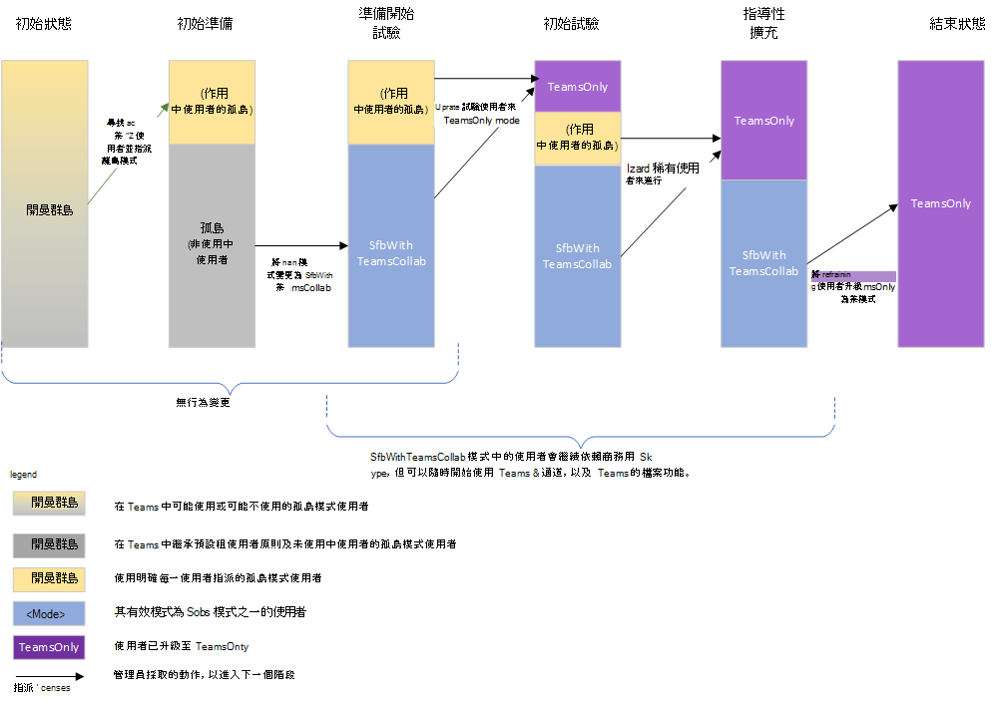

# <a name="upgrade-strategies-for-it-administrators"></a>適用于 IT 系統管理員的升級策略


本文適用于想要實作從商務用 Skype升級至Teams的 IT 系統管理員。

在實作升級之前，建議您使用下列文章來描述重要的升級概念和共存行為：

- [瞭解Microsoft Teams與商務用 Skype共存與互通性](teams-and-skypeforbusiness-coexistence-and-interoperability.md)
- [共存模式 - 參照](migration-interop-guidance-for-teams-with-skype.md)
- [Teams 用戶端體驗和遵從共存模式](teams-client-experience-and-conformance-to-coexistence-modes.md)

## <a name="upgrade-options"></a>升級選項

本節說明如何使用下列其中一個升級選項來實作升級：

- [使用群島模式升級 (重迭功能) ](#overlapping-capabilities-upgrade-using-islands-mode)
- [尚未開始使用Teams的組織選取功能更新](#a-select-capabilities-upgrade-for-an-organization-that-has-not-yet-started-using-teams)
- [已在群島模式中使用Teams的組織選取功能更新](#a-select-capabilities-upgrade-for-an-organization-that-is-already-using-teams-in-islands-mode)

如果您需要選項的詳細資訊，請確定您已經閱讀選擇[從商務用 Skype升級到Teams的升級旅程](upgrade-and-coexistence-of-skypeforbusiness-and-teams.md)。

## <a name="overlapping-capabilities-upgrade-using-islands-mode"></a>使用群島模式升級 (重迭功能) 

對於重迭功能更新選項：

- 如果您可以為整個組織快速升級，請考慮這個選項。  由於執行這兩個用戶端的使用者可能會造成混淆，因此最好能將使用者必須同時執行這兩個用戶端的時段最小化。 您應該確保您的使用者知道要同時執行這兩個用戶端。

- 此選項為全新模式，除了指派Microsoft 365或Office 365授權外，不需要系統管理員動作即可開始Teams。 如果您的使用者已經商務用 Skype Online，您可能已經處於此模式。

- 要退出重迭的功能模式並移至 TeamsOnly 可能不太容易。 由於升級的使用者只能透過Teams通訊，因此組織中與該使用者通訊的任何其他使用者都必須使用Teams。  如果您的使用者尚未開始使用Teams，他們會暴露在遺失的訊息中。 此外，他們不會在 商務用 Skype 中看到 TeamsOnly 使用者線上。 有些組織選擇使用租使用者全域原則進行全租使用者升級，以避免此問題，不過這需要事先規劃，以及等到所有使用者都準備好升級為止。

## <a name="a-select-capabilities-upgrade-for-an-organization-that-has-not-yet-started-using-teams"></a>尚未開始使用Teams的組織選取功能更新

如果貴組織在 Teams 中沒有任何作用中的使用者，第一個步驟是將 Teams 的預設租使用者全租使用者原則設定為其中一個商務用 Skype模式，例如 SfbWithTeamsCollab。  尚未開始使用Teams的使用者不會注意到任何行為差異。 不過，在租使用者層級設定此原則可讓您開始將使用者升級至 TeamsOnly 模式，並確保升級的使用者仍可與未升級的使用者通訊。  一旦您找到試驗使用者，就可以將他們升級至 TeamsOnly。  如果是內部部署，請使用 Move-CsUser。 如果他們在線上，只要使用 Grant-CsTeamsUpgradePolicy 指派 TeamsOnly 模式即可。 根據預設，這些使用者所排程的任何商務用 Skype會議都會移轉到Teams。

以下是重要命令：

1. 將全租使用者預設值設為模式 SfbWithTeamsCollab 如下所示：

   ```PowerShell
   Grant-CsTeamsUpgradePolicy -PolicyName SfbWithTeamsCollab -Global
   ```

2. 將試驗使用者升級至 TeamsOnly 如下所示：

   - 對於在線上的使用者：

     ```PowerShell
     Grant-CsTeamsUpgradePolicy -PolicyName UpgradeToTeams -Identity $username
     ```

   - 對於內部部署的使用者：

     ```PowerShell
     Move-CsUser -identity $user -Target sipfed.online.lync.com -MoveToTeams -credential $cred
     ```

**附注**：

- 您可以將它設定為 SfbWithTeamsCollab，而不是將全租使用者原則設定為 SfbWithTeamsCollabAndMeetings。 這會導致所有使用者在Teams中排程所有新會議。
- 根據預設，升級至 TeamsOnly 模式或指派 SfbWithTeamsCollabAndMeetings 模式時，商務用 Skype會議會移轉到 Teams。

> [!NOTE]
> 為準備即將淘汰 商務用 Skype Online，Microsoft 簡化了組織移轉至Teams的方式。 不再需要指定 `-MoveToTeams` 將使用者直接從內部部署移至 TeamsOnly 的切換 `Move-CsUser` 。 先前若未指定此切換，使用者會從內部部署的商務用 Skype Server家移轉至 商務用 Skype Online，而他們的模式則維持不變。 現在當使用者從內部部署移至雲 `Move-CsUser` 端時，系統會自動指派使用者 TeamsOnly 模式，且他們的內部部署會議會自動轉換為Teams會議，就如同實際指定切換一樣 `-MoveToTeams switch had been specified` 。 此行為適用于從未支援 `-MoveToTeams`) 的所有 Skype 商務用伺服器和 Lync Server 2013 (版本。

下圖顯示沒有先前使用Teams的組織選取功能更新的概念性階段。 長條的高度代表使用者數目。 在升級的任何階段中，所有使用者都可以彼此通訊。  商務用 Skype使用者使用 Interop 與 TeamsOnly 使用者通訊，反之亦然。 在群島模式中的使用者必須同時執行這兩個用戶端。


## <a name="a-select-capabilities-upgrade-for-an-organization-that-is-already-using-teams-in-islands-mode"></a>已在群島模式中使用Teams的組織選取功能更新

如果貴組織中的某些使用者正在群島模式中主動使用Teams，您可能不想移除現有使用者的功能。 因此，變更整個租使用者的原則之前，必須先進行額外的步驟。 解決方法是在將全租使用者原則設定為 SfbWithTeamsCollab 之前，將這些現有的作用中Teams使用者「寄送」到群島模式。  完成之後，您可以如上所述繼續進行部署，不過，您會有兩個使用者群組要移至 TeamsOnly：在Teams使用中的使用者會處於群島模式，而其餘的使用者則會處於 SfbWithTeamsCollab 模式。 您可以逐步將這些使用者移至 TeamsOnly 模式。

1. 尋找使用Teams的使用者，如下所示：

   1. 從Microsoft 365 系統管理中心的左側導覽中，移至 [報告]，然後移至 [使用狀況]。
   2. 在 [選取報告] 下拉式清單中，選擇 [Microsoft Teams]，然後選擇 [使用者活動]。 這會提供已在 Teams 中使用中的可匯出使用者資料表。
   3. 按一下 [匯出]、開啟 [Excel]，然後篩選以僅顯示正在Teams的使用者。

2. 針對步驟 1 中找到的每個作用中Teams使用者，在遠端 PowerShell 中指派他們群島模式。 這可讓您移至下一個步驟，並確保您不會變更使用者體驗。

   ```PowerShell
   $users=get-content "C:\MyPath\users.txt"
    foreach ($user in $users){
    Grant-CsTeamsUpgradePolicy -identity $user -PolicyName Islands}
   ```

3. 將整個租使用者的原則設定為 SfbWithTeamsCollab：

   ```PowerShell
   Grant-CsTeamsUpgradePolicy -Global -PolicyName SfbWithTeamsCollab
   ```

4. 將選取的使用者升級至 TeamsOnly 模式。 您可以選擇以群島模式或 SfbWithTeamsCollab 模式升級使用者，不過建議您優先安排在群島模式中升級使用者的優先順序，以減少使用者處於群島模式時可能會出現的混淆。

   對於商務用 Skype Online 的使用者：

   ```PowerShell
   Grant-CsTeamsUpgradePolicy -Identity $user -PolicyName UpgradeToTeams
   ```

   對於商務用 Skype Server內部部署的使用者：

   ```PowerShell
   Move-CsUser -Identity $user -Target sipfed.online.lync.com -MoveToTeams -credential $cred
   ```

下圖顯示選取功能轉換的概念性階段，一開始會有作用中的群島使用者。 長條的高度代表使用者數目。 在升級的任何階段中，所有使用者都可以彼此通訊。  商務用 Skype使用者使用 Interop 與 TeamsOnly 使用者通訊，反之亦然。



## <a name="related-links"></a>相關連結

[搭配使用Teams的組織移轉和互通性指導方針商務用 Skype](migration-interop-guidance-for-teams-with-skype.md)

[設定商務用 Skype Server與Microsoft 365或Office 365之間的混合式連線](/SkypeForBusiness/hybrid/configure-hybrid-connectivity)

[在內部部署和雲端之間移動使用者](/SkypeForBusiness/hybrid/move-users-between-on-premises-and-cloud)

[設定您的共存與升級設定](setting-your-coexistence-and-upgrade-settings.md)

[Grant-CsTeamsUpgradePolicy](/powershell/module/skype/grant-csteamsupgradepolicy)

[使用會議移轉服務 (MMS) ](/skypeforbusiness/audio-conferencing-in-office-365/setting-up-the-meeting-migration-service-mms)
