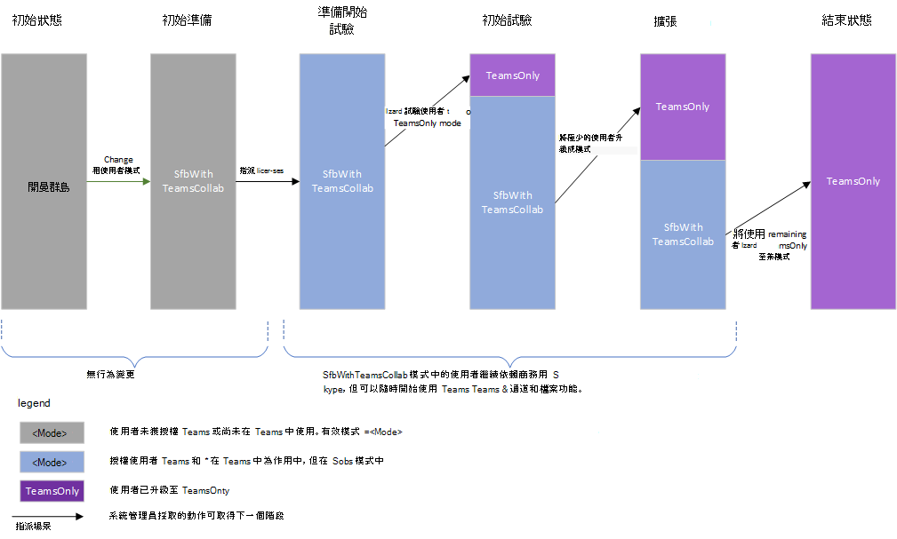

# <a name="upgrade-strategies-for-it-administrators"></a><span data-ttu-id="f4bfb-103">適用于 IT 系統管理員的升級策略</span><span class="sxs-lookup"><span data-stu-id="f4bfb-103">Upgrade strategies for IT administrators</span></span>

<span data-ttu-id="f4bfb-104"></span><span class="sxs-lookup"><span data-stu-id="f4bfb-104"></span></span>

<span data-ttu-id="f4bfb-105">本文適用于想要從商務用 Skype 升級至 Teams 的 IT 系統管理員。</span><span class="sxs-lookup"><span data-stu-id="f4bfb-105">This article is for IT administrators who want to implement their upgrade to Teams from Skype for Business.</span></span>

<span data-ttu-id="f4bfb-106">在實行升級之前，建議您閱讀下列文章，說明重要的升級概念和共存行為：</span><span class="sxs-lookup"><span data-stu-id="f4bfb-106">Before implementing your upgrade, we recommend the following articles which describe important upgrade concepts and coexistence behaviors:</span></span>

- [<span data-ttu-id="f4bfb-107">瞭解 Microsoft Teams 和商務用 Skype 共存與互通性</span><span class="sxs-lookup"><span data-stu-id="f4bfb-107">Understand Microsoft Teams and Skype for Business coexistence and interoperability</span></span>](teams-and-skypeforbusiness-coexistence-and-interoperability.md)
- [<span data-ttu-id="f4bfb-108">共存模式 - 參照</span><span class="sxs-lookup"><span data-stu-id="f4bfb-108">Coexistence modes - Reference</span></span>](migration-interop-guidance-for-teams-with-skype.md)
- [<span data-ttu-id="f4bfb-109">Teams 用戶端體驗和遵從共存模式</span><span class="sxs-lookup"><span data-stu-id="f4bfb-109">Teams client experience and conformance to coexistence modes</span></span>](teams-client-experience-and-conformance-to-coexistence-modes.md)

## <a name="upgrade-options"></a><span data-ttu-id="f4bfb-110">升級選項</span><span class="sxs-lookup"><span data-stu-id="f4bfb-110">Upgrade options</span></span>

<span data-ttu-id="f4bfb-111">本節說明如何使用下列其中一個升級選項來執行升級：</span><span class="sxs-lookup"><span data-stu-id="f4bfb-111">This section describes how to implement your upgrade by using one of the following upgrade options:</span></span>

- [<span data-ttu-id="f4bfb-112">使用群島模式升級 (功能) </span><span class="sxs-lookup"><span data-stu-id="f4bfb-112">Overlapping capabilities upgrade (using Islands mode)</span></span>](#overlapping-capabilities-upgrade-using-islands-mode)
- [<span data-ttu-id="f4bfb-113">尚未開始使用 Teams 的組織之選取功能更新</span><span class="sxs-lookup"><span data-stu-id="f4bfb-113">A select capabilities upgrade for an organization that has not yet started using Teams</span></span>](#a-select-capabilities-upgrade-for-an-organization-that-has-not-yet-started-using-teams)
- [<span data-ttu-id="f4bfb-114">針對已在群島模式中使用 Teams 的組織進行選取功能更新</span><span class="sxs-lookup"><span data-stu-id="f4bfb-114">A select capabilities upgrade for an organization that is already using Teams in Islands mode</span></span>](#a-select-capabilities-upgrade-for-an-organization-that-is-already-using-teams-in-islands-mode)

<span data-ttu-id="f4bfb-115">如果您需要選項的詳細資訊，請確定已閱讀選擇從商務用 Skype 到 Teams 的 [升級旅程](upgrade-and-coexistence-of-skypeforbusiness-and-teams.md)。</span><span class="sxs-lookup"><span data-stu-id="f4bfb-115">If you need more information about the options, make sure you have already read [Choose your upgrade journey from Skype for Business to Teams](upgrade-and-coexistence-of-skypeforbusiness-and-teams.md).</span></span>

## <a name="overlapping-capabilities-upgrade-using-islands-mode"></a><span data-ttu-id="f4bfb-116">使用群島模式升級 (功能) </span><span class="sxs-lookup"><span data-stu-id="f4bfb-116">Overlapping capabilities upgrade (using Islands mode)</span></span>

<span data-ttu-id="f4bfb-117">針對重迭的功能更新選項：</span><span class="sxs-lookup"><span data-stu-id="f4bfb-117">For the overlapping capabilities upgrade option:</span></span>

- <span data-ttu-id="f4bfb-118">如果您可以為整體組織執行快速升級，請考慮此選項。</span><span class="sxs-lookup"><span data-stu-id="f4bfb-118">Consider this option if you can do a fast upgrade for your overall organization.</span></span>  <span data-ttu-id="f4bfb-119">由於使用者可能因為執行這兩個用戶端而產生混淆的風險，因此最好能將使用者必須執行這兩個用戶端的期間最小化。</span><span class="sxs-lookup"><span data-stu-id="f4bfb-119">Since there is potential risk of confusion for end users with running both clients, it’s best if you can minimize the time period during which users must run both clients.</span></span> <span data-ttu-id="f4bfb-120">您應該確保您的使用者知道要執行這兩個用戶端。</span><span class="sxs-lookup"><span data-stu-id="f4bfb-120">You should ensure your users know to run both clients.</span></span>

- <span data-ttu-id="f4bfb-121">此選項是開箱即用模型，不需要系統管理員動作，您只需要指派 Microsoft 365 或 Office 365 授權，才能開始使用 Teams。</span><span class="sxs-lookup"><span data-stu-id="f4bfb-121">This option is the out-of-the box model, and doesn’t require administrator action to get started with Teams except to assign the Microsoft 365 or Office 365 license.</span></span> <span data-ttu-id="f4bfb-122">如果您的使用者已經有商務用 Skype Online，您可能已經在這個模型中了。</span><span class="sxs-lookup"><span data-stu-id="f4bfb-122">If your users already have Skype for Business Online, you may already be in this model.</span></span>

- <span data-ttu-id="f4bfb-123">要退出重迭功能模式並移往 TeamsOnly 可能會是一項挑戰。</span><span class="sxs-lookup"><span data-stu-id="f4bfb-123">It can be challenging getting out of overlapping capabilities mode and moving to TeamsOnly.</span></span> <span data-ttu-id="f4bfb-124">由於升級的使用者只會透過 Teams 進行通訊，因此組織中與該使用者通訊的其他使用者都必須使用 Teams。</span><span class="sxs-lookup"><span data-stu-id="f4bfb-124">Because upgraded users only communicate via Teams, any other user in the organization communicating with that user must be using Teams.</span></span>  <span data-ttu-id="f4bfb-125">如果您有尚未開始使用 Teams 的使用者，他們會暴露在遺失的郵件中。</span><span class="sxs-lookup"><span data-stu-id="f4bfb-125">If you have users that have not started using Teams, they will be exposed to missing messages.</span></span> <span data-ttu-id="f4bfb-126">此外，他們也不會在商務用 Skype 中線上看到 TeamsOnly 使用者。</span><span class="sxs-lookup"><span data-stu-id="f4bfb-126">Furthermore, they won’t see the TeamsOnly users online in Skype for Business.</span></span> <span data-ttu-id="f4bfb-127">有些組織會選擇使用租使用者全域原則進行全租使用者升級，以避免這種情況，不過這需要預先規劃，並等到所有使用者準備好升級之後才能升級。</span><span class="sxs-lookup"><span data-stu-id="f4bfb-127">Some organizations choose to do a tenant-wide upgrade using the Tenant global policy to avoid this, however that requires upfront planning as well as waiting until all users are ready to be upgraded.</span></span>


## <a name="a-select-capabilities-upgrade-for-an-organization-that-has-not-yet-started-using-teams"></a><span data-ttu-id="f4bfb-128">尚未開始使用 Teams 的組織之選取功能更新</span><span class="sxs-lookup"><span data-stu-id="f4bfb-128">A select capabilities upgrade for an organization that has not yet started using Teams</span></span>

<span data-ttu-id="f4bfb-129">如果貴組織尚未在 Teams 中有任何作用中使用者，第一個步驟是設定 TeamsUpgradePolicy 的預設全租使用者政策至其中一種商務用 Skype 模式，例如 SfbWithTeamsCollab。</span><span class="sxs-lookup"><span data-stu-id="f4bfb-129">If your organization does not yet have any active users in Teams, the first step is to set the default tenant-wide policy for TeamsUpgradePolicy to one of the Skype for Business modes, for example, SfbWithTeamsCollab.</span></span>  <span data-ttu-id="f4bfb-130">尚未開始使用 Teams 的使用者不會注意到任何行為差異。</span><span class="sxs-lookup"><span data-stu-id="f4bfb-130">Users who have not yet started using Teams won’t notice any difference in behavior.</span></span> <span data-ttu-id="f4bfb-131">不過，在租使用者層級設定此策略可讓使用者開始將使用者升級至 TeamsOnly 模式，並確保升級的使用者仍然可以與未升級的使用者通訊。</span><span class="sxs-lookup"><span data-stu-id="f4bfb-131">However, setting this policy at the tenant level makes it possible to start upgrading users to TeamsOnly mode, and ensures that the upgraded users can still communicate with non-upgraded users.</span></span>  <span data-ttu-id="f4bfb-132">一旦識別您的試驗使用者之後，您可以將他們升級至 TeamsOnly。</span><span class="sxs-lookup"><span data-stu-id="f4bfb-132">Once you have identified your pilot users you can upgrade them to TeamsOnly.</span></span>  <span data-ttu-id="f4bfb-133">如果是內部部署，請使用 Move-CsUser。</span><span class="sxs-lookup"><span data-stu-id="f4bfb-133">If they are on-premises, use Move-CsUser.</span></span> <span data-ttu-id="f4bfb-134">如果他們在線上，只要使用 Grant-CsTeamsUpgradePolicy 指派 TeamsOnly 模式。</span><span class="sxs-lookup"><span data-stu-id="f4bfb-134">If they are online, simply assign them TeamsOnly mode by using Grant-CsTeamsUpgradePolicy.</span></span> <span data-ttu-id="f4bfb-135">根據預設，這些使用者排程的任何商務用 Skype 會議都會移至 Teams。</span><span class="sxs-lookup"><span data-stu-id="f4bfb-135">By default, any Skype for Business meetings scheduled by these users will be migrated to Teams.</span></span>

<span data-ttu-id="f4bfb-136">以下是主要命令：</span><span class="sxs-lookup"><span data-stu-id="f4bfb-136">Following are the key commands:</span></span>

1. <span data-ttu-id="f4bfb-137">將全租使用者的預設設定為模式 SfbWithTeamsCollab，如下所示：</span><span class="sxs-lookup"><span data-stu-id="f4bfb-137">Set the tenant-wide default to mode SfbWithTeamsCollab as follows:</span></span>

   ```PowerShell
   Grant-CsTeamsUpgradePolicy -PolicyName SfbWithTeamsCollab -Global
   ```

2. <span data-ttu-id="f4bfb-138">將試驗使用者升級至 TeamsOnly，如下所示：</span><span class="sxs-lookup"><span data-stu-id="f4bfb-138">Upgrade the pilot users to TeamsOnly as follows:</span></span>

   - <span data-ttu-id="f4bfb-139">對於在線上的使用者：</span><span class="sxs-lookup"><span data-stu-id="f4bfb-139">For a user who is online:</span></span>

     ```PowerShell
     Grant-CsTeamsUpgradePolicy -PolicyName UpgradeToTeams -Identity $username 
     ```

   - <span data-ttu-id="f4bfb-140">對於內部部署的使用者：</span><span class="sxs-lookup"><span data-stu-id="f4bfb-140">For a user who is on-premises:</span></span>

     ```PowerShell
     Move-CsUser -identity $user -Target sipfed.online.lync.com -MoveToTeams -credential $cred 
     ```

<span data-ttu-id="f4bfb-141">注釋</span><span class="sxs-lookup"><span data-stu-id="f4bfb-141">Notes</span></span>
 
- <span data-ttu-id="f4bfb-142">您可以設定 SfbWithTeamsCollabs，而不是將全租使用者策略設定為 SfbWithTeamsCollabAndMeetings。</span><span class="sxs-lookup"><span data-stu-id="f4bfb-142">Instead of setting the tenant-wide policy to SfbWithTeamsCollab, you could set it to SfbWithTeamsCollabAndMeetings.</span></span> <span data-ttu-id="f4bfb-143">這會導致所有使用者在 Teams 中排程所有新會議。</span><span class="sxs-lookup"><span data-stu-id="f4bfb-143">This causes all users to schedule all new meetings in Teams.</span></span>
- <span data-ttu-id="f4bfb-144">`Move-CsUser` 是內部部署工具中的 Cmdlet。</span><span class="sxs-lookup"><span data-stu-id="f4bfb-144">`Move-CsUser` is a cmdlet in the on-premises tools.</span></span> <span data-ttu-id="f4bfb-145">切換 `MoveToTeams` 需要商務用 Skype Server 2019 或商務用 Skype Server 2015 與 CU8 或更新版。</span><span class="sxs-lookup"><span data-stu-id="f4bfb-145">The `MoveToTeams` switch requires Skype for Business Server 2019 or Skype for Business Server 2015 with CU8 or later.</span></span> <span data-ttu-id="f4bfb-146">如果您使用的是先前的版本，您可以先將使用者移至商務用 Skype Online，然後將 TeamsOnly 模式授予該使用者。</span><span class="sxs-lookup"><span data-stu-id="f4bfb-146">If you are using a prior version, you can first move the user to Skype for Business Online, and then grant TeamsOnly mode to that user.</span></span>
- <span data-ttu-id="f4bfb-147">根據預設，升級到 TeamsOnly 模式或指派 SfbWithTeamsCollabAndMeetings 模式時，商務用 Skype 會議會移至 Teams。</span><span class="sxs-lookup"><span data-stu-id="f4bfb-147">By default, Skype for Business meetings are migrated to Teams when upgrading to TeamsOnly mode or when assigning SfbWithTeamsCollabAndMeetings mode.</span></span>  

<span data-ttu-id="f4bfb-148">下圖顯示未事先使用 Teams 的組織之部分功能更新的概念性階段。</span><span class="sxs-lookup"><span data-stu-id="f4bfb-148">The diagram below shows the conceptual phases of select capabilities upgrade for an organization with no prior usage of Teams.</span></span> <span data-ttu-id="f4bfb-149">長條的高度代表使用者數目。</span><span class="sxs-lookup"><span data-stu-id="f4bfb-149">The height of the bars represents number of users.</span></span> <span data-ttu-id="f4bfb-150">在升級的任何階段，所有使用者都可以彼此通訊。</span><span class="sxs-lookup"><span data-stu-id="f4bfb-150">During any phase of the upgrade, all users can communicate with each other.</span></span>  <span data-ttu-id="f4bfb-151">商務用 Skype 使用者會使用 Interop 與 TeamsOnly 使用者通訊，反之亦然。</span><span class="sxs-lookup"><span data-stu-id="f4bfb-151">Skype for Business users communicate with TeamsOnly users using Interop, and vice versa.</span></span> <span data-ttu-id="f4bfb-152">位於群島模式的使用者必須同時執行這兩個用戶端。</span><span class="sxs-lookup"><span data-stu-id="f4bfb-152">Users in Islands mode must be sure to run both clients.</span></span>




## <a name="a-select-capabilities-upgrade-for-an-organization-that-is-already-using-teams-in-islands-mode"></a><span data-ttu-id="f4bfb-154">針對已在群島模式中使用 Teams 的組織進行選取功能更新</span><span class="sxs-lookup"><span data-stu-id="f4bfb-154">A select capabilities upgrade for an organization that is already using Teams in Islands mode</span></span>

<span data-ttu-id="f4bfb-155">如果貴組織的部分使用者正以群島模式主動使用 Teams，您可能不想移除現有使用者的功能。</span><span class="sxs-lookup"><span data-stu-id="f4bfb-155">If some users in your organization are actively using Teams in Islands mode, you probably do not want to remove functionality from existing users.</span></span> <span data-ttu-id="f4bfb-156">因此，變更全租使用者政策之前，需要執行額外的步驟。</span><span class="sxs-lookup"><span data-stu-id="f4bfb-156">Therefore, an extra step is required before changing the tenant-wide policy.</span></span> <span data-ttu-id="f4bfb-157">解決方法是在將全租使用者政策設定為 SfbWithTeamsCollab 之前，將這些現有使用中的 Teams 使用者「重新組成群島模式」。</span><span class="sxs-lookup"><span data-stu-id="f4bfb-157">The solution is to “grandfather” these existing active Teams users into Islands mode, before setting the tenant-wide policy to SfbWithTeamsCollab.</span></span>  <span data-ttu-id="f4bfb-158">完成之後，您可以繼續如上所述進行部署，不過，您將有兩組使用者正在移往 TeamsOnly：在 Teams 中活動的使用者會位於群島模式，其餘的使用者將位於 SfbWithTeamsCollab 模式。</span><span class="sxs-lookup"><span data-stu-id="f4bfb-158">Once you’ve done that, you can proceed with deployment as above, however, you’ll have two groups of users who are moving to TeamsOnly:  the users who were active in Teams will be in Islands mode, and the remaining users will be in SfbWithTeamsCollab mode.</span></span> <span data-ttu-id="f4bfb-159">您可以逐漸將這些使用者移至 TeamsOnly 模式。</span><span class="sxs-lookup"><span data-stu-id="f4bfb-159">You can progressively move these users to TeamsOnly mode.</span></span>

1. <span data-ttu-id="f4bfb-160">在 Teams 中尋找使用中使用者，如下所示：</span><span class="sxs-lookup"><span data-stu-id="f4bfb-160">Find users who are active in Teams as follows:</span></span>

   1. <span data-ttu-id="f4bfb-161">從 Microsoft 365 系統管理中心左側流覽，前往報告，然後前往使用狀況。</span><span class="sxs-lookup"><span data-stu-id="f4bfb-161">From the Microsoft 365 admin center, in the left-hand navigation, go to Reports, and then Usage.</span></span> 
   2. <span data-ttu-id="f4bfb-162">在 「選取報告」下拉，選擇 Microsoft Teams，然後選擇使用者活動。</span><span class="sxs-lookup"><span data-stu-id="f4bfb-162">In the “Select a report” dropdown, choose Microsoft Teams, and then User Activity.</span></span> <span data-ttu-id="f4bfb-163">這會提供已使用 Teams 的可匯出使用者資料表。</span><span class="sxs-lookup"><span data-stu-id="f4bfb-163">This will provide an exportable table of users who have been active in Teams.</span></span> 
   3. <span data-ttu-id="f4bfb-164">按一下 [匯出、開啟 Excel 並篩選，只顯示 Teams 中的使用中使用者。</span><span class="sxs-lookup"><span data-stu-id="f4bfb-164">Click Export, open Excel, and filter to show only the users who are active in Teams.</span></span>

2. <span data-ttu-id="f4bfb-165">針對步驟 1 找到的每個使用中的 Teams 使用者，在遠端 PowerShell 中指派他們群島模式。</span><span class="sxs-lookup"><span data-stu-id="f4bfb-165">For each active Teams user found in step 1, assign them Islands mode in remote PowerShell.</span></span> <span data-ttu-id="f4bfb-166">這可讓您進入下一個步驟，並確保您不會變更使用者體驗。</span><span class="sxs-lookup"><span data-stu-id="f4bfb-166">This allows you to go to the next step, and ensures you don’t change the user experience.</span></span>  

   ```PowerShell
   $users=get-content “C:\MyPath\users.txt” 
    foreach ($user in $users){ 
    Grant-CsTeamsUpgradePolicy -identity $user -PolicyName Islands} 
   ```

3. <span data-ttu-id="f4bfb-167">將全租使用者策略設定為 SfbWithTeamsCollab：</span><span class="sxs-lookup"><span data-stu-id="f4bfb-167">Set the tenant-wide policy to SfbWithTeamsCollab:</span></span>

   ```PowerShell
   Grant-CsTeamsUpgradePolicy -Global -PolicyName SfbWithTeamsCollab 
   ```

4. <span data-ttu-id="f4bfb-168">將選取的使用者升級至 TeamsOnly 模式。</span><span class="sxs-lookup"><span data-stu-id="f4bfb-168">Upgrade selected users to TeamsOnly mode.</span></span> <span data-ttu-id="f4bfb-169">您可以選擇以群島模式或 SfbWithTeamsCollab 模式升級使用者，不過您可能會想要優先升級位於群島模式的使用者，以將使用者進入群島模式時可能出現的混淆降到最低。</span><span class="sxs-lookup"><span data-stu-id="f4bfb-169">You can choose to upgrade either users in Islands mode or SfbWithTeamsCollab mode, although you might want to prioritize upgrading the users in Islands mode first to minimize the potential for confusion that can arise when users are in Islands mode.</span></span>   

   <span data-ttu-id="f4bfb-170">針對在商務用 Skype Online 中家用的使用者：</span><span class="sxs-lookup"><span data-stu-id="f4bfb-170">For users homed in Skype for Business Online:</span></span>  

   ```PowerShell
   Grant-CsTeamsUpgradePolicy -Identity $user -PolicyName UpgradeToTeams 
   ```

   <span data-ttu-id="f4bfb-171">針對位於商務用 Skype Server 內部部署的使用者：</span><span class="sxs-lookup"><span data-stu-id="f4bfb-171">For users homed in Skype for Business Server on-premises:</span></span>  

   ```PowerShell
   Move-CsUser -Identity $user -Target sipfed.online.lync.com -MoveToTeams -credential $cred 
   ```

<span data-ttu-id="f4bfb-172">下圖顯示選取功能轉換的概念階段，其中一開始有使用中的群島使用者。</span><span class="sxs-lookup"><span data-stu-id="f4bfb-172">The diagram below shows the conceptual phases of a select capabilities transition in which there are active Islands users at the start.</span></span> <span data-ttu-id="f4bfb-173">長條的高度代表使用者數目。</span><span class="sxs-lookup"><span data-stu-id="f4bfb-173">The height of the bars represents the number of users.</span></span> <span data-ttu-id="f4bfb-174">在升級的任何階段，所有使用者都可以彼此通訊。</span><span class="sxs-lookup"><span data-stu-id="f4bfb-174">During any phase of the upgrade, all users can communicate with each other.</span></span>  <span data-ttu-id="f4bfb-175">商務用 Skype 使用者會使用交互操作與 TeamsOnly 使用者通訊，反之亦然。</span><span class="sxs-lookup"><span data-stu-id="f4bfb-175">Skype for Business users communicate with TeamsOnly users using interop, and vice versa.</span></span> 


   


## <a name="related-links"></a><span data-ttu-id="f4bfb-177">相關連結</span><span class="sxs-lookup"><span data-stu-id="f4bfb-177">Related links</span></span>

[<span data-ttu-id="f4bfb-178">適用于將 Teams 與商務用 Skype 一起使用的組織之移移和互通性指南</span><span class="sxs-lookup"><span data-stu-id="f4bfb-178">Migration and interoperability guidance for organizations using Teams together with Skype for Business</span></span>](migration-interop-guidance-for-teams-with-skype.md) 

[<span data-ttu-id="f4bfb-179">設定商務用 Skype Server 與 Microsoft 365 或 Office 365 之間的混合式連接</span><span class="sxs-lookup"><span data-stu-id="f4bfb-179">Configure hybrid connectivity between Skype for Business Server and Microsoft 365 or Office 365</span></span>](https://docs.microsoft.com/SkypeForBusiness/hybrid/configure-hybrid-connectivity)

[<span data-ttu-id="f4bfb-180">在內部部署和雲端之間移動使用者</span><span class="sxs-lookup"><span data-stu-id="f4bfb-180">Move users between on-premises and cloud</span></span>](https://docs.microsoft.com/SkypeForBusiness/hybrid/move-users-between-on-premises-and-cloud)

[<span data-ttu-id="f4bfb-181">設定您的共存和升級設定</span><span class="sxs-lookup"><span data-stu-id="f4bfb-181">Setting your coexistence and upgrade settings</span></span>](setting-your-coexistence-and-upgrade-settings.md)

[<span data-ttu-id="f4bfb-182">Grant-CsTeamsUpgradePolicy</span><span class="sxs-lookup"><span data-stu-id="f4bfb-182">Grant-CsTeamsUpgradePolicy</span></span>](https://docs.microsoft.com/powershell/module/skype/grant-csteamsupgradepolicy?view=skype-ps)

[<span data-ttu-id="f4bfb-183">使用會議移 (MMS) </span><span class="sxs-lookup"><span data-stu-id="f4bfb-183">Using the Meeting Migration Service (MMS)</span></span>](https://docs.microsoft.com/skypeforbusiness/audio-conferencing-in-office-365/setting-up-the-meeting-migration-service-mms)

