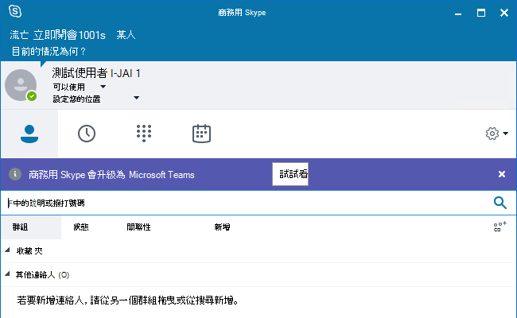
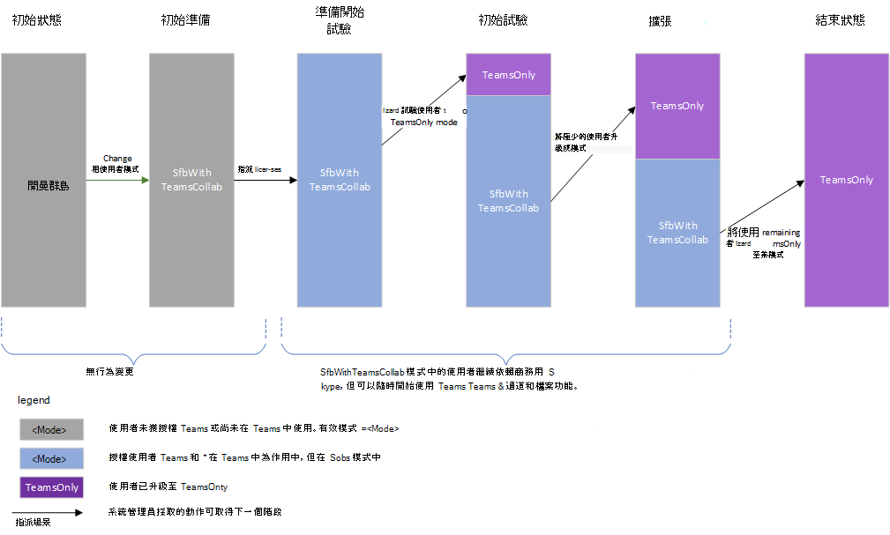
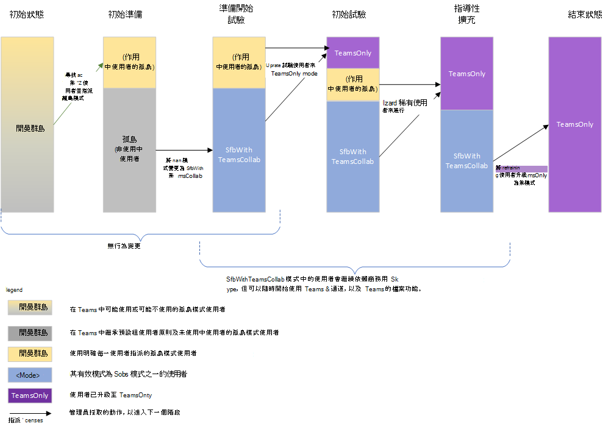
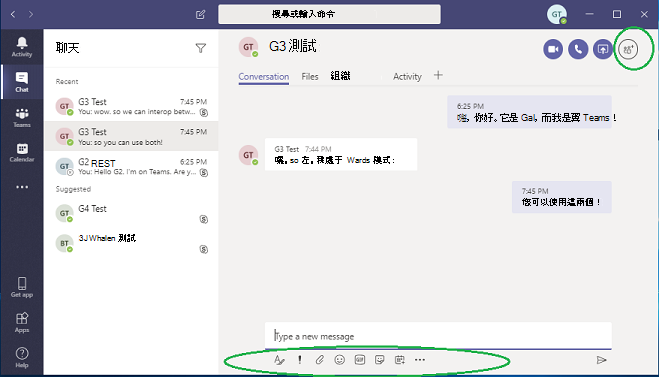
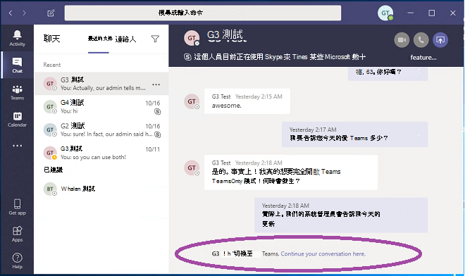

# <a name="upgrade-from-skype-for-business-to-teams-mdash-for-it-administrators"></a><span data-ttu-id="323f5-103">從商務用 Skype 升級至適用&mdash;于 IT 系統管理員的小組</span><span class="sxs-lookup"><span data-stu-id="323f5-103">Upgrade from Skype for Business to Teams &mdash; for IT administrators</span></span>

## <a name="overview"></a><span data-ttu-id="323f5-104">概觀</span><span class="sxs-lookup"><span data-stu-id="323f5-104">Overview</span></span>

<span data-ttu-id="323f5-105">當您從商務用 Skype 升級至小組時，某些組織必須逐步推出由其 IT 部門規劃和管理的漸進式推出。</span><span class="sxs-lookup"><span data-stu-id="323f5-105">When upgrading from Skype for Business to Teams, some organizations require a progressive rollout that is planned and managed by their IT departments.</span></span> <span data-ttu-id="323f5-106">本文主要針對大型內部部署組織中的 IT 系統管理員，但也可能適用于某些商務用 Skype Online 組織。</span><span class="sxs-lookup"><span data-stu-id="323f5-106">This article is primarily targeted to IT administrators in large, on-premises organizations, but it might also apply to some Skype for Business Online organizations.</span></span>  <span data-ttu-id="323f5-107">閱讀本文之前，請務必閱讀[您的小組升級](upgrade-start-here.md)和[升級架構](upgrade-framework.md)的快速入門。</span><span class="sxs-lookup"><span data-stu-id="323f5-107">Before reading this article,  be sure to read [Getting started with your Teams Upgrade](upgrade-start-here.md) and [About the Upgrade framework](upgrade-framework.md).</span></span>

>[!NOTE]
><span data-ttu-id="323f5-108">本文使用 [商務用 Skype Online]、[商務用 skype 內部部署] 和 [商務用 Skype] 這一詞。</span><span class="sxs-lookup"><span data-stu-id="323f5-108">This article uses the terms Skype for Business Online, Skype for Business on-premises, and Skype for Business.</span></span>  <span data-ttu-id="323f5-109">後一詞指的是線上和內部部署版本。</span><span class="sxs-lookup"><span data-stu-id="323f5-109">The latter term refers to both online and on-premises versions.</span></span>

<span data-ttu-id="323f5-110">已遷移至團隊的使用者將不再使用商務用 Skype 用戶端，除非加入在商務用 Skype 中託管的會議。</span><span class="sxs-lookup"><span data-stu-id="323f5-110">A user that has been migrated to Teams no longer uses a Skype for Business client except to join a meeting hosted in Skype for Business.</span></span>  <span data-ttu-id="323f5-111">無論寄件者是使用小組或商務用 Skype，所有傳入聊天和呼叫使用者團隊用戶端中的土地。</span><span class="sxs-lookup"><span data-stu-id="323f5-111">All incoming chats and calls land in the user’s Teams client, regardless of whether the sender uses Teams or Skype for Business.</span></span> <span data-ttu-id="323f5-112">由遷移使用者組織的任何新會議，都會排程為團隊會議。</span><span class="sxs-lookup"><span data-stu-id="323f5-112">Any new meetings organized by the migrated user will be scheduled as Teams meetings.</span></span> <span data-ttu-id="323f5-113">如果使用者嘗試使用商務用 Skype 用戶端，就會封鎖聊天和通話的啟動。</span><span class="sxs-lookup"><span data-stu-id="323f5-113">If the user attempts to use the Skype for Business client, initiation of chats and calls is blocked.</span></span>  <span data-ttu-id="323f5-114">不過，使用者可以（且必須）使用商務用 Skype 用戶端加入其受邀的會議。</span><span class="sxs-lookup"><span data-stu-id="323f5-114">However, the user can (and must) still use the Skype for Business client to join meetings they are invited to.</span></span> <span data-ttu-id="323f5-115">（在2017之前隨附的舊版商務用 Skype 用戶端，不會提供 TeamsUpgradePolicy。</span><span class="sxs-lookup"><span data-stu-id="323f5-115">(Older Skype for Business clients that shipped before 2017 do not honor TeamsUpgradePolicy.</span></span> <span data-ttu-id="323f5-116">請確定您使用的是最新的商務用 Skype 用戶端。</span><span class="sxs-lookup"><span data-stu-id="323f5-116">Make sure you are using the latest Skype for Business client.)</span></span>
 
<span data-ttu-id="323f5-117">系統管理員會使用[模式](migration-interop-guidance-for-teams-with-skype.md#coexistence-modes)的概念（ [TeamsUpgradePolicy](https://docs.microsoft.com/powershell/module/skype/grant-csteamsupgradepolicy?view=skype-ps)的屬性）來管理其轉場的小組。</span><span class="sxs-lookup"><span data-stu-id="323f5-117">Administrators manage their transition to Teams using the concept of [mode](migration-interop-guidance-for-teams-with-skype.md#coexistence-modes), which is a property of [TeamsUpgradePolicy](https://docs.microsoft.com/powershell/module/skype/grant-csteamsupgradepolicy?view=skype-ps).</span></span> <span data-ttu-id="323f5-118">如上述所述，已遷移至團隊的使用者，請參閱「TeamsOnly」模式。</span><span class="sxs-lookup"><span data-stu-id="323f5-118">A user that has been migrated to Teams as described above is in “TeamsOnly” mode.</span></span>  <span data-ttu-id="323f5-119">對於遷移至團隊的組織而言，最終目標是將所有使用者移至 TeamsOnly 模式。</span><span class="sxs-lookup"><span data-stu-id="323f5-119">For an organization that is migrating to Teams, the ultimate goal is to move all users to TeamsOnly mode.</span></span>

<span data-ttu-id="323f5-120">有兩種方法可以將現有的組織從商務用 Skype （無論是線上或內部部署）遷移至團隊：</span><span class="sxs-lookup"><span data-stu-id="323f5-120">There are two methods for migrating an existing organization with Skype for Business (whether online or on-premises) to Teams:</span></span>

- <span data-ttu-id="323f5-121">**並列方法**（使用孤島模式）：將現有商務用 Skype 組織中的使用者引入團隊，讓他們可以在過渡階段中並排使用這兩個用戶端。</span><span class="sxs-lookup"><span data-stu-id="323f5-121">**Side-by-side method** (using Islands mode):  Users in an existing Skype for Business organization are introduced to Teams so that they can use both clients side by side during a transitional phase.</span></span> <span data-ttu-id="323f5-122">在此期間，您可以使用大部分的團隊功能，但不是所有功能。</span><span class="sxs-lookup"><span data-stu-id="323f5-122">During this period, most--but not all--functionality of Teams is available to them.</span></span> <span data-ttu-id="323f5-123">此設定的模式稱為 [孤島]，這是任何擁有商務用 Skype 之現有組織的預設模式。</span><span class="sxs-lookup"><span data-stu-id="323f5-123">The mode for this configuration is referred to as Islands, and this is the default mode for any existing organization with Skype for Business.</span></span> <span data-ttu-id="323f5-124">組織就緒之後，系統管理員會將使用者移至 TeamsOnly 模式。</span><span class="sxs-lookup"><span data-stu-id="323f5-124">Once the organization is ready, the administrator moves the users to TeamsOnly mode.</span></span>

- <span data-ttu-id="323f5-125">**受管理的方法**（使用一或多個商務用 skype 模式）：系統管理員會針對組織中的使用者管理聊天、通話及會議排程功能的轉場（從商務用 skype 移至團隊）。</span><span class="sxs-lookup"><span data-stu-id="323f5-125">**A managed method** (using one or more of the Skype for Business modes): The administrator manages the transition (from Skype for Business to Teams) of chat, calling, and meeting scheduling functionality for users in their organization.</span></span>  <span data-ttu-id="323f5-126">您可以在商務用 Skype 或團隊中使用這些功能，但不能同時在這兩者中找到。</span><span class="sxs-lookup"><span data-stu-id="323f5-126">Each of these functions is available either in Skype for Business or Teams, but not both.</span></span> <span data-ttu-id="323f5-127">系統管理員使用 TeamsUpgradePolicy 控制何時將此功能移至團隊中的使用者。</span><span class="sxs-lookup"><span data-stu-id="323f5-127">Administrators use TeamsUpgradePolicy to control when to shift this functionality to Teams for their users.</span></span> <span data-ttu-id="323f5-128">尚未處於 TeamsOnly 模式的使用者會繼續使用商務用 Skype 進行聊天和通話，而這兩組使用者可以透過交互操作功能進行通訊。</span><span class="sxs-lookup"><span data-stu-id="323f5-128">Users who are not yet in TeamsOnly mode continue to use Skype for Business for chat and calling, and the two sets of users can communicate via interop functionality.</span></span> <span data-ttu-id="323f5-129">系統管理員會透過逐漸將更多使用者遷移至 TeamsOnly 模式，來管理轉換。</span><span class="sxs-lookup"><span data-stu-id="323f5-129">Administrators manage the transition by progressively migrating more users into TeamsOnly mode.</span></span>  

<span data-ttu-id="323f5-130">本文將說明這兩種方法，並提供每個方法的優缺點，協助您為您的組織選擇正確的方法。</span><span class="sxs-lookup"><span data-stu-id="323f5-130">This article helps you choose the right method for your organization by describing both methods and presenting the pros and cons of each.</span></span> 

## <a name="side-by-side-method-using-islands-mode"></a><span data-ttu-id="323f5-131">並列方法（使用孤島模式）</span><span class="sxs-lookup"><span data-stu-id="323f5-131">Side-by-side method (using Islands mode)</span></span>

<span data-ttu-id="323f5-132">透過並行方法，使用者可以使用小組與商務用 Skype 用戶端進行聊天、VoIP 通話及會議。</span><span class="sxs-lookup"><span data-stu-id="323f5-132">With the side-by-side method, users can use both Teams and Skype for Business clients for chat, VoIP calling, and meetings.</span></span> <span data-ttu-id="323f5-133">此狀態稱為「孤島」模式，因為商務用 Skype 和團隊的通訊流量會保持不變（即使是相同的使用者），而兩個不同的用戶端彼此之間都不會相互通訊（針對同一個組織中的使用者）。</span><span class="sxs-lookup"><span data-stu-id="323f5-133">This state is referred to as “Islands” mode because the communication traffic for Skype for Business and Teams remains separate (even for the same user) and the two different clients never communicate with each other (for users within the same organization).</span></span> <span data-ttu-id="323f5-134">例如，假設收件者使用者 A 處於孤島模式：</span><span class="sxs-lookup"><span data-stu-id="323f5-134">For example, assume recipient User A is in Islands mode:</span></span>

- <span data-ttu-id="323f5-135">從另一個使用者的商務用 Skype 用戶端發起的通訊，將永遠位於使用者 A 的商務用 Skype 用戶端。</span><span class="sxs-lookup"><span data-stu-id="323f5-135">Communication initiated from another user’s Skype for Business client will always land in User A’s Skype for Business client.</span></span>
- <span data-ttu-id="323f5-136">從另一個使用者的團隊用戶端發起的通訊，在使用者 A 的團隊用戶端中，*如果其他使用者位於同一個組織中*，就會永遠居住在該使用者。</span><span class="sxs-lookup"><span data-stu-id="323f5-136">Communication initiated from another user’s Teams client will always land in User A’s Teams client, *if the other user is in the same organization*.</span></span> 
- <span data-ttu-id="323f5-137">從另一個使用者的團隊用戶端發起的通訊，在使用者 A 的商務用 Skype 用戶端（*如果其他使用者位於同盟組織中*）中，將永遠居住在該使用者。</span><span class="sxs-lookup"><span data-stu-id="323f5-137">Communication initiated from another user’s Teams client will always land in User A’s Skype for Business client, *if the other user is in a federated organization*.</span></span>

<span data-ttu-id="323f5-138">[孤島模式] 是尚未 TeamsOnly 之任何現有組織的預設 TeamsUpgradePolicy 模式。</span><span class="sxs-lookup"><span data-stu-id="323f5-138">Islands mode is the default mode of TeamsUpgradePolicy for any existing organization that is not yet TeamsOnly.</span></span> <span data-ttu-id="323f5-139">當您指派 Office 365 授權時，系統會預設指派 [小組] 和 [商務用 Skype Online] 授權。</span><span class="sxs-lookup"><span data-stu-id="323f5-139">When you assign an Office 365 license, both Teams and Skype for Business Online licenses are assigned by default.</span></span> <span data-ttu-id="323f5-140">（即使使用者是在商務用 Skype 伺服器中託管內部部署，也是如此。</span><span class="sxs-lookup"><span data-stu-id="323f5-140">(This is true even if the user is homed on-premises in Skype for Business Server.</span></span> <span data-ttu-id="323f5-141">無論使用者是駐留在內部部署還是線上，都可以讓商務用 Skype Online 授權保持啟用，因為這是完整的小組功能目前所需要的。事實上，如果您未採取任何步驟來變更預設設定，您的組織可能已有大量的小組使用量。</span><span class="sxs-lookup"><span data-stu-id="323f5-141">Whether the user is homed on-premises or online, leave the Skype for Business Online license enabled, because it is currently needed for full Teams functionality.) In fact, if you have not taken any steps to change the default configuration, you may already have significant usage of Teams in your organization.</span></span>  <span data-ttu-id="323f5-142">這是並列方法的其中一個優點之一。</span><span class="sxs-lookup"><span data-stu-id="323f5-142">This is one of the benefits of the side-by-side approach.</span></span> <span data-ttu-id="323f5-143">它可讓組織內的快速、使用者導向採用。</span><span class="sxs-lookup"><span data-stu-id="323f5-143">It allows for rapid, end-user driven adoption within an organization.</span></span>

<span data-ttu-id="323f5-144">為了讓這個方法有效運作，它需要所有使用者同時執行這兩個用戶端。</span><span class="sxs-lookup"><span data-stu-id="323f5-144">For this method to work effectively, it requires all users to run both clients simultaneously.</span></span> <span data-ttu-id="323f5-145">您可以在商務用 Skype 或團隊用戶端中，將組織內部的內送聊天和組織中的電話撥入至使用者，而不是收件者的控制權。</span><span class="sxs-lookup"><span data-stu-id="323f5-145">Incoming chats and calls from within the organization to a user in Islands mode can land in either the Skype for Business or Teams client--and this is not under the control of the recipient.</span></span> <span data-ttu-id="323f5-146">這取決於寄件者用來啟動通訊的用戶端。</span><span class="sxs-lookup"><span data-stu-id="323f5-146">It depends on what client the sender uses to initiate the communication.</span></span> <span data-ttu-id="323f5-147">如果寄件者和收件者是在不同的組織中，在 [孤島] 模式中的來電與聊天，在商務用 Skype 用戶端中，將永遠居住在該使用者。</span><span class="sxs-lookup"><span data-stu-id="323f5-147">If the sender and recipient are in different organizations, incoming calls and chats to a user in Islands mode always land in the Skype for Business client.</span></span>  

<span data-ttu-id="323f5-148">例如，如果孤島模式的收件者執行的是商務用 Skype，而不是團隊，而其他人則是從小組傳送訊息，則 [孤島模式收件者] 不會看到該郵件（但最終會收到電子郵件，告知他們在小組中漏掉了郵件）。</span><span class="sxs-lookup"><span data-stu-id="323f5-148">For example, if an Islands mode recipient is running Skype for Business but not Teams, and someone messages them from Teams, the Islands mode recipient will not see the message (but they will eventually get an email saying they missed a message in Teams).</span></span> <span data-ttu-id="323f5-149">同樣地，如果使用者執行的是小組，而不是商務用 Skype，而某人是從商務用 Skype 傳送給使用者的訊息，使用者就不會看到該聊天。</span><span class="sxs-lookup"><span data-stu-id="323f5-149">Likewise, if a user is running Teams but not Skype for Business, and someone messages that user from Skype for Business, the user will not see that chat.</span></span>  <span data-ttu-id="323f5-150">他們會收到一封電子郵件，指出遺失的訊息。</span><span class="sxs-lookup"><span data-stu-id="323f5-150">They will get an email saying there was a missed message.</span></span> <span data-ttu-id="323f5-151">上述每個案例中的行為都與通話類似。</span><span class="sxs-lookup"><span data-stu-id="323f5-151">The behavior in each of these cases is similar for calling.</span></span> <span data-ttu-id="323f5-152">如果使用者不同時執行這兩個用戶端，可能很容易導致不滿。</span><span class="sxs-lookup"><span data-stu-id="323f5-152">If users do not run both clients, it can easily lead to frustration.</span></span>

<span data-ttu-id="323f5-153">當使用者 A 處於孤島模式時，小組和商務用 Skype 中的其他使用者看到的使用者 A 目前狀態是獨立的：</span><span class="sxs-lookup"><span data-stu-id="323f5-153">When User A is in Islands mode, User A’s presence as seen by other users in Teams and in Skype for Business is independent:</span></span>

- <span data-ttu-id="323f5-154">其他使用者在使用團隊時，會根據使用者在團隊中的活動來查看目前狀態。</span><span class="sxs-lookup"><span data-stu-id="323f5-154">Other users, when using Teams, will see presence based on User A’s activity in Teams.</span></span> 
- <span data-ttu-id="323f5-155">其他使用者在使用商務用 Skype 時，會根據商務用 Skype 中的使用者 A 活動，查看目前狀態。</span><span class="sxs-lookup"><span data-stu-id="323f5-155">Other users, when using Skype for Business, will see presence based on User A’s activity in Skype for Business.</span></span> 

<span data-ttu-id="323f5-156">這代表使用者 A 的其他使用者可能會看到不同的目前狀態，視它們所使用的用戶端而定。</span><span class="sxs-lookup"><span data-stu-id="323f5-156">This means other users may see different presence states for User A, depending on which client they use.</span></span> <span data-ttu-id="323f5-157">如需詳細資訊，請參閱目前[狀態](#presence)。</span><span class="sxs-lookup"><span data-stu-id="323f5-157">For more details, see [Presence](#presence).</span></span>

<span data-ttu-id="323f5-158">當您準備好要將使用者升級至 TeamsOnly 模式之後，您可以個別升級使用者，或者您可以使用租使用者的原則一次升級整個租使用者。</span><span class="sxs-lookup"><span data-stu-id="323f5-158">Once you are ready to upgrade users to TeamsOnly mode, you can upgrade users individually or you can upgrade the entire tenant at once using the tenant-wide policy.</span></span> <span data-ttu-id="323f5-159">一旦使用者升級至 TeamsOnly 模式，就會在團隊中收到所有傳入聊天和通話。</span><span class="sxs-lookup"><span data-stu-id="323f5-159">Once a user is upgraded to TeamsOnly mode, they receive all incoming chats and calls in Teams.</span></span> <span data-ttu-id="323f5-160">（請注意，只有當您將 TeamsUpgradePolicy 套用至個別使用者，而不是每個租使用者時，才會觸發將商務用 Skype 會議遷移至團隊會議。</span><span class="sxs-lookup"><span data-stu-id="323f5-160">(Note that migration of Skype for Business meetings to Teams meetings is only triggered when applying TeamsUpgradePolicy to individual users, not on a per tenant basis.</span></span> <span data-ttu-id="323f5-161">請參閱[會議遷移](#meeting-migration)以取得詳細資料。）</span><span class="sxs-lookup"><span data-stu-id="323f5-161">See [Meeting Migration](#meeting-migration) for details.)</span></span>

<span data-ttu-id="323f5-162">不過，在孤島模式中未升級的收件者，可能會繼續在其商務用 Skype 或團隊用戶端的 TeamsOnly 使用者中接收聊天和通話。</span><span class="sxs-lookup"><span data-stu-id="323f5-162">However, non-upgraded recipients in Islands mode may continue to receive chats and calls from a TeamsOnly user in either their Skype for Business or Teams clients.</span></span>  <span data-ttu-id="323f5-163">這是因為小組用戶端會針對小組與團隊成員以及商務用 Skype 通訊（即使是針對相同的使用者），為小組對等小組的交談進行單獨的交談執行緒。</span><span class="sxs-lookup"><span data-stu-id="323f5-163">This is because the Teams client maintains separate conversation threads for Teams-to-Teams and Teams-to-Skype for Business communication, even for the same user.</span></span>  <span data-ttu-id="323f5-164">（請參閱[團隊交談-互通性與原生執行緒](#teams-conversations---interop-versus-native-threads)）。 例如，假設 [Islands 使用者] 是使用團隊來 TeamsOnly 使用者 B 的訊息。當使用者 B 回復該聊天時，該通訊將會集中在使用者 A 的團隊用戶端中。</span><span class="sxs-lookup"><span data-stu-id="323f5-164">(See [Teams Conversations - Interop versus native threads](#teams-conversations---interop-versus-native-threads).)  For example, assume Islands User A uses Teams to message TeamsOnly User B. When User B replies to that chat, the communication will land in User A’s Teams client.</span></span> <span data-ttu-id="323f5-165">現在假設使用者 A 使用其商務用 Skype 用戶端到郵件 TeamsOnly 使用者 B。使用者 B 將會在團隊中收到聊天，但這將是與其他交談相比，在使用者 B 的團隊用戶端中相互獨立的交談。</span><span class="sxs-lookup"><span data-stu-id="323f5-165">Now assume User A uses his Skype for Business client to message TeamsOnly User B. User B will receive the chat in Teams, but this will be a separate conversation in User B's Teams client compared to the other conversation.</span></span> <span data-ttu-id="323f5-166">如果使用者 B 與使用者 A 回復此交談，則會將它集中在使用者 A 的商務用 Skype 用戶端。</span><span class="sxs-lookup"><span data-stu-id="323f5-166">If User B replies to this conversation with User A, it will land in User A’s Skype for Business client.</span></span> 

<span data-ttu-id="323f5-167">下表摘要列出了孤島模式與 TeamsOnly 模式的團隊體驗：</span><span class="sxs-lookup"><span data-stu-id="323f5-167">The following table summarizes the Teams experience for both Islands mode and TeamsOnly mode:</span></span>  

| <span data-ttu-id="323f5-168">團隊經驗</span><span class="sxs-lookup"><span data-stu-id="323f5-168">Teams experience</span></span> | <span data-ttu-id="323f5-169">在孤島模式中</span><span class="sxs-lookup"><span data-stu-id="323f5-169">In Islands mode</span></span> | <span data-ttu-id="323f5-170">在 TeamsOnly 模式中</span><span class="sxs-lookup"><span data-stu-id="323f5-170">In TeamsOnly mode</span></span> |
|:------------------ | :------------------- | :------------------ |
| <span data-ttu-id="323f5-171">傳入聊天與接聽的通話：</span><span class="sxs-lookup"><span data-stu-id="323f5-171">Incoming chats and calls received in:</span></span>|  <span data-ttu-id="323f5-172">團隊或商務用 Skype</span><span class="sxs-lookup"><span data-stu-id="323f5-172">Teams or Skype for Business</span></span> | <span data-ttu-id="323f5-173">團隊</span><span class="sxs-lookup"><span data-stu-id="323f5-173">Teams</span></span> |
| <span data-ttu-id="323f5-174">在下列情況中接收 PSTN 通話：</span><span class="sxs-lookup"><span data-stu-id="323f5-174">PSTN calls received in:</span></span> | <span data-ttu-id="323f5-175">商務用 Skype</span><span class="sxs-lookup"><span data-stu-id="323f5-175">Skype for Business</span></span> <br><span data-ttu-id="323f5-176">（在 [孤島] 模式中不支援使用團隊中的 PSTN 功能。）</span><span class="sxs-lookup"><span data-stu-id="323f5-176">(Using PSTN functionality in Teams is not supported in Islands mode.)</span></span>    | <span data-ttu-id="323f5-177">團隊</span><span class="sxs-lookup"><span data-stu-id="323f5-177">Teams</span></span> |   
 |<span data-ttu-id="323f5-178">平臺</span><span class="sxs-lookup"><span data-stu-id="323f5-178">Presence</span></span>  | <span data-ttu-id="323f5-179">商務用 Skype 和團隊中的目前狀態是獨立的。</span><span class="sxs-lookup"><span data-stu-id="323f5-179">Presence in Skype for Business and Teams is independent.</span></span> <span data-ttu-id="323f5-180">針對相同的孤島使用者，使用者可能會看到不同的狀態，視它們所使用的用戶端而定。</span><span class="sxs-lookup"><span data-stu-id="323f5-180">Users may see different states for the same Islands user, depending on which client they use.</span></span> | <span data-ttu-id="323f5-181">目前狀態僅根據使用者在團隊中的活動而定。</span><span class="sxs-lookup"><span data-stu-id="323f5-181">Presence is based solely on the user’s activity in Teams.</span></span> <span data-ttu-id="323f5-182">所有其他使用者（無論他們使用的用戶端），請參閱目前狀態。</span><span class="sxs-lookup"><span data-stu-id="323f5-182">All other users, regardless of which client they use, see that presence.</span></span> | 
 | <span data-ttu-id="323f5-183">會議排程</span><span class="sxs-lookup"><span data-stu-id="323f5-183">Meeting Scheduling</span></span>   | <span data-ttu-id="323f5-184">使用者可以在小組或商務用 Skype 中排程會議。</span><span class="sxs-lookup"><span data-stu-id="323f5-184">Users can schedule meetings in either Teams or Skype for Business.</span></span> <span data-ttu-id="323f5-185">它們會在 Outlook 中看到兩個增益集。</span><span class="sxs-lookup"><span data-stu-id="323f5-185">They will see both add-ins in Outlook.</span></span> |   <span data-ttu-id="323f5-186">使用者只會在團隊中排程會議。</span><span class="sxs-lookup"><span data-stu-id="323f5-186">Users only schedule meetings in Teams.</span></span> <span data-ttu-id="323f5-187">只有 [團隊] 增益集可在 Outlook 中使用。</span><span class="sxs-lookup"><span data-stu-id="323f5-187">Only the Teams add-in is available in Outlook.</span></span> | 

<span data-ttu-id="323f5-188">下表摘要列出使用並列方法將您的組織遷移至團隊的優點與缺點。</span><span class="sxs-lookup"><span data-stu-id="323f5-188">The following table summarizes the pros and cons of using the side-by-side method to migrate your organization to Teams.</span></span>

| <span data-ttu-id="323f5-189">專業人員</span><span class="sxs-lookup"><span data-stu-id="323f5-189">Pros</span></span>     |       <span data-ttu-id="323f5-190">利弊</span><span class="sxs-lookup"><span data-stu-id="323f5-190">Cons</span></span> |
| :------------------ | :---------------- |
| <span data-ttu-id="323f5-191">可在組織內快速採用。</span><span class="sxs-lookup"><span data-stu-id="323f5-191">Allows for rapid adoption within an organization.</span></span>| <span data-ttu-id="323f5-192">因為有兩個用戶端具有相似的功能，但使用者介面不同，所以可能造成使用者混淆。</span><span class="sxs-lookup"><span data-stu-id="323f5-192">Potential for end user confusion because there are two clients with similar functionality, but different user interfaces.</span></span> <span data-ttu-id="323f5-193">此外，他們也無法控制傳入聊天/呼叫居住在哪個用戶端。</span><span class="sxs-lookup"><span data-stu-id="323f5-193">Also, they have no control over which client the incoming chats/calls land in.</span></span> |
| <span data-ttu-id="323f5-194">允許使用者在仍擁有商務用 Skype 的完整存取權的情況下，瞭解並熟悉團隊。</span><span class="sxs-lookup"><span data-stu-id="323f5-194">Allows users to learn and get familiar with Teams while still having full access to Skype for Business.</span></span> | <span data-ttu-id="323f5-195">如果使用者不是同時執行這兩個用戶端，可能會造成使用者不滿意的可能性。</span><span class="sxs-lookup"><span data-stu-id="323f5-195">Potential for end user dissatisfaction due to missed messages if the user is not running both clients.</span></span> <span data-ttu-id="323f5-196">使用者可能會抱怨沒有收到訊息。</span><span class="sxs-lookup"><span data-stu-id="323f5-196">Users may complain that they are not receiving messages.</span></span>|
| <span data-ttu-id="323f5-197">在團隊中開始使用最少的管理工作量。</span><span class="sxs-lookup"><span data-stu-id="323f5-197">Minimal administration effort to get started in Teams.</span></span> | <span data-ttu-id="323f5-198">如果不是組織中的所有人都使用團隊，則可以使用「使用孤島」模式並移至 TeamsOnly 模式，特別是在團隊中的所有使用者都不是使用中時。</span><span class="sxs-lookup"><span data-stu-id="323f5-198">Can be challenging to “get out of Islands” mode and move to TeamsOnly mode if not everyone in the organization is using Teams, especially if not all users are active in Teams.</span></span> <span data-ttu-id="323f5-199">例如，當使用者子集升級為 TeamsOnly 模式之後，這些使用者就只能在小組中傳送。</span><span class="sxs-lookup"><span data-stu-id="323f5-199">For example, once a subset of users is upgraded to TeamsOnly mode, those users will only send in Teams.</span></span> <span data-ttu-id="323f5-200">針對 [孤島] 模式中的其他人口，這些訊息將永遠位於小組中。</span><span class="sxs-lookup"><span data-stu-id="323f5-200">For the rest of the population in Islands mode, those messages will always land in Teams.</span></span> <span data-ttu-id="323f5-201">但如果其中一些總體不是執行團隊，他們將會認為這些訊息是未接的。</span><span class="sxs-lookup"><span data-stu-id="323f5-201">But if some of that population is not running Teams, they will perceive these messages as missed.</span></span> |
|  | <span data-ttu-id="323f5-202">在使用團隊時，在商務用 Skype 伺服器中擁有內部部署帳戶的使用者，沒有互通性或同盟支援。</span><span class="sxs-lookup"><span data-stu-id="323f5-202">When using Teams, users who have an on-premises account in Skype for Business Server do not have interop or federation support.</span></span>  <span data-ttu-id="323f5-203">如果您有混合式的孤島使用者，這可能會造成混淆，因為有些人是駐留在商務用 Skype Online 中，還有一些是在商務用 Skype 內部部署中。</span><span class="sxs-lookup"><span data-stu-id="323f5-203">This can potentially create confusion if you have a mix of Islands users--some who are homed in Skype for Business Online and some in Skype for Business on-premises.</span></span>   |

## <a name="managed-transition-method-using-skype-for-business-modes"></a><span data-ttu-id="323f5-204">受管理的轉換方法（使用商務用 Skype 模式）</span><span class="sxs-lookup"><span data-stu-id="323f5-204">Managed transition method (using Skype for Business modes)</span></span>

<span data-ttu-id="323f5-205">有些組織可能想要讓使用者在組織從商務用 Skype 轉換為小組時，為他們的使用者提供更簡單且更具預見性的體驗。</span><span class="sxs-lookup"><span data-stu-id="323f5-205">Some organizations may prefer to provide their end users a simpler, more predictable experience as their organization transitions from Skype for Business to Teams.</span></span> <span data-ttu-id="323f5-206">在這個模型中，IT 系統管理員會在 TeamsUpgradePolicy 中使用其中一個商務用 Skype 模式，以明確指定哪些使用者在遷移到 TeamsOnly 模式之前仍在商務用 Skype 中。</span><span class="sxs-lookup"><span data-stu-id="323f5-206">In this model, IT administrators use one of the Skype for Business modes in TeamsUpgradePolicy to explicitly designate which users remain in Skype for Business prior to migrating to TeamsOnly mode.</span></span> <span data-ttu-id="323f5-207">當他們準備好將選取的使用者移至 TeamsOnly 模式時，系統管理員會更新這些使用者的 TeamsOnly 模式。</span><span class="sxs-lookup"><span data-stu-id="323f5-207">As they are ready to shift selected users to TeamsOnly mode, the administrator updates the mode for those users to TeamsOnly.</span></span>  <span data-ttu-id="323f5-208">隨著部署的進展，越來越多的使用者會從商務用 Skype 轉換成 TeamsOnly 模式。</span><span class="sxs-lookup"><span data-stu-id="323f5-208">As the deployment progresses, more and more users are transitioned from Skype for Business to TeamsOnly mode.</span></span>  <span data-ttu-id="323f5-209">在此轉換期間：</span><span class="sxs-lookup"><span data-stu-id="323f5-209">During this transition:</span></span>

- <span data-ttu-id="323f5-210">無論是來自其他使用者的小組或商務用 Skype 用戶端，仍在商務用 Skype 中的使用者都會收到其商務用 Skype 用戶端的所有傳入聊天和通話。</span><span class="sxs-lookup"><span data-stu-id="323f5-210">Users still on Skype for Business receive all incoming chats and calls in their Skype for Business client, regardless of whether the communication originated from the other user’s Teams or Skype for Business client.</span></span> <span data-ttu-id="323f5-211">此外，對於這些商務用 Skype 使用者，小組用戶端中的 [通話與聊天] 功能已停用，以協助避免使用者混淆，並確保正確地進行路由。</span><span class="sxs-lookup"><span data-stu-id="323f5-211">In addition, for these Skype for Business users, calling and chat functionality in the Teams client are disabled to help prevent end user confusion and to ensure proper routing.</span></span> 

- <span data-ttu-id="323f5-212">在 TeamsOnly 模式中的使用者會收到其團隊用戶端中的所有傳入聊天和通話，而不管通訊來自何處：團隊、商務用 Skype 或任何類型的同盟使用者。</span><span class="sxs-lookup"><span data-stu-id="323f5-212">Users in TeamsOnly mode receive all incoming chats and calls in their Teams client, regardless of where the communication originated from:  Teams, Skype for Business, or any kind of federated user.</span></span> 

<span data-ttu-id="323f5-213">與孤島方法不同的是，在受管理的轉換方法中，商務用 Skype 使用者和 TeamsOnly 使用者可以彼此通訊。</span><span class="sxs-lookup"><span data-stu-id="323f5-213">Unlike the Islands method, in the managed transition method, Skype for Business users and TeamsOnly users can communicate with each other.</span></span> <span data-ttu-id="323f5-214">商務用 Skype 使用者與團隊使用者之間的通訊稱為互通性或 "互通性"。</span><span class="sxs-lookup"><span data-stu-id="323f5-214">Communication between a Skype for Business user and Teams user is known as interoperability or “interop”.</span></span> <span data-ttu-id="323f5-215">（請參閱[互通性](#interoperability)。）在商務用 Skype 和小組中的另一個使用者之間，互通性通訊可能是一對一的。</span><span class="sxs-lookup"><span data-stu-id="323f5-215">(See [Interoperability](#interoperability).) Interop communication is possible on a one-to-one basis for chats and calls between a user in Skype for Business and another user in Teams.</span></span> <span data-ttu-id="323f5-216">此外，受邀的使用者永遠都可以加入商務用 Skype 或團隊會議，但是他們必須使用與會議類型相對應的用戶端。</span><span class="sxs-lookup"><span data-stu-id="323f5-216">In addition, invited users can always join either a Skype for Business or Teams meeting, however, they must use a client that corresponds to the type of meeting.</span></span> <span data-ttu-id="323f5-217">如需詳細資訊，請參閱[會議](#meetings)。</span><span class="sxs-lookup"><span data-stu-id="323f5-217">For more information, see [Meetings](#meetings).</span></span>

<span data-ttu-id="323f5-218">因為受管理轉換中的使用者通常不是孤島模式，所以無論其他使用者使用哪一個用戶端，使用者的目前狀態都是一致的。</span><span class="sxs-lookup"><span data-stu-id="323f5-218">Because users in a managed transition are typically not in Islands mode, presence for a user is consistent regardless of which client is used by the other user.</span></span> <span data-ttu-id="323f5-219">如果使用者使用的是其中一種商務用 Skype 模式，所有其他使用者都會在商務用 Skype 中根據該使用者的活動查看目前狀態。</span><span class="sxs-lookup"><span data-stu-id="323f5-219">If the user is in one of the Skype for Business modes, all other users see presence based on that user’s activity in Skype for Business.</span></span> <span data-ttu-id="323f5-220">同樣地，如果使用者處於 TeamsOnly 模式，則所有其他使用者會根據團隊中該使用者的活動查看目前狀態。</span><span class="sxs-lookup"><span data-stu-id="323f5-220">Similarly, if a user is in TeamsOnly mode, all other users see presence based on that user’s activity in Teams.</span></span> <span data-ttu-id="323f5-221">如需詳細資訊，請參閱目前[狀態](#presence)。</span><span class="sxs-lookup"><span data-stu-id="323f5-221">For details, see [Presence](#presence).</span></span>

<span data-ttu-id="323f5-222">對於尚未使用小組開始的組織，系統管理員應該將全租使用者的模式從孤島變更為 SfbWithTeamsCollab。</span><span class="sxs-lookup"><span data-stu-id="323f5-222">For an organization that has not yet started using Teams, the administrator should change the tenant-wide mode from Islands to SfbWithTeamsCollab.</span></span> <span data-ttu-id="323f5-223">（適用于已有一些團隊使用的組織，系統管理員應該「grandfather」小組中已開啟的使用者，以確保此變更不適用於他們。</span><span class="sxs-lookup"><span data-stu-id="323f5-223">(For organizations that already have some Teams usage, the administrator should “grandfather” users already active in Teams to ensure this change does not apply to them.</span></span> <span data-ttu-id="323f5-224">如需詳細資訊，請參閱[已在孤島模式中使用團隊之組織的受管理升級](#a-managed-upgrade-for-an-organization-that-is-already-using-teams-in-islands-mode)。</span><span class="sxs-lookup"><span data-stu-id="323f5-224">For details, see [A managed upgrade for an organization that is already using Teams in Islands mode](#a-managed-upgrade-for-an-organization-that-is-already-using-teams-in-islands-mode).)</span></span>

<span data-ttu-id="323f5-225">當模式從孤島變更為 SfbWithTeamsCollab 時，如果使用者使用的是商務用 Skype，就不會有任何差異。</span><span class="sxs-lookup"><span data-stu-id="323f5-225">When mode changes from Islands to SfbWithTeamsCollab, a user that has never used Teams will see no difference in how they use Skype for Business.</span></span> <span data-ttu-id="323f5-226">不過，如果使用者要開始使用小組，就只會對功能（例如團隊 & 頻道和檔案）公開。</span><span class="sxs-lookup"><span data-stu-id="323f5-226">However, should that user start to use Teams, they would only be exposed to functionality such as Teams & Channel and Files.</span></span> <span data-ttu-id="323f5-227">小組中不提供聊天、通話和會議排程，因為系統管理員擁有（適用于目前）指派商務用 Skype 作為這些功能的所需用戶端。</span><span class="sxs-lookup"><span data-stu-id="323f5-227">Chat, calling and meeting scheduling would not be available in Teams, since the administrator has (for now) designated Skype for Business as the desired client for those functions.</span></span>  

<span data-ttu-id="323f5-228">注意：當使用者從孤島變更為其中一個商務用 Skype 模式時，任何其他與使用者進行通訊的使用者的小組用戶端，都需要知道使用者 A 的模式已變更，以便讓使用者 A 將通訊傳送給適當的用戶端。 對於已建立與使用者 A 的原生團隊與團隊聊天的任何使用者，可能需要長達36小時，這些使用者的小組用戶端才能知道從孤島變更為任何商務用 Skype 模式的模式。</span><span class="sxs-lookup"><span data-stu-id="323f5-228">Note: When User A changes from Islands to one of the Skype for Business modes, the Teams client of any other user that communicates with User A needs to know that User A’s mode changed so it can route the communication to the appropriate client for User A.  For any users who have already established native Teams-to-Teams chats with User A, it can take up to 36 hours for these other users' Teams clients to be aware of the mode change from Islands to any Skype for Business mode.</span></span>   <span data-ttu-id="323f5-229">相反地，現有使用者對 TeamsOnly 模式所做的變更會在兩個小時內由其他用戶端發現。</span><span class="sxs-lookup"><span data-stu-id="323f5-229">In contrast, changes for an existing user to TeamsOnly mode are discovered by other clients within 2 hours.</span></span>

<span data-ttu-id="323f5-230">當系統管理員準備好時，他們可以將使用者的模式更新為 TeamsOnly，將指定使用者的聊天、通話及會議排程一次性移至團隊。</span><span class="sxs-lookup"><span data-stu-id="323f5-230">When administrators are ready, they can shift chat, calling, and meeting scheduling for a given user to Teams all at once by updating the user’s mode to TeamsOnly.</span></span>  

<span data-ttu-id="323f5-231">或者，管理員只能將會議排程轉移至團隊，同時使用 SfBWithTeamsCollabAndMeetings 模式在商務用 Skype 中離開交談和通話功能。</span><span class="sxs-lookup"><span data-stu-id="323f5-231">Alternatively, the administrator can first shift only meeting scheduling to Teams, while leaving chat and calling functions in Skype for Business using the SfBWithTeamsCollabAndMeetings mode.</span></span> <span data-ttu-id="323f5-232">此模式可讓組織轉換為會議小組，如果使用者尚未準備好移至 TeamsOnly 模式（通常是因為遷移現有的 PSTN 功能可能需要較多的時間）。</span><span class="sxs-lookup"><span data-stu-id="323f5-232">This mode allows organizations to transition to Teams for meetings--if users are not yet ready to move to TeamsOnly mode (typically because more time may be needed to migrate existing PSTN functionality).</span></span> <span data-ttu-id="323f5-233">此過渡案例會[先稱為會議](meetings-first.md)。</span><span class="sxs-lookup"><span data-stu-id="323f5-233">This transitional scenario is referred to as [Meetings First](meetings-first.md).</span></span>


<span data-ttu-id="323f5-234">下表摘要列出使用商務用 Skype 模式做為 TeamsOnly 模式的過渡階段的優點與缺點。</span><span class="sxs-lookup"><span data-stu-id="323f5-234">The following table summarizes the pros and cons of using Skype for Business modes as a transitional step toward TeamsOnly mode.</span></span>


| <span data-ttu-id="323f5-235">專業人員</span><span class="sxs-lookup"><span data-stu-id="323f5-235">Pros</span></span>     |       <span data-ttu-id="323f5-236">利弊</span><span class="sxs-lookup"><span data-stu-id="323f5-236">Cons</span></span> |
| :------------------ | :---------------- |
| <span data-ttu-id="323f5-237">可預測的最終使用者路由。</span><span class="sxs-lookup"><span data-stu-id="323f5-237">Predictable routing for the end user.</span></span>  <span data-ttu-id="323f5-238">根據系統管理員的選取，在商務用 Skype 或團隊（但不是兩者）中，所有通話和聊天都是居住的。</span><span class="sxs-lookup"><span data-stu-id="323f5-238">All calls and chats either land in Skype for Business or Teams (but not both), based on administrator selection.</span></span>  | <span data-ttu-id="323f5-239">互通性交談缺少豐富文字、檔案共用及螢幕共用的支援。</span><span class="sxs-lookup"><span data-stu-id="323f5-239">Interop conversations lack support for rich text, file sharing, and screen sharing.</span></span>  <span data-ttu-id="323f5-240">這可以與點播會議進行合作，但這並不是無縫的。</span><span class="sxs-lookup"><span data-stu-id="323f5-240">This can be worked around with on-demand meetings but this is not as seamless.</span></span>  |
| <span data-ttu-id="323f5-241">消除對使用者造成的混亂，因為只有一位用戶端提供所提供的功能。</span><span class="sxs-lookup"><span data-stu-id="323f5-241">Eliminate end user confusion because a given functionality is only available in one client.</span></span>  | <span data-ttu-id="323f5-242">使用者不能同時針對相同的一組功能嘗試並行兩個用戶端。</span><span class="sxs-lookup"><span data-stu-id="323f5-242">Users can’t try both clients side-by-side for the same set of functionality.</span></span> <span data-ttu-id="323f5-243">如果使用者認為從商務用 Skype 移至團隊，做為主要模式班次，這可能特別是一個因數。</span><span class="sxs-lookup"><span data-stu-id="323f5-243">This may especially be a factor if the users perceive the shift from Skype for Business to Teams as a major paradigm shift.</span></span> |
| <span data-ttu-id="323f5-244">可讓團隊增加簡介。</span><span class="sxs-lookup"><span data-stu-id="323f5-244">Allows for incremental introduction of Teams.</span></span>  |  | |
| <span data-ttu-id="323f5-245">系統管理員完全控制從商務用 Skype 到團隊的轉場。</span><span class="sxs-lookup"><span data-stu-id="323f5-245">Administrator is in full control of the transition from Skype for Business to Teams.</span></span> |  | | 
| <span data-ttu-id="323f5-246">允許組織使用團隊進行會議，即使尚未準備好將其完全移至 TeamsOnly 模式。</span><span class="sxs-lookup"><span data-stu-id="323f5-246">Allows an organization to use Teams for meetings, even if it is not yet ready to move entirely to TeamsOnly mode.</span></span> |  | |
| <span data-ttu-id="323f5-247">依其他人查看指定使用者的狀態，不論他們使用的是哪一個用戶端，都是一樣的。</span><span class="sxs-lookup"><span data-stu-id="323f5-247">Presence of a given user as viewed by others is the same, regardless of which client they use.</span></span>  |  | |

## <a name="summary-of-upgrade-methods"></a><span data-ttu-id="323f5-248">升級方法摘要</span><span class="sxs-lookup"><span data-stu-id="323f5-248">Summary of upgrade methods</span></span>

<span data-ttu-id="323f5-249">下表摘要列出升級的方法：</span><span class="sxs-lookup"><span data-stu-id="323f5-249">The following table summarizes the upgrade methods:</span></span>

| <span data-ttu-id="323f5-250">並排（使用孤島模式）</span><span class="sxs-lookup"><span data-stu-id="323f5-250">Side-by-side (using Islands mode)</span></span>     |      <span data-ttu-id="323f5-251">管理（使用商務用 Skype 模式）</span><span class="sxs-lookup"><span data-stu-id="323f5-251">Managed (using Skype for Business modes)</span></span> |
| :------------------ | :---------------- |
| <span data-ttu-id="323f5-252">在升級到 TeamsOnly 之前，使用者必須同時執行這兩個用戶端，因為傳入聊天和通話可能會在其中一個用戶端中進行。</span><span class="sxs-lookup"><span data-stu-id="323f5-252">Prior to being upgraded to TeamsOnly, users must run both clients simultaneously since incoming chats and calls may land in either client.</span></span>   | <span data-ttu-id="323f5-253">[聊天] 只會根據收件者的模式，在一個用戶端中呼叫土地。</span><span class="sxs-lookup"><span data-stu-id="323f5-253">Chats and calls only land in one client, based on the recipient’s mode.</span></span> <span data-ttu-id="323f5-254">未升級的使用者可以同時執行這兩個用戶端，但不存在任何正常的重迭（在小組中不提供通話與聊天）。</span><span class="sxs-lookup"><span data-stu-id="323f5-254">Non-upgraded users may run both clients, but there is no functional overlap (calling and chat are not available in Teams).</span></span>  <span data-ttu-id="323f5-255">系統管理員也可以控制使用者是否要在小組或商務用 Skype 中排程會議。</span><span class="sxs-lookup"><span data-stu-id="323f5-255">Administrators can also control whether users schedule meetings in Teams or Skype for Business.</span></span>   |
| <span data-ttu-id="323f5-256">使用者可以並排使用商務用 Skype 和團隊來提供相同的功能。</span><span class="sxs-lookup"><span data-stu-id="323f5-256">Users can use Skype for Business and Teams side by side for same functionality.</span></span>   | <span data-ttu-id="323f5-257">可讓系統管理員將小組的網路新功能引入使用者（團隊和頻道），但不提供在商務用 Skype 中也存在的相同功能。</span><span class="sxs-lookup"><span data-stu-id="323f5-257">Allows administrators to introduce net new functionality of Teams to end users (Teams and Channels), without providing same functionality that also exists in Skype for Business.</span></span>   |
|<span data-ttu-id="323f5-258">在商務用 Skype 與團隊之間的互通性，在兩個使用者都是孤島模式時不存在。</span><span class="sxs-lookup"><span data-stu-id="323f5-258">Interop between Skype for Business and Teams does not exist while both users are in Islands mode.</span></span> <span data-ttu-id="323f5-259">在將某些使用者升級至 TeamsOnly 之後，這些使用者和其他使用者可能會在仍在孤島模式中的互通性交談。</span><span class="sxs-lookup"><span data-stu-id="323f5-259">Once some users are upgraded to TeamsOnly, interop conversation may occur between those users and other users still in Islands mode.</span></span> <span data-ttu-id="323f5-260">不過，孤島使用者可以選擇使用團隊並避免互通性交談。</span><span class="sxs-lookup"><span data-stu-id="323f5-260">However, the Islands user could choose to use Teams and avoid the interop conversation.</span></span> | <span data-ttu-id="323f5-261">商務用 Skype 與團隊使用者之間的通訊需要互通性。</span><span class="sxs-lookup"><span data-stu-id="323f5-261">Interop is required for communication between Skype for Business and Teams users.</span></span>   |

## <a name="tools-for-managing-the-upgrade"></a><span data-ttu-id="323f5-262">管理升級的工具</span><span class="sxs-lookup"><span data-stu-id="323f5-262">Tools for managing the upgrade</span></span>

<span data-ttu-id="323f5-263">針對上述其中一種方法，系統管理員會使用[TeamsUpgradePolicy](https://docs.microsoft.com/powershell/module/skype/grant-csteamsupgradepolicy?view=skype-ps)（控制使用者的共存模式）來管理轉換為 TeamsOnly。</span><span class="sxs-lookup"><span data-stu-id="323f5-263">For either of the methods described above, administrators manage the transition to TeamsOnly using [TeamsUpgradePolicy](https://docs.microsoft.com/powershell/module/skype/grant-csteamsupgradepolicy?view=skype-ps), which controls a user’s coexistence mode.</span></span> <span data-ttu-id="323f5-264">如需每個模式的詳細資訊，請參閱[共存模式](migration-interop-guidance-for-teams-with-skype.md#coexistence-modes)。</span><span class="sxs-lookup"><span data-stu-id="323f5-264">For more information on each of the modes, see [Coexistence modes](migration-interop-guidance-for-teams-with-skype.md#coexistence-modes).</span></span>

<span data-ttu-id="323f5-265">無論系統管理員是使用商務用 Skype 模式執行受管理的轉場，或是從預設孤島設定直接升級至 TeamsOnly 模式，TeamsUpgradePolicy 是主要工具。</span><span class="sxs-lookup"><span data-stu-id="323f5-265">Whether the administrator performs a managed transition using Skype for Business modes or simply upgrades to TeamsOnly mode from the default Islands configuration, TeamsUpgradePolicy is the primary tool.</span></span>  <span data-ttu-id="323f5-266">就像團隊中的任何其他原則一樣，TeamsUpgradePolicy 可以直接指派給使用者，也可以設定為租使用者範圍的預設值。</span><span class="sxs-lookup"><span data-stu-id="323f5-266">Like any other policy in Teams, TeamsUpgradePolicy can be assigned directly to a user, and it can also be set as the tenant-wide default.</span></span> <span data-ttu-id="323f5-267">針對使用者的任何指派，都優先于租使用者預設設定。</span><span class="sxs-lookup"><span data-stu-id="323f5-267">Any assignment to a user takes precedence over the tenant default setting.</span></span>  <span data-ttu-id="323f5-268">它可以在團隊管理員主控台和 PowerShell 中進行管理。</span><span class="sxs-lookup"><span data-stu-id="323f5-268">It can be managed both in the Teams Admin Console and in PowerShell.</span></span>

<span data-ttu-id="323f5-269">系統管理員可以將任何 TeamsUpgradePolicy 模式指派給使用者，不論該使用者是駐留在商務用 Skype Online 或內部部署中，除了只能將 TeamsOnly 模式指派給已駐留在商務用 Skype Online 的使用者外。</span><span class="sxs-lookup"><span data-stu-id="323f5-269">Administrators can assign any mode of TeamsUpgradePolicy to users whether the user is homed in Skype for Business Online or on-premises, except that TeamsOnly mode can only be assigned to a user who is already homed in Skype for Business Online.</span></span> <span data-ttu-id="323f5-270">這是因為，只有當使用者駐留在商務用 Skype Online 中，才可以使用商務用 Skype 使用者和同盟進行交互操作。</span><span class="sxs-lookup"><span data-stu-id="323f5-270">This is because interop with Skype for Business users and federation are only possible if the user is homed in Skype for Business Online.</span></span>

<span data-ttu-id="323f5-271">擁有商務用 Skype 帳戶的使用者，必須使用商務用 Skype 內部部署工具組，在線上（無論是商務用 Skype Online 或直接在小組中）[移動](https://docs.microsoft.com/SkypeForBusiness/hybrid/move-users-from-on-premises-to-teams)move-csuser。</span><span class="sxs-lookup"><span data-stu-id="323f5-271">Users with Skype for Business accounts homed on-premises [must be moved online](https://docs.microsoft.com/SkypeForBusiness/hybrid/move-users-from-on-premises-to-teams) (either to Skype for Business Online or direct to Teams) using Move-CsUser in the Skype for Business on-premises toolset.</span></span> <span data-ttu-id="323f5-272">在1或2個步驟中，您可以將這些使用者移至 TeamsOnly：</span><span class="sxs-lookup"><span data-stu-id="323f5-272">These users can be moved to TeamsOnly in either 1 or 2 steps:</span></span>

-   <span data-ttu-id="323f5-273">1步驟：在 Move-csuser 中指定-MoveToTeams 開關。</span><span class="sxs-lookup"><span data-stu-id="323f5-273">1 step:  Specify the -MoveToTeams switch in Move-CsUser.</span></span> <span data-ttu-id="323f5-274">這需要商務用 Skype Server 2019 或商務用 Skype Server 2015 與 CU8。</span><span class="sxs-lookup"><span data-stu-id="323f5-274">This requires Skype for Business Server 2019 or Skype for Business Server 2015 with CU8.</span></span>

-   <span data-ttu-id="323f5-275">2個步驟：執行移動 Move-csuser 之後，使用 TeamsUpgradePolicy 將 TeamsOnly 模式授與使用者。</span><span class="sxs-lookup"><span data-stu-id="323f5-275">2 steps: After running Move-CsUser, grant TeamsOnly mode to the user using TeamsUpgradePolicy.</span></span>

<span data-ttu-id="323f5-276">與其他原則不同，您無法在 Office 365 中建立新的 TeamsUpgradePolicy 實例。</span><span class="sxs-lookup"><span data-stu-id="323f5-276">Unlike other policies, it is not possible to create new instances of TeamsUpgradePolicy in Office 365.</span></span> <span data-ttu-id="323f5-277">所有現有的實例都會內嵌在服務中。</span><span class="sxs-lookup"><span data-stu-id="323f5-277">All the existing instances are built into the service.</span></span>  <span data-ttu-id="323f5-278">（請注意，mode 是 TeamsUpgradePolicy 內的屬性，而不是原則實例的名稱）。在部分（但非全部）情況下，原則實例的名稱與模式相同。</span><span class="sxs-lookup"><span data-stu-id="323f5-278">(Note that mode is a property within TeamsUpgradePolicy, rather than the name of a policy instance.) In some--but not all--cases, the name of the policy instance is the same as mode.</span></span> <span data-ttu-id="323f5-279">特別是，若要將 TeamsOnly 模式指派給使用者，您會將 TeamsUpgradePolicy 的「UpgradeToTeams」實例授與該使用者。</span><span class="sxs-lookup"><span data-stu-id="323f5-279">In particular, to assign TeamsOnly mode to a user, you will grant the “UpgradeToTeams” instance of TeamsUpgradePolicy to that user.</span></span> <span data-ttu-id="323f5-280">若要查看所有實例的清單，您可以執行下列命令：</span><span class="sxs-lookup"><span data-stu-id="323f5-280">To see a list of all instances, you can run the following command:</span></span>

```
Get-CsTeamsUpgradePolicy|ft Identity, Mode, NotifySfbUsers
```

<span data-ttu-id="323f5-281">若要將線上使用者升級為 TeamsOnly 模式，請指派「UpgradeToTeams」實例：</span><span class="sxs-lookup"><span data-stu-id="323f5-281">To upgrade an online user to TeamsOnly mode, assign the “UpgradeToTeams” instance:</span></span> 

```
Grant-CsTeamsUpgradePolicy -PolicyName UpgradeToTeams -Identity $user 
```

<span data-ttu-id="323f5-282">若要將內部部署商務用 Skype 使用者升級到 TeamsOnly 模式，請在內部部署工具集中使用 Move-csuser：</span><span class="sxs-lookup"><span data-stu-id="323f5-282">To upgrade an on-premise Skype for Business user to TeamsOnly mode, use Move-CsUser in the on-premises toolset:</span></span>

```
Move-CsUser -identity $user -Target sipfed.online.lync.com -MoveToTeams -credential $cred
```

<span data-ttu-id="323f5-283">若要變更租使用者中所有使用者的模式，除了擁有明確的每個使用者授與許可權的人員之外，請執行下列命令：</span><span class="sxs-lookup"><span data-stu-id="323f5-283">To change the mode for all users in the tenant, except those who have an explicit per-user grant (which takes precedence), run the following command:</span></span>

```
Grant-CsTeamsUpgradePolicy -PolicyName SfbWithTeamsCollab -Global
```


>[!NOTE]
><span data-ttu-id="323f5-284">如果您擁有內部部署商務用 Skype 帳戶的任何使用者，則不應在租使用者層級指派 TeamsOnly 模式，除非您明確地將部分其他模式指派給使用內部部署商務用 Skype 帳戶的所有使用者。</span><span class="sxs-lookup"><span data-stu-id="323f5-284">If you have any users with Skype for Business accounts on-premises, you should not assign TeamsOnly mode at the tenant level, unless you explicitly assign some other mode to all users with on-premises Skype for Business accounts.</span></span>


### <a name="using-notifications-in-skype-for-business-clients"></a><span data-ttu-id="323f5-285">在商務用 Skype 用戶端中使用通知</span><span class="sxs-lookup"><span data-stu-id="323f5-285">Using notifications in Skype for Business clients</span></span>

<span data-ttu-id="323f5-286">系統管理員可以選擇在商務用 Skype 用戶端中提供使用者通知，以通知使用者即將升級至團隊，如下圖所示。</span><span class="sxs-lookup"><span data-stu-id="323f5-286">Administrators have the option to provide end user notifications in the Skype for Business client to inform users that they will soon be upgraded to Teams, as shown in the following diagram.</span></span> <span data-ttu-id="323f5-287">例如，管理員將一周的時間升級為 TeamsOnly 模式，系統管理員可能會想要針對該使用者群組開啟這些通知。</span><span class="sxs-lookup"><span data-stu-id="323f5-287">For example, a week before the administrator plans to upgrade a group of users to TeamsOnly mode, the administrator might want to turn on these notifications for that group of users.</span></span> <span data-ttu-id="323f5-288">使用 TeamsUpgradePolicy 與 NotifySfbUsers = true 的實例啟用這些通知。</span><span class="sxs-lookup"><span data-stu-id="323f5-288">These notifications are enabled using an instance of TeamsUpgradePolicy with NotifySfbUsers=true.</span></span>  <span data-ttu-id="323f5-289">針對除 TeamsOnly 以外的所有模式，實際會有兩個模式的實例，對應到兩個 NotifySfbUsers 值。</span><span class="sxs-lookup"><span data-stu-id="323f5-289">For all modes other than TeamsOnly, there are actually two instances per mode, corresponding to the two values of NotifySfbUsers.</span></span>  <span data-ttu-id="323f5-290">針對除 TeamsOnly 以外的所有模式，實際會有兩個模式的實例，對應到兩個 NotifySfbUsers 值。</span><span class="sxs-lookup"><span data-stu-id="323f5-290">For all modes other than TeamsOnly, there are actually two instances per mode, corresponding to the two values of NotifySfbUsers.</span></span> 



<span data-ttu-id="323f5-292">如果您的使用者是駐留在商務用 Skype Online，只要指派的原則實例與使用者的模式相同，但 NotifySfbUsers = true。</span><span class="sxs-lookup"><span data-stu-id="323f5-292">If your users are homed in Skype for Business Online, simply assign the policy instance that has the same mode as the user, but with NotifySfbUsers=true.</span></span> 

<span data-ttu-id="323f5-293">如果您的使用者是駐留在內部部署的商務用 Skype 伺服器，您必須使用內部部署工具集，且需要商務用 Skype server 2019 或 CU8 （適用于商務用 skype Server 2015）。</span><span class="sxs-lookup"><span data-stu-id="323f5-293">If your users are homed in Skype for Business Server on-premises, you’ll need to use the on-premises toolset and you’ll need Skype for Business Server 2019 or CU8 for Skype for Business Server 2015.</span></span> <span data-ttu-id="323f5-294">在 [內部部署] PowerShell 視窗中，使用 NotifySfbUsers = true 建立新的 TeamsUpgradePolicy 實例：</span><span class="sxs-lookup"><span data-stu-id="323f5-294">In the on-premises PowerShell window, create a new instance of TeamsUpgradePolicy with NotifySfbUsers=true:</span></span>

```
New-CsTeamsUpgradePolicy -Identity EnableNotification -NotifySfbUsers $true
```

<span data-ttu-id="323f5-295">接著，使用相同的內部部署 PowerShell 視窗，將該新原則指派給所需的使用者：</span><span class="sxs-lookup"><span data-stu-id="323f5-295">Then, using the same on-premises PowerShell window, assign that new policy to the desired users:</span></span>

```
Grant-CsTeamsUpgradePolicy -Identity $user -PolicyName EnableNotification
```

### <a name="meeting-migration"></a><span data-ttu-id="323f5-296">會議遷移</span><span class="sxs-lookup"><span data-stu-id="323f5-296">Meeting migration</span></span>

<span data-ttu-id="323f5-297">當使用者被遷移至 TeamsOnly 模式時，預設會將他們所組織的現有商務用 Skype 會議轉換成小組。</span><span class="sxs-lookup"><span data-stu-id="323f5-297">When a user is migrated to TeamsOnly mode, by default their existing Skype for Business meetings that they organized will be converted to Teams.</span></span> <span data-ttu-id="323f5-298">您也可以選擇在指派 TeamsOnly 模式給使用者時，停用預設行為。</span><span class="sxs-lookup"><span data-stu-id="323f5-298">You can optionally disable the default behavior when assigning TeamsOnly mode to a user.</span></span> <span data-ttu-id="323f5-299">從內部部署移動使用者時，必須將會議遷移到雲端，才能與線上使用者帳戶共同作業，但如果您沒有指定-MoveToTeams，會議將會以商務用 Skype 會議進行遷移，而不是轉換成團隊。</span><span class="sxs-lookup"><span data-stu-id="323f5-299">When moving users from on-premises, meetings must be migrated to the cloud to function with the online user account, but if you do not specify -MoveToTeams, the meetings will be migrated as Skype for Business meetings, rather than converted to Teams.</span></span> 

<span data-ttu-id="323f5-300">在租使用者層級指派 TeamsOnly 模式時，不會觸發會議遷移給任何使用者。</span><span class="sxs-lookup"><span data-stu-id="323f5-300">When assigning TeamsOnly mode at the tenant level, meeting migration is not triggered for any users.</span></span> <span data-ttu-id="323f5-301">如果您想要在租使用者層級指派 TeamsOnly 模式和遷移會議，您可以使用 PowerShell 來取得租使用者的清單（例如，在需要的任何篩選器中使用 CsOnlineUser），然後遍歷這些使用者，以觸發會議使用開始-CsExMeetingMigration 的遷移。</span><span class="sxs-lookup"><span data-stu-id="323f5-301">If you wish to assign TeamsOnly mode at the tenant level and migrate meetings, you can use PowerShell to get a list of users in the tenant (for example, using Get-CsOnlineUser with whatever filters are needed) and then loop through each of these users to trigger meeting migration using Start-CsExMeetingMigration.</span></span> <span data-ttu-id="323f5-302">如需詳細資訊，請參閱[使用會議遷移服務（MMS）](https://docs.microsoft.com/skypeforbusiness/audio-conferencing-in-office-365/setting-up-the-meeting-migration-service-mms)。</span><span class="sxs-lookup"><span data-stu-id="323f5-302">For details, see [Using the Meeting Migration Service (MMS)](https://docs.microsoft.com/skypeforbusiness/audio-conferencing-in-office-365/setting-up-the-meeting-migration-service-mms).</span></span>


### <a name="additional-considerations-for-organizations-with-skype-for-business-server-on-premises"></a><span data-ttu-id="323f5-303">使用商務用 Skype Server 內部部署之組織的其他考慮事項</span><span class="sxs-lookup"><span data-stu-id="323f5-303">Additional considerations for organizations with Skype for Business Server on-premises</span></span>

- <span data-ttu-id="323f5-304">設定商務用 Skype 混合式版是遷移至 TeamsOnly 模式的先決條件。</span><span class="sxs-lookup"><span data-stu-id="323f5-304">Setting up Skype for Business hybrid is a prerequisite to migrate to TeamsOnly mode.</span></span> <span data-ttu-id="323f5-305">雖然您可以在沒有混合式的孤島模式下使用小組，但在使用者從商務用 Skype 內部部署移至商務用 Skype Online （使用 [[移動-move-csuser](https://docs.microsoft.com/SkypeForBusiness/hybrid/move-users-between-on-premises-and-cloud)]）之前，無法進行 [轉至 TeamsOnly] 模式。</span><span class="sxs-lookup"><span data-stu-id="323f5-305">While it is possible to use Teams in Islands mode without hybrid, the transition to TeamsOnly mode cannot be made until the user is moved from Skype for Business on-premises to Skype for Business Online (using [Move-CsUser](https://docs.microsoft.com/SkypeForBusiness/hybrid/move-users-between-on-premises-and-cloud)).</span></span> <span data-ttu-id="323f5-306">如需詳細資訊，請參閱[設定混合式連線性](https://docs.microsoft.com/skypeforbusiness/hybrid/configure-hybrid-connectivity)。</span><span class="sxs-lookup"><span data-stu-id="323f5-306">For more information, see [Configure hybrid connectivity](https://docs.microsoft.com/skypeforbusiness/hybrid/configure-hybrid-connectivity).</span></span>

- <span data-ttu-id="323f5-307">擁有商務用 Skype 帳戶（也就是使用移動流覽 Move-csuser）的小組使用者，無法與任何商務用 Skype 使用者進行交互操作，也無法與外部使用者進行聯盟。</span><span class="sxs-lookup"><span data-stu-id="323f5-307">Teams users who have a Skype for Business account on-premises (that is, they have not yet been moved to the cloud by using Move-CsUser) cannot interoperate with any Skype for Business users, nor can they federate with external users.</span></span> <span data-ttu-id="323f5-308">只有在使用者移至雲端（在孤島模式或 TeamsOnly 使用者）後，才能使用此功能。</span><span class="sxs-lookup"><span data-stu-id="323f5-308">This functionality is only available once the users are moved to the cloud (either in Islands mode, or as TeamsOnly users).</span></span> 

- <span data-ttu-id="323f5-309">如果您擁有內部部署商務用 Skype 帳戶的任何使用者，則不應在租使用者層級指派 TeamsOnly 模式，除非您明確地將部分其他模式指派給使用內部部署商務用 Skype 帳戶的所有使用者。</span><span class="sxs-lookup"><span data-stu-id="323f5-309">If you have any users with Skype for Business accounts on-premises, you should not assign TeamsOnly mode at the tenant level, unless you explicitly assign some other mode to all users with on-premises Skype for Business accounts.</span></span> 

- <span data-ttu-id="323f5-310">您必須確保您的使用者能以正確的商務用 Skype 屬性正確地同步處理到 Azure AD。</span><span class="sxs-lookup"><span data-stu-id="323f5-310">You must ensure your users are properly synchronized into Azure AD with the correct Skype for Business attributes.</span></span> <span data-ttu-id="323f5-311">這些屬性都是含 "msRTCSIP-" 的所有首碼。</span><span class="sxs-lookup"><span data-stu-id="323f5-311">These attributes are all prefixes with “msRTCSIP-”.</span></span> <span data-ttu-id="323f5-312">如果使用者未正確地同步處理到 Azure AD，小組中的管理工具將無法管理這些使用者。</span><span class="sxs-lookup"><span data-stu-id="323f5-312">If users are not synchronized properly to Azure AD, the management tools in Teams will not be able to manage these users.</span></span> <span data-ttu-id="323f5-313">如需詳細資訊，請參閱[設定團隊與商務用 Skype 的 AZURE AD Connect](https://docs.microsoft.com/SkypeForBusiness/hybrid/configure-azure-ad-connect)。</span><span class="sxs-lookup"><span data-stu-id="323f5-313">For more information, see [Configure Azure AD Connect for Teams and Skype for Business](https://docs.microsoft.com/SkypeForBusiness/hybrid/configure-azure-ad-connect).</span></span>

- <span data-ttu-id="323f5-314">若要在混合式組織中建立新的 TeamsOnly 或商務用 Skype Online 使用者，*您必須先在內部部署中啟用商務用 Skype Server 中的使用者*，然後使用 move-csuser 將使用者從內部部署移至雲端。</span><span class="sxs-lookup"><span data-stu-id="323f5-314">To create a new TeamsOnly or Skype for Business Online user in a hybrid organization, *you must first enable the user in Skype for Business Server on-premises*, and then move the user from on-premises to the cloud using Move-CsUser.</span></span>  <span data-ttu-id="323f5-315">首先，在內部部署中建立使用者，以確保任何其他剩餘的內部部署商務用 Skype 使用者都能傳送給新建立的使用者。</span><span class="sxs-lookup"><span data-stu-id="323f5-315">Creating the user in on-premises first ensures that any other remaining on-premises Skype for Business users will be able route to the newly created user.</span></span> <span data-ttu-id="323f5-316">當所有使用者都在線上移動之後，就不再需要先在內部部署中啟用使用者。</span><span class="sxs-lookup"><span data-stu-id="323f5-316">Once all users have been moved online, it is no longer necessary to first enable users in on-premises.</span></span>

- <span data-ttu-id="323f5-317">當使用者從內部部署移至雲端時，由該使用者組織的會議會遷移到商務用 Skype Online 或團隊中，視是否已指定-MoveToTeams 開關而定。</span><span class="sxs-lookup"><span data-stu-id="323f5-317">When a user is moved from on-premises to the cloud, meetings organized by that user are migrated to either Skype for Business Online or Teams--depending on whether or not the -MoveToTeams switch is specified.</span></span>

- <span data-ttu-id="323f5-318">如果您想要在內部部署使用者的商務用 Skype 用戶端中顯示通知，您必須在內部部署工具集中使用 TeamsUpgradePolicy。</span><span class="sxs-lookup"><span data-stu-id="323f5-318">If you would like display notifications in the Skype for Business client for on-premises users, you must use TeamsUpgradePolicy in the on-premises toolset.</span></span> <span data-ttu-id="323f5-319">只有 NotifySfbUsers 參數與內部部署使用者有關。</span><span class="sxs-lookup"><span data-stu-id="323f5-319">Only the NotifySfbUsers parameter is relevant for on-premises users.</span></span>  <span data-ttu-id="323f5-320">內部部署使用者從 TeamsUpgradePolicy 的線上實例接收它們的模式。</span><span class="sxs-lookup"><span data-stu-id="323f5-320">On-premises users receive their mode from the online instances of TeamsUpgradePolicy.</span></span> <span data-ttu-id="323f5-321">請參閱授與[授與 CsTeamsUpgradePolicy](https://docs.microsoft.com/powershell/module/skype/grant-csteamsupgradepolicy?view=skype-ps)中的筆記。</span><span class="sxs-lookup"><span data-stu-id="323f5-321">See the notes in [Grant-CsTeamsUpgradePolicy](https://docs.microsoft.com/powershell/module/skype/grant-csteamsupgradepolicy?view=skype-ps).</span></span> 

>[!NOTE]
> <span data-ttu-id="323f5-322">在2019年9月3日之後建立的任何新租使用者，都會建立為 TeamsOnly 租使用者，而不需要系統管理員進行降級的功能。</span><span class="sxs-lookup"><span data-stu-id="323f5-322">Any new tenants created after Sept 3, 2019 are created as TeamsOnly tenants without the ability for admins to downgrade.</span></span> <span data-ttu-id="323f5-323">使用商務用 Skype Server 內部部署的組織（在9月 3 2019 日之前從未安裝 Office 365 訂閱），在使用者取得 Office 365 的訂閱之後，就必須與 Microsoft 支援人員聯繫，才能將其租使用者。</span><span class="sxs-lookup"><span data-stu-id="323f5-323">Organizations with Skype for Business Server on-premises that previously never had an Office 365 subscription prior to Sept 3, 2019 will need to contact Microsoft Support to have their tenant downgraded, once they acquire a subscription with Office 365.</span></span> 


## <a name="perform-the-upgrade-for-your-organization"></a><span data-ttu-id="323f5-324">針對您的組織執行升級</span><span class="sxs-lookup"><span data-stu-id="323f5-324">Perform the upgrade for your organization</span></span>

<span data-ttu-id="323f5-325">本節將說明下列升級選項：</span><span class="sxs-lookup"><span data-stu-id="323f5-325">This section describes the following upgrade options:</span></span>

- <span data-ttu-id="323f5-326">並行升級（使用孤島模式）</span><span class="sxs-lookup"><span data-stu-id="323f5-326">Side-by-side upgrade (using Islands mode)</span></span>
- <span data-ttu-id="323f5-327">尚未使用團隊開始的組織的受管理升級</span><span class="sxs-lookup"><span data-stu-id="323f5-327">A managed upgrade for an organization that has not yet started using Teams</span></span>
- <span data-ttu-id="323f5-328">已在孤島模式中使用團隊之組織的受管理升級</span><span class="sxs-lookup"><span data-stu-id="323f5-328">A managed upgrade for an organization that is already using Teams in Islands mode</span></span>

### <a name="side-by-side-upgrade-using-islands-mode"></a><span data-ttu-id="323f5-329">並行升級（使用孤島模式）</span><span class="sxs-lookup"><span data-stu-id="323f5-329">Side-by-side upgrade (using Islands mode)</span></span>

<span data-ttu-id="323f5-330">若要並排升級選項：</span><span class="sxs-lookup"><span data-stu-id="323f5-330">For the side-by-side upgrade option:</span></span>

- <span data-ttu-id="323f5-331">如果您可以為整體組織執行快速升級，請考慮此選項。</span><span class="sxs-lookup"><span data-stu-id="323f5-331">Consider this option if you can do a fast upgrade for your overall organization.</span></span>  <span data-ttu-id="323f5-332">由於同時執行這兩個用戶端有潛在的風險，因此最好將此時段最小化。</span><span class="sxs-lookup"><span data-stu-id="323f5-332">Since there is potential risk of confusion with running both clients, it’s best if you can minimize this time period.</span></span> <span data-ttu-id="323f5-333">您應該確保您的使用者知道同時執行這兩個用戶端。</span><span class="sxs-lookup"><span data-stu-id="323f5-333">You should ensure your users know to run both clients.</span></span>

- <span data-ttu-id="323f5-334">此選項是現成的模型，而且不需要系統管理員指令即可開始使用小組，除非指派 Office 365 授權。</span><span class="sxs-lookup"><span data-stu-id="323f5-334">This option is the out-of-the box model, and doesn’t require administrator action to get started with Teams except to assign the Office 365 license.</span></span> <span data-ttu-id="323f5-335">如果您的使用者已經有商務用 Skype Online，您可能已經在這個模型中了。</span><span class="sxs-lookup"><span data-stu-id="323f5-335">If your users already have Skype for Business Online, you may already be in this model.</span></span>

- <span data-ttu-id="323f5-336">這可能會讓人感挑戰性，並移至 TeamsOnly。</span><span class="sxs-lookup"><span data-stu-id="323f5-336">It can be challenging getting out of side-by-side mode and moving to TeamsOnly.</span></span> <span data-ttu-id="323f5-337">由於升級的使用者只透過團隊進行通訊，組織中與該使用者進行通訊的任何其他使用者都必須使用團隊。</span><span class="sxs-lookup"><span data-stu-id="323f5-337">Because upgraded users only communicate via Teams, any other user in the organization communicating with that user must be using Teams.</span></span>  <span data-ttu-id="323f5-338">如果您有尚未開始使用小組的使用者，他們會面臨遺失的郵件。</span><span class="sxs-lookup"><span data-stu-id="323f5-338">If you have users that have not started using Teams, they will be exposed to missing messages.</span></span> <span data-ttu-id="323f5-339">此外，他們在商務用 Skype 中不會看到 TeamsOnly 使用者的線上狀態。</span><span class="sxs-lookup"><span data-stu-id="323f5-339">Furthermore, they won’t see the TeamsOnly users online in Skype for Business.</span></span> <span data-ttu-id="323f5-340">有些組織會選擇使用租使用者全域原則來執行租使用者範圍的升級，以避免這種情況，但需要等到所有使用者都準備好進行升級。</span><span class="sxs-lookup"><span data-stu-id="323f5-340">Some organizations choose to do a tenant-wide upgrade using the Tenant global policy to avoid this, however that requires waiting until all users are ready to be upgraded.</span></span>


### <a name="a-managed-upgrade-for-an-organization-that-has-not-yet-started-using-teams"></a><span data-ttu-id="323f5-341">尚未使用團隊開始的組織的受管理升級</span><span class="sxs-lookup"><span data-stu-id="323f5-341">A managed upgrade for an organization that has not yet started using Teams</span></span>

<span data-ttu-id="323f5-342">如果您的組織在團隊中還沒有任何作用中的使用者，第一個步驟是將 TeamsUpgradePolicy 的預設租使用者範圍原則設定為其中一個商務用 Skype 模式，例如 SfbWithTeamsCollab。</span><span class="sxs-lookup"><span data-stu-id="323f5-342">If your organization does not yet have any active users in Teams, the first step is to set the default tenant-wide policy for TeamsUpgradePolicy to one of the Skype for Business modes, for example, SfbWithTeamsCollab.</span></span>  <span data-ttu-id="323f5-343">尚未開始使用團隊的使用者，將不會注意到行為的任何差異。</span><span class="sxs-lookup"><span data-stu-id="323f5-343">Users who have not yet started using Teams won’t notice any difference in behavior.</span></span> <span data-ttu-id="323f5-344">不過，在租使用者層級設定此原則，就可以開始將使用者升級至 TeamsOnly 模式，並確保升級後的使用者仍可與未升級的使用者通訊。</span><span class="sxs-lookup"><span data-stu-id="323f5-344">However, setting this policy at the tenant level makes it possible to start upgrading users to TeamsOnly mode, and ensures that the upgraded users can still communicate with non-upgraded users.</span></span>  <span data-ttu-id="323f5-345">一旦您發現您的試驗使用者，您就可以將其升級至 TeamsOnly。</span><span class="sxs-lookup"><span data-stu-id="323f5-345">Once you have identified your pilot users you can upgrade them to TeamsOnly.</span></span>  <span data-ttu-id="323f5-346">如果他們是內部部署，請使用 Move-csuser。</span><span class="sxs-lookup"><span data-stu-id="323f5-346">If they are on-premises, use Move-CsUser.</span></span> <span data-ttu-id="323f5-347">如果它們是線上的，只要使用 TeamsUpgradePolicy 就能指派 TeamsOnly 模式。</span><span class="sxs-lookup"><span data-stu-id="323f5-347">If they are online, simply assign them TeamsOnly mode by using TeamsUpgradePolicy.</span></span>  <span data-ttu-id="323f5-348">根據預設，由這些使用者排程的任何商務用 Skype 會議都會遷移至團隊。</span><span class="sxs-lookup"><span data-stu-id="323f5-348">By default, any Skype for Business meetings scheduled by these users will be migrated to Teams.</span></span>

<span data-ttu-id="323f5-349">下列是按鍵命令：</span><span class="sxs-lookup"><span data-stu-id="323f5-349">Following are the key commands:</span></span>

1. <span data-ttu-id="323f5-350">將 [租使用者範圍] 的預設值設定為 mode SfbWithTeamsCollab，如下所示：</span><span class="sxs-lookup"><span data-stu-id="323f5-350">Set the tenant-wide default to mode SfbWithTeamsCollab as follows:</span></span>

   ```
   Grant-CsTeamsUpgradePolicy -PolicyName SfbWithTeamsCollab -Global
   ```

2. <span data-ttu-id="323f5-351">將使用者升級成 TeamsOnly，如下所示：</span><span class="sxs-lookup"><span data-stu-id="323f5-351">Upgrade the user to TeamsOnly as follows:</span></span>

   - <span data-ttu-id="323f5-352">如果使用者已經在線上：</span><span class="sxs-lookup"><span data-stu-id="323f5-352">If the user is already online:</span></span>

     ```
     Grant-CsTeamsUpgradePolicy -PolicyName UpgradeToTeams -Identity $username 
     ```

   - <span data-ttu-id="323f5-353">如果使用者是內部部署：</span><span class="sxs-lookup"><span data-stu-id="323f5-353">If the user is on-premises:</span></span>

     ```
     Move-CsUser -identity $user -Target sipfed.online.lync.com -MoveToTeams -credential $cred 
     ```

<span data-ttu-id="323f5-354">筆記</span><span class="sxs-lookup"><span data-stu-id="323f5-354">Notes</span></span>
 
- <span data-ttu-id="323f5-355">您可以將整個租使用者的原則設定為 SfbWithTeamsCollabAndMeetings，而不是將它設定為 SfbWithTeamsCollab。</span><span class="sxs-lookup"><span data-stu-id="323f5-355">Instead of setting the tenant-wide policy to SfbWithTeamsCollab, you could set it to SfbWithTeamsCollabAndMeetings.</span></span> <span data-ttu-id="323f5-356">這會讓所有使用者排程團隊中的所有新會議。</span><span class="sxs-lookup"><span data-stu-id="323f5-356">This causes all users to schedule all new meetings in Teams.</span></span>
- <span data-ttu-id="323f5-357">Move-csuser 是內部部署工具中的一個 Cmdlet。</span><span class="sxs-lookup"><span data-stu-id="323f5-357">Move-CsUser is a cmdlet in the on-premises tools.</span></span> <span data-ttu-id="323f5-358">MoveToTeams 開關需要使用 CU8 的商務用 Skype Server 2019 或商務用 Skype Server 2015。</span><span class="sxs-lookup"><span data-stu-id="323f5-358">The MoveToTeams switch requires Skype for Business Server 2019 or Skype for Business Server 2015 with CU8.</span></span> <span data-ttu-id="323f5-359">如果您使用的是先前的版本，您可以先將使用者移至商務用 Skype Online，然後將 TeamsOnly 模式授與該使用者。</span><span class="sxs-lookup"><span data-stu-id="323f5-359">If you are using a prior version, you can first move the user to Skype for Business Online, and then grant TeamsOnly mode to that user.</span></span>
- <span data-ttu-id="323f5-360">根據預設，當您升級至 TeamsOnly 模式或指派 SfbWithTeamsCollabAndMeetings 模式時，商務用 Skype 會議會遷移至團隊。</span><span class="sxs-lookup"><span data-stu-id="323f5-360">By default, Skype for Business meetings are migrated to Teams when upgrading to TeamsOnly mode or when assigning SfbWithTeamsCollabAndMeetings mode.</span></span>  

<span data-ttu-id="323f5-361">下圖顯示的是組織的受管理升級的概念性階段，不含預先使用的團隊。</span><span class="sxs-lookup"><span data-stu-id="323f5-361">The diagram below shows the conceptual phases of managed upgrade for an organization with no prior usage of Teams.</span></span> <span data-ttu-id="323f5-362">橫條圖的高度代表使用者數目。</span><span class="sxs-lookup"><span data-stu-id="323f5-362">The height of the bars represents number of users.</span></span> <span data-ttu-id="323f5-363">在升級的任何階段中，所有使用者都可以彼此通訊。</span><span class="sxs-lookup"><span data-stu-id="323f5-363">During any phase of the upgrade, all users can communicate with each other.</span></span>  <span data-ttu-id="323f5-364">商務用 Skype 使用者使用互通性與 TeamsOnly 使用者進行通訊，反之亦然。</span><span class="sxs-lookup"><span data-stu-id="323f5-364">Skype for Business users communicate with TeamsOnly users using Interop, and vice versa.</span></span>




### <a name="a-managed-upgrade-for-an-organization-that-is-already-using-teams-in-islands-mode"></a><span data-ttu-id="323f5-366">已在孤島模式中使用團隊之組織的受管理升級</span><span class="sxs-lookup"><span data-stu-id="323f5-366">A managed upgrade for an organization that is already using Teams in Islands mode</span></span>

<span data-ttu-id="323f5-367">如果貴組織中的部分使用者積極地在孤島模式中使用團隊，您可能不想移除現有使用者的功能。</span><span class="sxs-lookup"><span data-stu-id="323f5-367">If some users in your organization are actively using Teams in Islands mode, you probably do not want to remove functionality from existing users.</span></span> <span data-ttu-id="323f5-368">因此，您必須先執行額外步驟，才能變更租使用者範圍的原則。</span><span class="sxs-lookup"><span data-stu-id="323f5-368">Therefore, an extra step is required before changing the tenant-wide policy.</span></span> <span data-ttu-id="323f5-369">解決方案是在將租使用者範圍的原則設定為 SfbWithTeamsCollab 之前，將這些現有的活動團隊使用者「grandfather」成孤島模式。</span><span class="sxs-lookup"><span data-stu-id="323f5-369">The solution is to “grandfather” these existing active Teams users into Islands mode, before setting the tenant-wide policy to SfbWithTeamsCollab.</span></span>  <span data-ttu-id="323f5-370">完成之後，您就可以繼續進行部署，不過，您將會有兩個使用者群組會移至 TeamsOnly：在團隊中使用中的使用者將會處於孤島模式，其餘的使用者將處於 SfbWithTeamsCollab 模式。</span><span class="sxs-lookup"><span data-stu-id="323f5-370">Once you’ve done that, you can proceed with deployment as above, however, you’ll have two groups of users who are moving to TeamsOnly:  the users who were active in Teams will be in Islands mode, and the remaining users will be in SfbWithTeamsCollab mode.</span></span> <span data-ttu-id="323f5-371">您可以逐步將這些使用者移至 TeamsOnly 模式。</span><span class="sxs-lookup"><span data-stu-id="323f5-371">You can progressively move these users to TeamsOnly mode.</span></span>

1. <span data-ttu-id="323f5-372">在團隊中尋找活躍的使用者，如下所示：</span><span class="sxs-lookup"><span data-stu-id="323f5-372">Find users who are active in Teams as follows:</span></span>

   1. <span data-ttu-id="323f5-373">從 Office 365 系統管理入口網站的左側導覽中，移至 [報表]，然後移至 [使用方式]。</span><span class="sxs-lookup"><span data-stu-id="323f5-373">From the Office 365 Admin Portal, in the left-hand navigation, go to Reports, and then Usage.</span></span> 
   2. <span data-ttu-id="323f5-374">在 [選取報表] 下拉式清單中，選擇 [Microsoft 團隊]，然後選擇 [使用者活動]。</span><span class="sxs-lookup"><span data-stu-id="323f5-374">In the “Select a report” dropdown, choose Microsoft Teams, and then User Activity.</span></span> <span data-ttu-id="323f5-375">這將提供已在團隊中使用中的使用者可匯出的資料表。</span><span class="sxs-lookup"><span data-stu-id="323f5-375">This will provide an exportable table of users who have been active in Teams.</span></span> 
   3. <span data-ttu-id="323f5-376">按一下 [匯出]、[開啟 Excel] 和 [篩選]，只顯示在團隊中作用中的使用者。</span><span class="sxs-lookup"><span data-stu-id="323f5-376">Click Export, open Excel, and filter to show only the users who are active in Teams.</span></span>

2. <span data-ttu-id="323f5-377">針對在步驟1中找到的每個作用中團隊使用者，在遠端 PowerShell 中指派其孤島模式。</span><span class="sxs-lookup"><span data-stu-id="323f5-377">For each active Teams user found in step 1, assign them Islands mode in remote PowerShell.</span></span> <span data-ttu-id="323f5-378">這可讓您移至下一個步驟，並確保您不會變更使用者體驗。</span><span class="sxs-lookup"><span data-stu-id="323f5-378">This allows you to go to the next step, and ensures you don’t change the user experience.</span></span>  

   ```
   $users=get-content “C:\MyPath\users.txt” 
    foreach ($user in $users){ 
    Grant-CsTeamsUpgradePolicy -identity $user -PolicyName Islands} 
   ```

3. <span data-ttu-id="323f5-379">將租使用者的原則設定為 SfbWithTeamsCollab：</span><span class="sxs-lookup"><span data-stu-id="323f5-379">Set the tenant-wide policy to SfbWithTeamsCollab:</span></span>

   ```
   Grant-CsTeamsUpgradePolicy -Global -PolicyName SfbWithTeamsCollab 
   ```

4. <span data-ttu-id="323f5-380">將選取的使用者升級至 TeamsOnly 模式。</span><span class="sxs-lookup"><span data-stu-id="323f5-380">Upgrade selected users to TeamsOnly mode.</span></span> <span data-ttu-id="323f5-381">您可以選擇在 [孤島模式] 或 [SfbWithTeamsCollab] 模式中升級使用者，不過，您可能會想要優先處理在 [孤島] 模式中升級使用者的優先順序，以便將使用者處於 [孤島] 模式時所發生的混淆可能性降至最低。</span><span class="sxs-lookup"><span data-stu-id="323f5-381">You can choose to upgrade either users in Islands mode or SfbWithTeamsCollab mode, although you might want to prioritize upgrading the users in Islands mode first to minimize the potential for confusion that can arise when users are in Islands mode.</span></span>   

   <span data-ttu-id="323f5-382">針對駐留在商務用 Skype Online 的使用者：</span><span class="sxs-lookup"><span data-stu-id="323f5-382">For users homed in Skype for Business Online:</span></span>  

   ```
   Grant-CsTeamsUpgradePolicy -Identity $user -PolicyName UpgradeToTeams 
   ```

   <span data-ttu-id="323f5-383">針對駐留在內部部署的商務用 Skype 伺服器的使用者：</span><span class="sxs-lookup"><span data-stu-id="323f5-383">For users homed in Skype for Business Server on-premises:</span></span>  

   ```
   Move-CsUser -Identity $user -Target sipfed.online.lync.com -MoveToTeams -credential $cred 
   ```

<span data-ttu-id="323f5-384">下圖顯示的是受管理轉換的概念性階段，在開始時，會有活躍的孤島使用者。</span><span class="sxs-lookup"><span data-stu-id="323f5-384">The diagram below shows the conceptual phases of a managed transition in which there are active Islands users at the start.</span></span> <span data-ttu-id="323f5-385">橫條圖的高度代表使用者數目。</span><span class="sxs-lookup"><span data-stu-id="323f5-385">The height of the bars represents the number of users.</span></span> <span data-ttu-id="323f5-386">在升級的任何階段中，所有使用者都可以彼此通訊。</span><span class="sxs-lookup"><span data-stu-id="323f5-386">During any phase of the upgrade, all users can communicate with each other.</span></span>  <span data-ttu-id="323f5-387">商務用 Skype 使用者使用互通性與 TeamsOnly 使用者進行通訊，反之亦然。</span><span class="sxs-lookup"><span data-stu-id="323f5-387">Skype for Business users communicate with TeamsOnly users using interop, and vice versa.</span></span>




   

## <a name="considerations-for-pstn-calling"></a><span data-ttu-id="323f5-389">PSTN 通話的考慮</span><span class="sxs-lookup"><span data-stu-id="323f5-389">Considerations for PSTN calling</span></span>

<span data-ttu-id="323f5-390">如果涉及 PSTN 通話功能，當您移至 TeamsOnly 模式時，可能會發生四種情況：</span><span class="sxs-lookup"><span data-stu-id="323f5-390">If PSTN calling functionality is involved, there are four possible scenarios when moving to TeamsOnly mode:</span></span>

- <span data-ttu-id="323f5-391">*商務用 Skype Online 中的使用者，包含 Microsoft 通話方案*。</span><span class="sxs-lookup"><span data-stu-id="323f5-391">*A user in Skype for Business Online, with a Microsoft Calling Plan*.</span></span> <span data-ttu-id="323f5-392">升級時，此使用者將會繼續進行 Microsoft 通話計畫。</span><span class="sxs-lookup"><span data-stu-id="323f5-392">Upon upgrade, this user will continue to have a Microsoft Calling plan.</span></span>

- <span data-ttu-id="323f5-393">*商務用 Skype Online 中的使用者，* 可透過商務用 skype 內部部署或雲端連接器版本使用內部部署語音功能。</span><span class="sxs-lookup"><span data-stu-id="323f5-393">*A user in Skype for Business Online, with on-premises voice functionality* via Skype for Business on-premises or Cloud Connector Edition.</span></span> <span data-ttu-id="323f5-394">使用者在小組中的升級需要與使用者遷移以直接傳送路由，以確保 TeamsOnly 使用者有 PSTN 功能。</span><span class="sxs-lookup"><span data-stu-id="323f5-394">The user’s upgrade to Teams needs to be coordinated with migration of the user to Direct Routing to ensure the TeamsOnly user has PSTN functionality.</span></span>

- <span data-ttu-id="323f5-395">*在商務用 Skype 內部部署中使用企業語音的使用者，他們將會移至線上並保留內部部署 PSTN 連線*。</span><span class="sxs-lookup"><span data-stu-id="323f5-395">*A user in Skype for Business on-premises with Enterprise Voice, who will be moving to online and keeping on-premises PSTN connectivity*.</span></span>  <span data-ttu-id="323f5-396">將此使用者遷移至團隊需要將使用者的內部部署商務用 Skype 帳戶移至雲端，並將使用者的遷移轉移至直接傳送路線。</span><span class="sxs-lookup"><span data-stu-id="323f5-396">Migrating this user to Teams requires moving the user’s on-premises Skype for Business account to the cloud, and coordinating that move with migration of the user to Direct Routing.</span></span> 

- <span data-ttu-id="323f5-397">*在商務用 Skype 內部部署中使用企業語音的使用者*，他們將會移至線上並使用 Microsoft 通話方案。</span><span class="sxs-lookup"><span data-stu-id="323f5-397">*A user in Skype for Business on-premises with Enterprise Voice*, who will be moving to online and using a Microsoft Calling plan.</span></span>  <span data-ttu-id="323f5-398">將此使用者遷移至團隊需要將使用者的內部部署商務用 Skype 帳戶移至雲端，並將該使用者電話號碼的埠與 A 進行協調）指派新的訂閱者號碼可用區域。</span><span class="sxs-lookup"><span data-stu-id="323f5-398">Migrating this user to Teams requires moving the user’s on-premises Skype for Business account to the cloud, and coordinating that move with either A) the port of that user’s phone number to a Microsoft Calling Plan or B) assigning a new subscriber number from available regions.</span></span>

<span data-ttu-id="323f5-399">本文僅提供高層次的概覽。</span><span class="sxs-lookup"><span data-stu-id="323f5-399">This article provides a high-level overview only.</span></span>  <span data-ttu-id="323f5-400">如需詳細資訊，請參閱[手機系統 Direct 路由](direct-routing-landing-page.md)與[通話方案](calling-plan-landing-page.md)。</span><span class="sxs-lookup"><span data-stu-id="323f5-400">For more information, see [Phone System Direct Routing](direct-routing-landing-page.md) and [Calling Plans](calling-plan-landing-page.md).</span></span> <span data-ttu-id="323f5-401">此外，請注意，只有當使用者處於 TeamsOnly 模式時，才會支援使用電話系統與團隊。</span><span class="sxs-lookup"><span data-stu-id="323f5-401">In addition, note that using Phone System with Teams is only supported when the user is in TeamsOnly mode.</span></span>  <span data-ttu-id="323f5-402">如果使用者使用的是孤島模式，則只有商務用 Skype 支援電話系統。</span><span class="sxs-lookup"><span data-stu-id="323f5-402">If the user is in Islands mode, Phone System is only supported with Skype for Business.</span></span> 

### <a name="from-skype-for-business-online-with-microsoft-calling-plans"></a><span data-ttu-id="323f5-403">使用 Microsoft 通話方案從商務用 Skype Online</span><span class="sxs-lookup"><span data-stu-id="323f5-403">From Skype for Business Online with Microsoft Calling Plans</span></span> 

<span data-ttu-id="323f5-404">這是包括語音在內的最簡單的升級案例。</span><span class="sxs-lookup"><span data-stu-id="323f5-404">This is the simplest upgrade scenario involving voice.</span></span> 

1. <span data-ttu-id="323f5-405">請確定使用者已獲指派團隊授權。</span><span class="sxs-lookup"><span data-stu-id="323f5-405">Make sure users have been assigned a Teams license.</span></span> <span data-ttu-id="323f5-406">根據預設，當您指派 Office 365 授權時，系統會啟用團隊，所以除非您先前已停用團隊授權，否則不需要採取任何動作。</span><span class="sxs-lookup"><span data-stu-id="323f5-406">By default, when you assign an Office 365 license, Teams is enabled, so unless you previously disabled the Teams license, no action should be necessary.</span></span>

2.  <span data-ttu-id="323f5-407">如果使用者已有電話號碼的 Microsoft 通話方案，唯一的必要變更是在 TeamsUpgradePolicy 中指派使用者 TeamsOnly 模式。</span><span class="sxs-lookup"><span data-stu-id="323f5-407">If users already have a Microsoft Calling Plan with a phone number, the only required change is to assign the user TeamsOnly mode in TeamsUpgradePolicy.</span></span>  <span data-ttu-id="323f5-408">在指派 TeamsOnly 模式之前，傳入的 PSTN 呼叫將會居住在使用者的商務用 Skype 用戶端。</span><span class="sxs-lookup"><span data-stu-id="323f5-408">Prior to assigning TeamsOnly mode, incoming PSTN calls will land in the user’s Skype for Business client.</span></span> <span data-ttu-id="323f5-409">升級至 TeamsOnly 模式之後，傳入的 PSTN 呼叫會集中在使用者的團隊用戶端中。</span><span class="sxs-lookup"><span data-stu-id="323f5-409">After the upgrade to TeamsOnly mode, incoming PSTN calls will land in the user’s Teams client.</span></span>  

### <a name="from-skype-for-business-online-with-on-premises-voice"></a><span data-ttu-id="323f5-410">從商務用 Skype Online （含內部部署語音）</span><span class="sxs-lookup"><span data-stu-id="323f5-410">From Skype for Business Online with on-premises voice</span></span>

<span data-ttu-id="323f5-411">在這種情況下，使用者已經在商務用 Skype Online 中，但其 PSTN 連線是內部部署的，在混合模式或雲端連接器版本中使用商務用 Skype 伺服器。</span><span class="sxs-lookup"><span data-stu-id="323f5-411">In this scenario, the user is already in Skype for Business Online, but their PSTN connectivity is on-premises, either using Skype for Business Server in hybrid mode or Cloud Connector Edition.</span></span> <span data-ttu-id="323f5-412">透過 PSTN 功能將這些使用者遷移至 TeamsOnly 模式，就是透過您的內部部署會話邊界控制器（SBC），將 PSTN trunks 直接連線到雲端中的直接路由服務。</span><span class="sxs-lookup"><span data-stu-id="323f5-412">Migrating these users to TeamsOnly mode with PSTN functionality means enabling them for Direct Routing, in which PSTN trunks connect directly to the Direct Routing service in the cloud, via your on-premises Session Border Controller (SBC).</span></span>

<span data-ttu-id="323f5-413">下列基本步驟如下所示。</span><span class="sxs-lookup"><span data-stu-id="323f5-413">The basic steps are listed below.</span></span>  <span data-ttu-id="323f5-414">步驟1-4 會列在建議的順序中，但它們可以以任何順序完成。</span><span class="sxs-lookup"><span data-stu-id="323f5-414">Steps 1-4 are listed in the suggested sequence, but they can be done in any order.</span></span> <span data-ttu-id="323f5-415">金鑰是所有這些都應該在步驟5之前完成。</span><span class="sxs-lookup"><span data-stu-id="323f5-415">The key is that all of these should be completed before Step 5.</span></span>

1. <span data-ttu-id="323f5-416">如果您要將租使用者的原則設定為其中一個商務用 Skype 模式，請務必透過明確指派 grandfather 任何現有的孤島使用者，如前面所述。</span><span class="sxs-lookup"><span data-stu-id="323f5-416">If you are setting the tenant-wide policy to one of the Skype for Business modes, be sure to grandfather any existing Islands users by explicitly assigning them Islands mode, as previously described.</span></span>

2. <span data-ttu-id="323f5-417">針對直接路由設定您的租使用者。</span><span class="sxs-lookup"><span data-stu-id="323f5-417">Configure your tenant for Direct Routing.</span></span> <span data-ttu-id="323f5-418">請參閱[直接路由的每個租使用者配置摘要](#summary-of-per-tenant-configuration-of-direct-routing)。</span><span class="sxs-lookup"><span data-stu-id="323f5-418">See [Summary of per-tenant configuration of Direct Routing](#summary-of-per-tenant-configuration-of-direct-routing).</span></span>

3. <span data-ttu-id="323f5-419">如有需要，請針對這些使用者設定各種小組原則（例如 TeamsMessagingPolicy、TeamsMeetingPolicy 等）。</span><span class="sxs-lookup"><span data-stu-id="323f5-419">If desired, configure various Teams policies for these users (for example, TeamsMessagingPolicy, TeamsMeetingPolicy, etc.).</span></span> <span data-ttu-id="323f5-420">您可以隨時完成這項作業，但如果您想要確保使用者在升級時有正確的設定，最好在將使用者升級至 TeamsOnly 模式前執行此動作。</span><span class="sxs-lookup"><span data-stu-id="323f5-420">This can be done at any time, but if you want to ensure that users have the correct configuration when they are upgraded, it’s best to do this before the user is upgraded to TeamsOnly mode.</span></span>

4. <span data-ttu-id="323f5-421">準備選取要語音遷移的使用者：</span><span class="sxs-lookup"><span data-stu-id="323f5-421">Prepare select users for voice migration:</span></span> 
   - <span data-ttu-id="323f5-422">如有需要，請指派 [團隊授權]。</span><span class="sxs-lookup"><span data-stu-id="323f5-422">If necessary, assign the Teams license.</span></span>  <span data-ttu-id="323f5-423">假設使用者已在商務用 Skype Online 內部部署語音中運作，則使用者已經有商務用 Skype 方案2以及 Microsoft 手機系統。</span><span class="sxs-lookup"><span data-stu-id="323f5-423">Assuming the user is already functional in Skype for Business Online on-premises voice, the user already has Skype for Business Plan 2 as well as Microsoft Phone System.</span></span> <span data-ttu-id="323f5-424">讓這些方案保持啟用，包括商務用 Skype Online 方案2授權。</span><span class="sxs-lookup"><span data-stu-id="323f5-424">Leave both those plans enabled, including the Skype for Business Online Plan 2 license.</span></span>  
   - <span data-ttu-id="323f5-425">指派所需的 OnlineVoiceRoutingPolicy。</span><span class="sxs-lookup"><span data-stu-id="323f5-425">Assign the desired OnlineVoiceRoutingPolicy.</span></span> 

5. <span data-ttu-id="323f5-426">升級使用者：必須協調這些步驟。</span><span class="sxs-lookup"><span data-stu-id="323f5-426">Upgrade the user: These steps should be coordinated.</span></span> 

   - <span data-ttu-id="323f5-427">在 Office 365 中，將使用者升級至 TeamsOnly 模式（授與 CsTeamsUpgradePolicy）。</span><span class="sxs-lookup"><span data-stu-id="323f5-427">In Office 365, upgrade the user to TeamsOnly mode (Grant-CsTeamsUpgradePolicy).</span></span>
   - <span data-ttu-id="323f5-428">在 SBC 中，將語音路由設定為直接路由（而不是內部部署的中繼伺服器）傳送呼叫來啟用撥入通話。</span><span class="sxs-lookup"><span data-stu-id="323f5-428">On the SBC, configure voice routing to enable incoming calls by sending calls to Direct Routing instead of to the on-premises Mediation Server.</span></span>


### <a name="from-skype-for-business-server-on-premises-with-enterprise-voice-to-direct-routing"></a><span data-ttu-id="323f5-429">從商務用 Skype Server 內部部署（含企業語音）到直接路由</span><span class="sxs-lookup"><span data-stu-id="323f5-429">From Skype for Business Server on-premises, with Enterprise Voice, to Direct Routing</span></span>

<span data-ttu-id="323f5-430">在這種情況下，使用者仍然是在商務用 Skype 內部部署中，而且其 PSTN 連線也是內部部署。</span><span class="sxs-lookup"><span data-stu-id="323f5-430">In this scenario, the user is still homed in Skype for Business on-premises, and their PSTN connectivity is also on-premises.</span></span> <span data-ttu-id="323f5-431">使用 PSTN 功能將這些使用者遷移至 TeamsOnly 模式，可以讓他們直接路由，然後將使用者移至雲端。</span><span class="sxs-lookup"><span data-stu-id="323f5-431">Migrating these users to TeamsOnly mode with PSTN functionality means enabling them for Direct Routing and then moving the user to the cloud.</span></span> 
 
<span data-ttu-id="323f5-432">下列基本步驟如下所示。</span><span class="sxs-lookup"><span data-stu-id="323f5-432">The basic steps are listed below.</span></span>  <span data-ttu-id="323f5-433">步驟1-5 會列在建議的順序中，但它們可以以任何順序完成。</span><span class="sxs-lookup"><span data-stu-id="323f5-433">Steps 1-5 are listed in the suggested sequence, but they can be done in any order.</span></span> <span data-ttu-id="323f5-434">金鑰是所有這些都應該在步驟6之前完成。</span><span class="sxs-lookup"><span data-stu-id="323f5-434">The key is that all of these should be completed before Step 6.</span></span>

1. <span data-ttu-id="323f5-435">如果您要將租使用者的原則設定為其中一個商務用 Skype 模式，請務必 grandfather 現有的孤島使用者，方法是將其明確指派給其孤島模式（如前面所述）。</span><span class="sxs-lookup"><span data-stu-id="323f5-435">If you will be setting the tenant-wide policy to one of the Skype for Business modes, be sure to grandfather existing Islands users by explicitly assigning them Islands mode, as previously described.</span></span>

2. <span data-ttu-id="323f5-436">如果您尚未這麼做，請[針對商務用 Skype 混合式設定組織](https://docs.microsoft.com/SkypeForBusiness/hybrid/configure-hybrid-connectivity)。</span><span class="sxs-lookup"><span data-stu-id="323f5-436">If you haven’t already done so, [configure the organization for Skype for Business hybrid](https://docs.microsoft.com/SkypeForBusiness/hybrid/configure-hybrid-connectivity).</span></span>

3. <span data-ttu-id="323f5-437">針對直接路由設定您的租使用者。</span><span class="sxs-lookup"><span data-stu-id="323f5-437">Configure your tenant for Direct Routing.</span></span> <span data-ttu-id="323f5-438">請參閱[直接路由的每個租使用者配置摘要](#summary-of-per-tenant-configuration-of-direct-routing)。</span><span class="sxs-lookup"><span data-stu-id="323f5-438">See [Summary of per-tenant configuration of Direct Routing](#summary-of-per-tenant-configuration-of-direct-routing).</span></span>

4. <span data-ttu-id="323f5-439">如有需要，請針對這些使用者設定各種小組原則（例如 TeamsMessagingPolicy、TeamsMeetingPolicy 等）。</span><span class="sxs-lookup"><span data-stu-id="323f5-439">If desired, configure various Teams policies for these users (e.g. TeamsMessagingPolicy, TeamsMeetingPolicy, etc.).</span></span> <span data-ttu-id="323f5-440">您可以隨時完成這項作業，但如果您想要確保使用者在升級時有正確的設定，最好在將使用者升級至 TeamsOnly 前進行。</span><span class="sxs-lookup"><span data-stu-id="323f5-440">This can be done at any time, but if you want to ensure that users have the correct configuration when they are upgraded, it’s best to do this before the user is upgraded to TeamsOnly.</span></span>

5. <span data-ttu-id="323f5-441">如有需要，請指派 Office 365 授權。</span><span class="sxs-lookup"><span data-stu-id="323f5-441">Assign the Office 365 licenses if necessary.</span></span>  <span data-ttu-id="323f5-442">使用者應該同時擁有 [小組] 和 [商務用 Skype Online 方案 2]，以及 [電話系統]。</span><span class="sxs-lookup"><span data-stu-id="323f5-442">The user should have both Teams and Skype for Business Online Plan 2, as well as Phone System.</span></span> <span data-ttu-id="323f5-443">如果商務用 Skype Online 方案2已停用，請重新啟用它。</span><span class="sxs-lookup"><span data-stu-id="323f5-443">If the Skype for Business Online Plan 2 is disabled, re-enable it.</span></span>  

6. <span data-ttu-id="323f5-444">升級使用者：必須協調這些步驟。</span><span class="sxs-lookup"><span data-stu-id="323f5-444">Upgrade the user: These steps should be coordinated.</span></span> 

   - <span data-ttu-id="323f5-445">使用內部部署商務用 Skype 工具，以-MoveToTeams 開關執行移動 Move-csuser。</span><span class="sxs-lookup"><span data-stu-id="323f5-445">Using the on-premises Skype for Business tools, run Move-CsUser with -MoveToTeams switch.</span></span> <span data-ttu-id="323f5-446">如果您使用的是不支援-MoveToTeams 開關的商務用 Skype Server 版本，請先執行 Move-Move-csuser，然後在租使用者遠端 PowerShell 或團隊管理主控台中指派 TeamsOnly 模式。</span><span class="sxs-lookup"><span data-stu-id="323f5-446">If you are using a version of Skype for Business Server that does not support the -MoveToTeams switch, first run Move-CsUser and then assign TeamsOnly mode in tenant remote PowerShell or Teams Admin Console.</span></span>

   - <span data-ttu-id="323f5-447">在 SBC 中，將語音路由設定為直接路由（而不是內部部署的中繼伺服器）傳送呼叫來啟用撥入通話。</span><span class="sxs-lookup"><span data-stu-id="323f5-447">On the SBC, configure voice routing to enable incoming calls by sending calls to Direct Routing instead of to the on-premises Mediation Server.</span></span> 

   - <span data-ttu-id="323f5-448">在 Office 365 中：指派相關的 OnlineVoiceRoutingPolicy 來啟用撥出通話。</span><span class="sxs-lookup"><span data-stu-id="323f5-448">In Office 365: Assign the relevant OnlineVoiceRoutingPolicy to enable outgoing calls.</span></span> 


### <a name="from-skype-for-business-server-on-premises-with-enterprise-voice-to-microsoft-calling-plan"></a><span data-ttu-id="323f5-449">從商務用 Skype Server 內部部署（含企業語音）到 Microsoft 通話方案</span><span class="sxs-lookup"><span data-stu-id="323f5-449">From Skype for Business Server on-premises, with Enterprise Voice, to Microsoft Calling Plan</span></span>

<span data-ttu-id="323f5-450">在這種情況下，使用者仍然是在商務用 Skype 內部部署中，而且其 PSTN 連線也是內部部署。</span><span class="sxs-lookup"><span data-stu-id="323f5-450">In this scenario, the user is still homed in Skype for Business on-premises, and their PSTN connectivity is also on-premises.</span></span> <span data-ttu-id="323f5-451">透過 PSTN 功能將這些使用者遷移至 TeamsOnly 模式，意味著將使用者移至雲端，並將其號碼從舊的運營商移植到 Microsoft 通話方案，或為使用者指派新的號碼。</span><span class="sxs-lookup"><span data-stu-id="323f5-451">Migrating these users to TeamsOnly mode with PSTN functionality means moving the user to the cloud and either porting their number from the old carrier to a Microsoft Calling plan or assigning the user a new number.</span></span> 

<span data-ttu-id="323f5-452">下列基本步驟如下所示。</span><span class="sxs-lookup"><span data-stu-id="323f5-452">The basic steps are listed below.</span></span><span data-ttu-id="323f5-453">步驟1-5 會列在建議的順序中，但它們可以以任何順序完成。</span><span class="sxs-lookup"><span data-stu-id="323f5-453">  Steps 1-5 are listed in the suggested sequence, but they can be done in any order.</span></span> <span data-ttu-id="323f5-454">金鑰是所有這些都應該在步驟6之前完成。</span><span class="sxs-lookup"><span data-stu-id="323f5-454">The key is that all of these should be completed before Step 6.</span></span> 

1. <span data-ttu-id="323f5-455">如果您要將租使用者的原則設定為其中一個商務用 Skype 模式，請務必 grandfather 現有的孤島使用者，方法是將其明確指派給其孤島模式（如前面所述）。</span><span class="sxs-lookup"><span data-stu-id="323f5-455">If you will be setting the tenant-wide policy to one of the Skype for Business modes, be sure to grandfather existing Islands users by explicitly assigning them Islands mode, as previously described.</span></span> 

2. <span data-ttu-id="323f5-456">如果您尚未這麼做，請[針對商務用 Skype 混合式設定組織](https://docs.microsoft.com/SkypeForBusiness/hybrid/configure-hybrid-connectivity)。</span><span class="sxs-lookup"><span data-stu-id="323f5-456">If you haven’t already done so, [configure the organization for Skype for Business hybrid](https://docs.microsoft.com/SkypeForBusiness/hybrid/configure-hybrid-connectivity).</span></span> 

3. <span data-ttu-id="323f5-457">如有需要，請針對這些使用者設定各種小組原則（例如 TeamsMessagingPolicy、TeamsMeetingPolicy 等）。</span><span class="sxs-lookup"><span data-stu-id="323f5-457">If desired, configure various Teams policies for these users (for example, TeamsMessagingPolicy, TeamsMeetingPolicy, etc.).</span></span> <span data-ttu-id="323f5-458">您可以隨時完成這項作業，但如果您想要確保使用者在升級時有正確的設定，最好在將使用者升級至 TeamsOnly 前進行。</span><span class="sxs-lookup"><span data-stu-id="323f5-458">This can be done at any time, but if you want to ensure that users have the correct configuration when they are upgraded, it’s best to do this before the user is upgraded to TeamsOnly.</span></span> 

4. <span data-ttu-id="323f5-459">如有需要，請指派 Office 365 授權。</span><span class="sxs-lookup"><span data-stu-id="323f5-459">Assign the Office 365 licenses if necessary.</span></span><span data-ttu-id="323f5-460">使用者應該同時擁有 [小組] 和 [商務用 Skype Online 方案 2]，以及 [電話系統]。</span><span class="sxs-lookup"><span data-stu-id="323f5-460">  The user should have both Teams and Skype for Business Online Plan 2, as well as Phone System.</span></span> <span data-ttu-id="323f5-461">如果商務用 Skype Online 方案2已停用，請重新啟用它。</span><span class="sxs-lookup"><span data-stu-id="323f5-461">If the Skype for Business Online Plan 2 is disabled, re-enable it.</span></span>  

5. <span data-ttu-id="323f5-462">為您的使用者取得電話號碼。</span><span class="sxs-lookup"><span data-stu-id="323f5-462">Get phone numbers for your users.</span></span> <span data-ttu-id="323f5-463">（如需詳細資訊，請參閱[管理貴組織的電話號碼](https://docs.microsoft.com/MicrosoftTeams/manage-phone-numbers-for-your-organization/manage-phone-numbers-for-your-organization)。）</span><span class="sxs-lookup"><span data-stu-id="323f5-463">(For details see [Manage phone numbers for your organization](https://docs.microsoft.com/MicrosoftTeams/manage-phone-numbers-for-your-organization/manage-phone-numbers-for-your-organization).)</span></span>

   - <span data-ttu-id="323f5-464">如果您要重複使用這些號碼，請將移植要求提交給您的運營商。</span><span class="sxs-lookup"><span data-stu-id="323f5-464">If you will be re-using the numbers, submit a porting request to your carrier.</span></span>  
   - <span data-ttu-id="323f5-465">或者，您也可以直接從 Microsoft 取得新號碼。</span><span class="sxs-lookup"><span data-stu-id="323f5-465">Alternatively, you can acquire new numbers directly from Microsoft.</span></span> 

6. <span data-ttu-id="323f5-466">升級使用者。</span><span class="sxs-lookup"><span data-stu-id="323f5-466">Upgrade the user.</span></span> <span data-ttu-id="323f5-467">使用內部部署商務用 Skype 工具，以-MoveToTeams 開關執行移動 Move-csuser。</span><span class="sxs-lookup"><span data-stu-id="323f5-467">Using the on-premises Skype for Business tools, run Move-CsUser with the -MoveToTeams switch.</span></span>  

    - <span data-ttu-id="323f5-468">如果您要將號碼移植到 Microsoft，您應該將這個作業的時間調整為在埠出現時進行。</span><span class="sxs-lookup"><span data-stu-id="323f5-468">If you are porting numbers to Microsoft, you should coordinate the timing of this operation to occur when the port occurs.</span></span> 

    - <span data-ttu-id="323f5-469">如果您使用的是 Microsoft 的新號碼，您需要變更該使用者的 LineUri。</span><span class="sxs-lookup"><span data-stu-id="323f5-469">If you are using new numbers from Microsoft, you’ll need to change the LineUri for the user.</span></span><span data-ttu-id="323f5-470">這應該在內部部署工具中完成，然後透過 Azure AD Connect 同步處理到雲端。</span><span class="sxs-lookup"><span data-stu-id="323f5-470">  This should be done in the on-prem tools and then synchronized to the cloud via Azure AD Connect.</span></span> <span data-ttu-id="323f5-471">您應該在 Azure AD Connect 同步處理變更時，與 Move-csuser 作業同時進行。</span><span class="sxs-lookup"><span data-stu-id="323f5-471">You should time the Move-CsUser operation to be concurrent with when Azure AD Connect synchronizes the change.</span></span> 

### <a name="summary-of-per-tenant-configuration-of-direct-routing"></a><span data-ttu-id="323f5-472">直接路由的每個租使用者配置摘要</span><span class="sxs-lookup"><span data-stu-id="323f5-472">Summary of per-tenant configuration of Direct Routing</span></span> 

1. <span data-ttu-id="323f5-473">透過查看[此清單](direct-routing-border-controllers.md)，確定您的會話邊界控制器（SBC）支援直接路由。</span><span class="sxs-lookup"><span data-stu-id="323f5-473">Ensure that your Session Border Controller (SBC) is supported with Direct Routing by reviewing [this list](direct-routing-border-controllers.md).</span></span> <span data-ttu-id="323f5-474">您也必須確定您的固件版本正確。</span><span class="sxs-lookup"><span data-stu-id="323f5-474">You must also ensure that you have correct version of firmware.</span></span>  

2. <span data-ttu-id="323f5-475">將您的內部部署 SBC 與團隊直向路由服務配對。</span><span class="sxs-lookup"><span data-stu-id="323f5-475">Pair your on-premises SBC with the Teams Direct Routing service.</span></span> <span data-ttu-id="323f5-476">如需詳細資訊，請參閱將[SBC 與電話系統的直接路由服務](direct-routing-configure.md#pair-the-sbc-to-the-direct-routing-service-of-phone-system)。</span><span class="sxs-lookup"><span data-stu-id="323f5-476">For details, see [Pair the SBC to the Direct Routing service of Phone System](direct-routing-configure.md#pair-the-sbc-to-the-direct-routing-service-of-phone-system).</span></span> 

3. <span data-ttu-id="323f5-477">此設定實質上是內部部署設定的鏡像。</span><span class="sxs-lookup"><span data-stu-id="323f5-477">This configuration is essentially a mirror of the on-premises configuration.</span></span> <span data-ttu-id="323f5-478">線上配置包括：</span><span class="sxs-lookup"><span data-stu-id="323f5-478">The online configuration consists of:</span></span> 
   - <span data-ttu-id="323f5-479">OnlineVoiceRoutingPolicy （根據內部部署 VoiceRoutingPolicy，如果您是從商務用 Skype Online 來遷移使用者，而如果是透過企業語音從內部部署遷移使用者，則根據 VoicePolicy）。</span><span class="sxs-lookup"><span data-stu-id="323f5-479">OnlineVoiceRoutingPolicy (based on the on-premises VoiceRoutingPolicy if migrating users from Skype for Business   Online, and based on VoicePolicy if migrating users from on-premises with Enterprise Voice).</span></span>
   - <span data-ttu-id="323f5-480">OnlinePSTNUsage 物件（根據內部部署的 PSTN 使用量）。</span><span class="sxs-lookup"><span data-stu-id="323f5-480">OnlinePSTNUsage objects (based on on-premises PSTN usage).</span></span> 
   - <span data-ttu-id="323f5-481">OnlineVoiceRoute 物件（根據內部部署 VoiceRoute）。</span><span class="sxs-lookup"><span data-stu-id="323f5-481">OnlineVoiceRoute objects (based on-premises VoiceRoute).</span></span> 

<span data-ttu-id="323f5-482">如需詳細資訊，請參閱[設定直接路由](direct-routing-configure.md)。</span><span class="sxs-lookup"><span data-stu-id="323f5-482">For more information, see [Configure Direct Routing](direct-routing-configure.md).</span></span> 

### <a name="manage-enterprisevoiceenabled-property-during-migration"></a><span data-ttu-id="323f5-483">在遷移期間管理 EnterpriseVoiceEnabled 屬性</span><span class="sxs-lookup"><span data-stu-id="323f5-483">Manage EnterpriseVoiceEnabled property during migration</span></span> 

<span data-ttu-id="323f5-484">無論是使用直接路由或 Microsoft 通話方案，使用者在 Azure AD 中都必須有 EnterpriseVoiceEnabled = true，才能讓使用者擁有 PSTN 功能。</span><span class="sxs-lookup"><span data-stu-id="323f5-484">Whether using Direct Routing or a Microsoft Calling plan, a user must have EnterpriseVoiceEnabled=true in Azure AD for the user to have PSTN functionality.</span></span>  <span data-ttu-id="323f5-485">EnterpriseVoiceEnabled （"EV-enabled"）是在內部部署目錄和雲端中都存在的屬性（不是原則）。</span><span class="sxs-lookup"><span data-stu-id="323f5-485">EnterpriseVoiceEnabled (“EV-enabled”) is a property (not a policy) that exists in both an on-premises directory and in the cloud.</span></span> <span data-ttu-id="323f5-486">雲端中的值是對團隊而言重要的。</span><span class="sxs-lookup"><span data-stu-id="323f5-486">The value in the cloud is what matters for Teams.</span></span>  <span data-ttu-id="323f5-487">如何將 EV 啟用的確切邏輯設定為 true，視下列情況而定：</span><span class="sxs-lookup"><span data-stu-id="323f5-487">The exact logic for how EV-enabled gets set to true depends on the following scenario:</span></span> 

- <span data-ttu-id="323f5-488">如果使用者在內部部署商務用 Skype 伺服器中啟用 EV，且在將使用者移至雲端且使用 Move-csuser 時，系統會為使用者指派電話系統授權，則會使用 EV-enabled = true 來預配線上使用者。</span><span class="sxs-lookup"><span data-stu-id="323f5-488">If the user is EV-enabled in on-premises Skype for Business Server and a Phone System license is assigned to the user prior to moving the user to the cloud with Move-CsUser, the online user will be provisioned with EV-enabled=true.</span></span> 

- <span data-ttu-id="323f5-489">如果現有的 TeamsOnly 或商務用 Skype Online 使用者已獲指派電話系統授權，則 EV-enabled 預設不會設定為 true。</span><span class="sxs-lookup"><span data-stu-id="323f5-489">If an existing TeamsOnly or Skype for Business Online user is assigned a Phone System license, EV-enabled is not set to true by default.</span></span>  <span data-ttu-id="323f5-490">如果在指派電話系統授權之前，將內部部署使用者移至雲端，也會發生這種情況。</span><span class="sxs-lookup"><span data-stu-id="323f5-490">This also is the case if an on-premises user is moved to the cloud prior to assigning the Phone System license.</span></span> <span data-ttu-id="323f5-491">不論是哪一種情況，管理員都必須指定下列 Cmdlet：</span><span class="sxs-lookup"><span data-stu-id="323f5-491">In either case, the admin must specify the following cmdlet:</span></span> 

  ```
  Set-CsUser -EnterpriseVoiceEnabled $True 
  ```

## <a name="coexistence-of-teams-with-skype-for-business"></a><span data-ttu-id="323f5-492">使用商務用 Skype 的團隊共存</span><span class="sxs-lookup"><span data-stu-id="323f5-492">Coexistence of Teams with Skype for Business</span></span>

<span data-ttu-id="323f5-493">本節摘要說明在同一個組織中執行兩個小組和商務用 Skype 用戶端時可能會遇到的行為，無論使用何種模式和使用何種升級方法：</span><span class="sxs-lookup"><span data-stu-id="323f5-493">This section summarizes behavior that may be experienced when running both Teams and Skype for Business clients in the same organization, regardless of what mode and what upgrade method is used:</span></span>

- [<span data-ttu-id="323f5-494">舉行</span><span class="sxs-lookup"><span data-stu-id="323f5-494">Meetings</span></span>](#meetings)
- [<span data-ttu-id="323f5-495">互通性</span><span class="sxs-lookup"><span data-stu-id="323f5-495">Interoperability</span></span>](#interoperability)
- [<span data-ttu-id="323f5-496">團隊交談-互通性與原生執行緒</span><span class="sxs-lookup"><span data-stu-id="323f5-496">Teams conversations-Interop versus native threads</span></span>](#teams-conversations---interop-versus-native-threads)
- [<span data-ttu-id="323f5-497">平臺</span><span class="sxs-lookup"><span data-stu-id="323f5-497">Presence</span></span>](#presence)
- [<span data-ttu-id="323f5-498">聯盟</span><span class="sxs-lookup"><span data-stu-id="323f5-498">Federation</span></span>](#federation)
- [<span data-ttu-id="323f5-499">連絡人</span><span class="sxs-lookup"><span data-stu-id="323f5-499">Contacts</span></span>](#contacts)

### <a name="meetings"></a><span data-ttu-id="323f5-500">舉行</span><span class="sxs-lookup"><span data-stu-id="323f5-500">Meetings</span></span>

<span data-ttu-id="323f5-501">無論其模式為何，使用者都可以加入受邀者（無論是商務用 Skype 或團隊）所邀請的任何類型的會議。</span><span class="sxs-lookup"><span data-stu-id="323f5-501">Regardless of their mode, users can always join any type of meeting they are invited to, whether it is Skype for Business or Teams.</span></span>  <span data-ttu-id="323f5-502">不過，使用者必須以符合會議類型的對應用戶端加入會議：</span><span class="sxs-lookup"><span data-stu-id="323f5-502">However, users must join the meeting with a corresponding client that matches the meeting type:</span></span>

- <span data-ttu-id="323f5-503">如果會議是團隊會議，所有參與者（無論是 TeamsOnly、孤島或商務用 Skype 使用者）都可以使用團隊用戶端加入會議。</span><span class="sxs-lookup"><span data-stu-id="323f5-503">If the meeting is a Teams meeting, all participants (whether they are TeamsOnly, Islands, or Skype for Business users) use the Teams client to join the meeting.</span></span> <span data-ttu-id="323f5-504">如果未安裝團隊，則在試圖加入會議時，該使用者會被導向網頁。</span><span class="sxs-lookup"><span data-stu-id="323f5-504">If Teams is not installed, the user will be directed to the web, upon attempting to join a meeting.</span></span>

- <span data-ttu-id="323f5-505">如果會議是商務用 Skype 會議，所有參與者（無論是 TeamsOnly、孤島或商務用 Skype 使用者），請使用商務用 Skype 用戶端加入會議。</span><span class="sxs-lookup"><span data-stu-id="323f5-505">If the meeting is a Skype for Business meeting, all participants (whether they are TeamsOnly, Islands, or Skype for Business users) use the Skype for Business client to join the meeting.</span></span> <span data-ttu-id="323f5-506">如果未安裝商務用 Skype 用戶端，使用者將會透過 Skype 會議應用程式導向網頁進行加入。</span><span class="sxs-lookup"><span data-stu-id="323f5-506">If the Skype for Business client is not installed, the user will be directed to the web to join via the Skype Meeting App.</span></span>

<span data-ttu-id="323f5-507">組織會議時，排程的會議類型是以召集人的模式為基礎，如下表所示：</span><span class="sxs-lookup"><span data-stu-id="323f5-507">When organizing meetings, the meeting type that gets scheduled is based on the mode of the organizer, as shown in the following table:</span></span>

| <span data-ttu-id="323f5-508">召集人模式</span><span class="sxs-lookup"><span data-stu-id="323f5-508">Mode of organizer</span></span>    |      <span data-ttu-id="323f5-509">行為</span><span class="sxs-lookup"><span data-stu-id="323f5-509">Behavior</span></span> |
| :------------------ | :---------------- |
| <span data-ttu-id="323f5-510">TeamsOnly, SfbWithTeamsCollabAndMeetings</span><span class="sxs-lookup"><span data-stu-id="323f5-510">TeamsOnly, SfbWithTeamsCollabAndMeetings</span></span> |    <span data-ttu-id="323f5-511">安排在團隊中的所有會議。</span><span class="sxs-lookup"><span data-stu-id="323f5-511">All meetings scheduled in Teams.</span></span> <span data-ttu-id="323f5-512">Outlook 中無法使用商務用 Skype 增益集。</span><span class="sxs-lookup"><span data-stu-id="323f5-512">Skype for Business add-in is not available in Outlook.</span></span> | 
| <span data-ttu-id="323f5-513">SfbWithTeamsCollab, SfbOnly</span><span class="sxs-lookup"><span data-stu-id="323f5-513">SfbWithTeamsCollab, SfbOnly</span></span>   | <span data-ttu-id="323f5-514">在商務用 Skype 中排程的所有會議。</span><span class="sxs-lookup"><span data-stu-id="323f5-514">All meetings scheduled in Skype for Business.</span></span> <span data-ttu-id="323f5-515">Outlook 中無法使用 [團隊] 增益集。</span><span class="sxs-lookup"><span data-stu-id="323f5-515">Teams add-in is not available in Outlook.</span></span> | 
| <span data-ttu-id="323f5-516">索羅門群島</span><span class="sxs-lookup"><span data-stu-id="323f5-516">Islands</span></span> |     <span data-ttu-id="323f5-517">您可以在商務用 Skype 或團隊中排程會議。</span><span class="sxs-lookup"><span data-stu-id="323f5-517">Meetings can be scheduled in either Skype for Business or Teams.</span></span> <span data-ttu-id="323f5-518">您可以在 Outlook 中使用這兩個增益集。</span><span class="sxs-lookup"><span data-stu-id="323f5-518">Both add-ins are available in Outlook.</span></span> | 


### <a name="interoperability"></a><span data-ttu-id="323f5-519">互通性</span><span class="sxs-lookup"><span data-stu-id="323f5-519">Interoperability</span></span>

<span data-ttu-id="323f5-520">在某些情況下，小組支援互通性（"互通性"）與商務用 Skype。</span><span class="sxs-lookup"><span data-stu-id="323f5-520">Teams supports interoperability (“interop”) with Skype for Business in certain scenarios.</span></span> <span data-ttu-id="323f5-521">互通性通訊指的是商務用 Skype 使用者與團隊使用者之間的交談或通話。</span><span class="sxs-lookup"><span data-stu-id="323f5-521">Interop communication refers to a chat or call between a Skype for Business user and a Teams user.</span></span>  <span data-ttu-id="323f5-522">交互操作通訊只可以在兩個使用者之間取得;不支援多方聊天/通話或新增其他使用者。</span><span class="sxs-lookup"><span data-stu-id="323f5-522">Interop communication is only possible between two users; multi-party chat/calling or adding additional users is not supported.</span></span>

<span data-ttu-id="323f5-523">當下列各項都成立時，就會建立兩個使用者之間的互通性聊天或通話：</span><span class="sxs-lookup"><span data-stu-id="323f5-523">An interop chat or call between two users is created when each of the following are true:</span></span>

- <span data-ttu-id="323f5-524">一位使用者使用的是 [商務用 Skype]。</span><span class="sxs-lookup"><span data-stu-id="323f5-524">One user is using Teams and the other is using Skype for Business.</span></span>

- <span data-ttu-id="323f5-525">初始通訊的收件者模式不是孤島（否則，通訊會在相同的用戶端內），如果兩個使用者都在同一個組織中。</span><span class="sxs-lookup"><span data-stu-id="323f5-525">The mode of the recipient of the initial communication is NOT Islands (otherwise the communication would land in the same client) if both users are in the same organization.</span></span> <span data-ttu-id="323f5-526">在聯盟案例中，傳送使用者使用的是 [小組]，而收件者則不是 TeamsOnly 模式。</span><span class="sxs-lookup"><span data-stu-id="323f5-526">In federated scenarios, the sending user is using Teams, and the recipient is not in TeamsOnly mode.</span></span> 

- <span data-ttu-id="323f5-527">團隊使用者也不會將商務用 Skype 帳戶駐留在內部部署中。</span><span class="sxs-lookup"><span data-stu-id="323f5-527">The Teams user does NOT also have a Skype for Business account homed on-premises.</span></span> 

<span data-ttu-id="323f5-528">在交互操作通訊中，聊天只是純文字。</span><span class="sxs-lookup"><span data-stu-id="323f5-528">Within the interop communication, chat is plain-text only.</span></span> <span data-ttu-id="323f5-529">此外，在*交互操作聊天本身中*不可能進行檔案共用和螢幕共用。</span><span class="sxs-lookup"><span data-stu-id="323f5-529">In addition, file sharing and screen sharing are not possible *in the interop chat itself*.</span></span> <span data-ttu-id="323f5-530">不過，交互操作交談中的使用者可以從互通性聊天中建立點播會議，輕鬆地達到檔案和/或螢幕共用，如下所述：</span><span class="sxs-lookup"><span data-stu-id="323f5-530">However, users in an interop conversation can easily achieve file and/or screen sharing by creating an on-demand meeting, from within the interop chat, as described below:</span></span>

- <span data-ttu-id="323f5-531">如果小組使用者嘗試共用其畫面，系統會自動建立一個點播團隊會議，而該會議的邀請連結會傳送到商務用 Skype 使用者的用戶端。</span><span class="sxs-lookup"><span data-stu-id="323f5-531">If the Teams user attempts to share their screen, an on-demand Teams meeting is automatically created and an invite link to that meeting is sent to the Skype for Business user’s client.</span></span> <span data-ttu-id="323f5-532">按一下連結時，商務用 Skype 使用者將會開啟團隊並加入會議。</span><span class="sxs-lookup"><span data-stu-id="323f5-532">Upon clicking the link, the Skype for Business user will open Teams and join the meeting.</span></span> <span data-ttu-id="323f5-533">兩個使用者現在都在團隊會議中，而且可以視需要共用。</span><span class="sxs-lookup"><span data-stu-id="323f5-533">Both users are now in a Teams meeting and can share as needed.</span></span>

- <span data-ttu-id="323f5-534">如果商務用 Skype 使用者使用的是2018或更新版本的用戶端，且試圖共用任何內容，則會自動建立點播商務用 Skype 會議，而該會議的邀請連結會傳送給團隊使用者的用戶端。</span><span class="sxs-lookup"><span data-stu-id="323f5-534">If the Skype for Business user is using a client from 2018 or later and attempts to share any content, an on-demand Skype for Business meeting is automatically created and an invite link to that meeting is sent to the Teams user’s client.</span></span> <span data-ttu-id="323f5-535">當您按一下連結時，小組使用者會嘗試加入商務用 Skype 會議。</span><span class="sxs-lookup"><span data-stu-id="323f5-535">Upon clicking the link, the Teams user will attempt to join the Skype for Business meeting.</span></span> <span data-ttu-id="323f5-536">如果團隊使用者已安裝商務用 Skype 用戶端，則會開啟並提示使用者登入（若尚未登入）。</span><span class="sxs-lookup"><span data-stu-id="323f5-536">If the Teams user has the Skype for Business client installed, it will open and the user is prompted to sign in (if not already signed in).</span></span>  <span data-ttu-id="323f5-537">如果團隊使用者沒有安裝商務用 Skype 用戶端，系統會提示使用者使用 web 版本。</span><span class="sxs-lookup"><span data-stu-id="323f5-537">If the Teams user does not have the Skype for Business client installed, the user will be prompted to use the web version.</span></span> <span data-ttu-id="323f5-538">這兩個使用者登入之後，他們就在商務用 Skype 會議中，而且可以視需要共用。</span><span class="sxs-lookup"><span data-stu-id="323f5-538">Once both users are signed in, they are in a Skype for Business meeting and can share as needed.</span></span>

### <a name="teams-conversations---interop-versus-native-threads"></a><span data-ttu-id="323f5-539">團隊交談-互通性與原生執行緒</span><span class="sxs-lookup"><span data-stu-id="323f5-539">Teams conversations - Interop versus native threads</span></span>

<span data-ttu-id="323f5-540">因為互通性通訊不支援原生團隊交談的所有功能，所以團隊用戶端會為小組對團隊以及商務用 Skype 通訊提供獨立的交談執行緒。</span><span class="sxs-lookup"><span data-stu-id="323f5-540">Because interop communications do not support all the features of native Teams conversation, the Teams client maintains separate conversation threads for Teams-to-Teams and Teams-to-Skype for Business communication.</span></span> <span data-ttu-id="323f5-541">這些交談在使用者介面中會以不同的方式呈現：互通性執行緒可以與一般原生團隊執行緒區別：</span><span class="sxs-lookup"><span data-stu-id="323f5-541">These conversations are rendered differently in the user interface: Interop threads can be differentiated from a regular native Teams thread by:</span></span>

- <span data-ttu-id="323f5-542">不需要豐富的文字、檔案/螢幕共用、無法新增使用者的控制項。</span><span class="sxs-lookup"><span data-stu-id="323f5-542">Lack of controls for rich text, file/screen sharing, inability to add users.</span></span>
- <span data-ttu-id="323f5-543">針對目標使用者的圖示所做的修改，顯示商務用 Skype 的「S」。</span><span class="sxs-lookup"><span data-stu-id="323f5-543">A modification to the target user’s icon, showing an “S” for Skype for Business.</span></span>

<span data-ttu-id="323f5-544">下列螢幕擷取畫面顯示這些差異：</span><span class="sxs-lookup"><span data-stu-id="323f5-544">These differences are shown in the following screenshots:</span></span>

<span data-ttu-id="323f5-545">與使用者 G3 測試的原生團隊與團隊交談</span><span class="sxs-lookup"><span data-stu-id="323f5-545">A native Teams-to-Teams conversation with User G3 Test</span></span>



<span data-ttu-id="323f5-547">具有相同使用者 G3 測試的互通性交談</span><span class="sxs-lookup"><span data-stu-id="323f5-547">An interop conversation with the same User G3 Test</span></span>


<span data-ttu-id="323f5-549">建立交談執行緒之後，其類型就不會變更。</span><span class="sxs-lookup"><span data-stu-id="323f5-549">Once a conversation thread is created, its type never changes.</span></span> <span data-ttu-id="323f5-550">建立後，小組中的互通性執行緒將永遠會傳送給目標使用者的商務用 Skype 用戶端。</span><span class="sxs-lookup"><span data-stu-id="323f5-550">Once created, an interop thread in Teams will always route to the target user’s Skype for Business client.</span></span> <span data-ttu-id="323f5-551">原生執行緒永遠會傳送給目標使用者的團隊用戶端。</span><span class="sxs-lookup"><span data-stu-id="323f5-551">A native thread will always route to the target user’s Teams client.</span></span>  <span data-ttu-id="323f5-552">如果收件者使用者的模式變更，現有的團隊執行緒將無法正常運作，而且會在該聊天上顯示一則筆記，其中包含開始新的原生交談的連結，如下列螢幕擷取畫面所示。</span><span class="sxs-lookup"><span data-stu-id="323f5-552">If a recipient user’s mode changes, existing Teams threads to that user will no longer function and a note will be displayed on that chat with a link to start a new native conversation as shown in the following screenshot.</span></span> <span data-ttu-id="323f5-553">如需詳細資訊，請參閱[聊天和來自預先存在的執行緒的通話](coexistence-chat-calls-presence.md#chats-and-calls-from-pre-existing-threads)。</span><span class="sxs-lookup"><span data-stu-id="323f5-553">For more details, see [Chats and calls from pre-existing threads](coexistence-chat-calls-presence.md#chats-and-calls-from-pre-existing-threads).</span></span>




### <a name="presence"></a><span data-ttu-id="323f5-555">平臺</span><span class="sxs-lookup"><span data-stu-id="323f5-555">Presence</span></span>

<span data-ttu-id="323f5-556">指定使用者的「目前狀態」是依據客戶在服務中的活動。</span><span class="sxs-lookup"><span data-stu-id="323f5-556">Presence for a given user is based on the user’s activity in the service via the client.</span></span> <span data-ttu-id="323f5-557">隨後便會發佈目前狀態，供其他使用者查看。</span><span class="sxs-lookup"><span data-stu-id="323f5-557">The presence is then published for other users to see.</span></span>  <span data-ttu-id="323f5-558">商務用 Skype 與團隊是獨立用戶端的個別服務，所以每個服務都有自己的狀態供使用者使用。</span><span class="sxs-lookup"><span data-stu-id="323f5-558">Skype for Business and Teams are separate services with separate clients, so each service has its own presence state for a user.</span></span>   <span data-ttu-id="323f5-559">在團隊與商務用 Skype Online 中的目前狀態服務之間也有同步處理。</span><span class="sxs-lookup"><span data-stu-id="323f5-559">There is also synchronization between the presence services in Teams and in Skype for Business Online.</span></span>  <span data-ttu-id="323f5-560">這可讓一個服務視需要從其他服務發佈使用者的目前狀態。</span><span class="sxs-lookup"><span data-stu-id="323f5-560">This allows one service to potentially publish the presence of the user from the other service if needed.</span></span> 

<span data-ttu-id="323f5-561">目前狀態發佈行為是以使用者的模式為基礎。</span><span class="sxs-lookup"><span data-stu-id="323f5-561">Presence publishing behavior is based on the user’s mode.</span></span> <span data-ttu-id="323f5-562">以下是三種基本案例：</span><span class="sxs-lookup"><span data-stu-id="323f5-562">There are three basic cases:</span></span>

- <span data-ttu-id="323f5-563">如果使用者處於 TeamsOnly 模式，則所有其他使用者都會看到該使用者的小組目前狀態，不論他們使用的是哪一個用戶端。</span><span class="sxs-lookup"><span data-stu-id="323f5-563">If a user is in TeamsOnly mode, all other users see Teams presence for that user, regardless of which client they use.</span></span>

- <span data-ttu-id="323f5-564">如果使用者是在任何商務用 Skype 模式中，所有其他使用者都會看到該使用者的商務用 Skype 目前狀態，不論他們使用的是哪一種用戶端。</span><span class="sxs-lookup"><span data-stu-id="323f5-564">If a user is in any of the Skype for Business modes, all other users see Skype for Business presence for that user, regardless of which client they use.</span></span>

- <span data-ttu-id="323f5-565">如果使用者使用的是孤島模式，在商務用 Skype 中發佈的目前狀態就是獨立的，因此同一個組織中的使用者所顯示的目前狀態將視其他使用者的用戶端而定。</span><span class="sxs-lookup"><span data-stu-id="323f5-565">If a user is in Islands mode, presence published in Skype for Business and Teams are independent, so the presence shown to users within the same organization will depend on the client of the other user.</span></span> <span data-ttu-id="323f5-566">同盟組織中的使用者會根據商務用 Skype 活動查看該使用者的目前狀態，因為在商務用 Skype 中，來自孤島模式使用者的聯盟流量。</span><span class="sxs-lookup"><span data-stu-id="323f5-566">Users in federated organizations will see presence of that user based on their Skype for Business activity, since federated traffic to an Islands mode user lands in Skype for Business.</span></span>

<span data-ttu-id="323f5-567">例如，假設使用者 A 處於孤島模式。</span><span class="sxs-lookup"><span data-stu-id="323f5-567">For example, Assume User A is in Islands mode.</span></span> <span data-ttu-id="323f5-568">如果使用者 A 在小組中使用中，但尚未登入商務用 Skype，其他使用者就會看到使用者 A 從其小組用戶端使用，但在其商務用 Skype 用戶端中，他們會看到使用者 A 為離線狀態。</span><span class="sxs-lookup"><span data-stu-id="323f5-568">If User A is active in Teams but is not signed in to Skype for Business, other users would see User A as active from their Teams client, but in their Skype for Business client they would see User A as offline.</span></span> <span data-ttu-id="323f5-569">這是由於設計，因為使用者 A 不在執行用戶端，所以無法到達。</span><span class="sxs-lookup"><span data-stu-id="323f5-569">This is by design, since User A cannot be reached if they are not running the client.</span></span> 

<span data-ttu-id="323f5-570">如需其他資訊，請參閱目前[狀態](coexistence-chat-calls-presence.md#presence)。</span><span class="sxs-lookup"><span data-stu-id="323f5-570">For additional information, see [Presence](coexistence-chat-calls-presence.md#presence).</span></span>

### <a name="federation"></a><span data-ttu-id="323f5-571">聯盟</span><span class="sxs-lookup"><span data-stu-id="323f5-571">Federation</span></span>

<span data-ttu-id="323f5-572">從小組聯盟到另一個使用商務用 Skype 的使用者，必須讓團隊使用者在商務用 Skype 中駐留在線上。</span><span class="sxs-lookup"><span data-stu-id="323f5-572">Federation from Teams to another user using Skype for Business requires the Teams user to be homed online in Skype for Business.</span></span> <span data-ttu-id="323f5-573">TeamsUpgradePolicy 會控制傳入的同盟聊天和通話的路由。</span><span class="sxs-lookup"><span data-stu-id="323f5-573">TeamsUpgradePolicy governs routing for incoming federated chats and calls.</span></span> <span data-ttu-id="323f5-574">同盟路由行為與與相同租使用者案例相同，但在孤島模式除外。</span><span class="sxs-lookup"><span data-stu-id="323f5-574">Federated routing behavior is the same as for same-tenant scenarios, except in Islands mode.</span></span> <span data-ttu-id="323f5-575">當收件者處於孤島模式時：</span><span class="sxs-lookup"><span data-stu-id="323f5-575">When recipients are in Islands mode:</span></span>

- <span data-ttu-id="323f5-576">如果收件者是聯盟租使用者，則會從商務用 Skype 中的 [小組] 土地開始聊天和通話。</span><span class="sxs-lookup"><span data-stu-id="323f5-576">Chats and calls initiated from Teams land in Skype for Business if the recipient is in a federated tenant.</span></span>
- <span data-ttu-id="323f5-577">如果收件者在相同的租使用者中，就會從團隊中的團隊土地開始聊天和通話。</span><span class="sxs-lookup"><span data-stu-id="323f5-577">Chats and calls initiated from Teams land in Teams if the recipient is in the same tenant.</span></span>
- <span data-ttu-id="323f5-578">從商務用 Skype 發起的聊天和通話，在商務用 Skype 中永遠不間斷。</span><span class="sxs-lookup"><span data-stu-id="323f5-578">Chats and calls initiated from Skype for Business always land in Skype for Business.</span></span>

<span data-ttu-id="323f5-579">小組使用者與商務用 Skype 之間的同盟聊天是交互操作執行緒，所以無法進行 rtf 與共享。</span><span class="sxs-lookup"><span data-stu-id="323f5-579">A federated chat between a Teams user and a Skype for Business is an interop thread, so rich text and sharing are not possible.</span></span> <span data-ttu-id="323f5-580">使用者介面會以與同一個租使用者交互操作執行緒相似的方式公開同盟聊天，但有一個指示使用者是外部的筆記。</span><span class="sxs-lookup"><span data-stu-id="323f5-580">The user interface exposes federated chats in a similar manner to same-tenant interop threads, except there is a note indicating the user is external.</span></span>

<span data-ttu-id="323f5-581">當團隊第一次推出同盟時，兩個團隊使用者之間的同盟聊天也是交互操作執行緒，但將來，系統會推出原生團隊同盟，提供在 TeamsOnly 模式的使用者之間進行交談的完整功能。</span><span class="sxs-lookup"><span data-stu-id="323f5-581">When Teams first introduced federation, a federated chat between two Teams users was also an interop thread, but in the future, native Teams federation will be introduced which provides full functionality for conversations between users who are in TeamsOnly mode.</span></span> <span data-ttu-id="323f5-582">.</span><span class="sxs-lookup"><span data-stu-id="323f5-582"></span></span> 

<span data-ttu-id="323f5-583">如需詳細資訊，請參閱[聯盟路由以取得新的聊天或通話](coexistence-chat-calls-presence.md#federated-routing-for-new-chats-or-calls)。</span><span class="sxs-lookup"><span data-stu-id="323f5-583">For more details, see [Federated routing for new chats or calls](coexistence-chat-calls-presence.md#federated-routing-for-new-chats-or-calls).</span></span>

### <a name="contacts"></a><span data-ttu-id="323f5-584">連絡人</span><span class="sxs-lookup"><span data-stu-id="323f5-584">Contacts</span></span>

<span data-ttu-id="323f5-585">[小組] 和 [商務用 Skype] 有不同的連絡人清單。</span><span class="sxs-lookup"><span data-stu-id="323f5-585">Teams and Skype for Business have separate lists of contacts.</span></span> <span data-ttu-id="323f5-586">這表示在單一系統中所做的連絡人新增、移除及修改，不會與其他系統同步處理。</span><span class="sxs-lookup"><span data-stu-id="323f5-586">This means that contact additions, removal, and modifications made in one system are not synchronized to the other system.</span></span> <span data-ttu-id="323f5-587">不過，當兩個特定事件發生時，商務用 Skype 的連絡人會自動複製到小組中：</span><span class="sxs-lookup"><span data-stu-id="323f5-587">However, contacts from Skype for Business are automatically copied over to Teams when either of two specific events occur:</span></span> 

- <span data-ttu-id="323f5-588">針對任何商務用 Skype Online 使用者，第一次登入小組時，商務用 Skype 的連絡人將會複製到小組。</span><span class="sxs-lookup"><span data-stu-id="323f5-588">For any Skype for Business Online user, the first time they log onto Teams, contacts from Skype for Business will be copied over to Teams.</span></span>  <span data-ttu-id="323f5-589">在商務用 Skype Server 中擁有內部部署帳戶的使用者無法使用此行為。</span><span class="sxs-lookup"><span data-stu-id="323f5-589">This behavior is not available for users with an on-premises account in Skype for Business Server.</span></span>  

- <span data-ttu-id="323f5-590">在使用者升級至 TeamsOnly （透過指派 TeamsUpgradePolicy 或透過移動 Move-csuser-MoveToTeams）之後，下次使用者登入小組時，商務用 Skype 中現有的連絡人將會與已存在於團隊中的現有連絡人合併。</span><span class="sxs-lookup"><span data-stu-id="323f5-590">After a user is upgraded to TeamsOnly (either via assigning TeamsUpgradePolicy or via Move-CsUser -MoveToTeams), the next time a user logs into Teams, existing contacts in Skype for Business will be merged with existing contacts already in Teams.</span></span> <span data-ttu-id="323f5-591">不論使用者的商務用 Skype 帳戶是駐留在內部部署還是線上，都會發生此行為。</span><span class="sxs-lookup"><span data-stu-id="323f5-591">This behavior happens whether the user’s Skype for Business Account is homed on-premises or online.</span></span> 

<span data-ttu-id="323f5-592">在這兩種情況下，從商務用 Skype 將連絡人轉移至團隊是非同步，因此可能需要幾分鐘的時間，才會在團隊中顯示連絡人。</span><span class="sxs-lookup"><span data-stu-id="323f5-592">In both cases, the transfer of contacts from Skype for Business to Teams is asynchronous so it may be a few minutes before contacts appear in Teams.</span></span> <span data-ttu-id="323f5-593">上述兩個事件會觸發複本。</span><span class="sxs-lookup"><span data-stu-id="323f5-593">The two events above are what trigger the copy.</span></span>  

## <a name="related-links"></a><span data-ttu-id="323f5-594">相關連結</span><span class="sxs-lookup"><span data-stu-id="323f5-594">Related links</span></span>

[<span data-ttu-id="323f5-595">與商務用 Skype 搭配使用團隊之組織的遷移和互通性指南</span><span class="sxs-lookup"><span data-stu-id="323f5-595">Migration and interoperability guidance for organizations using Teams together with Skype for Business</span></span>](migration-interop-guidance-for-teams-with-skype.md) 

[<span data-ttu-id="323f5-596">在商務用 Skype Server 和 Office 365 之間設定混合式連接</span><span class="sxs-lookup"><span data-stu-id="323f5-596">Configure hybrid connectivity between Skype for Business Server and Office 365</span></span>](https://docs.microsoft.com/SkypeForBusiness/hybrid/configure-hybrid-connectivity)

[<span data-ttu-id="323f5-597">在內部部署和雲端之間移動使用者</span><span class="sxs-lookup"><span data-stu-id="323f5-597">Move users between on-premises and cloud</span></span>](https://docs.microsoft.com/SkypeForBusiness/hybrid/move-users-between-on-premises-and-cloud)

[<span data-ttu-id="323f5-598">設定您的共存與升級設定</span><span class="sxs-lookup"><span data-stu-id="323f5-598">Setting your coexistence and upgrade settings</span></span>](setting-your-coexistence-and-upgrade-settings.md)

[<span data-ttu-id="323f5-599">授與 CsTeamsUpgradePolicy</span><span class="sxs-lookup"><span data-stu-id="323f5-599">Grant-CsTeamsUpgradePolicy</span></span>](https://docs.microsoft.com/powershell/module/skype/grant-csteamsupgradepolicy?view=skype-ps)

[<span data-ttu-id="323f5-600">使用會議遷移服務（MMS）</span><span class="sxs-lookup"><span data-stu-id="323f5-600">Using the Meeting Migration Service (MMS)</span></span>](https://docs.microsoft.com/skypeforbusiness/audio-conferencing-in-office-365/setting-up-the-meeting-migration-service-mms)

