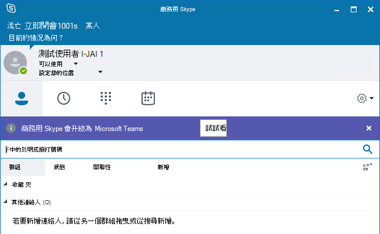

# <a name="tools-for-upgrading-to-teams-mdash-for-it-administrators"></a><span data-ttu-id="da426-103">為 IT 系統管理員升級至團隊的工具 &mdash;</span><span class="sxs-lookup"><span data-stu-id="da426-103">Tools for upgrading to Teams &mdash; for IT administrators</span></span>

<span data-ttu-id="da426-104">本文將說明升級至團隊的工具。</span><span class="sxs-lookup"><span data-stu-id="da426-104">This article describes tools for upgrading to Teams.</span></span> <span data-ttu-id="da426-105">本文是幾個描述 IT 系統管理員升級概念與實現的第三個專案。</span><span class="sxs-lookup"><span data-stu-id="da426-105">This article is the third of several that describe upgrade concepts and implementation for IT administrators.</span></span>  

- [<span data-ttu-id="da426-106">概觀</span><span class="sxs-lookup"><span data-stu-id="da426-106">Overview</span></span>](upgrade-to-teams-on-prem-overview.md)
- [<span data-ttu-id="da426-107">升級方法</span><span class="sxs-lookup"><span data-stu-id="da426-107">Upgrade methods</span></span>](upgrade-to-teams-on-prem-upgrade-methods.md)
- <span data-ttu-id="da426-108"> (本文**的管理升級工具**) </span><span class="sxs-lookup"><span data-stu-id="da426-108">**Tools for managing your upgrade**   (This article)</span></span>
- [<span data-ttu-id="da426-109">使用商務用 Skype 內部部署之組織的其他考慮事項</span><span class="sxs-lookup"><span data-stu-id="da426-109">Additional considerations for organizations with Skype for Business on-premises</span></span>](upgrade-to-teams-on-prem-considerations.md)
- [<span data-ttu-id="da426-110">實施您的升級</span><span class="sxs-lookup"><span data-stu-id="da426-110">Implement your upgrade</span></span>](upgrade-to-teams-on-prem-implement.md)
- [<span data-ttu-id="da426-111">公用交換電話網絡 (PSTN) 考慮</span><span class="sxs-lookup"><span data-stu-id="da426-111">Public Switched Telephone Network (PSTN) considerations</span></span>](upgrade-to-teams-on-prem-pstn-considerations.md)

<span data-ttu-id="da426-112">此外，下列文章說明重要的升級概念與共存行為：</span><span class="sxs-lookup"><span data-stu-id="da426-112">In addition, the following articles describe important upgrade concepts and coexistence behaviors:</span></span>

- [<span data-ttu-id="da426-113">團隊與商務用 Skype 的共存</span><span class="sxs-lookup"><span data-stu-id="da426-113">Coexistence of Teams and Skype for Business</span></span>](upgrade-to-teams-on-prem-coexistence.md)
- [<span data-ttu-id="da426-114">共存模式-參考</span><span class="sxs-lookup"><span data-stu-id="da426-114">Coexistence modes - Reference</span></span>](migration-interop-guidance-for-teams-with-skype.md)
- [<span data-ttu-id="da426-115">Teams 用戶端體驗和遵從共存模式</span><span class="sxs-lookup"><span data-stu-id="da426-115">Teams client experience and conformance to coexistence modes</span></span>](teams-client-experience-and-conformance-to-coexistence-modes.md)


## <a name="tools-for-managing-the-upgrade"></a><span data-ttu-id="da426-116">管理升級的工具</span><span class="sxs-lookup"><span data-stu-id="da426-116">Tools for managing the upgrade</span></span>

<span data-ttu-id="da426-117">無論您選擇哪一種升級方法，都可以使用 [TeamsUpgradePolicy](https://docs.microsoft.com/powershell/module/skype/grant-csteamsupgradepolicy?view=skype-ps)來管理切換至 TeamsOnly，以控制使用者的共存模式。</span><span class="sxs-lookup"><span data-stu-id="da426-117">Whichever upgrade method you choose, you manage the transition to TeamsOnly using [TeamsUpgradePolicy](https://docs.microsoft.com/powershell/module/skype/grant-csteamsupgradepolicy?view=skype-ps), which controls a user’s coexistence mode.</span></span> <span data-ttu-id="da426-118">如需每個模式的詳細資訊，請參閱 [共存模式](migration-interop-guidance-for-teams-with-skype.md)。</span><span class="sxs-lookup"><span data-stu-id="da426-118">For more information on each of the modes, see [Coexistence modes](migration-interop-guidance-for-teams-with-skype.md).</span></span>

<span data-ttu-id="da426-119">無論您是使用商務用 Skype 模式執行選取功能轉場，或是直接從預設孤島設定升級到 TeamsOnly 模式，TeamsUpgradePolicy 是主要工具。</span><span class="sxs-lookup"><span data-stu-id="da426-119">Whether you perform a select capabilities transition using Skype for Business modes or simply upgrade to TeamsOnly mode from the default Islands configuration, TeamsUpgradePolicy is the primary tool.</span></span> <span data-ttu-id="da426-120">與團隊中的任何其他原則一樣，您可以將 TeamsUpgradePolicy 直接指派給使用者。</span><span class="sxs-lookup"><span data-stu-id="da426-120">Like any other policy in Teams, you can assign TeamsUpgradePolicy directly to a user.</span></span> <span data-ttu-id="da426-121">您也可以將原則設定為租使用者範圍的預設值。</span><span class="sxs-lookup"><span data-stu-id="da426-121">You can also set the policy as the tenant-wide default.</span></span> <span data-ttu-id="da426-122">針對使用者的任何指派，都優先于租使用者預設設定。</span><span class="sxs-lookup"><span data-stu-id="da426-122">Any assignment to a user takes precedence over the tenant default setting.</span></span>  <span data-ttu-id="da426-123">您可以在 [團隊管理員] 主控台和 PowerShell 中管理原則。</span><span class="sxs-lookup"><span data-stu-id="da426-123">You can manage the policy in the Teams Admin Console and in PowerShell.</span></span>

<span data-ttu-id="da426-124">您可以將 TeamsUpgradePolicy 的任何模式指派給使用者，不論該使用者是駐留在商務用 Skype Online 或內部部署中，除了只能將 **TeamsOnly 模式指派給已在商務用 Skype online 中的使用者**。</span><span class="sxs-lookup"><span data-stu-id="da426-124">You can assign any mode of TeamsUpgradePolicy to users whether the user is homed in Skype for Business Online or on-premises, **except that TeamsOnly mode can only be assigned to a user who is already homed in Skype for Business Online**.</span></span> <span data-ttu-id="da426-125">這是因為與商務用 Skype 使用者、同盟以及 Microsoft 365 電話系統功能的互通性，只有當使用者駐留在商務用 Skype Online 中時，才可以使用。</span><span class="sxs-lookup"><span data-stu-id="da426-125">This is because interop with Skype for Business users and federation as well as Microsoft 365 Phone System functionality are only possible if the user is homed in Skype for Business Online.</span></span>

<span data-ttu-id="da426-126">使用商務用 Skype 帳戶駐留內部部署的使用者 [必須在線上 (移](https://docs.microsoft.com/SkypeForBusiness/hybrid/move-users-from-on-premises-to-teams) 至商務用 skype online 或直接在商務用 skype 內部部署工具組中) 使用 move-csuser。</span><span class="sxs-lookup"><span data-stu-id="da426-126">Users with Skype for Business accounts homed on-premises [must be moved online](https://docs.microsoft.com/SkypeForBusiness/hybrid/move-users-from-on-premises-to-teams) (either to Skype for Business Online or direct to Teams) using Move-CsUser in the Skype for Business on-premises toolset.</span></span> <span data-ttu-id="da426-127">在1或2個步驟中，您可以將這些使用者移至 TeamsOnly：</span><span class="sxs-lookup"><span data-stu-id="da426-127">These users can be moved to TeamsOnly in either 1 or 2 steps:</span></span>

-   <span data-ttu-id="da426-128">1步驟：在 Move-csuser 中指定-MoveToTeams 開關。</span><span class="sxs-lookup"><span data-stu-id="da426-128">1 step:  Specify the -MoveToTeams switch in Move-CsUser.</span></span> <span data-ttu-id="da426-129">這需要有 CU8 或更新版本的商務用 Skype Server 2019 或商務用 Skype Server 2015。</span><span class="sxs-lookup"><span data-stu-id="da426-129">This requires Skype for Business Server 2019 or Skype for Business Server 2015 with CU8 or later.</span></span>

-   <span data-ttu-id="da426-130">2個步驟：執行移動 Move-csuser 之後，使用 TeamsUpgradePolicy 將 TeamsOnly 模式授與使用者。</span><span class="sxs-lookup"><span data-stu-id="da426-130">2 steps: After running Move-CsUser, grant TeamsOnly mode to the user using TeamsUpgradePolicy.</span></span>

<span data-ttu-id="da426-131">與其他原則不同，您無法在 Microsoft 365 或 Office 365 中建立新的 TeamsUpgradePolicy 實例。</span><span class="sxs-lookup"><span data-stu-id="da426-131">Unlike other policies, it is not possible to create new instances of TeamsUpgradePolicy in Microsoft 365 or Office 365.</span></span> <span data-ttu-id="da426-132">所有現有的實例都會內嵌在服務中。</span><span class="sxs-lookup"><span data-stu-id="da426-132">All the existing instances are built into the service.</span></span>  <span data-ttu-id="da426-133"> (請注意，mode 是 TeamsUpgradePolicy 內的屬性，而不是原則實例的名稱。 ) 在部分（但非全部）情況下，原則實例的名稱與模式相同。</span><span class="sxs-lookup"><span data-stu-id="da426-133">(Note that mode is a property within TeamsUpgradePolicy, rather than the name of a policy instance.) In some--but not all--cases, the name of the policy instance is the same as mode.</span></span> <span data-ttu-id="da426-134">特別是，若要將 TeamsOnly 模式指派給使用者，您會將 TeamsUpgradePolicy 的「UpgradeToTeams」實例授與該使用者。</span><span class="sxs-lookup"><span data-stu-id="da426-134">In particular, to assign TeamsOnly mode to a user, you will grant the “UpgradeToTeams” instance of TeamsUpgradePolicy to that user.</span></span> <span data-ttu-id="da426-135">若要查看所有實例的清單，您可以執行下列命令：</span><span class="sxs-lookup"><span data-stu-id="da426-135">To see a list of all instances, you can run the following command:</span></span>

```PowerShell
Get-CsTeamsUpgradePolicy|ft Identity, Mode, NotifySfbUsers
```

<span data-ttu-id="da426-136">若要將線上使用者升級為 TeamsOnly 模式，請指派「UpgradeToTeams」實例：</span><span class="sxs-lookup"><span data-stu-id="da426-136">To upgrade an online user to TeamsOnly mode, assign the “UpgradeToTeams” instance:</span></span> 

```PowerShell
Grant-CsTeamsUpgradePolicy -PolicyName UpgradeToTeams -Identity $user 
```

<span data-ttu-id="da426-137">若要將內部部署商務用 Skype 使用者升級到 TeamsOnly 模式，請在內部部署工具集中使用 Move-csuser：</span><span class="sxs-lookup"><span data-stu-id="da426-137">To upgrade an on-premise Skype for Business user to TeamsOnly mode, use Move-CsUser in the on-premises toolset:</span></span>

```PowerShell
Move-CsUser -identity $user -Target sipfed.online.lync.com -MoveToTeams -credential $cred
```

<span data-ttu-id="da426-138">若要變更租使用者中所有使用者的模式，除了擁有明確的每位使用者 (授與優先順序) 的人員外，請執行下列命令：</span><span class="sxs-lookup"><span data-stu-id="da426-138">To change the mode for all users in the tenant, except those who have an explicit per-user grant (which takes precedence), run the following command:</span></span>

```PowerShell
Grant-CsTeamsUpgradePolicy -PolicyName SfbWithTeamsCollab -Global
```


>[!NOTE]
><span data-ttu-id="da426-139">如果您擁有內部部署商務用 Skype 帳戶的任何使用者，則不能在租使用者層級指派 TeamsOnly 模式，除非您明確地將部分其他模式指派給使用內部部署商務用 Skype 帳戶的所有使用者。</span><span class="sxs-lookup"><span data-stu-id="da426-139">If you have any users with Skype for Business accounts on-premises, you must not assign TeamsOnly mode at the tenant level, unless you explicitly assign some other mode to all users with on-premises Skype for Business accounts.</span></span>


## <a name="using-notifications-in-skype-for-business-clients"></a><span data-ttu-id="da426-140">在商務用 Skype 用戶端中使用通知</span><span class="sxs-lookup"><span data-stu-id="da426-140">Using notifications in Skype for Business clients</span></span>

<span data-ttu-id="da426-141">系統管理員可以選擇在商務用 Skype 用戶端中提供使用者通知，以通知使用者即將升級至團隊，如下圖所示。</span><span class="sxs-lookup"><span data-stu-id="da426-141">Administrators have the option to provide end user notifications in the Skype for Business client to inform users that they will soon be upgraded to Teams, as shown in the following diagram.</span></span> <span data-ttu-id="da426-142">例如，管理員將一周的時間升級為 TeamsOnly 模式，系統管理員可能會想要針對該使用者群組開啟這些通知。</span><span class="sxs-lookup"><span data-stu-id="da426-142">For example, a week before the administrator plans to upgrade a group of users to TeamsOnly mode, the administrator might want to turn on these notifications for that group of users.</span></span> <span data-ttu-id="da426-143">使用 TeamsUpgradePolicy 與 NotifySfbUsers = true 的實例啟用這些通知。</span><span class="sxs-lookup"><span data-stu-id="da426-143">These notifications are enabled using an instance of TeamsUpgradePolicy with NotifySfbUsers=true.</span></span>  <span data-ttu-id="da426-144">針對除 TeamsOnly 以外的所有模式，實際會有兩個模式的實例，對應到兩個 NotifySfbUsers 值。</span><span class="sxs-lookup"><span data-stu-id="da426-144">For all modes other than TeamsOnly, there are actually two instances per mode, corresponding to the two values of NotifySfbUsers.</span></span>  <span data-ttu-id="da426-145">針對除 TeamsOnly 以外的所有模式，實際會有兩個模式的實例，對應到兩個 NotifySfbUsers 值。</span><span class="sxs-lookup"><span data-stu-id="da426-145">For all modes other than TeamsOnly, there are actually two instances per mode, corresponding to the two values of NotifySfbUsers.</span></span> 



<span data-ttu-id="da426-147">如果您的使用者是駐留在商務用 Skype Online，只要指派的原則實例與使用者的模式相同，但 NotifySfbUsers = true。</span><span class="sxs-lookup"><span data-stu-id="da426-147">If your users are homed in Skype for Business Online, simply assign the policy instance that has the same mode as the user, but with NotifySfbUsers=true.</span></span> 

<span data-ttu-id="da426-148">如果您的使用者是駐留在內部部署的商務用 Skype 伺服器，您必須使用內部部署工具集，且需要商務用 Skype server 2019 或 CU8 （適用于商務用 skype Server 2015）。</span><span class="sxs-lookup"><span data-stu-id="da426-148">If your users are homed in Skype for Business Server on-premises, you’ll need to use the on-premises toolset and you’ll need Skype for Business Server 2019 or CU8 for Skype for Business Server 2015.</span></span> <span data-ttu-id="da426-149">針對駐留在內部部署的商務用 Skype 伺服器中的使用者，TeamsUpgradePolicy 來自線上實例的 mode 屬性，但 NotifySfbUsers 屬性不會生效。</span><span class="sxs-lookup"><span data-stu-id="da426-149">For users homed in Skype for Business Server on-premises, the mode property from the online instance of TeamsUpgradePolicy is honored, but the NotifySfbUsers property is not.</span></span> <span data-ttu-id="da426-150">如果您需要通知，您必須建立 TeamsUpgradePolicy 的內部部署實例來控制用戶端行為。</span><span class="sxs-lookup"><span data-stu-id="da426-150">If notifications are desired, you must create an on-premises instance of TeamsUpgradePolicy to control the client behavior.</span></span> 

<span data-ttu-id="da426-151">在 [內部部署] PowerShell 視窗中，使用 NotifySfbUsers = true 建立新的 TeamsUpgradePolicy 實例：</span><span class="sxs-lookup"><span data-stu-id="da426-151">In the on-premises PowerShell window, create a new instance of TeamsUpgradePolicy with NotifySfbUsers=true:</span></span>

```PowerShell
New-CsTeamsUpgradePolicy -Identity EnableNotification -NotifySfbUsers $true
```

<span data-ttu-id="da426-152">接著，使用相同的內部部署 PowerShell 視窗，將該新原則指派給所需的使用者：</span><span class="sxs-lookup"><span data-stu-id="da426-152">Then, using the same on-premises PowerShell window, assign that new policy to the desired users:</span></span>

```PowerShell
Grant-CsTeamsUpgradePolicy -Identity $user -PolicyName EnableNotification
```

## <a name="meeting-migration"></a><span data-ttu-id="da426-153">會議遷移</span><span class="sxs-lookup"><span data-stu-id="da426-153">Meeting migration</span></span>

<span data-ttu-id="da426-154">當使用者被遷移至 TeamsOnly 模式時，預設會將他們所組織的現有商務用 Skype 會議轉換成小組。</span><span class="sxs-lookup"><span data-stu-id="da426-154">When a user is migrated to TeamsOnly mode, by default their existing Skype for Business meetings that they organized will be converted to Teams.</span></span> <span data-ttu-id="da426-155">您也可以選擇在指派 TeamsOnly 模式給使用者時，停用預設行為。</span><span class="sxs-lookup"><span data-stu-id="da426-155">You can optionally disable the default behavior when assigning TeamsOnly mode to a user.</span></span> <span data-ttu-id="da426-156">從內部部署移動使用者時，必須將會議遷移到雲端，才能與線上使用者帳戶共同作業，但如果您沒有指定-MoveToTeams，會議將會以商務用 Skype 會議進行遷移，而不是轉換成團隊。</span><span class="sxs-lookup"><span data-stu-id="da426-156">When moving users from on-premises, meetings must be migrated to the cloud to function with the online user account, but if you do not specify -MoveToTeams, the meetings will be migrated as Skype for Business meetings, rather than converted to Teams.</span></span> 

<span data-ttu-id="da426-157">在租使用者層級指派 TeamsOnly 模式時，不會觸發會議遷移給任何使用者。</span><span class="sxs-lookup"><span data-stu-id="da426-157">When assigning TeamsOnly mode at the tenant level, meeting migration is not triggered for any users.</span></span> <span data-ttu-id="da426-158">如果您想要在租使用者層級指派 TeamsOnly 模式和遷移會議，您可以使用 PowerShell 來取得 (租使用者的使用者清單，例如，在) 需要的任何篩選器中使用 CsOnlineUser，然後遍歷這些使用者，以觸發會議遷移（使用啟動 CsExMeetingMigration）。</span><span class="sxs-lookup"><span data-stu-id="da426-158">If you wish to assign TeamsOnly mode at the tenant level and migrate meetings, you can use PowerShell to get a list of users in the tenant (for example, using Get-CsOnlineUser with whatever filters are needed) and then loop through each of these users to trigger meeting migration using Start-CsExMeetingMigration.</span></span> <span data-ttu-id="da426-159">如需詳細資訊，請參閱 [使用會議遷移服務 (MMS) ](https://docs.microsoft.com/skypeforbusiness/audio-conferencing-in-office-365/setting-up-the-meeting-migration-service-mms)。</span><span class="sxs-lookup"><span data-stu-id="da426-159">For details, see [Using the Meeting Migration Service (MMS)](https://docs.microsoft.com/skypeforbusiness/audio-conferencing-in-office-365/setting-up-the-meeting-migration-service-mms).</span></span>


## <a name="related-links"></a><span data-ttu-id="da426-160">相關連結</span><span class="sxs-lookup"><span data-stu-id="da426-160">Related links</span></span>

[<span data-ttu-id="da426-161">與商務用 Skype 搭配使用團隊之組織的遷移和互通性指南</span><span class="sxs-lookup"><span data-stu-id="da426-161">Migration and interoperability guidance for organizations using Teams together with Skype for Business</span></span>](migration-interop-guidance-for-teams-with-skype.md) 

[<span data-ttu-id="da426-162">在商務用 Skype Server 與 Microsoft 365 或 Office 365 之間設定混合式連接</span><span class="sxs-lookup"><span data-stu-id="da426-162">Configure hybrid connectivity between Skype for Business Server and Microsoft 365 or Office 365</span></span>](https://docs.microsoft.com/SkypeForBusiness/hybrid/configure-hybrid-connectivity)

[<span data-ttu-id="da426-163">在內部部署和雲端之間移動使用者</span><span class="sxs-lookup"><span data-stu-id="da426-163">Move users between on-premises and cloud</span></span>](https://docs.microsoft.com/SkypeForBusiness/hybrid/move-users-between-on-premises-and-cloud)

[<span data-ttu-id="da426-164">設定您的共存與升級設定</span><span class="sxs-lookup"><span data-stu-id="da426-164">Setting your coexistence and upgrade settings</span></span>](setting-your-coexistence-and-upgrade-settings.md)

[<span data-ttu-id="da426-165">授與 CsTeamsUpgradePolicy</span><span class="sxs-lookup"><span data-stu-id="da426-165">Grant-CsTeamsUpgradePolicy</span></span>](https://docs.microsoft.com/powershell/module/skype/grant-csteamsupgradepolicy?view=skype-ps)

[<span data-ttu-id="da426-166">使用會議遷移服務 (MMS) </span><span class="sxs-lookup"><span data-stu-id="da426-166">Using the Meeting Migration Service (MMS)</span></span>](https://docs.microsoft.com/skypeforbusiness/audio-conferencing-in-office-365/setting-up-the-meeting-migration-service-mms)

