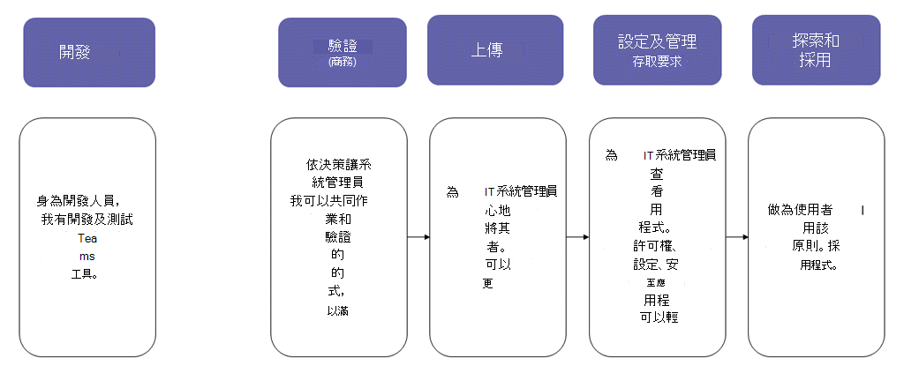
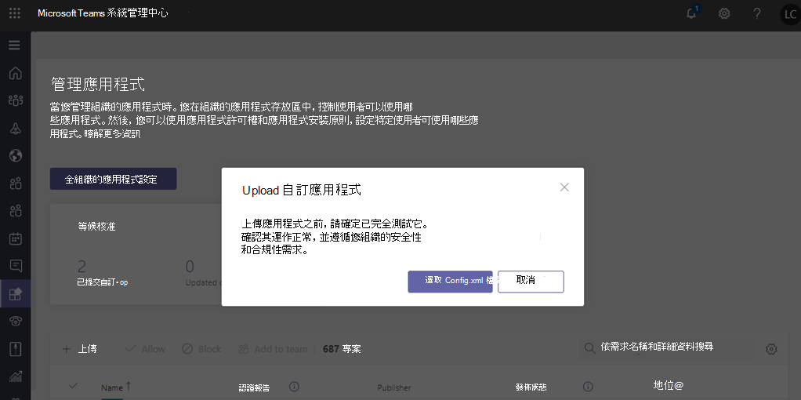

# 透過上傳應用程式套件發佈自訂應用程式Publish a custom app by uploading an app package

> [!NOTE]
> 當您發佈自訂團隊 app 時，您組織的 app store 中的使用者就能使用該應用程式。When you publish a custom Teams app, it's available to users in your organization's app store. 發佈自訂應用程式的方式有兩種，您使用的方式取決於您取得 app 的方式。There are two ways to publish a custom app and the way that you use depends on how you get the app. **本文將重點說明如何發佈自訂應用程式，方法是使用開發人員傳送給您的 .zip 格式) 來上傳應用程式套件 (。****This article focuses on how to publish a custom app by uploading an app package (in .zip format) that a developer sends you**. 當開發人員透過團隊 App 提交 API 直接向 [<a href="https://docs.microsoft.com/microsoftteams/manage-apps" target="_blank">管理應用</a>程式] 頁面提交應用程式時，就會使用另一個方法（核准自訂的應用程式）。The other method, approving a custom app, is used when a developer submits an app directly to the <a href="https://docs.microsoft.com/microsoftteams/manage-apps" target="_blank">Manage apps</a> page through the Teams App Submission API. 若要深入瞭解該方法，請參閱<a href="https://docs.microsoft.com/microsoftteams/submit-approve-custom-apps" target="_blank">發佈透過團隊 App 提交 API 提交的自訂應用程式</a>。To learn more about that method, see <a href="https://docs.microsoft.com/microsoftteams/submit-approve-custom-apps" target="_blank">Publish a custom app submitted through the Teams App Submission API</a>.

本文提供如何將您的小組 app 從開發移至部署到探索的端對端指導方針。This article provides end-to-end guidance for how to take your Teams app from development to deployment to discovery. 本指南主要說明 app 的小組各部分，且適用于系統管理員和 IT 專業人員。This guidance focuses on the Teams aspects of the app and is intended for admins and IT pros. 如需開發小組 app 的詳細資訊，請參閱<a href="https://docs.microsoft.com/microsoftteams/platform" target="_blank">團隊開發人員檔</a>。For more information about developing Teams apps, see the <a href="https://docs.microsoft.com/microsoftteams/platform" target="_blank">Teams developer documentation</a>.

## 開發Develop

### 建立您的應用程式Create your app

Microsoft 團隊開發人員平臺可讓開發人員輕鬆地整合您自己的 app 與服務，以提高生產力、更快速地作出決策，以及在現有的內容和工作流程中建立共同作業。The Microsoft Teams developer platform makes it easy for developers to integrate your own apps and services to improve productivity, make decisions faster, and create collaboration around existing content and workflows. 在團隊平臺上建立的應用程式是團隊用戶端與您的服務與工作流程之間的橋樑，可直接將它們納入共同作業平臺的內容。Apps built on the Teams platform are bridges between the Teams client and your services and workflows, bringing them directly into the context of your collaboration platform. 如需詳細資訊，請移至<a href="https://docs.microsoft.com/microsoftteams/platform" target="_blank">團隊開發人員檔</a>。For more information, go to the <a href="https://docs.microsoft.com/microsoftteams/platform" target="_blank">Teams developer documentation</a>.

## 核實Validate

### 取得應用程式套件Get the app package

當應用程式準備好在生產中使用時，開發人員應該會產生應用程式套件。When the app is ready for use in production, the developer should produce an app package. 他們可以使用<a href="https://docs.microsoft.com/microsoftteams/platform/get-started/get-started-app-studio" target="_blank">應用程式 Studio</a>來執行此程式。They can use <a href="https://docs.microsoft.com/microsoftteams/platform/get-started/get-started-app-studio" target="_blank">App Studio</a> for that. 他們會以 .zip 格式傳送檔案。They'll send you the file in .zip format.

Microsoft 使用<a href="https://docs.microsoft.com/microsoftteams/platform/publishing/office-store-approval" target="_blank">這些指導方針</a>，以確保 app 符合全域團隊 app store 的品質與安全性標準。Microsoft uses <a href="https://docs.microsoft.com/microsoftteams/platform/publishing/office-store-approval" target="_blank">these guidelines</a> to ensure apps comply with the quality and security standards of the global Teams apps store.

### 允許信任的使用者上傳自訂應用程式Allow trusted users to upload custom apps

若要驗證 app 在您的生產租使用者中是否正常運作，您必須允許自己和/或受信任的使用者上傳生產租使用者中的自訂應用程式。To validate that the app is working correctly in your production tenant, you need to allow yourself and/or trusted users to upload custom apps in the production tenant. 您可以使用<a href="https://docs.microsoft.com/microsoftteams/teams-app-setup-policies" target="_blank">應用程式設定原則</a>來執行這項作業。You use <a href="https://docs.microsoft.com/microsoftteams/teams-app-setup-policies" target="_blank">app setup policies</a> to do this.

> [!NOTE]
> 如果您不滿意將 app 上傳到您的生產租使用者進行驗證，即使您是自己或信任的使用者，您也可以略過此步驟，並遵循[上傳](#upload)和[設定及管理](#set-up-and-manage)區段中的步驟，將 unvalidated 應用程式發佈到貴組織的 app store。If you're uncomfortable with uploading the app to your production tenant for validation, even for yourself or trusted users, you can skip this step and follow the steps in the [Upload](#upload) and [Set up and manage](#set-up-and-manage) sections to publish the unvalidated app to your organization's app store. 然後，將該 app 的存取許可權制為只有您自己和您信任的使用者。Then, restrict access to that app to only yourself and users you trust. 然後，這些使用者就可以從貴組織的 app store 取得 app 來執行驗證。These users can then get the app from your organization's app store to perform validation. 驗證應用程式後，請使用相同的許可權原則來開啟 access，並將 app 滾出以供生產使用。After the app is validated, use the same permission policies to open access and roll the app out for production use.

若要允許信任的使用者上傳自訂應用程式，請依照下列步驟執行：To allow trusted users to upload custom apps, follow these steps:

1. 開啟 [**允許與自訂應用程式互動**] 全組織性應用程式設定。Turn on the **Allow interaction with custom apps** org-wide app setting. 若要執行此動作：To do this:
    1. 在 Microsoft 團隊系統管理中心的左導覽中，移至 [**團隊 app**  >  **管理 app**]，然後按一下 [**全組織式應用程式設定**]。In the left navigation of the Microsoft Teams admin center, go to **Teams apps** > **Manage apps**, and then click **Org-wide app settings**.
    2. 開啟 [**自訂應用程式**] 底下的 [**允許與自訂應用程式互動**]，然後按一下 [**儲存**]。Under **Custom apps**, turn on **Allow interaction with custom apps**, and then click **Save**.
2. 關閉全域 app 設定原則中的 [**上傳自訂應用程式**] 設定。Turn off the **Upload custom apps** setting in the global app setup policy. 若要執行此動作：To do this:
    1. 在 Microsoft 團隊系統管理中心的左導覽中，移至 [**團隊 app**  >  **設定原則**]，然後按一下 [\*\*全域 (組織範圍的預設) \*\*原則。In the left navigation of the Microsoft Teams admin center, go to **Teams apps** > **Setup policies**, and then click the **Global (Org-wide default)** policy.
    2. 關閉 **[上傳自訂應用程式**]，然後按一下 [**儲存**]。Turn off **Upload custom apps**, and then click **Save**.
3. 建立新的應用程式設定原則，以允許上傳自訂應用程式，並將它指派給您的一組受信任的使用者。Create a new app setup policy that allows uploading custom apps and assign it to your set of trusted users. 若要執行此動作：To do this:
    1. 在 Microsoft 團隊系統管理中心的左導覽中，移至 [**團隊 app**  >  **設定原則**]，然後按一下 [**新增**]。In the left navigation of the Microsoft Teams admin center, go to **Teams apps** > **Setup policies**, and then click the **Add**. 提供新原則的名稱和描述、開啟 **[上傳自訂應用程式**]，然後按一下 [**儲存**]。Give the new policy a name and description, turn on **Upload custom apps**, and then click **Save**.
    2. 選取您建立的新原則，然後按一下 [**管理使用者**]。Select the new policy you created, and then click **Manage users**. 搜尋使用者 **，按一下 [\*\*\*\*新增**]，然後按一下 [套用]。Search for a user, click **Add**, and then click **Apply**. 重複此步驟，將原則指派給所有信任的使用者。Repeat this step to assign the policy to all your trusted users.

        ![[新增應用程式設定原則] 頁面的螢幕擷取畫面](media/manage-your-lob-apps-new-app-setup-policy.png)

    這些使用者現在可以上傳應用程式資訊清單，以驗證 app 在生產租使用者中是否正常運作。These users can now upload the app manifest to validate that the app is working correctly in the production tenant.

## 將Upload

若要讓貴組織 app store 中的使用者使用該應用程式，請上傳 app。To make the app available to users in your organization's app store, upload the app. 您可以在 Microsoft 團隊系統管理中心的 [<a href="https://docs.microsoft.com/microsoftteams/manage-apps" target="_blank">管理應用程式</a>] 頁面上執行此動作。You can do this on the <a href="https://docs.microsoft.com/microsoftteams/manage-apps" target="_blank">Manage apps</a> page of the Microsoft Teams admin center.

1. 在 Microsoft 團隊系統管理中心的左導覽中，移至 [**團隊 app**  >  **管理應用程式**]。In the left navigation of the Microsoft Teams admin center, go to **Teams apps** > **Manage apps**.
2. 按一下 **[上傳**]，按一下 [**選取**檔案]，然後選取您從開發人員收到的應用程式套件。Click **Upload**, click **Select a file**, and then select the app package that you received from the developer.

    

## 設定和管理Set up and manage

### 控制對應用程式的存取權Control access to the app

根據預設，貴組織中的所有使用者都可以存取貴組織 app store 中的 app。By default, all users in your organization can access the app in your organization's app store. 若要限制及控制誰有權使用該應用程式，您可以建立並指派應用程式許可權原則。To restrict and control who has permission to use the app, you can create and assign an app permission policy. 若要深入瞭解，請參閱<a href="https://docs.microsoft.com/microsoftteams/teams-app-permission-policies" target="_blank">在團隊中管理 app 許可權原則</a>。To learn more, see <a href="https://docs.microsoft.com/microsoftteams/teams-app-permission-policies" target="_blank">Manage app permission policies in Teams</a>.

### 釘選並安裝應用程式供使用者探索Pin and install the app for users to discover

根據預設，使用者可以找到您組織的 app 商店所需的 app，然後流覽或搜尋該應用程式。By default, for users to find the app they have to go to your organization's app store and browse or search for it. 若要讓使用者能夠輕鬆存取應用程式，您可以將應用程式釘選到 [團隊] 中的應用程式行。To make it easy for users to get to the app, you can pin the app to the app bar in Teams. 若要這樣做，請建立應用程式設定原則，並將它指派給使用者。To do this, create an app setup policy and assign it to users. 若要深入瞭解，請參閱<a href="https://docs.microsoft.com/microsoftteams/teams-app-setup-policies" target="_blank">管理團隊中的 app 設定原則</a>。To learn more, see <a href="https://docs.microsoft.com/microsoftteams/teams-app-setup-policies" target="_blank">Manage app setup policies in Teams</a>.

### 搜尋小組 app 事件的審核記錄Search the audit log for Teams app events

您可以搜尋 [審核記錄]，以查看貴組織中的 [小組 app] 活動。You can search the audit log to view Teams apps activity in your organization. 若要進一步瞭解如何搜尋審核記錄，以及查看在審核記錄中記錄的小組活動清單，請參閱<a href="https://docs.microsoft.com/microsoftteams/audit-log-events" target="_blank">在審核記錄中搜尋小組中的事件</a>。To learn more about how to search the audit log and to see a list of Teams activities that are logged in the audit log, see <a href="https://docs.microsoft.com/microsoftteams/audit-log-events" target="_blank">Search the audit log for events in Teams</a>.

在您可以搜尋審核記錄之前，您必須先在<a href="https://protection.office.com" target="_blank">安全性 & 合規性中心</a>開啟審核。Before you can search the audit log, you have to first turn on auditing in the <a href="https://protection.office.com" target="_blank">Security & Compliance Center</a>. 若要深入瞭解，請參閱<a href="https://support.office.com/article/Turn-Office-365-audit-log-search-on-or-off-e893b19a-660c-41f2-9074-d3631c95a014" target="_blank">開啟或關閉審核記錄搜尋</a>。To learn more, see <a href="https://support.office.com/article/Turn-Office-365-audit-log-search-on-or-off-e893b19a-660c-41f2-9074-d3631c95a014" target="_blank">Turn audit log search on or off</a>. 請記住，審核資料只能從您開啟審核的位置取得。Keep in mind that audit data is only available from the point at which you turned on auditing.

## 探索與採納Discover and adopt

擁有 app 許可權的使用者可以在您組織的 app store 中找到該應用程式。Users who have permissions to the app can find it in your organization's app store. 移至 [應用程式] 頁面上的 [**針對*您的組織名稱*建立**]，以尋找貴組織的自訂應用程式。Go to **Built for *Your Organization Name*** on the Apps page to find your organization's custom apps.

![顯示已發佈 app 之 [應用程式] 頁面的螢幕擷取畫面Screenshot of Apps page showing published app ](media/custom-app-lifecycle-discovery.png)

如果您已建立並指派應用程式設定原則，應用程式會釘選在團隊中的應用程式行上，輕鬆存取指派了原則的使用者。If you created and assigned an app setup policy, the app is pinned to the app bar in Teams for easy access for those users who were assigned the policy.

## 時更新Update

若要更新應用程式，開發人員應該繼續遵循[開發](#develop)和[驗證](#validate)區段中的步驟。To update an app, developers should continue to follow the steps in the [Develop](#develop) and [Validate](#validate) sections.

您可以在 Microsoft 團隊系統管理中心的 [管理應用程式] 頁面上更新應用程式。You can update the app on the Manage apps page in the Microsoft Teams admin center. 若要這樣做，請在 Microsoft 團隊系統管理中心的左導覽中，移至 [**團隊 app**  >  **管理應用程式**]。To do this, in the left navigation of the Microsoft Teams admin center, go to **Teams apps** > **Manage apps**. 按一下應用程式名稱，然後按一下 [**更新**]。Click the app name, and then click **Update**. 這麼做會取代現有的 app，而且所有 app 許可權原則和 app 設定原則都會針對更新的 app 保持強制執行。Doing this replaces the existing app, and all app permission policies and app setup policies remain enforced for the updated app.

### 最終使用者更新體驗End user update experience

在大多數情況下，當您完成應用程式更新後，系統會自動針對最終使用者顯示新版本。In most cases, after you complete an app update the new version automatically appears for end users. 不過， <a href="https://docs.microsoft.com/microsoftteams/platform/resources/schema/manifest-schema" target="_blank">Microsoft 團隊資訊清單</a>有一些更新需要使用者驗收才能完成：However, there are some updates to the <a href="https://docs.microsoft.com/microsoftteams/platform/resources/schema/manifest-schema" target="_blank">Microsoft Teams manifest</a> that require user acceptance to complete:

* 已新增或移除 botA bot was added or removed
* 現有 bot 的 "botId" 屬性已變更An existing bot's "botId" property changed
* 現有 bot 的 "isNotificationOnly" 屬性已變更An existing bot's "isNotificationOnly" property changed
* Bot 的 "supportsFiles" 屬性已變更The bot's "supportsFiles" property changed
* 已新增或移除訊息延伸A Messaging extension was added or removed
* 已新增新的連接器A new connector was added
* 新增了 [靜態] 索引標籤A new static tab was added
* 新增 [可設定] 索引標籤A new configurable tab was added
* "WebApplicationInfo" 中的屬性已變更Properties inside "webApplicationInfo" changed

![[應用程式清單] 的螢幕擷取畫面，顯示已推出新版本的 app](media/manage-your-custom-apps-update1.png)

## 相關主題Related topics

- [發佈透過團隊 App 提交 API 提交的自訂應用程式Publish a custom app submitted through the Teams App Submission API](submit-approve-custom-apps.md)
- [在 Microsoft 團隊系統管理中心管理您的應用程式Manage your apps in the Microsoft Teams admin center](manage-apps.md)
- [在 Teams 中管理自訂應用程式原則和設定Manage custom app policies and settings in Teams](teams-custom-app-policies-and-settings.md)
- [在 Teams 中管理應用程式權限原則Manage app permission policies in Teams](teams-app-permission-policies.md)
- [在 Teams 中管理應用程式設定原則Manage app setup policies in Teams](teams-app-setup-policies.md)
