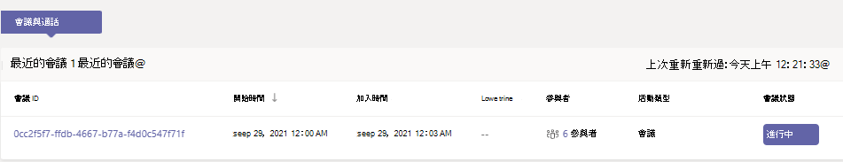
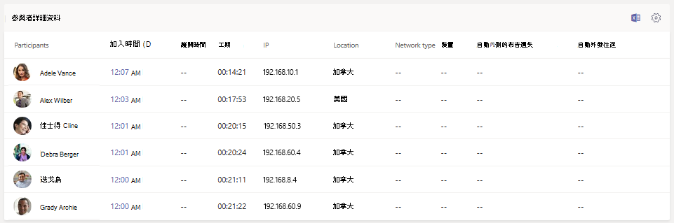
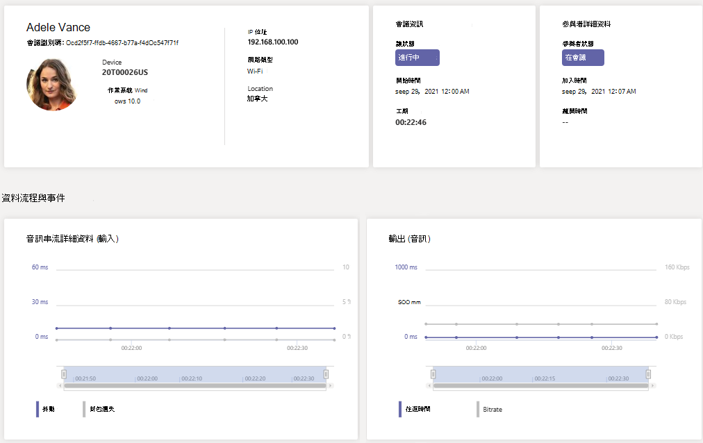

# 使用即時遙測來疑難排解會議品質不佳的問題

> [!NOTE]
> 此功能目前為公開預覽版。

本文將說明如何使用即時遙測來疑難排解個別Microsoft Teams會議品質不佳的問題。 如果您有下列其中一個角色，可以看見即時遙測：

- Teams 系統管理員
- Teams通訊支援專家
- Teams 通訊支援工程師

若要進一Teams系統管理員角色，請參閱使用 Microsoft Teams[系統管理員角色來管理Teams。](/MicrosoftTeams/using-admin-roles)

即時遙測可讓 IT 系統管理員查看重要使用者的排程會議，並查看音訊、視像、內容共用和網路相關問題。 做為系統管理員，您可以在會議期間使用遙測調查這些問題，並即時進行疑難排解。

## 什麼是即時遙測？

今天，個別會議疑難排解[Teams在會議](use-call-analytics-to-troubleshoot-poor-call-quality.md)結束後透過通話分析提供給系統管理員。 即時遙測可讓系統管理員在排程會議進行時進行疑難排解。

即時遙測會顯示即時更新Teams帳戶中每個使用者Office 365會議的詳細資訊。 其中包含有關裝置、網路、連接、音訊、視像和內容共用問題的資訊，有助於系統管理員更有效地疑難排解通話品質。

做為Teams系統管理員，您可以完全存取每個使用者的所有即時遙測資料。 此外，您也可以將Azure Active Directory角色指派給支援人員。 若要深入瞭解這些角色，請參閱授予支援 [與](set-up-call-analytics.md#give-permission-to-support-and-helpdesk-staff)技術支援人員的許可權。

## 哪裡可以找到每個使用者即時疑難排解遙測

若要查看使用者的所有會議資訊和資料，請前往系統管理Teams[中心](https://admin.teams.microsoft.com)。 在 **使用者**  >  **管理使用者** 下，選取使用者，然後開啟&**設定檔頁面面上的**&通話清單。 在 **最近的會議** 下，您會看到使用者在過去 24 小時內參與的會議清單，其中即時遙測功能可供使用，包括任何進行中的會議。 如果會議沒有進行中，或沒有即時遙測資料，它會顯示在過去的 **會議中**。

若要取得進行中會議參與者的其他資訊，包括其裝置、網路和音訊統計資料，請在最近的會議中尋找會議，然後選取參與者欄 **下的連結。** 

若要查看進行中會議之特定使用者即時遙測，包括裝置、網路、音訊、視像和內容共用詳細資料的資訊，請選取會議 **識別碼**。

## 支援即時遙測的平臺

- Windows
- macOS
- Linux
- Android
- iOS

## Teams即時遙測的裝置支援

- 國鐵 - Surface Hub
- 中環線 - Teams顯示器
- 中電 - 共同合作欄
- IP 電話裝置

## 限制

- 即時遙測僅適用于排定的會議。 對於臨時會議 ，例如 [現在開會、PSTN、1：1 通話和群組通話等，即時遙測無法使用。
- 即時遙測僅適用于排程即時事件的簡報者。 目前不適用於即時活動出席者。
- 即時遙測資料可在會議結束後的 24小時內用於會議最近的會議。 24 小時後，您即無法存取資料，且會議會移至 **過去會議**。 如果會議超過 3 小時，則即時遙測只能使用過去 *3 小時*。
- 遙測無法與舊版的 Teams。 如果沒有可用的遙測資料，請嘗試更新您的用戶端。
- 如果外部參與者或匿名使用者加入會議，其顯示名稱會顯示為無法保留跨租使用者隱私權。

## 相關主題

[設定每個使用者的通話分析](set-up-call-analytics.md)

[使用 Microsoft Teams 系統管理員角色來管理Teams。](/MicrosoftTeams/using-admin-roles)
