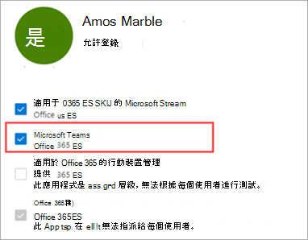
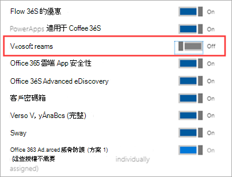

# 管理使用者對 Teams 的存取權Manage user access to Teams

您可以指派或移除 Microsoft 團隊產品授權，在使用者層級管理團隊的存取權。You manage access to Teams at the user level by assigning or removing a Microsoft Teams product license. 貴組織中的每位使用者都必須擁有團隊授權，才能使用團隊。Each user in your organization must have a Teams license before they can use Teams. 您可以在建立新的使用者帳戶時指派團隊授權給新使用者，或是使用現有帳戶指派給使用者。You can assign a Teams license for new users when new user accounts are created or to users with existing accounts.

根據預設，當授權方案 (：例如，Microsoft 365 企業版 E3 或 Microsoft 365 Business Premium) 指派給使用者時，系統會自動指派團隊授權，並為團隊啟用使用者。By default, when a licensing plan (for example, Microsoft 365 Enterprise E3 or Microsoft 365 Business Premium)  is assigned to a user, a Teams license is automatically assigned, and the user is enabled for Teams. 您可以隨時移除或指派授權，來停用或啟用使用者的團隊。You can disable or enable Teams for a user by removing or assigning a license at any time.

使用來自 <a href="https://go.microsoft.com/fwlink/p/?linkid=2024339" target="_blank">團隊系統管理中心</a>管理的訊息原則，以控制可供團隊使用者使用的聊天和通道訊息功能。Use messaging policies, managed from the <a href="https://go.microsoft.com/fwlink/p/?linkid=2024339" target="_blank">Teams Admin Center</a>, to control what chat and channel messaging features are available to users in Teams. 您可以針對組織中的人員，使用預設原則或建立一或多個自訂的訊息策略。You can use the default policy or create one or more custom messaging policies for people in your organization. 若要深入瞭解，請參閱 [管理團隊中的訊息傳遞原則](messaging-policies-in-teams.md)。To learn more, read [Manage messaging policies in Teams](messaging-policies-in-teams.md).
您可以在 Microsoft 365 系統管理中心或使用 PowerShell 管理團隊授權。You manage Teams licenses in the Microsoft 365 admin center or by using PowerShell. 您必須是全域系統管理員或使用者管理系統管理員，才能管理授權。You must be a Global admin or User management admin to manage licenses.

> [!NOTE]
> 我們建議您為所有使用者啟用團隊，讓團隊可以針對專案和其他動態方案進行 organically。We recommend that you enable Teams for all users so that teams can be formed organically for projects and other dynamic initiatives. 即使您執行的是試用版，仍可將團隊保持為所有使用者使用，但只有目標是與使用者的試驗群組進行通訊。Even if you're running a pilot, it may still be helpful to keep Teams enabled for all users, but only target communications to the pilot group of users.

## 使用 Microsoft 365 系統管理中心Using the Microsoft 365 admin center

團隊使用者層級授權是透過 Microsoft 365 系統管理中心使用者管理介面直接管理。Teams user-level licenses are managed directly through the Microsoft 365 admin center user management interfaces. 系統管理員可以在建立新的使用者帳戶時指派授權給新的使用者，或指派給現有帳戶的使用者。An administrator can assign licenses to new users when new user accounts are created, or to users with existing accounts. 

> [!IMPORTANT]
> 系統管理員必須具備全域系統管理員或使用者管理管理員的許可權，才能管理 Microsoft 團隊授權。The administrator must have Global Administrator or User Management Administrator privileges to manage Microsoft Teams licenses.
使用 Microsoft 365 系統管理中心，分別管理個別使用者或一組小組使用者的小組授權。Use the Microsoft 365 admin center to manage Teams licenses for individual users or small sets of users at a time. 您可以在 [ **授權** ] 頁面上管理多達20個使用者，同時) 或 [作用中 **使用者** ] 頁面上的 [團隊授權] (。You can manage Teams licenses on the **Licenses** page (for up to 20 users at at time) or **Active users** page. 您選擇的方法取決於您是否要管理特定使用者的產品授權，或管理特定產品的使用者授權。The method you choose depends on whether you want to manage product licenses for specific users or manage user licenses for specific products.

如果您需要管理大量使用者（例如幾百或數千位使用者）的團隊授權，請[在 Azure Active Directory 中使用 Powershell 或群組式授權 (AZURE AD) ](https://docs.microsoft.com/azure/active-directory/users-groups-roles/licensing-groups-assign)。 [use Powershell](#using-powershell)If you need to manage Teams licenses for a large number of users, such as hundreds or thousands of users, [use Powershell](#using-powershell) or [group-based licensing in Azure Active Directory (Azure AD)](https://docs.microsoft.com/azure/active-directory/users-groups-roles/licensing-groups-assign). 

### 指派團隊授權Assign a Teams license

這些步驟會根據您使用的是 [ **授權** ] 頁面或 [作用中 **使用者** ] 頁面而有所不同。The steps are different depending on whether you use the **Licenses** page or **Active users** page.  如需逐步指示，請參閱 [指派授權給使用者](https://docs.microsoft.com/microsoft-365/admin/manage/assign-licenses-to-users)。For step-by-step instructions, see [Assign licenses to users](https://docs.microsoft.com/microsoft-365/admin/manage/assign-licenses-to-users).

|||
|---------|---------|
|    |         |

### 移除團隊授權Remove a Teams license

當您移除使用者的小組授權時，系統會停用該使用者的小組，且不會再在應用程式啟動器或首頁中看到小組。When you remove a Teams license from a user, Teams is disabled for that user, and they will no longer see Teams in the app launcher or homepage. 如需詳細步驟，請參閱 [取消指派給使用者的授權](https://docs.microsoft.com/microsoft-365/admin/manage/remove-licenses-from-users)。For detailed steps, see [Unassign licenses from users](https://docs.microsoft.com/microsoft-365/admin/manage/remove-licenses-from-users).

|||
|---------|---------|
|    |         |

## 使用 PowerShellUsing PowerShell

使用 PowerShell 管理大量使用者的團隊授權。Use PowerShell to manage Teams licenses for users in bulk. 您可以透過 PowerShell 啟用和停用團隊，就像在任何其他服務方案授權中一樣。You enable and disable Teams through PowerShell in the same way that you would for any other service plan license. 您需要團隊服務方案的識別碼，如下所示：You'll need the identifiers for the service plans for Teams, which are as follows:

- Microsoft 團隊： TEAMS1Microsoft Teams: TEAMS1
- 適用于 GCC 的 Microsoft 團隊： TEAMS_GOVMicrosoft Teams for GCC: TEAMS_GOV
- 適用于 DoD 的 Microsoft 團隊： TEAMS_DODMicrosoft Teams for DoD: TEAMS_DOD

### 大量指派團隊授權Assign Teams licenses in bulk

如需詳細步驟，請參閱 [使用 PowerShell 指派授權給使用者帳戶](https://docs.microsoft.com/office365/enterprise/powershell/assign-licenses-to-user-accounts-with-office-365-powershell)。For detailed steps, see [Assign licenses to user accounts with PowerShell](https://docs.microsoft.com/office365/enterprise/powershell/assign-licenses-to-user-accounts-with-office-365-powershell).

### 大量移除團隊授權Remove Teams licenses in bulk

如需詳細步驟，請參閱 [使用 PowerShell 停用服務的存取權](https://docs.microsoft.com/office365/enterprise/powershell/disable-access-to-services-with-office-365-powershell) ，以及 [在指派使用者授權時停用服務的存取權](https://docs.microsoft.com/office365/enterprise/powershell/disable-access-to-services-while-assigning-user-licenses)。For detailed steps, see [Disable access to services with PowerShell](https://docs.microsoft.com/office365/enterprise/powershell/disable-access-to-services-with-office-365-powershell) and [Disable access to services while assigning user licenses](https://docs.microsoft.com/office365/enterprise/powershell/disable-access-to-services-while-assigning-user-licenses).

#### 範例Example 

以下是如何使用 [新的 MsolLicenseOptions](https://docs.microsoft.com/powershell/module/msonline/new-msollicenseoptions) 和 [MsolUserLicense](https://docs.microsoft.com/powershell/module/msonline/set-msoluserlicense) Cmdlet 來針對擁有特定授權方案的使用者停用團隊的範例。The following is an example of how to use the [New-MsolLicenseOptions](https://docs.microsoft.com/powershell/module/msonline/new-msollicenseoptions) and [Set-MsolUserLicense](https://docs.microsoft.com/powershell/module/msonline/set-msoluserlicense) cmdlets to disable Teams for users who have a specific licensing plan. 例如，請依照下列步驟，先針對所有擁有特定授權方案的使用者停用團隊。For example, follow these steps to first disable Teams for all users who have a particular licensing plan. 然後針對應該有權存取團隊的每位使用者，分別啟用團隊。Then enable Teams for each individual user who should have access to Teams.

> [!IMPORTANT]
> [新的 MsolLicenseOptions](https://docs.microsoft.com/powershell/module/msonline/new-msollicenseoptions) Cmdlet 會啟用先前已停用的所有服務，除非您在自訂腳本中明確標示。The [New-MsolLicenseOptions](https://docs.microsoft.com/powershell/module/msonline/new-msollicenseoptions) cmdlet will enable all services that were previously disabled unless explicitly identified in your custom script. 例如，如果您想要停用 Exchange 和 Sway 同時又停用小組，您必須在腳本中包含這項功能，否則您所識別的使用者將會啟用 Exchange 和 Sway。For example, if you want to leave both Exchange and Sway disabled while also disabling Teams, you'll need to include this in the script or both Exchange and Sway will be enabled for those users you identified.

執行下列命令，以顯示貴組織中所有可用的授權方案。Run the following command to display all available licensing plans in your organization. 若要深入瞭解，請參閱 [使用 PowerShell 來查看授權及服務](https://docs.microsoft.com/office365/enterprise/powershell/view-licenses-and-services-with-office-365-powershell)。To learn more, see [View licenses and services with PowerShell](https://docs.microsoft.com/office365/enterprise/powershell/view-licenses-and-services-with-office-365-powershell).

      Get-MsolAccountSku

執行下列命令，其中 \<CompanyName:License> 是您的組織名稱，以及您在先前步驟中檢索之授權方案的識別碼。Run the following commands, where \<CompanyName:License> is your organization name and the identifier for the licensing plan that you retrieved in the earlier step. 例如，ContosoSchool： ENTERPRISEPACK_STUDENT。For example, ContosoSchool:ENTERPRISEPACK_STUDENT.

      $acctSKU="<CompanyName:License>
      $x = New-MsolLicenseOptions -AccountSkuId $acctSKU -DisabledPlans "TEAMS1"

執行下列命令，以針對所有擁有授權方案有效授權的使用者停用團隊。Run the following command to disable Teams for all users who have an active license for the licensing plan.

      Get-MsolUser | Where-Object {$_.licenses[0].AccountSku.SkuPartNumber -eq  ($acctSKU).Substring($acctSKU.IndexOf(":")+1,  $acctSKU.Length-$acctSKU.IndexOf(":")-1) -and $_.IsLicensed -eq $True} |  Set-MsolUserLicense -LicenseOptions $x

## 在組織層級管理團隊Manage teams at the organization level

[!INCLUDE [global-switch-expiry-note](includes/global-switch-expiry-note.md)]

## 相關主題Related topics

- [團隊附加元件授權Teams add-on licenses](teams-add-on-licensing/microsoft-teams-add-on-licensing.md)
- [指派團隊附加元件授權Assign Teams add-on licenses](teams-add-on-licensing/assign-teams-add-on-licenses.md)
- [使用 PowerShell 來查看授權與服務View licenses and services with PowerShell](https://docs.microsoft.com/office365/enterprise/powershell/view-licenses-and-services-with-office-365-powershell)
- [用於授權的產品名稱和服務方案識別碼Product names and service plan identifiers for licensing](https://docs.microsoft.com/azure/active-directory/users-groups-roles/licensing-service-plan-reference)
- [教育版 SKU 參考Education SKU reference](sku-reference-edu.md)