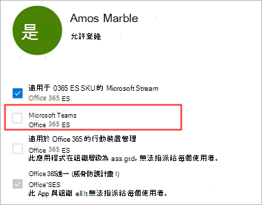

# <a name="manage-user-access-to-teams"></a><span data-ttu-id="18b98-103">管理使用者對 Teams 的存取權</span><span class="sxs-lookup"><span data-stu-id="18b98-103">Manage user access to Teams</span></span>

<span data-ttu-id="18b98-104">您可以指派或移除Teams授權，以管理使用者層級Microsoft Teams存取權。</span><span class="sxs-lookup"><span data-stu-id="18b98-104">You manage access to Teams at the user level by assigning or removing a Microsoft Teams product license.</span></span> <span data-ttu-id="18b98-105">除了以匿名Teams加入會議之外，貴組織的每個使用者都必須擁有Teams授權，才能使用Teams。</span><span class="sxs-lookup"><span data-stu-id="18b98-105">Except for joining Teams meetings anonymously, each user in your organization must have a Teams license before they can use Teams.</span></span> <span data-ttu-id="18b98-106">您可以在建立Teams使用者帳戶時指派授權給新使用者，或指派給擁有現有帳戶的使用者。</span><span class="sxs-lookup"><span data-stu-id="18b98-106">You can assign a Teams license for new users when new user accounts are created or to users with existing accounts.</span></span>

<span data-ttu-id="18b98-107">根據預設，當授權方案 (例如 Microsoft 365 企業版 E3 或 Microsoft 365 商務進階版) 指派給使用者時，系統會自動指派 Teams 授權，且使用者已啟用 Teams。</span><span class="sxs-lookup"><span data-stu-id="18b98-107">By default, when a licensing plan (for example, Microsoft 365 Enterprise E3 or Microsoft 365 Business Premium) is assigned to a user, a Teams license is automatically assigned, and the user is enabled for Teams.</span></span> <span data-ttu-id="18b98-108">您隨時都可以Teams或指派授權，為使用者停用或啟用授權。</span><span class="sxs-lookup"><span data-stu-id="18b98-108">You can disable or enable Teams for a user by removing or assigning a license at any time.</span></span>

<span data-ttu-id="18b98-109">使用從系統管理中心管理Teams訊息<a href="https://go.microsoft.com/fwlink/p/?linkid=2024339" target="_blank"></a>策略，控制哪些聊天和頻道訊息功能可供 Teams。</span><span class="sxs-lookup"><span data-stu-id="18b98-109">Use messaging policies, managed from the <a href="https://go.microsoft.com/fwlink/p/?linkid=2024339" target="_blank">Teams Admin Center</a>, to control what chat and channel messaging features are available to users in Teams.</span></span> <span data-ttu-id="18b98-110">您可以使用預設策略，或為貴組織人員建立一或多個自訂訊息策略。</span><span class="sxs-lookup"><span data-stu-id="18b98-110">You can use the default policy or create one or more custom messaging policies for people in your organization.</span></span> <span data-ttu-id="18b98-111">若要深入瞭解，請參閱在 Teams[中管理Teams。](messaging-policies-in-teams.md)</span><span class="sxs-lookup"><span data-stu-id="18b98-111">To learn more, read [Manage messaging policies in Teams](messaging-policies-in-teams.md).</span></span>
<span data-ttu-id="18b98-112">您可以在系統Teams管理中心Microsoft 365或使用 PowerShell 管理授權。</span><span class="sxs-lookup"><span data-stu-id="18b98-112">You manage Teams licenses in the Microsoft 365 admin center or by using PowerShell.</span></span> <span data-ttu-id="18b98-113">您必須是全域系統管理員或使用者管理系統管理員，才能管理授權。</span><span class="sxs-lookup"><span data-stu-id="18b98-113">You must be a Global admin or User management admin to manage licenses.</span></span>

> [!NOTE]
> <span data-ttu-id="18b98-114">我們建議您為所有使用者啟用Teams，讓團隊可以針對專案和其他動態計畫以組織方式組成。</span><span class="sxs-lookup"><span data-stu-id="18b98-114">We recommend that you enable Teams for all users so that teams can be formed organically for projects and other dynamic initiatives.</span></span> <span data-ttu-id="18b98-115">即使您進行試驗，保持所有使用者Teams，但只將通訊目標鎖定至試驗使用者群組可能還是很有説明。</span><span class="sxs-lookup"><span data-stu-id="18b98-115">Even if you're running a pilot, it may still be helpful to keep Teams enabled for all users, but only target communications to the pilot group of users.</span></span>

## <a name="using-the-microsoft-365-admin-center"></a><span data-ttu-id="18b98-116">使用 Microsoft 365系統管理中心</span><span class="sxs-lookup"><span data-stu-id="18b98-116">Using the Microsoft 365 admin center</span></span>

<span data-ttu-id="18b98-117">Teams管理中心使用者管理介面直接管理Microsoft 365層級授權。</span><span class="sxs-lookup"><span data-stu-id="18b98-117">Teams user-level licenses are managed directly through the Microsoft 365 admin center user management interfaces.</span></span> <span data-ttu-id="18b98-118">系統管理員可以在建立新使用者帳戶時指派授權給新使用者，或指派給擁有現有帳戶的使用者。</span><span class="sxs-lookup"><span data-stu-id="18b98-118">An administrator can assign licenses to new users when new user accounts are created, or to users with existing accounts.</span></span> 

> [!IMPORTANT]
> <span data-ttu-id="18b98-119">系統管理員必須擁有全域系統管理員或使用者管理系統管理員許可權，才能管理Microsoft Teams授權。</span><span class="sxs-lookup"><span data-stu-id="18b98-119">The administrator must have Global Administrator or User Management Administrator privileges to manage Microsoft Teams licenses.</span></span>
<span data-ttu-id="18b98-120">使用 Microsoft 365管理中心，一Teams管理個別使用者或小使用者組的使用者授權。</span><span class="sxs-lookup"><span data-stu-id="18b98-120">Use the Microsoft 365 admin center to manage Teams licenses for individual users or small sets of users at a time.</span></span> <span data-ttu-id="18b98-121">您可以在授權Teams或活動 (頁面上管理最多20 位) **授權**。</span><span class="sxs-lookup"><span data-stu-id="18b98-121">You can manage Teams licenses on the **Licenses** page (for up to 20 users at at time) or **Active users** page.</span></span> <span data-ttu-id="18b98-122">您選擇的方法取決於您要管理特定使用者的產品授權，或管理特定產品的使用者授權。</span><span class="sxs-lookup"><span data-stu-id="18b98-122">The method you choose depends on whether you want to manage product licenses for specific users or manage user licenses for specific products.</span></span>

<span data-ttu-id="18b98-123">如果您需要管理大量使用者的 Teams 授權 ，例如數百或數千個使用者，請使用[Azure Active Directory (Azure AD ](/azure/active-directory/users-groups-roles/licensing-groups-assign)Azure Active Directory (中的[PowerShell](#using-powershell)或群組授權) 。</span><span class="sxs-lookup"><span data-stu-id="18b98-123">If you need to manage Teams licenses for a large number of users, such as hundreds or thousands of users, [use PowerShell](#using-powershell) or [group-based licensing in Azure Active Directory (Azure AD)](/azure/active-directory/users-groups-roles/licensing-groups-assign).</span></span> 

### <a name="assign-a-teams-license"></a><span data-ttu-id="18b98-124">指派授權Teams授權</span><span class="sxs-lookup"><span data-stu-id="18b98-124">Assign a Teams license</span></span>

<span data-ttu-id="18b98-125">步驟會根據您使用授權頁面或活動 **使用者頁面\*\*\*\*而** 不同。</span><span class="sxs-lookup"><span data-stu-id="18b98-125">The steps are different depending on whether you use the **Licenses** page or **Active users** page.</span></span>  <span data-ttu-id="18b98-126">有關逐步指示，請參閱指派 [授權給使用者](/microsoft-365/admin/manage/assign-licenses-to-users)。</span><span class="sxs-lookup"><span data-stu-id="18b98-126">For step-by-step instructions, see [Assign licenses to users](/microsoft-365/admin/manage/assign-licenses-to-users).</span></span>

|||
|---------|---------|
|    |         |

### <a name="remove-a-teams-license"></a><span data-ttu-id="18b98-129">移除Teams授權</span><span class="sxs-lookup"><span data-stu-id="18b98-129">Remove a Teams license</span></span>

> [!IMPORTANT]
> <span data-ttu-id="18b98-130">停用 SKU 需要大約 24 小時Teams SKU 才能生效。</span><span class="sxs-lookup"><span data-stu-id="18b98-130">It takes about 24 hours for disabling a Teams SKU to take effect.</span></span>

<span data-ttu-id="18b98-131">當您從使用者Teams授權時，Teams使用者就會停用，而且他們不會再在應用程式啟動器Teams首頁看到任何授權。</span><span class="sxs-lookup"><span data-stu-id="18b98-131">When you remove a Teams license from a user, Teams is disabled for that user, and they will no longer see Teams in the app launcher or homepage.</span></span> <span data-ttu-id="18b98-132">有關詳細步驟，請參閱 [取消使用者授權](/microsoft-365/admin/manage/remove-licenses-from-users)。</span><span class="sxs-lookup"><span data-stu-id="18b98-132">For detailed steps, see [Unassign licenses from users](/microsoft-365/admin/manage/remove-licenses-from-users).</span></span>

|||
|---------|---------|
|    |         |

## <a name="using-powershell"></a><span data-ttu-id="18b98-135">使用 PowerShell</span><span class="sxs-lookup"><span data-stu-id="18b98-135">Using PowerShell</span></span>

<span data-ttu-id="18b98-136">使用 PowerShell 大量Teams使用者授權。</span><span class="sxs-lookup"><span data-stu-id="18b98-136">Use PowerShell to manage Teams licenses for users in bulk.</span></span> <span data-ttu-id="18b98-137">您透過 PowerShell Teams和停用其他服務方案授權的方式，來啟用和停用。</span><span class="sxs-lookup"><span data-stu-id="18b98-137">You enable and disable Teams through PowerShell in the same way that you would for any other service plan license.</span></span> <span data-ttu-id="18b98-138">您需要服務方案識別碼Teams，如下所示：</span><span class="sxs-lookup"><span data-stu-id="18b98-138">You'll need the identifiers for the service plans for Teams, which are as follows:</span></span>

- <span data-ttu-id="18b98-139">Microsoft Teams：TEAMS1</span><span class="sxs-lookup"><span data-stu-id="18b98-139">Microsoft Teams: TEAMS1</span></span>
- <span data-ttu-id="18b98-140">Microsoft Teams： GCC： TEAMS_GOV</span><span class="sxs-lookup"><span data-stu-id="18b98-140">Microsoft Teams for GCC: TEAMS_GOV</span></span>
- <span data-ttu-id="18b98-141">Microsoft Teams DoD 的TEAMS_DOD</span><span class="sxs-lookup"><span data-stu-id="18b98-141">Microsoft Teams for DoD: TEAMS_DOD</span></span>

### <a name="assign-teams-licenses-in-bulk"></a><span data-ttu-id="18b98-142">大量Teams指派授權</span><span class="sxs-lookup"><span data-stu-id="18b98-142">Assign Teams licenses in bulk</span></span>

<span data-ttu-id="18b98-143">有關詳細步驟，請參閱使用 [PowerShell 將授權指派給使用者帳戶](/office365/enterprise/powershell/assign-licenses-to-user-accounts-with-office-365-powershell)。</span><span class="sxs-lookup"><span data-stu-id="18b98-143">For detailed steps, see [Assign licenses to user accounts with PowerShell](/office365/enterprise/powershell/assign-licenses-to-user-accounts-with-office-365-powershell).</span></span>

### <a name="remove-teams-licenses-in-bulk"></a><span data-ttu-id="18b98-144">大量Teams移除授權</span><span class="sxs-lookup"><span data-stu-id="18b98-144">Remove Teams licenses in bulk</span></span>

<span data-ttu-id="18b98-145">有關詳細步驟，請參閱停用 [PowerShell](/office365/enterprise/powershell/disable-access-to-services-with-office-365-powershell) 服務存取權，以及指派使用者授權 [時停用服務存取權](/office365/enterprise/powershell/disable-access-to-services-while-assigning-user-licenses)。</span><span class="sxs-lookup"><span data-stu-id="18b98-145">For detailed steps, see [Disable access to services with PowerShell](/office365/enterprise/powershell/disable-access-to-services-with-office-365-powershell) and [Disable access to services while assigning user licenses](/office365/enterprise/powershell/disable-access-to-services-while-assigning-user-licenses).</span></span>

#### <a name="example"></a><span data-ttu-id="18b98-146">範例</span><span class="sxs-lookup"><span data-stu-id="18b98-146">Example</span></span> 

<span data-ttu-id="18b98-147">以下是如何使用[New-MsolLicenseOptions](/powershell/module/msonline/new-msollicenseoptions)和[Set-MsolUserLicense](/powershell/module/msonline/set-msoluserlicense) Cmdlet 來停用 Teams 的範例，供擁有特定授權方案的使用者使用。</span><span class="sxs-lookup"><span data-stu-id="18b98-147">The following is an example of how to use the [New-MsolLicenseOptions](/powershell/module/msonline/new-msollicenseoptions) and [Set-MsolUserLicense](/powershell/module/msonline/set-msoluserlicense) cmdlets to disable Teams for users who have a specific licensing plan.</span></span> <span data-ttu-id="18b98-148">例如，請遵循下列步驟，針對Teams方案的使用者，先停用授權。</span><span class="sxs-lookup"><span data-stu-id="18b98-148">For example, follow these steps to first disable Teams for all users who have a particular licensing plan.</span></span> <span data-ttu-id="18b98-149">然後針對Teams使用者啟用Teams。</span><span class="sxs-lookup"><span data-stu-id="18b98-149">Then enable Teams for each individual user who should have access to Teams.</span></span>

> [!IMPORTANT]
> <span data-ttu-id="18b98-150">[New-MsolLicenseOptions](/powershell/module/msonline/new-msollicenseoptions) Cmdlet 會啟用先前停用的所有服務，除非您在自訂腳本中明確識別。</span><span class="sxs-lookup"><span data-stu-id="18b98-150">The [New-MsolLicenseOptions](/powershell/module/msonline/new-msollicenseoptions) cmdlet will enable all services that were previously disabled unless explicitly identified in your custom script.</span></span> <span data-ttu-id="18b98-151">例如，如果您想要同時停用 Exchange 和 Sway，同時停用 Teams，您必須在腳本中納入此功能，否則 Exchange 和 Sway 都會針對您識別的使用者啟用。</span><span class="sxs-lookup"><span data-stu-id="18b98-151">For example, if you want to leave both Exchange and Sway disabled while also disabling Teams, you'll need to include this in the script or both Exchange and Sway will be enabled for those users you identified.</span></span>

<span data-ttu-id="18b98-152">執行下列命令以顯示貴組織中所有可用的授權方案。</span><span class="sxs-lookup"><span data-stu-id="18b98-152">Run the following command to display all available licensing plans in your organization.</span></span> <span data-ttu-id="18b98-153">若要深入瞭解，請參閱 [使用 PowerShell 來查看授權和服務](/office365/enterprise/powershell/view-licenses-and-services-with-office-365-powershell)。</span><span class="sxs-lookup"><span data-stu-id="18b98-153">To learn more, see [View licenses and services with PowerShell](/office365/enterprise/powershell/view-licenses-and-services-with-office-365-powershell).</span></span>


```powershell
Get-MsolAccountSku
```

<span data-ttu-id="18b98-154">執行下列命令，即貴組織的名稱，以及您先前步驟中所提取之授權計畫的 \<CompanyName:License> 識別碼。</span><span class="sxs-lookup"><span data-stu-id="18b98-154">Run the following commands, where \<CompanyName:License> is your organization name and the identifier for the licensing plan that you retrieved in the earlier step.</span></span> <span data-ttu-id="18b98-155">例如，ContosoSchool：ENTERPRISEPACK_STUDENT。</span><span class="sxs-lookup"><span data-stu-id="18b98-155">For example, ContosoSchool:ENTERPRISEPACK_STUDENT.</span></span>

```powershell
$acctSKU="<CompanyName:License>
$x = New-MsolLicenseOptions -AccountSkuId $acctSKU -DisabledPlans "TEAMS1"
```

<span data-ttu-id="18b98-156">請執行下列命令，Teams授權方案之所有使用中授權的使用者停用授權。</span><span class="sxs-lookup"><span data-stu-id="18b98-156">Run the following command to disable Teams for all users who have an active license for the licensing plan.</span></span>

```powershell
Get-MsolUser | Where-Object {$_.licenses[0].AccountSku.SkuPartNumber -eq  ($acctSKU).Substring($acctSKU.IndexOf(":")+1,  $acctSKU.Length-$acctSKU.IndexOf(":")-1) -and $_.IsLicensed -eq $True} |  Set-MsolUserLicense -LicenseOptions $x
```

## <a name="related-topics"></a><span data-ttu-id="18b98-157">相關主題</span><span class="sxs-lookup"><span data-stu-id="18b98-157">Related topics</span></span>

- [<span data-ttu-id="18b98-158">Teams附加元件授權</span><span class="sxs-lookup"><span data-stu-id="18b98-158">Teams add-on licenses</span></span>](teams-add-on-licensing/microsoft-teams-add-on-licensing.md)
- [<span data-ttu-id="18b98-159">指派Teams附加元件授權</span><span class="sxs-lookup"><span data-stu-id="18b98-159">Assign Teams add-on licenses</span></span>](teams-add-on-licensing/assign-teams-add-on-licenses.md)
- [<span data-ttu-id="18b98-160">使用 PowerShell 來查看授權和服務</span><span class="sxs-lookup"><span data-stu-id="18b98-160">View licenses and services with PowerShell</span></span>](/office365/enterprise/powershell/view-licenses-and-services-with-office-365-powershell)
- [<span data-ttu-id="18b98-161">用於授權的產品名稱和服務方案識別碼</span><span class="sxs-lookup"><span data-stu-id="18b98-161">Product names and service plan identifiers for licensing</span></span>](/azure/active-directory/users-groups-roles/licensing-service-plan-reference)
- [<span data-ttu-id="18b98-162">教育用 SKU 參考</span><span class="sxs-lookup"><span data-stu-id="18b98-162">Education SKU reference</span></span>](sku-reference-edu.md)
