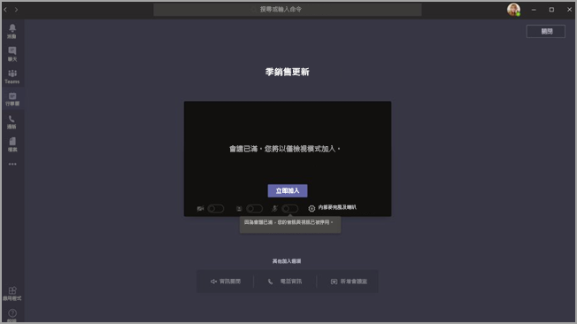

# <a name="teams-view-only-meeting-experience"></a>Teams 僅供檢視會議體驗

> [!Note]
> 在 Microsoft 365 E3/E5 和 Microsoft 365 A3/A5 中提供僅供檢視廣播。 此功能將於 2021 年 3 月 1 日啟用，但預設為關閉。 Microsoft 365 政府社群雲端 (GCC) 中的功能將於 2021 年 3 月底開始推出。 政府社群雲端 High (GCCH) 和美國國防部 (DoD) 將於稍後推出。 如果您想要將功能設定為預設開啟，您必須在此日期之後變更預設原則。 使用 PowerShell 啟用原則 `Set-CsTeamsMeetingPolicy -Identity Global -StreamingAttendeeMode Enabled`。

> [!Note]
> 如果您的會議或網路研討會達到容量限制，Teams 將會無縫調整，以容納 10,000 人僅供檢視廣播體驗。 此外，在遠端工作數量增加的這段時間裡，到今年年底，請利用 20,000 人的更大廣播容量。

Microsoft Teams 允許最多 10,000 位出席者加入 Teams 會議。 達到主要會議容量之後 (在 WW 中 300 人或 GCC 使用者有 250 人進入會議) 之後，其他出席者會以僅查看體驗加入會議。

第一次加入會議的出席者，最多可取得主要會議的容量，並取得完整的 Teams 會議體驗。 他們可以分享音訊和視訊、查看分享的視訊以及參與會議聊天。

主要會議容量到達後加入的出席者將擁有僅供檢視體驗。

出席者將能透過 Android 和 iOS (桌面、Web 和 Teams 行動) 。

> [!Note]
> 「主要會議」或換句話說，「完全互動」使用者數目的目前限制為 WW 為 300，GCC、GCC High 和 DoD 為 250。

## <a name="teams-view-only-experience-controls"></a>Teams 僅查看體驗控制項

您可以使用 PowerShell 啟用僅查看體驗。

```PowerShell
Set-CsTeamsMeetingPolicy -Identity Global -StreamingAttendeeMode Enabled
```

若要停用僅以視圖顯示的體驗，您也可以使用 PowerShell。

```PowerShell
Set-CsTeamsMeetingPolicy -Identity Global -StreamingAttendeeMode Disabled
```

您日後將能夠啟用或停用 Teams 系統管理中心中的僅查看體驗。

## <a name="impact-to-users"></a>對使用者的影響

使用者的體驗會根據數個因素而不同。

達到主要會議的容量限制後，如果下列任一情況成立，出席者將無法加入會議：

- 系統管理員已停用召集人或整個租使用者的 Teams 僅查看體驗。
- 只能觀看的出席者無法跳過大廳。 舉個例說，如果會議召集人選擇只讓組織中的人員跳過大廳，而組織外部的出席者嘗試以僅以唯一的出席者加入，就會遭到拒絕。

當達到主要會議的容量時，會議召集人和簡報者會看到橫幅，通知他們新的出席者會以僅觀看的出席者加入。

  

達到主要會議的容量限制後，系統將在加入前的畫面上通知會議出席者他們正在以僅供檢視模式加入。

  

如果有空間，使用者一律可以加入主要會議。 達到主要會議容量限制後，如果一或多位出席者離開主要會議，則主要會議會釋出容量可供加入。 加入 (或重新加入) 會議的出席者將加入主要會議，直到再次達到容量限制。 處於僅供檢視體驗的出席者無法自動升級到主要會議，且目前無法手動將他們升級到主要會議。

如果簡報者與出席者角色已設定，且簡報者在主要會議達到容量後嘗試加入會議，他們將以只觀看的出席者加入，且與其他僅查看出席者有相同的限制。 支援確保所有簡報者加入主要會議，稍後推出。 主會議一定會保證召集人有空間。

## <a name="impact-to-meeting-presenters"></a>對會議簡報者的影響

對會議簡報者的限制包括：

- 您沒有僅供檢視出席者的資訊。 我們不支援僅供檢視出席者使用電子文件探索。
- 主要會議中的使用者看不到僅查看出席者。
- 您無法從會議移除僅供檢視出席者。

> [!Note]
> 出席者計數只會反映主要會議中的人員，而非僅顯示會議室中的人員。 因此，簡報者無法取得使用僅供檢視體驗的確切人數。

## <a name="experience-for-view-only-attendees"></a>僅供檢視出席者的體驗

Teams 僅供檢視體驗可讓出席者：

- 聆聽 Teams 主要會議的參與者發言。
- 觀看目前主講人的視訊摘要 (如果目前主講人有分享視訊)。
- 查看使用共用桌面或螢幕功能共用的內容。

僅供檢視出席者將無法在會議中體驗下列選項：

- 如果根據設定的大廳原則或選項，出席者沒有略過大廳的權限，則無法加入會議。
- 無法使用音訊會議加入僅供檢視會議室。
- 使用 Microsoft Teams Room 系統，或使用雲端視 (CVI) 聊天室。
- 無法分享他們的音訊或視訊。
- 無法查看或參與會議聊天。
- 無法觀看會議參與者的視訊摘要，除非參與者是目前的主講人。
- 請參閱使用 PowerPoint Live 功能共用的 PowerPoint 檔案或個別應用程式共用 (桌面或螢幕共用功能) 。
- 在會議中舉手。
- 傳送或查看反應。
- 與整合至 Teams 會議的任何 3P App 互動，包括投票。

## <a name="view-only-feature-limitations"></a>僅供檢視功能限制

- 只有只能觀看的出席者才能在桌面和 Web 上看到即時字幕。 目前僅支援英文字輔助字幕。
- 串流技術將支援僅供檢視出席者。
- 出席報告中不會包含僅供檢視出席者。
- 僅供檢視出席者將擁有單一視訊體驗。 他們可以看到目前主講人或正在共用的內容，但不能同時看到兩者。
- 我們目前不支援僅供檢視出席者使用 **圖庫**、**大型圖庫** 或 **在一起模式** 版面配置。  
- 僅供檢視出席者不會與一般出席者一樣有相同的延遲。 <sup>1</sup>

  <sup>1</sup> 僅供檢視出席者在會議中會有 30 秒的視訊和音訊延遲。  
