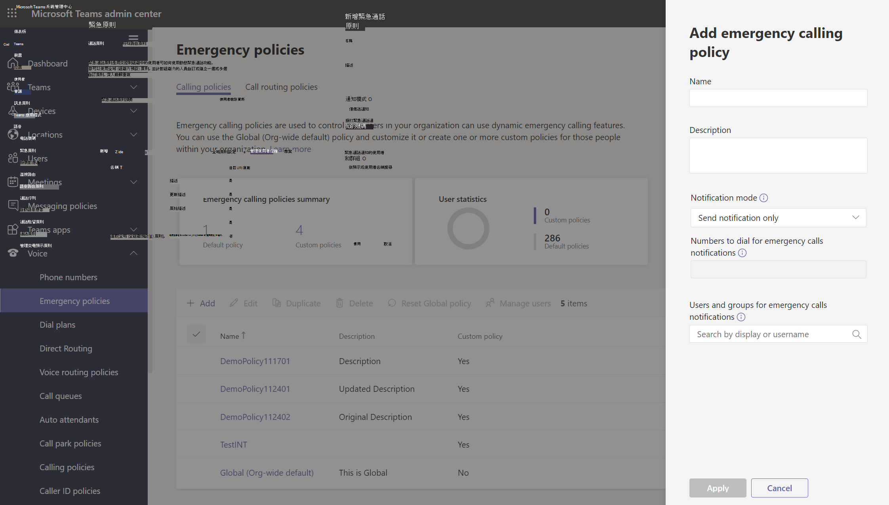
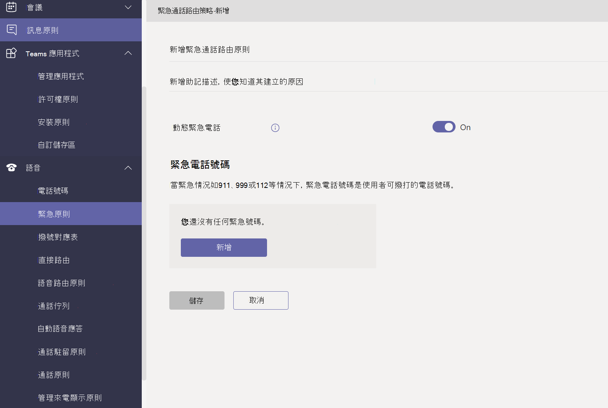
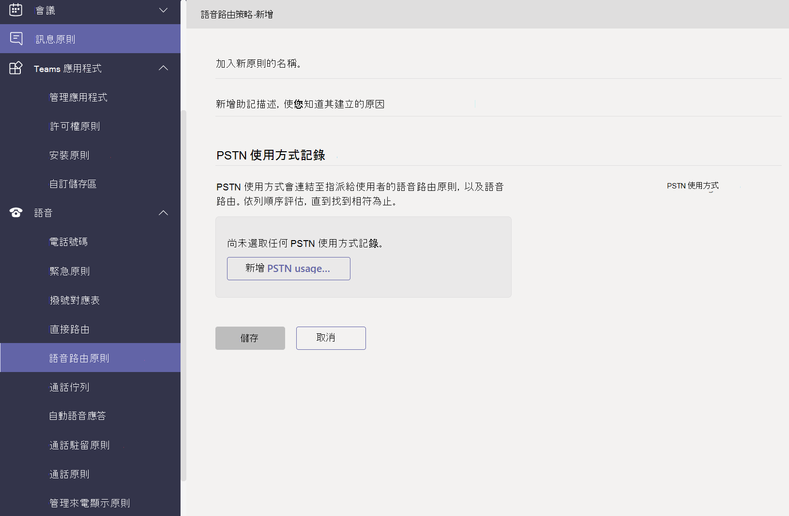

# 管理語音和通話Microsoft Teams

語音和通話政策是用來控制語音和通話Microsoft Teams。

## 緊急通話政策

您可以使用 [緊急通話政策](manage-emergency-calling-policies.md) 來設定當貴組織的使用者撥打緊急電話時會發生什麼情況。 這些策略在系統管理中心Teams使用Windows PowerShell。

## 緊急通話路由策略

如果貴組織已部署 **電話系統** 路由，您可以使用緊急電話路由策略來 判斷緊急電話的路由位置、是否已啟用增強的緊急服務，以及用於緊急服務的號碼。 這些策略是使用 PowerShell 或系統管理Microsoft Teams管理中心管理。

## 本機號碼政策

[本機號碼政策](caller-id-policies.md) 是用來變更或封鎖本機號碼。

## 語音路由策略

語音 [路由策略](manage-voice-routing-policies.md) 是公用交換電話網絡 (PSTN) 容器。 如果您的組織已部署直接路由，您可以使用 **電話系統策略**。 語音路由策略可以使用 PowerShell 或系統管理中心Teams管理。

## 通話原則

[通話政策](teams-calling-policy.md) 可控制哪些通話和呼叫轉寄功能可供使用者使用，包括使用者是否可以撥打私人電話、將通話傳送給通話群組，以及將通話路由至語音信箱。

## 呼叫停駐和取回策略

[呼叫保留和取回](call-park-and-retrieve.md) 可讓使用者將其他使用者置於保留狀態，並可讓同一個使用者或其他人繼續通話。

## 建立和管理撥號對應表

[撥號方案](create-and-manage-dial-plans.md) 會翻譯撥號電話號碼，以用於通話授權和路由。 您可以透過 PowerShell 或系統管理中心建立Microsoft Teams方案。

## 相關主題

* [在 Microsoft Teams](manage-emergency-calling-policies.md)
* [管理緊急電話路由原則](manage-emergency-call-routing-policies.md)
* [管理 Microsoft Teams 中的來電顯示原則](caller-id-policies.md)。
* [管理語音路由策略](manage-voice-routing-policies.md)
* [通話中Microsoft Teams](teams-calling-policy.md)
* [呼叫停駐和Microsoft Teams](call-park-and-retrieve.md)
* [建立和管理撥號對應表](create-and-manage-dial-plans.md)
* [使用Teams管理](manage-teams-with-policies.md)
