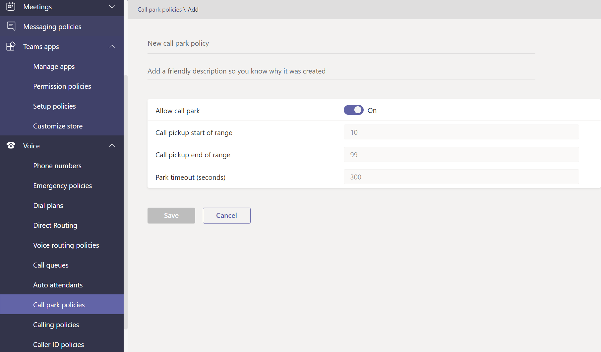

# 在 Microsoft Teams 中管理語音和通話原則

語音和通話原則可用來控制 Microsoft Teams 中的語音和通話。

## 緊急通話原則

您可以使用 [緊急通話原則](manage-emergency-calling-policies.md) 來設定當組織中的使用者撥打緊急電話時會發生什麼情況。 這些原則是在 Teams 系統管理中心管理，或使用Windows PowerShell。

## 緊急通話路由原則

如果貴組織已部署 **電話系統直接路由**，您可以使用 [緊急電話路由原則](manage-emergency-call-routing-policies.md) 來判斷緊急電話的路由位置、是否啟用增強型緊急服務，以及緊急服務所使用的號碼。 這些原則是使用 PowerShell 或 Microsoft Teams 系統管理中心來管理。

## 來電者識別碼原則

[來電者識別碼原則](caller-id-policies.md) 可用來變更或封鎖來電者識別碼。

## 語音路由原則

[語音路由原則](manage-voice-routing-policies.md)是公用交換電話網路 (PSTN) 使用記錄的容器。 如果您的組織已部署 **電話系統直接路由**，您可以使用這些原則。 您可以使用 PowerShell 或 Teams 系統管理中心來管理語音路由原則。

## 通話原則

[通話原則](teams-calling-policy.md) 可控制哪些呼叫和來電轉接功能可供使用者使用，包括使用者是否可以撥打私人電話、將電話傳送給通話群組，以及將通話路由至語音信箱。

## 通話駐留和擷取原則

[[駐留並擷取](call-park-and-retrieve.md) ] 可讓使用者保留其他使用者，並讓相同的使用者或其他人繼續通話。

## 建立和管理撥號對應表

[撥號對應表](create-and-manage-dial-plans.md) 會將撥號電話號碼翻譯為通話授權和路由。 您可以透過 PowerShell 或 Microsoft Teams 系統管理中心建立和管理撥號對應表。

## 相關主題

* [在 Microsoft Teams 中管理緊急通話原則](manage-emergency-calling-policies.md)
* [管理緊急電話路由原則](manage-emergency-call-routing-policies.md)
* [管理 Microsoft Teams 中的來電顯示原則](caller-id-policies.md)。
* [管理語音路由原則](manage-voice-routing-policies.md)
* [Microsoft Teams 中的通話原則](teams-calling-policy.md)
* [在 Microsoft Teams 中通話並擷取](call-park-and-retrieve.md)
* [建立和管理撥號對應表](create-and-manage-dial-plans.md)
* [使用原則管理 Teams](manage-teams-with-policies.md)
