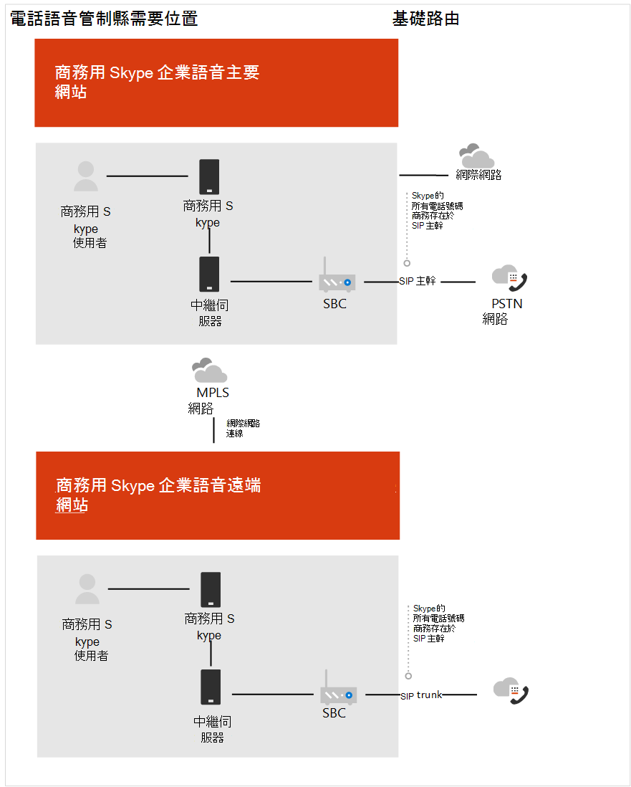
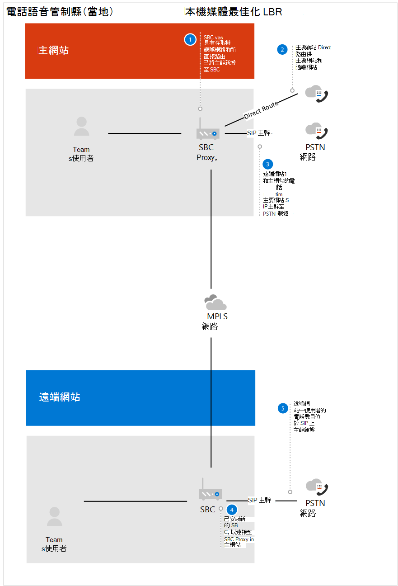

# Contoso 案例研究：Location-Based路由

Location-Based路由 (LBR) 是一項功能，根據撥打或接收通話時，根據策略和使用者實際位置限制免付費。  

## 概觀

Contoso 在一個國家/地區有兩個辦公室，而忽略公用交換電話網絡 (PSTN) ，以降低長途通話成本。 主辦公室有由主要辦公室和第二個辦公室使用的網際網路連接。 每個辦公室都有自己的會話邊界控制器 (SBC) PSTN 電信公司。  
 
在這個國家/地區，Contoso 已針對他們的部署商務用 Skype LBR。 若要決定如何設定 LBR Teams，Contoso 請閱讀直接路由Location-Based[路由方案](location-based-routing-plan.md)。 Contoso 決定 Teams 和 商務用 Skype 在何時可以撥打、何時可以接收、PSTN 通話可以轉接給 Teams 使用者，以及何時可以將另一個 Teams 使用者轉接到 PSTN 通話時，遵循相同的案例。  

針對商務用 Skype，LBR 已使用會話邊界控制器 (SBC) SIP 主幹連接到 PSTN 電信電信公司。 針對此 SBC，Contoso 已審查認證 [SBC](direct-routing-border-controllers.md) 清單，並判定所部署的 SBC 已通過直接路由認證，但未通過媒體旁路認證。 若要支援 LBR，直接路由必須配置至 SBC 現場，需要有一個本地網際網路出口，而 SBC 必須針對媒體旁路進行配置。 根據這項資訊，Contoso 決定下列專案：

- 若要延遲啟用 LBR Teams，直到現有 SBC 通過媒體旁路認證。   

- Contoso 決定使用主要網站 SBC 進行直接路由Office 365。  主網站 SBC 是遠端網站的 Proxy SBC。  

- Contoso 使用印度的協力廠商顧問，協助國內電話公司進行 LBR 組組認證。  

- 為了支援公司外部使用者撥打 PSTN 電話，公司已發行行動電話給員工。 

下列圖表顯示國家/地區部署之前和之後，其電話法規需要Location-Based路由：

**原始部署**

**使用直接路由進行部署**

## 配置： 

若要在 Teams 中設定網路元件，Contoso 遵循管理雲端語音功能的網路拓撲[中的指示](manage-your-network-topology.md)。 Contoso 已完成下列設定路由Location-Based步驟： 

- 定義網路區域 - 已定義一個網路區域。 

- 定義網路網站 - 已定義兩個網路網站。 針對地區中每個辦公室位置的一個網站。

- 定義網路子網 - 辦公室位置內的每個樓層都有自己的有線和無線網路子網。 此組配置導致 Contoso 有 20 個子網。 

- 定義信任的 IP 位址 - SBC 的外部 IP 位址已新加到信任的 IP 位址。  

