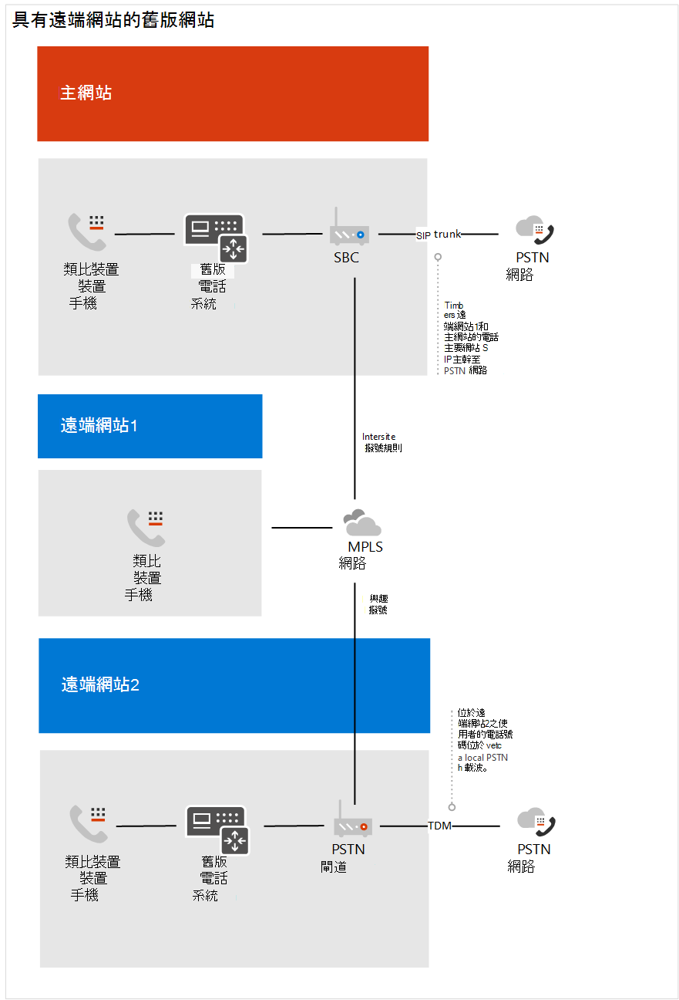
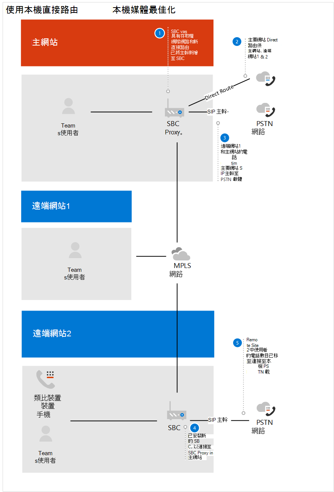
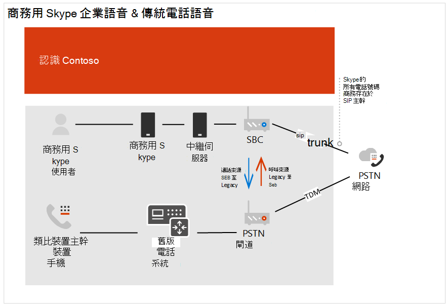
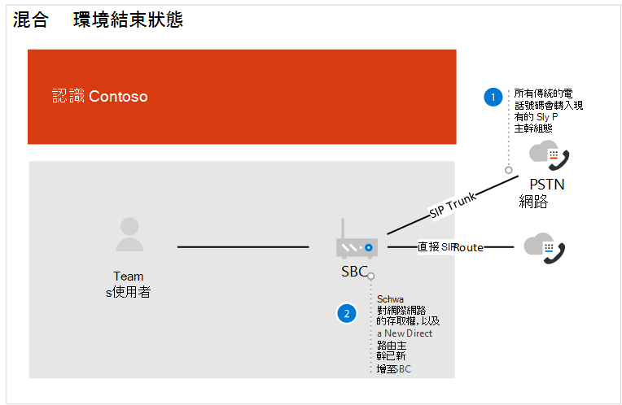

# Contoso 案例研究：電話系統Contoso case study: Phone System

根據地理位置和其他因素，Contoso 擁有使用下列電話解決方案的辦公室：Depending on geographic location and other factors, Contoso had offices using the following telephony solutions:

- 網站類型 A：商務用 Skype Enterprise VoiceSite Type A: Skype for Business Enterprise Voice

- 網站類型 B：傳統舊版電話系統Site Type B: Traditional legacy telephony systems

- 網站類型 C：商務用 Skype 企業語音與傳統舊版電話系統的組合Site Type C: A combination of Skype for Business Enterprise Voice and traditional legacy telephony systems

若要針對其整個組織實施 Microsoft Phone 系統方案，Contoso 必須 &mdash; 針對每個網站類型決定要 &mdash; 與手機系統搭配使用的下列選項，才能連線到公用的交換電話網絡（PSTN）：To implement a Microsoft Phone System solution for their entire organization, Contoso had to determine&mdash;for each site type&mdash;which of the following options would be used with Phone System to connect to the Public Switched Telephone Network (PSTN):

- 含有通話方案的電話系統Phone System with Calling Plan 

- 透過直接佈線提供給自己 PSTN 載體的電話系統Phone System with own PSTN carrier through Direct Routing 

- 透過直接佈線，搭配電話系統與呼叫方案和電話系統搭配擁有 PSTN 載體Combination of Phone System with Calling Plan and Phone System with own PSTN carrier through Direct Routing
 
若要針對其組織判斷合適的解決方案，Contoso 使用[microsoft 電話解決方案](https://docs.microsoft.com/SkypeForBusiness/hybrid/msft-telephony-solutions)和[microsoft 團隊中](https://myignite.techcommunity.microsoft.com/sessions/83170?source=sessions)的 Ignite 2019 會話通話。To determine the right solution for their organization, Contoso used [Microsoft telephony solutions](https://docs.microsoft.com/SkypeForBusiness/hybrid/msft-telephony-solutions) and the Ignite 2019 session [Calling in Microsoft Teams](https://myignite.techcommunity.microsoft.com/sessions/83170?source=sessions).  

## 網站類型 A：商務用 Skype Enterprise VoiceSite Type A: Skype for Business Enterprise Voice 

Contoso 商務用 Skype Enterprise Voice 已設定為中心和分支。Contoso Skype for Business Enterprise Voice was set up as a hub and spoke. 這裡有一個中央位置，可在區域中維護 PSTN 閘道，在該區域中提供與商務用 Skype Enterprise Voice 使用者的 PSTN 連線。There was a central location that maintained the PSTN gateway in the region that provided the connection to the PSTN for the Skype for Business Enterprise Voice users in country. 這些衛星辦公室通常沒有自己的網際網路出口。Often these satellite offices did not have their own Internet egress. 這些使用者的數位駐留在 SIP 主幹上與現有的 SBC 連接。The numbers for these users resided on the SIP trunk connecting to an existing SBC. 

為了判斷已部署的 SBC 是否已認證以進行直接路由及媒體旁路，Contoso 已核取已[認證以直接路由的會話框線控制器清單](direct-routing-border-controllers.md)。To determine if the SBC already deployed is certified for Direct Routing and Media Bypass, Contoso checked the [List of Session Border Controllers certified for Direct Routing](direct-routing-border-controllers.md).  

使用者的撥號習慣是使用延伸來撥打舊版電話系統上的使用者，即使使用者有適用于對等音訊的商務用 Skype 用戶端。The user's dialing habits were to dial a user on the legacy telephony system using an extension, even when the user has a Skype for Business client available for peer-to-peer audio. 

Contoso 根據下列問題進行決策：Contoso based their decision on the following questions:

- 答疑.Q. 我們需要保留我們內部部署所提供的功能嗎？Do we need to retain functionality provided by our on-premises deployment? 
  是.A. 否No 

- 答疑.Q. 我們需要與協力廠商 PBX 系統和其他電話裝置進行交互操作嗎？Do we need to interoperate with third-party PBX systems and other telephony equipment? 
  是.A. 否No 

- 答疑.Q. 我們需要保留我們目前的協力廠商運營商嗎？Do we need to retain our current third-party carrier?  答. 是（管控國家）和 NoA. Yes (regulated countries) and No 

- 答疑.Q. 我們需要取得在 SBCs 上部署的 ROI 嗎？Do we need to get the ROI on SBCs deployed?  答. 是和否A. Yes and No  

- 答疑.Q. 此地區提供 Microsoft PSTN 通話方案嗎？Is Microsoft PSTN Calling Plans available in this region?  答. 是和否A. Yes and No 

根據問題的答案，Contoso 決定：Based on the answers to their questions, Contoso decided to:

- 移動位於區域中的使用者，該區域中有 PSTN 通話方案可供電話系統使用通話方案。Move the users that are located in a region where PSTN calling plans is available to Phone System with Calling Plans. 

- 移動不在可使用 PSTN 通話方案之區域中的使用者、位於 SBCs 中的 ROI 仍需符合的網站，以及駐留在具有直接路線之電話系統的國家/地區中的使用者。Move the users that are not located in a region where PSTN calling plans is available, users located in a site where the ROI on the SBCs have yet to be met, and users that resided in a country that has telephony regulations to Phone System with Direct Routing. 

下圖顯示最初的商務用 Skype 企業語音部署，以及此部署如何遷移到 Microsoft 通話方案和直接路由：The following diagram shows the initial Skype for Business Enterprise Voice deployment and how this deployment was migrated to both Microsoft Calling Plans and Direct Routing:

## 網站類型 B：傳統舊版電話系統Site Type B: Traditional legacy telephony systems

Contoso 擁有許多利用舊版電話系統的辦公室。Contoso had many offices that leveraged legacy telephony systems. 有一個使用者子集有一個電子1.64 電話號碼，而其他人只有一個副檔名。There were a subset of users that had an E1.64 phone number while others only had an extension. 這些數位是駐留在 TDM 主幹上的 PSTN 閘道。These numbers resided on the TDM trunk to the PSTN gateway. 站內撥號是利用延伸前的網站程式碼來設定，以決定路由通話的位置。Intra-site dialing was configured by leveraging a site code in front of the extension to determine where to route the call. 使用者的撥號習慣是透過副檔名撥號。The users' dialing habits were to dial by extension.   

Contoso 根據下列問題進行決策：Contoso based their decision on the following questions:

- 答疑.Q. 我們需要保留我們內部部署所提供的功能嗎？Do we need to retain functionality provided by our on-premises deployment? 
  是.A. 否No 

- 答疑.Q. 我們需要與協力廠商 PBX 系統和其他電話裝置進行交互操作嗎？Do we need to interoperate with third-party PBX systems and other telephony equipment?  答. 是A. Yes

- 答疑.Q. 我們需要保留我們目前的協力廠商運營商嗎？Do we need to retain our current third-party carrier?  答. 沒有A. No 

- 答疑.Q. 我們的地區提供 Microsoft PSTN 的通話方案嗎？Is Microsoft PSTN's Calling Plan available in our region?  答. 是和否A. Yes and No 

根據問題的答案，Contoso 決定：Based on the answers to their questions, Contoso decided to: 

- 移動位於區域中的使用者，該區域中有 PSTN 通話方案可供電話系統使用通話方案。Move the users that are located in a region where PSTN calling plans is available to Phone System with Calling Plans. 

- 將沒有位於 PSTN 通話方案的區域中的使用者移至可直接傳送的電話系統。Move the users that are not located in a region where PSTN calling plans is available to Phone System with Direct Routing. 

- 維護與業務關鍵型類比裝置的 PSTN 連線。Maintain a PSTN connection to business critical analog devices.

下列圖表顯示具有遠端網站的原始舊版系統部署，以及使用本機媒體優化進行直接路由部署的遷移：The following diagrams show the original legacy system deployment with remote sites and the migration to a Direct Routing deployment with Local Media Optimization:

**原始舊版部署**  
 **Original legacy deployment** 

**使用直接路由進行部署****Deployment with Direct Routing**

 
## 網站類型 C：商務用 Skype 企業語音與傳統舊版電話系統的組合Site Type C: Combination of Skype for Business Enterprise Voice and traditional legacy telephony systems

Contoso 商務用 Skype Enterprise Voice 使用者的電話號碼是由電信公司在 SIP 主幹中駐留給 SBC。Contoso Skype for Business Enterprise Voice users' numbers reside on the SIP trunk to the SBC from the carrier. 傳統電話系統的數位駐留在 TDM 幹線上，是 PSTN 閘道。The numbers for the traditional telephony systems resided on the TDM trunk to the PSTN gateway.   

Contoso 根據下列問題進行決策：Contoso based their decision on the following questions:

- 答疑.Q. 我們需要保留我們內部部署所提供的功能嗎？Do we need to retain functionality provided by our on-premises deployment? 
  是.A. 否No 

- 答疑.Q. 我們需要與協力廠商 PBX 系統和其他電話裝置進行交互操作嗎？Do we need to interoperate with third-party PBX systems and other telephony equipment?  答. 沒有A. No 

- 答疑.Q. 我們需要保留我們目前的協力廠商運營商嗎？Do we need to retain our current third-party carrier?  答. 沒有A. No 

- 答疑.Q. 我們需要取得在 SBCs 上部署的 ROI 嗎？Do we need to get the ROI on SBCs deployed?  答. 是和否A. Yes and No  

- 答疑.Q. 此地區提供 Microsoft 的 PSTN 通話方案嗎？Is Microsoft's PSTN Calling Plan available in this region?  答. 沒有A. No 

根據問題的答案，Contoso 決定下列事項：Based on the answers to their questions, Contoso decided on the following: 

- 針對將啟用直接路由的舊版電話使用者，Contoso 會將 TDM 主幹中的數位移植到 SBC 的 SIP 幹線，因為 SBC 已認證直接路由。For the legacy telephony users that will be enabled for Direct Routing, Contoso ported the numbers from the TDM trunk to the SIP Trunk for the SBC, since the SBC is certified for Direct Routing. 

- 若要支援移至電話系統的使用者子集，並允許持續路由透過舊版系統，舊版電話系統會設定為 SBC 的下一個躍點。To support a subset of users moving to Phone System and to allow continued routing through the legacy system, the legacy telephony system was set up as the next hop to the SBC.   

- 此外，為了鼓勵使用者行為變更並移除在站內延伸撥號的相依性，Contoso 提供的指導方針將團隊用於所有內部通話。In addition, to encourage user behavior change and remove the dependency on inter- and intra-site extension dialing, Contoso provided guidance to use Teams for all internal calls.  

下列圖表顯示原始商務用 Skype Enterprise Voice 與舊版電話系統部署，以及使用直接路由進行混合式部署的遷移：The following diagrams show the original Skype for Business Enterprise Voice and legacy telephony system deployment and the migration to a mixed deployment using Direct Routing:

**原始混合式部署** 
 **Original mixed deployment**

**使用直接路由** 
 **Mixed deployment with Direct Routing**

## 通話方案Calling Plans

為了判斷通話方案的設定需求，Contoso 已檢查[通話方案核心部署決定](calling-plan-landing-page.md#core-deployment-decisions)。To determine the configuration requirements for Calling Plans, Contoso reviewed the [Calling Plan core deployment decisions](calling-plan-landing-page.md#core-deployment-decisions). 產生的決定如下所示：The resulting decisions were made: 

- 答疑.Q. 我的使用者需要國際通話嗎？Do my users need international calling?  答. 是A. Yes 

- 答疑.Q. 我的使用者是否每個都有直接向內撥電話號碼？Do my users each have a direct inward DID phone number?  答. 並非今天。A. Not today. 所有啟用的使用者都會收到已執行的動作。All users enabled will receive a DID. 

- 答疑.Q. 我想要遮罩或停用本機號碼嗎？Do I want to mask or disable caller ID?  答. 使用者的本機號碼會遮罩為 Contoso 的當地號碼。A. The caller ID for a user will be masked to the local number for Contoso. 

## 直接路由Direct Routing

Contoso 已參與 Ignite，以維持目前的 Office 365 功能，包括可在手機系統和直接路由中使用的功能。Contoso attended Ignite to stay current on Office 365 features including those available with Phone system and Direct Routing. 技術領導和架構師使用 Ignite 2019 期間提供的指導方針來決定其方向。Technical leadership and architects used the guidance provided during the Ignite 2019 to determine their direction.  所用的主要會話：Key sessions that were used: 

- [使用 Microsoft 團隊直接路由來規劃成功Plan for success with Microsoft Teams Direct Routing](https://myignite.techcommunity.microsoft.com/sessions/80381?source=sessions)

- [直接路由的更新Updates for Direct Routing](https://myignite.techcommunity.microsoft.com/sessions/80381?source=sessions)

## ConfigurationConfiguration

### 通話方案網站Calling Plans sites

若要取得授權並將電話號碼指派給使用者，Contoso 請按照[設定通話方案](set-up-calling-plans.md)中的步驟進行。To obtain licenses and assign phone numbers to users, Contoso followed the steps in [Set up Calling Plans](set-up-calling-plans.md). 

由於需要指派電話號碼的使用者數目，Contoso 決定要使用 PowerShell 來指派電話號碼。Due to the number of users that needed to be assigned phone numbers, Contoso decided to use PowerShell to assign the phone numbers. 若要進一步瞭解如何使用 PowerShell 指派數位， &mdash; 除了其他設定 &mdash; Contoso 使用[團隊 PowerShell](teams-powershell-overview.md)外。To learn how to assign numbers by using PowerShell&mdash;in addition to other settings&mdash;Contoso used the [Teams PowerShell Overview](teams-powershell-overview.md).  

### 直接路由網站Direct Routing sites

若要將 Contoso 的內部部署電話結構連線至 Microsoft 團隊，Contoso 的系統管理員遵循[設定直接路由](direct-routing-configure.md)及查看[microsoft 團隊中的視頻直接路由中](https://www.youtube.com/watch?v=1ASftX_Msb8&index=10&list=PLaSOUojkSiGnKuE30ckcjnDVkMNqDv0Vl)的步驟以取得指導方針。To connect Contoso's on-premises telephony infrastructure to Microsoft Teams, Contoso's administrator followed the steps in [Configure Direct Routing](direct-routing-configure.md) and reviewed the video [Direct Routing in Microsoft Teams](https://www.youtube.com/watch?v=1ASftX_Msb8&index=10&list=PLaSOUojkSiGnKuE30ckcjnDVkMNqDv0Vl) for guidance.  Contoso 也會參照由認證的 SBC 轉銷商提供的直接路由部署檔。Contoso also referred to the Direct routing deployment documentation by the certified SBC vendor. 

在 SBC 與 Microsoft Phone 系統之間設定直接路由之後，Contoso 必須對其進行測試。Once Direct Routing was configured between the SBC and Microsoft Phone System, it was necessary for Contoso to test the configuration. 若要這樣做，Contoso 系統管理員會使用 SIP 測試者用戶端，在[Ignite 2019 的直接路由會話更新](https://myignite.techcommunity.microsoft.com/sessions/83178?source=sessions)中討論。To do this, Contoso administrators used the SIP Tester client that was discussed in the [Updates for Direct Routing session at Ignite 2019](https://myignite.techcommunity.microsoft.com/sessions/83178?source=sessions). SIP 測試者用戶端腳本和檔都是從 PowerShell 腳本下載，以測試直接路由會話框線控制器連線。The SIP Tester client script and documentation was downloaded from the PowerShell script to test Direct Routing Session Border Controller connections.   

### 本機媒體優化Local Media Optimization

Contoso 在全球不同地區看到了利用本機媒體優化的機會。Contoso saw the opportunity to leverage Local Media Optimization in the different regions across the globe. Contoso 的支援案例將在[本機媒體優化中說明，以進行直接路由](direct-routing-media-optimization.md)。The supported scenarios for Contoso are described in [Local Media Optimization for Direct Routing](direct-routing-media-optimization.md). 以下是由 SBC 供應商和 Microsoft 提供的指導方針完成本機媒體優化的設定。The configuration of the local media optimization was completed by following guidance from both the SBC vendor and Microsoft. 本機媒體優化的設定步驟包括：The configuration steps for Local Media Optimization include: 

- 設定使用者和 SBC 網站Configure the user and SBC sites 

- 根據 SBC 廠商的規格來設定 SBC，Configure the SBC  according to the SBC vendor specification, 

- 將外部信任的 IP 位址新增到用於本機媒體優化的每個網站Add external trusted IP addresses to each site used for Local Media Optimization    

- 定義網路拓撲Define the network topology 

- 定義虛擬網路拓撲Define the virtual network topology 

- 判斷模式：總是略過或只適用于本機使用者Determine the mode: Always Bypass or Only for local users 

## 網路考慮Networking considerations

Contoso 有許多使用者需要在啟用電話系統之後，在一段時間內進行遠端作業。Contoso had a number of users who needed to work remotely for an extended period of time after they were enabled for Phone System. 使用者使用 VPN 存取特定的商務應用程式。The users used VPN to access certain Line of Business applications. 在 VPN 上，電話系統使用者遇到通話品質下降的情況。While on VPN, the Phone System users experienced a degradation of call quality. 

若要解決品質問題，Contoso 已實現 VPN 分割隧道，允許其 Office 365 通訊在與內部 app 連線之後，在 VPN 上保留。To resolve the quality issue, Contoso implemented VPN split tunneling, which allowed their Office 365 traffic to traverse the Internet while the connection to the internal apps remained on the VPN. 若要實現 VPN 分割隧道，Contoso 遵循[針對 Office 365 實現 vpn 分割隧道的](https://docs.microsoft.com/office365/enterprise/office-365-vpn-implement-split-tunnel)指導方針。To implement VPN split tunneling, Contoso followed the guidance in [Implementing VPN split tunneling for Office 365](https://docs.microsoft.com/office365/enterprise/office-365-vpn-implement-split-tunnel).  

 

