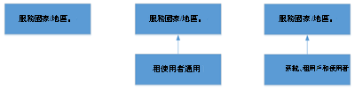

# 什麼是撥號對應表？What are dial plans?

撥號方案是一組指定的標準化規則，將個別使用者撥打的電話號碼轉換成替代格式 (通常是 E.164) ，用於通話授權和呼叫路由。A dial plan is a named set of normalization rules that translate dialed phone numbers by an individual user into an alternate format (typically E.164) for purposes of call authorization and call routing.

撥號方案包含一或多個標準化規則，定義以各種格式表示的電話號碼如何轉換成替代格式。A dial plan consists of one or more normalization rules that define how phone numbers expressed in various formats are translated to an alternate format. 不同的撥號方案可能會以不同方式解譯相同的撥號字串，因此根據指派給特定使用者的撥號方案，相同的撥號號碼可能會以不同方式翻譯和路由。The same dial string may be interpreted and translated differently in different dial plans, so depending on which dial plan is assigned to a given user, the same dialed number may be translated and routed differently. 最多可有 1，000 個租使用者撥號方案。There can be a maximum of 1,000 tenant dial plans.

請參閱 [建立及管理撥號方案](create-and-manage-dial-plans.md) 以建立和管理租使用者撥號方案。See [Create and manage dial plans](create-and-manage-dial-plans.md) to create and manage tenant dial plans.

## 租使用者撥號方案範圍Tenant dial plan scope

撥號方案的範圍會決定可適用撥號計畫的階層階層。A dial plan's scope determines the hierarchical level at which the dial plan can be applied. 用戶端會透過使用者登錄 Teams 時自動提供的設定，取得適當的撥號方案。Clients get the appropriate dial plan through provisioning settings that are automatically provided when users sign in to Teams. 做為系統管理員，您可以使用 Microsoft Teams 系統管理中心或遠端 PowerShell 來管理和指派撥號方案範圍層級。As an admin, you can manage and assign dial plan scope levels by using the Microsoft Teams admin center or Remote PowerShell.

在 Teams 中，有兩種類型的撥號方案：服務範圍和租使用者範圍 (適用于貴組織) 。In Teams, there are two types of dial plans: service-scoped and tenant-scoped (which is for your organization). 服務範圍撥號方案會針對每一個提供電話系統的國家/地區定義。A service-scoped dial plan is defined for every country or region where Phone System is available. 系統會自動為每個使用者指派符合指派給使用者的使用位置的服務國家/地區撥號方案。Each user is automatically assigned the service country dial plan that matches the usage location assigned to the user. 您無法變更服務國家/地區撥號方案，但您可以建立租使用者範圍撥號方案，增加服務國家/地區撥號方案。You can't change the service country dial plan, but you can create tenant scoped dial plans, which augment the service country dial plan. 在布備用戶端時，客戶會取得「有效的撥號方案」，這是服務國家/地區撥號方案與適當範圍租使用者撥號方案的組合。As clients are provisioned, they obtain an "effective dial plan," which is a combination of the service country dial plan and the appropriately scoped tenant dial plan. 因此，不需要定義租使用者撥號方案的所有標準化規則，因為規則可能已經存在於服務國家/地區撥號計畫中。Therefore, it's not necessary to define all normalization rules in tenant dial plans as they might already exist in the service country dial plan.

租使用者撥號方案可以進一步分成兩個範圍 ：租使用者範圍或使用者範圍。Tenant dial plans can be further broken into two scopes - tenant-scope or user-scope. 如果租使用者定義並指派使用者範圍撥號方案，該使用者將會配置使用者服務國家/地區撥號方案的有效撥號方案，以及指派的使用者撥號方案。If a tenant defines and assigns a user-scoped dial plan, that user will be provisioned with an effective dial plan of the user's service country dial plan and the assigned user dial plan. 如果租使用者定義租使用者範圍撥號方案，但未指派使用者範圍撥號方案，則該使用者會配置使用者服務國家/地區撥號方案的有效撥號方案及租使用者撥號方案。If a tenant defines a tenant-scoped dial plan but doesn't assign a user-scoped dial plan, then that user will be provisioned with an effective dial plan of the user's service country dial plan and the tenant dial plan.

以下是 Teams 中撥號計畫的繼承模型。The following is the inheritance model of dial plans in Teams.

以下是有效的撥號方案：The following are the possible effective dial plans:

 **服務國家/地區** 如果未定義租使用者範圍撥號方案，且未將租使用者範圍撥號方案指派給已配置的使用者，使用者將會收到對應到與其使用位置相關聯的服務國家/地區的有效撥號方案。**Service Country** If no tenant scoped dial plan is defined and no tenant user scoped dial plan is assigned to the provisioned user, the user will receive an effective dial plan mapped to the service country associated with their usage location.

 **租使用者全域 - 服務國家/地區** 如果已定義租使用者使用者撥號方案，但並未指派給使用者，則預配置的使用者會收到有效的撥號方案，其中包括合併的租使用者撥號方案，以及與其使用位置相關聯的服務國家/地區撥號方案。**Tenant Global - Service Country** If a tenant user dial plan is defined but not assigned to a user, the provisioned user will receive an effective dial plan consisting of a merged tenant dial plan and the service country dial plan associated with their usage location.

 **租使用者使用者 - 服務國家/地區** 如果已定義租使用者使用者撥號方案並指派給使用者，則預配置的使用者會收到有效的撥號方案，包含合併的租使用者撥號方案，以及與其使用位置相關聯的服務國家/地區撥號方案。**Tenant User - Service Country** If a tenant user dial plan is defined and assigned to a user, the provisioned user will receive an effective dial plan consisting of the merged tenant user dial plan and the service country dial plan associated with their usage location.

請參閱 [建立和管理撥號方案](create-and-manage-dial-plans.md) 以建立租使用者撥號方案。See [Create and manage dial plans](create-and-manage-dial-plans.md) to create your tenant dial plans.

> [!NOTE]
> 在未將撥號方案正規化規則適用于撥號號碼的情況下，撥號字串仍然會標準化為預先垂直的「+CC」，其中 CC 是撥號使用者使用位置的國家/地區代碼。In the scenario where no dial plan normalization rules apply to a dialed number, the dialed string is still normalized to prepend "+CC" where CC is the country code of the dialing user's usage location. 這適用于通話方案、直接路由和 PSTN 會議撥出案例。This applies to Calling Plans, Direct Routing and PSTN Conference dial-out scenarios.

## 規劃租使用者撥號方案Planning for tenant dial plans

若要規劃自訂撥號方案，請遵循下列步驟：To plan custom dial plans, follow these steps:

- **步驟 1** 決定是否需要自訂撥號方案，以增強使用者的撥號體驗。**Step 1** Decide whether a custom dial plan is needed to enhance the user dialing experience. 一般來說，您需要支援非 E.164 撥號，例如分機或縮寫的國內撥號。Typically, the need for one would be to support non-E.164 dialing, such as extensions or abbreviated national dialing.

- **步驟 2** 判斷是否需要租使用者全域或租使用者範圍撥號方案，或兩者同時使用。**Step 2** Determine whether tenant global or tenant user scoped dial plans are needed, or both. 如果使用者有不同的當地撥號需求，則需要使用者範圍撥號方案。User scoped dial plans are needed if users have different local dialing requirements.

- **步驟 3** 識別每個所需撥號方案的有效號碼模式。**Step 3** Identify valid number patterns for each required dial plan. 只需要服務等級國家/地區撥號方案未定義的號碼模式。Only the number patterns that are not defined in the service level country dial plans are required.

- **步驟 4** 開發全組織的撥號方案命名方案。**Step 4** Develop an organization-wide scheme for naming dial plans. 採用標準命名配置可確保整個組織的一致性，並簡化維護和更新。Adopting a standard naming scheme assures consistency across an organization and makes maintenance and updates easier.

## 建立新的撥號方案Creating your new dial plan

當您建立新的撥號方案時，您必須填入所需的資訊。When you create a new dial plan, you must put in the information that is required.

### 名稱和簡單名稱Name and simple name

針對使用者撥號方案，您應該指定描述性名稱，以識別要指派撥號方案的使用者。For user dial plans, you should specify a descriptive name that identifies the users to which the dial plan will be assigned. 撥號方案簡單名稱會預先填入從撥號方案名稱衍生的字串。The dial plan Simple Name is pre-populated with a string that is derived from the dial plan name. 簡易名稱欄位是可編輯的，這可讓您為撥號方案建立更具描述性的命名慣例。The Simple Name field is editable, which enables you to create a more descriptive naming convention for your dial plans. 簡單名稱值不能是空白的，而且必須是唯一的。The Simple Name value cannot be empty and must be unique. 最佳做法是為整個組織開發命名慣例，然後在所有網站和使用者間一致地使用此慣例。A best practice is to develop a naming convention for your entire organization and then use this convention consistently across all sites and users.

### 說明Description

我們建議您輸入適用對應撥號方案之地理位置或使用者群組的常見、可識別名稱。We recommend that you type the common, recognizable name of the geographic location or group of users to which the corresponding dial plan applies.

### 外部存取首碼External access prefix

如果使用者需要撥打一或多個額外的前置字元 (例如 9) ，您可以指定最多四個字元的外部存取首碼 (#、\*和 0-9) 。You can specify an external access prefix of up to four characters (#, \*, and 0-9) if users need to dial one or more additional leading digits (for example, 9) to get an external line.

> [!NOTE]
> 如果您指定外部存取首碼，則不需要建立額外的標準化規則來容納該首碼。If you specify an external access prefix, you don't need to create an additional normalization rule to accommodate the prefix.

請參閱 [建立和管理撥號方案](create-and-manage-dial-plans.md) 以建立租使用者撥號方案。See [Create and manage dial plans](create-and-manage-dial-plans.md) to create your tenant dial plans.

## 正規化規則Normalization rules

標準化規則定義要如何翻譯以各種格式表示的電話號碼。Normalization rules define how phone numbers expressed in various formats are to be translated. 根據撥號位置，相同的數位字串可能有不同的解譯和翻譯方式。The same number string may be interpreted and translated differently, depending on the locale from which it is dialed. 如果使用者需要能夠撥打縮寫的內部或外部號碼，可能需要標準化規則。Normalization rules may be necessary if users need to be able to dial abbreviated internal or external numbers.

一或多個標準化規則必須指派給撥號方案。One or more normalization rules must be assigned to the dial plan. 標準化規則會從上到下相符，因此它們在租使用者撥號計畫中顯示的順序非常重要。Normalization rules are matched from top to bottom, so the order in which they appear in a tenant dial plan is important. 例如，如果租使用者撥號方案有 10 個標準化規則，會從第一個標準化規則開始嘗試撥號號碼比對邏輯，如果第二個規則沒有相符，依此類推。For example, if a tenant dial plan has 10 normalization rules, the dialed number matching logic will be tried starting with the first normalization rule, if there isn't a match then the second, and so forth. 如果相符，即會使用該規則，而且不會比對已定義的其他任何規則。If a match is made, that rule is used and there is no effort to match any other rules that are defined. 在一個給定的租使用者撥號計畫中，最多可以有 50 個標準化規則。There can be a maximum of 50 normalization rules in a given tenant dial plan.

### 決定所需的標準化規則Determining the required normalization rules

由於任何租使用者撥號方案都有效地與使用者的服務國家/地區撥號方案合併，因此可能需要評估服務國家/地區撥號計畫的標準化規則，才能判斷需要哪一個租使用者撥號方案標準化規則。Because any tenant dial plan is effectively merged with a given user's service country dial plan, it is likely that the service country dial plan's normalization rules need to be evaluated in order to determine which tenant dial plan normalization rules are needed. **Get-CsEffectiveTenantDialPlan Cmdlet** 可用於此用途。The **Get-CsEffectiveTenantDialPlan** cmdlet can be used for this purpose. Cmdlet 會以使用者的身分識別做為輸入參數，並會返回適用于使用者的所有標準化規則。The cmdlet takes the user's identity as the input parameter and will return all normalization rules that are applicable to the user.

### 建立標準化規則Creating normalization rules

正規化規則使用 .NET Framework 正則運算式來指定伺服器用來將撥號字串轉換為 E.164 格式的數值比對模式。Normalization rules use .NET Framework regular expressions to specify numeric match patterns that the server uses to translate dial strings to E.164 format. 您可以指定符合的正則運算式，以及找到相符專案時要進行的翻譯，以建立正規化規則。Normalization rules can be created by specifying the regular expression for the match and the translation to be done when a match is found. 完成後，您可以輸入測試編號，確認標準化規則是否如預期般運作。When you finish, you can enter a test number to verify that the normalization rule works as expected.

有關使用 .NET Framework 正則運算式的詳細資訊，請參閱 [.NET Framework 正則運算式](/dotnet/standard/base-types/regular-expressions)。For details about using .NET Framework regular expressions, see [.NET Framework Regular Expressions](/dotnet/standard/base-types/regular-expressions).

請參閱 [建立及管理撥號方案](create-and-manage-dial-plans.md) ，以建立和管理租使用者撥號方案的標準化規則。See [Create and manage dial plans](create-and-manage-dial-plans.md) to create and manage normalization rules for your tenant dial plans.

> [!NOTE]
> 第一個權杖為選擇性的標準化規則目前不支援 3pip 裝置 (例如 Polycom VVX 601) 。Normalization rules with the first token as optional are currently not supported on 3pip devices (for example, Polycom VVX 601 model). 如果您想要在 3pip 裝置上以選擇性來適用標準化規則，您應該建立兩個標準化規則，而不是一個。If you want to apply normalization rules with optionality on 3pip devices, you should create two normalization rules instead of one. 例如，規則 ^0？ (999) $ 應該由下列兩個規則取代： (999) $ (翻譯：$1) 和 ^0 (999) $ (翻譯：$1) 。For example, the rule ^0?(999)$ should be replaced by the following two rules: (999)$ (Translation:$1) and ^0(999)$ (Translation:$1).

### 範例標準化規則Sample normalization rules

下表顯示以 .NET Framework 正則運算式撰寫的範例正規化規則。The following table shows sample normalization rules that are written as .NET Framework regular expressions. 範例僅供範例使用，不做為建立您自己的標準化規則的規範參照。The samples are examples only and are not meant to be a prescriptive reference for creating your own normalization rules.

 
 **使用 .NET Framework 正則運算式的正規化規則**
**Normalization rules using .NET Framework regular expressions**

| 規則名稱Rule name  | 說明Description  | 數位模式Number pattern  | 翻譯Translation  | 範例Example  |
|:-----|:-----|:-----|:-----|:-----|
|4digitExtension4digitExtension    |翻譯 4 位數的分機。Translates 4-digit extensions.    |^ (\\ d) {4} $^(\\d{4})$    |+1425555$1+1425555$1    |0100 會翻譯成 +142555501000100 is translated to +14255550100    |
|5digitExtension5digitExtension    |翻譯 5 位數的分機。Translates 5-digit extensions.    |^5 (\\ d) {4} $^5(\\d{4})$    |+1425555$1+1425555$1    |50100 會翻譯成 +1425555010050100 is translated to +14255550100    |
|7digitcallingRedmond7digitcallingRedmond    |將 7 位數的數位轉換成 Redmond 當地號碼。Translates 7-digit numbers to Redmond local numbers.    |^ (\\ d) {7} $^(\\d{7})$    |+1425$1+1425$1    |5550100 會翻譯成 +142555501005550100 is translated to +14255550100   |
|RedmondOperatorRedmondOperator    |將 0 翻譯成 Redmond 運算子。Translates 0 to Redmond Operator.    |^0$^0$    |+14255550100+14255550100    |0 會翻譯成 +142555501000 is translated to +14255550100    |
|RedmondSitePrefixRedmondSitePrefix    |在 222 (6) 和 Redmond 網站 (首碼) 。Translates numbers with on-net prefix (6) and Redmond site code (222).    |^6222 (\\ d) {4} $^6222(\\d{4})$    |+1425555$1+1425555$1    |62220100 會翻譯成 +1425555010062220100 is translated to +14255550100    |
|5digitRange5digitRange    |從包含 3 到 7 之間的位數範圍開始，翻譯 5 位數的分機。Translates 5-digit extensions starting with the digit range between 3-7 inclusive.    |^ ([3-7] \\ d) {4} $^([3-7]\\d{4})$    |+142555$1+142555$1   |54567 會翻譯成 +1425555456754567 is translated to +14255554567    |
|首碼AddedPrefixAdded    |在 9 位數數位前面加上國家/地區首碼，第一位數和第三位數有限制。Adds a country prefix in front of a 9 digit number with restrictions on the first and third digits.    |^ ([2-9] \\ d \\ [2-9] \\ d) {6} $^([2-9]\\d\\d[2-9]\\d{6})$    |1$11$1    |425554567 會翻譯成 142555545674255554567 is translated to 14255554567    |
|NoTranslationNoTranslation    |比對 5 位數，但無法翻譯。Match 5 digits but no translation.    |^ (\\ d) {5} $^(\\d{5})$    |$1$1    |34567 會翻譯成 3456734567 is translated to 34567    |

 **根據上述的標準化規則，雷德蒙撥號方案。****Redmond dial plan based on normalization rules shown above.**

 下表根據上一個資料表中顯示的標準化規則，說明雷蒙、美國華盛頓州雷蒙的範例撥號方案。The following table illustrates a sample dial plan for Redmond, Washington, United States, based on the normalization rules shown in the previous table.

| Redmond 撥號方案Redmond dial plan  |
|:-----------------------|                                                                                                                      
| 5digitExtension5digitExtension   |                                                                                                                                    
| 7digitcallingRedmond7digitcallingRedmond   |
| RedmondSitePrefixRedmondSitePrefix   |
| RedmondOperatorRedmondOperator   |

> [!NOTE]
> 上一個資料表中顯示的標準化規則名稱不包含空格，但這是一種選擇。The normalization rules names shown in the preceding table don't include spaces, but this is a matter of choice. 例如，表格中的名字可能是「5 位數分機」或「5 位數分機」，但仍然有效。The first name in the table, for example, could have been written "5 digit extension" or "5-digit Extension" and still be valid.

## 相關主題Related topics

[建立和管理撥號對應表Create and manage dial plans](create-and-manage-dial-plans.md)

[用於通話方案的各種電話號碼Different kinds of phone numbers used for Calling Plans](different-kinds-of-phone-numbers-used-for-calling-plans.md)

[管理貴組織的電話號碼Manage phone numbers for your organization](manage-phone-numbers-for-your-organization/manage-phone-numbers-for-your-organization.md)

[緊急通話條款及條件Emergency calling terms and conditions](emergency-calling-terms-and-conditions.md)

[緊急通話免責聲明標籤](https://github.com/MicrosoftDocs/OfficeDocs-SkypeForBusiness/blob/live/Teams/downloads/emergency-calling/emergency-calling-label-(en-us)-(v.1.0).zip?raw=true)[Emergency Calling disclaimer label](https://github.com/MicrosoftDocs/OfficeDocs-SkypeForBusiness/blob/live/Teams/downloads/emergency-calling/emergency-calling-label-(en-us)-(v.1.0).zip?raw=true)